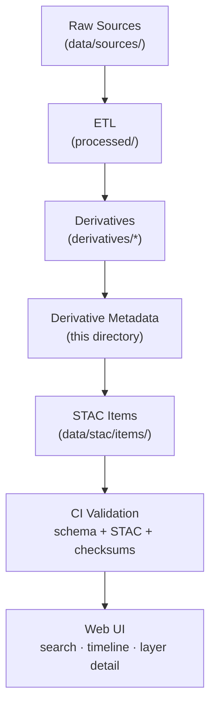

<div align="center">

# 🧾 Kansas Frontier Matrix — Derivative Metadata  
`data/derivatives/metadata/`

**Mission:** Store and validate all **metadata records** describing derivative datasets —  
ensuring provenance, lineage, licensing, and schema consistency for every processed layer in `data/derivatives/`.

[](../../../.github/workflows/site.yml)
[](../../../.github/workflows/stac-validate.yml)
[](../../../.github/workflows/codeql.yml)
[](../../../.github/workflows/trivy.yml)
[](../../../.github/workflows/pre-commit.yml)
[](../../../docs/)
[](../../../LICENSE)
[](../../../LICENSE)

</div>

---

## 📚 Table of Contents
- [Overview](#overview)
- [Purpose & Role](#purpose--role)
- [Directory Layout](#directory-layout)
- [Metadata Standards](#metadata-standards)
- [STAC Integration](#stac-integration)
- [Validation & Provenance](#validation--provenance)
- [Adding or Editing Metadata](#adding-or-editing-metadata)
- [Makefile & CI Hooks](#makefile--ci-hooks)
- [Examples](#examples)
- [References](#references)
- [Changelog](#changelog)

---

## 🧠 Overview

This directory maintains **JSON metadata and schema definitions** for every processed derivative dataset  
(e.g., terrain, hydrology, landcover, climate, hazards). It is the **source of truth** for dataset provenance,  
version, lineage, and licensing across the Kansas Frontier Matrix data ecosystem.

Each record documents where the dataset came from, how it was derived, who produced it, and how to verify it.  
All metadata conforms to open standards (**STAC 1.0**, **ISO 19115**, **schema.org**) and integrates with the project’s  
[SpatioTemporal Asset Catalog](../../stac/) for discovery and validation.

---

## 🎯 Purpose & Role

- Provide consistent dataset-level metadata for all products in `data/derivatives/`.  
- Track source lineage via `derived_from`, linking outputs to input datasets.  
- Capture processing details (software, parameters, environment).  
- Record temporal and spatial extents for catalog & UI filtering.  
- Supply authoritative inputs for automated STAC generation and validation.  

Metadata here powers both:
- the **catalog** → `data/stac/`  
- the **web app** → timeline / map filters, legends, and layer detail panels.

---

## 🧱 Directory Layout
```bash
data/
└── derivatives/
    └── metadata/
        ├── schema/
        │   ├── derivative_item.schema.json
        │   ├── stac_item.schema.json
        │   └── validation_rules.json
        ├── terrain/
        │   ├── slope_1m_ks.json
        │   └── hillshade_1m_ks.json
        ├── hydrology/
        │   ├── flow_direction_1m_ks.json
        │   └── flow_accumulation_1m_ks.json
        ├── landcover/
        │   ├── ndvi_2021_ks.json
        │   └── nlcd_1992_2021_change.json
        ├── climate/
        │   ├── README.md                          # Climate metadata registry (this subtree)
        │   ├── mean_temperature_summary.json      # NOAA + PRISM mean-temperature composites
        │   ├── precipitation_anomaly_summary.json # Rainfall deviation metrics
        │   ├── drought_index_composite.json       # Combined SPI · PDSI · SPEI indices
        │   ├── evapotranspiration_trends.json     # Modeled ET and water-balance trends
        │   ├── validation/
        │   │   ├── checksums.sha256               # File integrity hashes
        │   │   └── stac-validation.log            # STAC validation report
        │   └── schema/
        │       └── climate_derivative_metadata.schema.json  # JSON Schema definition
        ├── hazards/
        │   ├── tornado_density_1950_2024.json
        │   └── flood_extent_1993_ks.json
        ├── template.json
        └── README.md

````

---

## 🧩 Metadata Standards

Each JSON file follows the **hybrid MCP + STAC schema**, combining:

* **STAC Core:** `id`, `type`, `stac_version`, `assets`, `bbox`, `geometry`, `datetime`, `properties`
* **MCP Provenance:** `mcp_provenance`, `derived_from`, `processing:software`, `processing:parameters`,
  `author`, `created_at`, `last_updated`, `commit`
* **Schema.org Dataset:** `keywords`, `citation`, `creator`, `isBasedOn`, `license`

> Validate local edits with `schema/derivative_item.schema.json`; CI enforces both **KFM schema** and **STAC 1.0**.

---

## 🌐 STAC Integration

Every derivative metadata file is mapped into the broader **STAC Catalog**:

* `data/stac/items/` → per-layer entries (assets + properties)
* `data/stac/collections/` → thematic collections (terrain, hydrology, etc.)

CI (`.github/workflows/stac-validate.yml`) validates items against official STAC schemas and KFM rules.
Checksums from derivative folders populate `checksum:sha256` on all raster/vector assets.

---

## 🧮 Validation & Provenance



---

## 🧠 Adding or Editing Metadata

1. Copy template:
   `cp template.json <domain>/<new_id>.json`
2. Fill required fields
   (`id`, `stac_version`, `properties.title`, `properties.description`,
   `license`, `processing:software`, `derived_from[]`).
3. Add lineage: point `derived_from` to valid source paths.
4. Record environment: tool versions, parameters, and optional container image.
5. Validate locally: `make validate-metadata`.
6. Commit, include dataset + checksum; open PR → CI runs validations.

---

## 🔧 Makefile & CI Hooks

```make
validate-metadata:
	jsonschema -i data/derivatives/metadata/**/*.json \
	           data/derivatives/metadata/schema/derivative_item.schema.json

stac-validate:
	stac-validator data/stac/items/**/*.json

check-checksums:
	python scripts/validate_checksums.py --root data/derivatives
```

Recommended **pre-commit** hooks:

* `jsonlint` / `prettier --parser json`
* Schema check for `data/derivatives/metadata/**/*.json`
* Require `checksum:sha256` on every asset

---

## 🧪 Example — Minimal Derivative Item

```json
{
  "type": "Feature",
  "stac_version": "1.0.0",
  "id": "ndvi_2021_ks",
  "properties": {
    "title": "NDVI — Kansas 2021",
    "description": "Vegetation index derived from Landsat 8: (B5 − B4)/(B5 + B4).",
    "datetime": "2021-07-01T00:00:00Z",
    "processing:software": "GDAL 3.8.0 + NumPy",
    "processing:parameters": {"expression": "(B5 − B4)/(B5 + B4)"},
    "mcp_provenance": "sha256:a23be8…",
    "derived_from": ["data/sources/landsat8_ks_2021.tif"],
    "license": "CC-BY 4.0",
    "keywords": ["NDVI","Kansas","remote sensing"]
  },
  "assets": {
    "data": {
      "href": "../../landcover/ndvi_2021_ks.tif",
      "type": "image/tiff; application=geotiff; profile=cloud-optimized",
      "checksum:sha256": "e3b0c44298fc1c149afbf4c8996fb924..."
    }
  }
}
```

---

## 📖 References

* [STAC 1.0 Spec](https://stacspec.org)
* [ISO 19115 Metadata](https://www.iso.org/standard/53798.html)
* [Schema.org Dataset](https://schema.org/Dataset)
* [OGC GeoTIFF 1.1 Spec](https://docs.ogc.org/is/19-008r4/19-008r4.html)
* [Master Coder Protocol Docs](../../../docs/standards/)
* [KFM STAC Catalog](../../stac/)

---

## 🗓 Changelog

| Version    | Date       | Notes                                                          |
| :--------- | :--------- | :------------------------------------------------------------- |
| **v1.2.1** | 2025-10-11 | Fixed code-fence balance, rebuilt Mermaid for GitHub rendering |
| **v1.2.0** | 2025-10-11 | Added Makefile hooks and clarified MCP fields                  |
| **v1.1.0** | 2025-10-08 | Introduced hybrid MCP + STAC schema and validation rules       |
| **v1.0.0** | 2025-10-01 | Initial structure: domain folders, template, baseline schemas  |

`````

---
