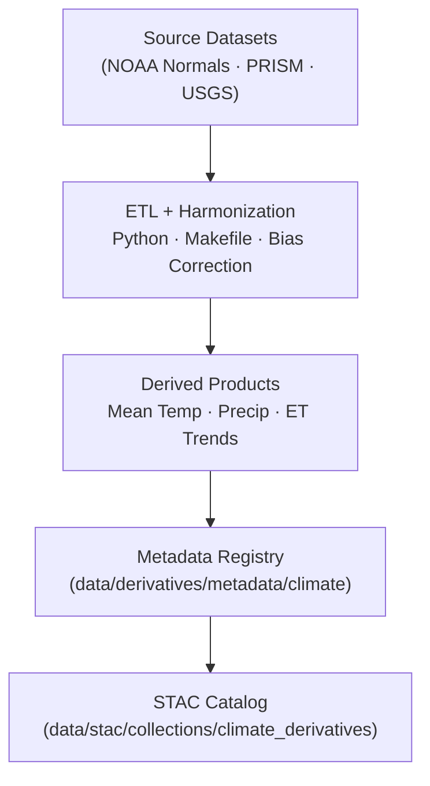

<div align="center">

# 🌡️ Kansas Frontier Matrix — Climate Derivative Metadata Registry  
`data/derivatives/metadata/climate/`

**Mission:** Maintain a unified, reproducible registry of **derived climate metadata**  
for the Kansas Frontier Matrix (KFM) — ensuring provenance, version control,  
and interoperability across geospatial and temporal domains.

[](../../../../../.github/workflows/site.yml)
[](../../../../../.github/workflows/stac-validate.yml)
[](../../../../../.github/workflows/codeql.yml)
[](../../../../../.github/workflows/trivy.yml)
[](../../../../../docs/)
[](../../../../../LICENSE)

</div>

---

## 📚 Overview

This directory houses **metadata summaries** describing each **derived climate product** produced within  
`data/derivatives/climate/`.  
All records comply with **STAC 1.0.0** and the **KFM Derivative Metadata Schema v1.0**, guaranteeing:

- Transparent source-to-product lineage  
- Validation of inputs and outputs (checksums + STAC)  
- Machine-readable uncertainty and model context  
- Semantic versioning and MCP reproducibility

---

## 🗂️ Directory Layout
```bash
data/derivatives/metadata/climate/
├── README.md                          # This document
├── mean_temperature_summary.json      # NOAA + PRISM mean-temperature composites
├── precipitation_anomaly_summary.json # Rainfall deviation metrics
├── drought_index_composite.json       # Combined SPI · PDSI · SPEI indices
├── evapotranspiration_trends.json     # Modeled ET and water-balance trends
├── validation/
│   ├── checksums.sha256
│   └── stac-validation.log
└── schema/
    └── climate_derivative_metadata.schema.json
````

---

## 🧮 Core Metadata Schema

| Field             | Type   | Description                                        |
| :---------------- | :----- | :------------------------------------------------- |
| `id`              | string | Unique dataset identifier (STAC Item ID)           |
| `title`           | string | Human-readable dataset title                       |
| `description`     | string | Concise dataset summary                            |
| `provenance`      | object | Source references · ETL steps · responsible agents |
| `spatial_extent`  | object | Bounding box / region in GeoJSON                   |
| `temporal_extent` | object | Start / end ISO 8601 timestamps                    |
| `uncertainty`     | object | Statistical uncertainty metrics                    |
| `stac_extensions` | array  | STAC extensions applied                            |
| `version`         | string | Semantic version (x.y.z)                           |
| `created`         | string | ISO 8601 creation timestamp                        |
| `last_updated`    | string | ISO 8601 last-modified timestamp                   |

---

## 🧠 Example Metadata Record

```json
{
  "id": "kfm_climate_derivative_mean_temperature_v1",
  "title": "Mean Temperature Derivative (Kansas 1991–2020)",
  "description": "Derived from NOAA Climate Normals (1991–2020) and PRISM gridded temperature data.",
  "provenance": {
    "sources": [
      "data/sources/noaa_climate_normals_1991_2020.json",
      "data/sources/prism_temperature_monthly.json"
    ],
    "processing": "Aggregation + bias correction via KFM Climate ETL v1.2",
    "validation": "Checksum + STAC validated 2025-10-10"
  },
  "spatial_extent": { "bbox": [-102.05, 36.99, -94.59, 40.00], "crs": "EPSG:4326" },
  "temporal_extent": { "start": "1991-01-01", "end": "2020-12-31" },
  "uncertainty": { "mean_bias": 0.12, "rmse": 0.31, "confidence_interval": "95%" },
  "stac_extensions": [
    "https://stac-extensions.github.io/processing/v1.1.0/schema.json",
    "https://stac-extensions.github.io/provenance/v1.0.0/schema.json"
  ],
  "version": "1.0.0",
  "created": "2025-10-10",
  "last_updated": "2025-10-11"
}
```

---

## 🧭 Data Lineage



---

## 🧪 Validation Workflow

| ✅ Check                    | Description                                                | Tool                                  |
| :------------------------- | :--------------------------------------------------------- | :------------------------------------ |
| **JSON Schema**            | Validate against `climate_derivative_metadata.schema.json` | `jsonschema-cli`                      |
| **STAC Extension**         | Confirm valid STAC fields                                  | `stac-validator`                      |
| **Provenance Integrity**   | Verify source checksums                                    | `sha256sum`                           |
| **Semantic Version**       | Match `version` to repo tag                                | `bump2version`                        |
| **Continuous Integration** | Automated in CI pipeline                                   | `.github/workflows/stac-validate.yml` |

---

## 🧾 Version History

| Version    | Date       | Author(s)                    | Notes                                                |
| :--------- | :--------- | :--------------------------- | :--------------------------------------------------- |
| **v1.2.0** | 2025-10-11 | KFM Climate Integration Team | Full rebuild for GitHub-safe Mermaid + MCP alignment |
| **v1.1.0** | 2025-10-10 | Data Integration Team        | Added front-matter & schema references               |
| **v1.0.0** | 2025-10-09 | Kansas Frontier Matrix Team  | Initial registry release                             |

---

## 🧩 Related Documents

* [`data/derivatives/climate/README.md`](../../climate/README.md) — Derived climate datasets
* [`data/sources/climate/README.md`](../../../sources/climate/README.md) — Source inputs
* [`docs/standards/markdown_protocol.md`](../../../../../docs/standards/markdown_protocol.md) — Markdown rules (MCP)
* [`docs/templates/model_card.md`](../../../../../docs/templates/model_card.md) — Model metadata template
* [`docs/architecture/data_lineage.md`](../../../../../docs/architecture/data_lineage.md) — System-wide lineage overview

---

## 🪶 License & Provenance

**License:** [CC-BY 4.0](../../../../../LICENSE)
**Provenance:** Prepared under the **Master Coder Protocol (MCP)** — document-first, traceable, and reproducible.
**Maintainers:** Kansas Frontier Matrix Climate Integration Team
**Last Updated:** 2025-10-11

````

---
