<div align="center">

# 🌡️ Kansas Frontier Matrix — Climate Derivative Metadata Registry  
`data/derivatives/metadata/climate/`

**Mission:** Maintain a unified, reproducible registry of **derived climate metadata**  
for the Kansas Frontier Matrix (KFM) — ensuring **provenance**, **version control**,  
and **interoperability** across geospatial and temporal domains.

[](../../../../../.github/workflows/site.yml)
[](../../../../../.github/workflows/stac-validate.yml)
[](../../../../../.github/workflows/codeql.yml)
[](../../../../../.github/workflows/trivy.yml)
[](../../../../../docs/)
[](../../../../../LICENSE)

</div>

---

## 📚 Overview

This directory houses **metadata records** describing each **derived climate product** produced within  
`data/derivatives/climate/`.

All records comply with **STAC 1.0.0** and the **KFM Derivative Metadata Schema v1.0**, guaranteeing:

- Transparent **source → process → product** lineage  
- Validation of inputs/outputs (**checksums + STAC**)  
- Machine-readable **uncertainty** & **model context**  
- **Semantic versioning** and full **MCP reproducibility**

---

## 🗂️ Directory Layout (immediate)

```bash
data/derivatives/metadata/climate/
├── README.md                          # This document (v1.2.0)
├── mean_temperature_summary.json      # NOAA + PRISM mean-temperature composites
├── precipitation_anomaly_summary.json # Rainfall deviation metrics
├── drought_index_composite.json       # Combined SPI · PDSI · SPEI indices
├── evapotranspiration_trends.json     # Modeled ET & water-balance trends
├── validation/
│   ├── checksums.sha256               # Integrity hashes (all climate metadata)
│   └── stac-validation.log            # STAC + schema validation output
└── schema/
    └── climate_derivative_metadata.schema.json
````

---

## 🧮 Core Metadata Schema (fields)

| Field             | Type   | Description                                                                         |
| :---------------- | :----- | :---------------------------------------------------------------------------------- |
| `id`              | string | STAC Item identifier (stable, unique)                                               |
| `title`           | string | Human-readable dataset title                                                        |
| `description`     | string | Concise dataset summary (purpose, inputs, transform)                                |
| `provenance`      | object | `sources[]`, `processing` (algorithms/params), `validation` (date, tools)           |
| `spatial_extent`  | object | `bbox` (WGS84) or GeoJSON region; include `crs` if not EPSG:4326                    |
| `temporal_extent` | object | `{ "start": ISO8601, "end": ISO8601 }`                                              |
| `uncertainty`     | object | e.g., `mean_bias`, `rmse`, `confidence_interval`                                    |
| `stac_extensions` | array  | STAC extension URIs (processing, provenance, raster, projection, etc.)              |
| `keywords`        | array  | Controlled tags (e.g., `["temperature","PRISM","normals-1991-2020"]`)               |
| `links`           | array  | STAC link objects (`rel`: `self`, `parent`, `collection`, `source`, `derived_from`) |
| `assets`          | object | Optional derivative assets (raster/vector) w/ roles, media types, checksums         |
| `version`         | string | Semantic version (x.y.z)                                                            |
| `created`         | string | ISO 8601 creation timestamp                                                         |
| `last_updated`    | string | ISO 8601 last-modified timestamp                                                    |

---

## 🧠 Example Metadata Record

```json
{
  "id": "kfm_climate_derivative_mean_temperature_v1",
  "title": "Mean Temperature Derivative (Kansas 1991–2020)",
  "description": "Derived from NOAA Climate Normals (1991–2020) and PRISM gridded temperature data.",
  "provenance": {
    "sources": [
      "data/sources/noaa_climate_normals_1991_2020.json",
      "data/sources/prism_temperature_monthly.json"
    ],
    "processing": "Aggregation + bias correction via KFM Climate ETL v1.2",
    "validation": "Checksum + STAC validated 2025-10-10"
  },
  "spatial_extent": { "bbox": [-102.05, 36.99, -94.59, 40.00], "crs": "EPSG:4326" },
  "temporal_extent": { "start": '1991-01-01', "end": "2020-12-31" },
  "uncertainty": { "mean_bias": 0.12, "rmse": 0.31, "confidence_interval": "95%" },
  "stac_extensions": [
    "https://stac-extensions.github.io/processing/v1.1.0/schema.json",
    "https://stac-extensions.github.io/provenance/v1.0.0/schema.json"
  ],
  "version": "1.0.0",
  "created": "2025-10-10",
  "last_updated": "2025-10-11"
}
```

---

## 🧭 Data Lineage

```mermaid
flowchart TD
    A["Source Datasets<br/>(NOAA Normals · PRISM · USGS)"]
        --> B["ETL + Harmonization<br/>Python · Makefile · Bias Correction"]
    B --> C["Derived Products<br/>Mean Temp · Precip · ET Trends"]
    C --> D["Metadata Registry<br/>(data/derivatives/metadata/climate)"]
    D --> E["STAC Catalog<br/>(data/stac/collections/climate_derivatives)"]
```



<!-- END OF MERMAID -->

---

## 🧪 Validation Workflow

| ✅ Check                    | Description                                                | Tool / Config                         |
| :------------------------- | :--------------------------------------------------------- | :------------------------------------ |
| **JSON Schema**            | Validate against `climate_derivative_metadata.schema.json` | `jsonschema-cli`                      |
| **STAC Extensions**        | Confirm valid STAC fields & extensions                     | `stac-validator`                      |
| **Provenance Integrity**   | Verify source file checksums                               | `sha256sum`                           |
| **Semantic Version Match** | Ensure `version` aligns with repo tag                      | `bump2version` or release workflow    |
| **Continuous Integration** | Automated end-to-end validation                            | `.github/workflows/stac-validate.yml` |

---

## 🔧 Makefile Targets (local)

```make
# Validate climate metadata locally
validate-climate:
\tjsonschema -i data/derivatives/metadata/climate/*.json \
\t           data/derivatives/metadata/climate/schema/climate_derivative_metadata.schema.json
\tstac-validator data/derivatives/metadata/climate/*.json \
\t  --log data/derivatives/metadata/climate/validation/stac-validation.log
\tfind data/derivatives/metadata/climate -maxdepth 1 -name "*.json" -exec sha256sum {} \; \
\t  > data/derivatives/metadata/climate/validation/checksums.sha256
```

> Runs as part of the global MCP job: `make validate-metadata`.

---

## 🧾 Version History

| Version    | Date       | Author(s)                    | Notes                                                            |
| :--------- | :--------- | :--------------------------- | :--------------------------------------------------------------- |
| **v1.2.0** | 2025-10-11 | KFM Climate Integration Team | GitHub-safe Mermaid, front-matter, Makefile block, MCP checklist |
| **v1.1.0** | 2025-10-10 | Data Integration Team        | Added schema references and validation workflow                  |
| **v1.0.0** | 2025-10-09 | Kansas Frontier Matrix Team  | Initial registry release                                         |

---

## 🔗 Related Documents

* [`../../climate/README.md`](../../climate/README.md) — Derived climate datasets
* [`../../../sources/climate/README.md`](../../../sources/climate/README.md) — Source inputs
* [`../../../../docs/standards/markdown_protocol.md`](../../../../docs/standards/markdown_protocol.md) — Markdown rules (MCP)
* [`../../../../docs/templates/model_card.md`](../../../../docs/templates/model_card.md) — Model metadata template
* [`../../../../docs/architecture/data_lineage.md`](../../../../docs/architecture/data_lineage.md) — System-wide lineage overview

---

## ✅ MCP Compliance Checklist (copy into PR)

* [ ] Front-matter includes `version`, `status`, `last_updated`, `owner`
* [ ] Metadata validates against **climate schema** (`jsonschema-cli`)
* [ ] **STAC** validation passes (`stac-validator`)
* [ ] **SHA-256** checksums updated in `validation/checksums.sha256`
* [ ] STAC links + source manifests present (`links`, `provenance.sources`)
* [ ] **CHANGELOG** updated (semantic versioning)

---

## 🪶 License & Provenance

**License:** [CC-BY 4.0](../../../../../LICENSE)
**Provenance:** Prepared under the **Master Coder Protocol (MCP)** — documentation-first, traceable, and reproducible.
**Maintainers:** Kansas Frontier Matrix — Climate Integration Team
**Last Updated:** 2025-10-11

```

---
```
