<div align="center">

# 🧩 Kansas Frontier Matrix — Climate Derivative Metadata Schema  
`data/derivatives/metadata/climate/schema/`

**Purpose:** Define, validate, and document the **JSON Schema** used to describe  
all climate-related derivative metadata records within the Kansas Frontier Matrix (KFM) system.

[](../../../../../../.github/workflows/site.yml)
[](../../../../../../.github/workflows/stac-validate.yml)
[](../../../../../../.github/workflows/codeql.yml)
[](../../../../../../docs/)
[](../../../../../../LICENSE)

</div>

---

## 📚 Overview

This directory contains **formal JSON Schema definitions** that validate  
metadata in `data/derivatives/metadata/climate/`.  
Schemas ensure interoperability between MCP documentation, STAC 1.0.0,  
and derivative dataset governance.

All metadata JSON files must conform to this schema **before acceptance** into the repository  
and are automatically validated via continuous integration (CI) workflows.

---

## 🗂️ Directory Layout
```bash
data/derivatives/metadata/climate/schema/
├── README.md                               # This document
└── climate_derivative_metadata.schema.json # Core schema definition
````

---

## 🧮 Schema Specification

| Element                | Type    | Description                                  |
| :--------------------- | :------ | :------------------------------------------- |
| `$schema`              | string  | Schema standard (Draft 2020-12 URI)          |
| `$id`                  | string  | Canonical URI for schema reference           |
| `title`                | string  | Name of schema                               |
| `description`          | string  | Purpose of the metadata definition           |
| `type`                 | string  | JSON type (object)                           |
| `properties`           | object  | Metadata fields and definitions              |
| `required`             | array   | Required fields                              |
| `additionalProperties` | boolean | Must be `false` to prevent unregistered keys |

---

## 🧠 Example Schema Stub

```json
{
  "$schema": "https://json-schema.org/draft/2020-12/schema",
  "$id": "https://kansasfrontiermatrix.org/schema/climate_derivative_metadata.schema.json",
  "title": "KFM Climate Derivative Metadata Schema",
  "description": "Standardized schema for derived climate metadata records.",
  "type": "object",
  "properties": {
    "id": { "type": "string" },
    "title": { "type": "string" },
    "description": { "type": "string" },
    "provenance": { "$ref": "#/$defs/provenance" },
    "spatial_extent": { "$ref": "#/$defs/spatial_extent" },
    "temporal_extent": { "$ref": "#/$defs/temporal_extent" },
    "uncertainty": { "$ref": "#/$defs/uncertainty" },
    "stac_extensions": { "type": "array", "items": { "type": "string" } },
    "version": { "type": "string", "pattern": "^v?[0-9]+\\.[0-9]+\\.[0-9]+$" },
    "created": { "type": "string", "format": "date" },
    "last_updated": { "type": "string", "format": "date" }
  },
  "required": ["id", "title", "description", "provenance", "version"],
  "additionalProperties": false
}
```

---

## 🧭 Validation Workflow

```mermaid
flowchart TD
    A["Metadata JSON<br/>(data/derivatives/metadata/climate)"]
        --> B["Schema Definition<br/>(climate_derivative_metadata.schema.json)"]
    B --> C["Validation<br/>jsonschema-cli · stac-validator"]
    C --> D["Continuous Integration<br/>(.github/workflows/stac-validate.yml)"]
    D --> E["Validated Metadata<br/>for STAC Catalog Ingest"]
```



---

## 🧰 Usage Example

| Purpose                       | Command                                                                                   | Result                   |
| :---------------------------- | :---------------------------------------------------------------------------------------- | :----------------------- |
| Validate single metadata file | `jsonschema -i ../mean_temperature_summary.json climate_derivative_metadata.schema.json`  | Confirms JSON validity   |
| Batch validation              | `for f in ../*.json; do jsonschema -i "$f" climate_derivative_metadata.schema.json; done` | Validates all files      |
| STAC validation               | `stac-validator ../mean_temperature_summary.json`                                         | Confirms STAC compliance |

---

## 🧾 Versioning & Changelog

| Version    | Date       | Author                  | Description                                                   |
| :--------- | :--------- | :---------------------- | :------------------------------------------------------------ |
| **v1.0.0** | 2025-10-11 | KFM Data Standards Team | Initial publication of the climate derivative metadata schema |

---

## 🧩 Related Documents

* [`../README.md`](../README.md) — Parent metadata registry
* [`../validation/README.md`](../validation/README.md) — Validation procedures and logs
* [`../../../../../../docs/standards/markdown_protocol.md`](../../../../../../docs/standards/markdown_protocol.md) — Markdown & MCP standard
* [`../../../../../../docs/templates/model_card.md`](../../../../../../docs/templates/model_card.md) — Climate model documentation template

---

## 🪶 License & Provenance

**License:** [CC-BY 4.0](../../../../../../LICENSE)
**Provenance:** Authored under **Master Coder Protocol (MCP)** — document-first, auditable, and version-controlled.
**Maintainers:** Kansas Frontier Matrix Data Standards Team
**Last Updated:** 2025-10-11

```

---
