<div align="center">

# ✅ Kansas Frontier Matrix — Climate Derivative Metadata Validation  
`data/derivatives/metadata/climate/validation/`

**Purpose:** Maintain verifiable records of **QA/QC operations** for all  
derived climate metadata under `data/derivatives/metadata/climate/`,  
ensuring scientific reproducibility, integrity, and **MCP compliance**.

[](../../../../../../.github/workflows/site.yml)
[](../../../../../../.github/workflows/stac-validate.yml)
[](../../../../../../.github/workflows/codeql.yml)
[](../../../../../../.github/workflows/trivy.yml)
[](../../../../../../docs/)
[](../../../../../../LICENSE)

</div>

---

## 📚 Overview

This directory stores **validation artifacts** verifying the integrity and provenance  
of all **climate derivative metadata** in the KFM repository.  

Each validation artifact enforces the *Master Coder Protocol (MCP)* reproducibility axiom:

> **“No derivative dataset or metadata record shall exist without a verifiable validation chain.”**

These records enable transparent, auditable QA/QC for every climate metadata entry.

---

## 🗂️ Directory Layout

```bash
data/derivatives/metadata/climate/validation/
├── README.md                # This document (v1.1.0)
├── checksums.sha256         # SHA-256 file integrity registry
└── stac-validation.log      # STAC + schema validation output
````

---

## 🧩 Validation Components

| Artifact                  | Description                                               | Generated By                          |
| :------------------------ | :-------------------------------------------------------- | :------------------------------------ |
| **`checksums.sha256`**    | SHA-256 hash signatures for each derivative metadata JSON | `sha256sum`                           |
| **`stac-validation.log`** | STAC 1.0 + schema validation report (aggregated)          | `stac-validator`                      |
| **CI Workflows**          | Automated validation triggered on push / PR               | `.github/workflows/stac-validate.yml` |
| **Makefile Target**       | Local wrapper for manual runs                             | `make validate-climate`               |

---

## 🧭 Validation Flow

```mermaid
flowchart TD
  A["Climate Metadata<br/>(data/derivatives/metadata/climate)"]
    --> B["Checksum Verification<br/>(sha256sum)"]
  B --> C["Schema Validation<br/>(jsonschema-cli)"]
  C --> D["STAC Compliance<br/>(stac-validator)"]
  D --> E["Continuous Integration<br/>(GitHub Actions)"]
  E --> F["Validation Artifacts<br/>(checksums.sha256 · stac-validation.log)"]
```



<!-- END OF MERMAID -->

---

## 🧠 Example: `checksums.sha256`

```text
2a489bafc31f7e51e0a6cdbad88e13d2a943ce7a5be25a8e43ecf54790f0b722  mean_temperature_summary.json
83efc931c75d80d76b9bb9a42d4e1a9d3a91a2217f0534b3f84ac713e93a93e5  precipitation_anomaly_summary.json
3b5fc761114c3e91f59b7e68988b0c41a9a234dbfc873857c4f8c3a7488e48c7  drought_index_composite.json
7a91b17de83b7b3cfd1f4ac23c88a8bb91fd5e9f40a3b91d743a0e352d1a96d4  evapotranspiration_trends.json
```

Each checksum is compared against historic values during CI to detect unauthorized changes
and ensure **data lineage integrity**.

---

## 🧰 Tools & Commands

| Step                   | Command                                                            | Output / Purpose                         |
| :--------------------- | :----------------------------------------------------------------- | :--------------------------------------- |
| **Generate Checksums** | `find .. -name "*.json" -exec sha256sum {} \; > checksums.sha256`  | Verifies metadata integrity              |
| **Validate Schema**    | `jsonschema -i ../*.json ../../schema/derivative_item.schema.json` | Enforces schema conformity               |
| **Validate STAC**      | `stac-validator ../*.json --log stac-validation.log`               | Ensures STAC 1.0 + extensions compliance |
| **Aggregate Logs**     | `cat checksums.sha256 >> stac-validation.log`                      | Consolidates checksum + validation logs  |

All steps can be executed locally or through the Makefile target:

```bash
make validate-climate
```

---

## ⚙️ Continuous Integration (CI/CD)

The [`.github/workflows/stac-validate.yml`](../../../../../../.github/workflows/stac-validate.yml)
workflow runs automatically upon PR or commit to `main` and performs:

1. **Checksum generation + diff audit**
2. **Schema + STAC validation**
3. **Artifact storage for reproducibility**
4. **Workflow status reporting via GitHub Actions badges**

Logs are uploaded as build artifacts and retained under the MCP documentation policy.

---

## ✅ MCP Compliance Checklist

| MCP Principle       | Implemented | Evidence                           |
| :------------------ | :---------: | :--------------------------------- |
| Documentation-First |      ✅      | README.md + YAML front-matter      |
| Reproducibility     |      ✅      | Checksums + CI automation          |
| Provenance          |      ✅      | STAC + schema logs                 |
| Validation          |      ✅      | `stac-validator`, `jsonschema-cli` |
| Auditability        |      ✅      | Stored CI artifacts                |

---

## 🧾 Versioning & Changelog

| Version    | Date       | Author              | Notes                                                                      |
| :--------- | :--------- | :------------------ | :------------------------------------------------------------------------- |
| **v1.1.0** | 2025-10-11 | KFM Climate QA Team | Added YAML front-matter, MCP compliance table, and expanded CI/CD coverage |
| **v1.0.0** | 2025-10-10 | KFM QA Team         | Initial creation of validation directory and workflow registry             |

---

## 🔗 Related Documents

* [`../README.md`](../README.md) — Climate metadata registry
* [`../../schema/README.md`](../../schema/README.md) — Schema definitions for derivative metadata
* [`../../../../../../docs/standards/markdown_protocol.md`](../../../../../../docs/standards/markdown_protocol.md) — MCP markdown standard
* [`../../../../../../docs/templates/sop.md`](../../../../../../docs/templates/sop.md) — Standard Operating Procedure template
* [`.github/workflows/stac-validate.yml`](../../../../../../.github/workflows/stac-validate.yml) — CI validation pipeline

---

## 🪶 License & Provenance

**License:** [CC-BY 4.0](../../../../../../LICENSE)
**Provenance:** Generated under the **Master Coder Protocol (MCP)** — documentation-first, reproducible, and audit-ready.
**Maintainers:** Kansas Frontier Matrix Climate QA Team
**Last Updated:** 2025-10-11

```

---
```
