<div align="center">

# ✅ Kansas Frontier Matrix — Climate Derivative Metadata Validation  
`data/derivatives/metadata/climate/validation/`

**Purpose:** Maintain verifiable records of **QA/QC operations** for all  
derived climate metadata under `data/derivatives/metadata/climate/`,  
ensuring scientific reproducibility, integrity, and MCP compliance.

[](../../../../../../.github/workflows/site.yml)
[](../../../../../../.github/workflows/stac-validate.yml)
[](../../../../../../.github/workflows/codeql.yml)
[](../../../../../../.github/workflows/trivy.yml)
[](../../../../../../docs/)
[](../../../../../../LICENSE)

</div>

---

## 📚 Overview

This directory stores **validation artifacts** that confirm the integrity  
and provenance of **climate derivative metadata**.  

Each validation record supports the *Master Coder Protocol* reproducibility principle:  
> *"No derivative dataset or metadata file shall exist without a verifiable validation chain."*

---

## 🗂️ Directory Layout
```bash
data/derivatives/metadata/climate/validation/
├── README.md                # This document
├── checksums.sha256         # File integrity signatures for all metadata JSONs
└── stac-validation.log      # STAC validation report (JSON + text output)
````

---

## 🧮 Validation Components

| Artifact                  | Description                                               | Generated By                          |
| :------------------------ | :-------------------------------------------------------- | :------------------------------------ |
| **`checksums.sha256`**    | SHA-256 hash values for every derivative metadata file    | `sha256sum` (GNU coreutils)           |
| **`stac-validation.log`** | Log of STAC schema validation across all derivative items | `stac-validator`                      |
| **CI Workflows**          | Automated validation on push/PR                           | `.github/workflows/stac-validate.yml` |

---

## 🧪 Validation Flow

```mermaid
flowchart TD
    A["Derivative Metadata<br/>(data/derivatives/metadata/climate)"]
        --> B["Checksum Verification<br/>(sha256sum)"]
    B --> C["STAC Schema Validation<br/>(stac-validator)"]
    C --> D["Continuous Integration<br/>GitHub Actions"]
    D --> E["Validation Logs<br/>(checksums.sha256 · stac-validation.log)"]
```



---

## 🧠 Example: `checksums.sha256`

```text
2a489bafc31f7e51e0a6cdbad88e13d2a943ce7a5be25a8e43ecf54790f0b722  mean_temperature_summary.json
83efc931c75d80d76b9bb9a42d4e1a9d3a91a2217f0534b3f84ac713e93a93e5  precipitation_anomaly_summary.json
3b5fc761114c3e91f59b7e68988b0c41a9a234dbfc873857c4f8c3a7488e48c7  drought_index_composite.json
7a91b17de83b7b3cfd1f4ac23c88a8bb91fd5e9f40a3b91d743a0e352d1a96d4  evapotranspiration_trends.json
```

---

## 🧰 Tools & Commands

| Step               | Command                                                           | Output                   |
| :----------------- | :---------------------------------------------------------------- | :----------------------- |
| Generate Checksums | `find .. -name "*.json" -exec sha256sum {} \; > checksums.sha256` | Verifies file integrity  |
| Validate STAC      | `stac-validator ../*.json --log stac-validation.log`              | Confirms STAC compliance |
| Combine Reports    | `cat checksums.sha256 >> stac-validation.log`                     | Unified audit trail      |

---

## 🧾 Versioning & Changelog

| Version    | Date       | Author      | Notes                                                        |
| :--------- | :--------- | :---------- | :----------------------------------------------------------- |
| **v1.0.0** | 2025-10-11 | KFM QA Team | Initial creation of validation directory & workflow registry |

---

## 🧩 Related Documents

* [`data/derivatives/metadata/climate/README.md`](../README.md) — Parent metadata registry
* [`docs/standards/markdown_protocol.md`](../../../../../../docs/standards/markdown_protocol.md) — Markdown / MCP standard
* [`docs/templates/sop.md`](../../../../../../docs/templates/sop.md) — Standard Operating Procedure template
* [`.github/workflows/stac-validate.yml`](../../../../../../.github/workflows/stac-validate.yml) — Automated validation workflow

---

## 🪶 License & Provenance

**License:** [CC-BY 4.0](../../../../../../LICENSE)
**Provenance:** Generated under the **Master Coder Protocol (MCP)** — documentation-first, auditable, reproducible.
**Maintainers:** Kansas Frontier Matrix Climate QA Team
**Last Updated:** 2025-10-11

```

---
