<div align="center">

# ⚠️ Kansas Frontier Matrix — Hazards Derivative Metadata  
`data/derivatives/metadata/hazards/`

**Mission:** Maintain reproducible and validated **hazard derivative metadata**  
for Kansas Frontier Matrix (KFM) datasets — including tornado, flood, drought, wildfire,  
and FEMA disaster products — ensuring scientific integrity, lineage tracking,  
and compliance with STAC 1.0.0 + MCP documentation standards.

[](../../../../../.github/workflows/site.yml)
[](../../../../../.github/workflows/stac-validate.yml)
[](../../../../../.github/workflows/codeql.yml)
[](../../../../../.github/workflows/trivy.yml)
[](../../../../../docs/)
[](../../../../../LICENSE)

</div>

---

## 📚 Overview

The **hazards metadata registry** provides structured documentation for  
derived hazard layers — representing spatial and temporal patterns of  
**flooding, tornadoes, droughts, wildfires**, and **multi-hazard composites** in Kansas.

Each metadata record:
- Traces data lineage and derivation from authoritative sources (NOAA, FEMA, USGS, USDA)
- Includes temporal and spatial coverage, versioning, and uncertainty fields
- Is validated against **KFM’s Derivative Metadata Schema** and **STAC 1.0.0**
- Follows MCP principles: documentation-first, reproducible, auditable

---

## 🗂️ Directory Layout
```bash
data/derivatives/metadata/hazards/
├── README.md                   # This document
├── tornado_density_1950_2024.json  # Tornado event kernel density (NOAA SPC)
├── flood_extent_1993_ks.json       # 1993 Kansas River flood extent polygons
└── validation/
    ├── checksums.sha256            # Integrity hashes for all hazard metadata JSONs
    └── stac-validation.log         # STAC + schema validation report
````

---

## 🧩 Core Metadata Schema

| Field             | Type   | Description                                                   |
| :---------------- | :----- | :------------------------------------------------------------ |
| `id`              | string | Unique STAC-compliant identifier for hazard dataset           |
| `title`           | string | Human-readable name of the dataset                            |
| `description`     | string | Short overview describing hazard type, source, and purpose    |
| `provenance`      | object | Source data references, processing lineage, validation status |
| `spatial_extent`  | object | Bounding box or GeoJSON region of hazard coverage             |
| `temporal_extent` | object | ISO 8601 start and end times for the event or dataset         |
| `uncertainty`     | object | Model or spatial uncertainty metrics (RMSE, CI, etc.)         |
| `stac_extensions` | array  | STAC extension URIs applied (processing, provenance, etc.)    |
| `version`         | string | Semantic version identifier                                   |
| `created`         | string | ISO 8601 creation timestamp                                   |
| `last_updated`    | string | ISO 8601 last modification timestamp                          |

---

## 🧠 Example Metadata Record

```json
{
  "id": "kfm_hazards_tornado_density_1950_2024_v1",
  "title": "Tornado Density (1950–2024) — Kansas",
  "description": "Kernel density raster of tornado touchdown points (F1–F5) derived from NOAA SPC event database.",
  "provenance": {
    "sources": [
      "data/sources/noaa_tornado_events_1950_2024.json"
    ],
    "processing": "Kernel density computed using ArcGIS Spatial Analyst (search radius: 25 km).",
    "validation": "STAC schema validated and checksum verified 2025-10-10."
  },
  "spatial_extent": {
    "bbox": [-102.05, 36.99, -94.59, 40.00],
    "crs": "EPSG:4326"
  },
  "temporal_extent": {
    "start": "1950-01-01",
    "end": "2024-12-31"
  },
  "uncertainty": {
    "rmse": 0.12,
    "confidence_interval": "95%"
  },
  "stac_extensions": [
    "https://stac-extensions.github.io/processing/v1.1.0/schema.json",
    "https://stac-extensions.github.io/provenance/v1.0.0/schema.json"
  ],
  "version": "1.0.0",
  "created": "2025-10-10",
  "last_updated": "2025-10-11"
}
```

---

## 🧭 Data Lineage

```mermaid
flowchart TD
    A["Hazard Sources<br/>(NOAA SPC · FEMA · USGS · USDA)"]
        --> B["Processing Pipelines<br/>Python · ArcGIS · GDAL"]
    B --> C["Derived Products<br/>Tornado Density · Flood Extent · Drought Index"]
    C --> D["Metadata Registry<br/>(data/derivatives/metadata/hazards)"]
    D --> E["STAC Catalog<br/>(data/stac/collections/hazards_derivatives)"]
    E --> F["Web UI<br/>Hazard Layers · Multi-Hazard Analytics"]
```



---

## 🧪 Validation Workflow

| Stage                   | Description                                  | Tool                                  |
| :---------------------- | :------------------------------------------- | :------------------------------------ |
| **Checksum Validation** | Verify file integrity via SHA-256            | `sha256sum`                           |
| **Schema Validation**   | Validate metadata structure using KFM schema | `jsonschema-cli`                      |
| **STAC Compliance**     | Check adherence to STAC 1.0 + extensions     | `stac-validator`                      |
| **CI/CD Validation**    | Automated via GitHub Actions pipeline        | `.github/workflows/stac-validate.yml` |

All validation logs are stored under `validation/`.

---

## 🔧 Makefile Target

```make
validate-hazards:
	jsonschema -i data/derivatives/metadata/hazards/*.json \
	           data/derivatives/metadata/schema/derivative_item.schema.json
```

This target runs automatically during the MCP `make validate-metadata` global job.

---

## 🧩 Related Documents

* [`../README.md`](../README.md) — Parent derivative metadata registry
* [`../../hazards/README.md`](../../hazards/README.md) — Processed hazard datasets
* [`../../schema/README.md`](../../schema/README.md) — JSON Schema registry
* [`../../../../docs/standards/markdown_protocol.md`](../../../../docs/standards/markdown_protocol.md) — Markdown Documentation Framework
* [`../../../../docs/templates/model_card.md`](../../../../docs/templates/model_card.md) — Model documentation template

---

## 🧾 Versioning & Changelog

| Version    | Date       | Author                   | Notes                                                                        |
| :--------- | :--------- | :----------------------- | :--------------------------------------------------------------------------- |
| **v1.0.0** | 2025-10-11 | Hazards Integration Team | Initial release covering tornado & flood metadata under MCP schema standards |

---

## 🪶 License & Provenance

**License:** [CC-BY 4.0](../../../../../LICENSE)
**Provenance:** Authored under the **Master Coder Protocol (MCP)** — ensuring document-first, validated, and reproducible hazard metadata.
**Maintainers:** Kansas Frontier Matrix Hazards & Emergency Data Integration Team
**Last Updated:** 2025-10-11

```

---
