<div align="center">

# ⚠️ Kansas Frontier Matrix — Hazards Derivative Metadata  
`data/derivatives/metadata/hazards/`

**Mission:** Maintain reproducible and validated **hazard derivative metadata**  
for Kansas Frontier Matrix (KFM) datasets — including **tornado, flood, drought, wildfire,**  
and **FEMA disaster** products — ensuring scientific integrity, lineage tracking,  
and compliance with **STAC 1.0.0** + **MCP** documentation standards.

[](../../../../../.github/workflows/site.yml)
[](../../../../../.github/workflows/stac-validate.yml)
[](../../../../../.github/workflows/codeql.yml)
[](../../../../../.github/workflows/trivy.yml)
[](../../../../../docs/)
[](../../../../../LICENSE)

</div>

---

## 📚 Overview

The **hazards metadata registry** documents derived hazard layers representing spatial/temporal patterns of  
**flooding, tornadoes, droughts, wildfires**, and **multi-hazard composites** in Kansas.

Each metadata record:
- Tracks **data lineage** from authoritative sources (NOAA, FEMA, USGS, USDA)
- Includes **temporal & spatial coverage**, **uncertainty**, and **semantic versioning**
- Is validated against **KFM Derivative Metadata Schema** and **STAC 1.0.0**
- Follows **MCP**: documentation-first, reproducible, auditable

---

## 🗂️ Directory Layout (immediate)

```bash
data/derivatives/metadata/hazards/
├── README.md                        # This document (v1.1.0)
├── tornado_density_1950_2024.json   # Tornado event kernel density (NOAA SPC)
├── flood_extent_1993_ks.json        # 1993 Kansas River flood extent polygons
└── validation/
    ├── checksums.sha256             # Integrity hashes for all hazard metadata JSONs
    └── stac-validation.log          # STAC + schema validation report
````

---

## 🧩 Core Metadata Schema (fields)

| Field             | Type   | Description                                                               |
| :---------------- | :----- | :------------------------------------------------------------------------ |
| `id`              | string | STAC-compliant identifier (snake or kebab case)                           |
| `title`           | string | Human-readable dataset name                                               |
| `description`     | string | Short overview (hazard type, source, purpose)                             |
| `provenance`      | object | `sources[]`, `processing`, `validation`                                   |
| `spatial_extent`  | object | `bbox` (WGS84) or GeoJSON region; include `crs` if not EPSG:4326          |
| `temporal_extent` | object | `start`, `end` (ISO-8601)                                                 |
| `uncertainty`     | object | Model/measurement uncertainty (e.g., `rmse`, `confidence_interval`)       |
| `stac_extensions` | array  | STAC extension URIs (processing, provenance, etc.)                        |
| `keywords`        | array  | Controlled tags (e.g., ["tornado","kernel-density"])                      |
| `links`           | array  | STAC-style link objects to items/assets (rel: `self`, `parent`, `source`) |
| `assets`          | object | Optional derivative assets (raster/vector) w/ roles & media types         |
| `version`         | string | Semantic version of the metadata record                                   |
| `created`         | string | ISO-8601 creation timestamp                                               |
| `last_updated`    | string | ISO-8601 last modification timestamp                                      |

---

## 🧠 Example Metadata Record

```json
{
  "id": "kfm_hazards_tornado_density_1950_2024_v1",
  "title": "Tornado Density (1950–2024) — Kansas",
  "description": "Kernel density raster of tornado touchdown points (F1–F5) derived from NOAA SPC event database.",
  "provenance": {
    "sources": ["data/sources/noaa_tornado_events_1950_2024.json"],
    "processing": "Kernel density computed using ArcGIS Spatial Analyst (search radius: 25 km).",
    "validation": "STAC schema validated and checksum verified 2025-10-10."
  },
  "spatial_extent": { "bbox": [-102.05, 36.99, -94.59, 40.00], "crs": "EPSG:4326" },
  "temporal_extent": { "start": "1950-01-01", "end": "2024-12-31" },
  "uncertainty": { "rmse": 0.12, "confidence_interval": "95%" },
  "stac_extensions": [
    "https://stac-extensions.github.io/processing/v1.1.0/schema.json",
    "https://stac-extensions.github.io/provenance/v1.0.0/schema.json"
  ],
  "version": "1.0.0",
  "created": "2025-10-10",
  "last_updated": "2025-10-11"
}
```

---

## 🧭 Data Lineage

```mermaid
flowchart TD
    A["Hazard Sources<br/>(NOAA SPC · FEMA · USGS · USDA)"]
        --> B["Processing Pipelines<br/>Python · ArcGIS · GDAL"]
    B --> C["Derived Products<br/>Tornado Density · Flood Extent · Drought Index"]
    C --> D["Metadata Registry<br/>(data/derivatives/metadata/hazards)"]
    D --> E["STAC Catalog<br/>(data/stac/collections/hazards_derivatives)"]
    E --> F["Web UI<br/>Hazard Layers · Multi-Hazard Analytics"]
```



<!-- END OF MERMAID -->

---

## 🧪 Validation Workflow

| Stage                   | Description                            | Tool / Config                         |
| :---------------------- | :------------------------------------- | :------------------------------------ |
| **Checksum Validation** | Verify file integrity via SHA-256      | `sha256sum`                           |
| **Schema Validation**   | Validate against KFM derivative schema | `jsonschema-cli`                      |
| **STAC Compliance**     | Check STAC 1.0 + extensions            | `stac-validator`                      |
| **CI/CD Validation**    | Automated in GitHub Actions            | `.github/workflows/stac-validate.yml` |

All validation logs are written to `validation/`.

---

## 🔧 Makefile Targets

```make
# Validate hazards metadata locally
validate-hazards:
\tjsonschema -i data/derivatives/metadata/hazards/*.json \
\t           data/derivatives/metadata/schema/derivative_item.schema.json
\tstac-validator data/derivatives/metadata/hazards/*.json --log data/derivatives/metadata/hazards/validation/stac-validation.log
\tfind data/derivatives/metadata/hazards -maxdepth 1 -name "*.json" -exec sha256sum {} \; > data/derivatives/metadata/hazards/validation/checksums.sha256

# Part of the global metadata validation job
validate-metadata: validate-hazards
```

> These targets run automatically in the MCP pipeline.

---

## 🔗 Related Documents

* [`../README.md`](../README.md) — Parent derivative metadata registry
* [`../../hazards/README.md`](../../hazards/README.md) — Processed hazard datasets
* [`../../schema/README.md`](../../schema/README.md) — JSON Schema registry
* [`../../../../docs/standards/markdown_protocol.md`](../../../../docs/standards/markdown_protocol.md) — Markdown Documentation Framework
* [`../../../../docs/templates/model_card.md`](../../../../docs/templates/model_card.md) — Model documentation template

---

## ✅ MCP Compliance Checklist (copy into PR)

* [ ] YAML frontmatter includes `version`, `status`, `last_updated`, `owner`
* [ ] Metadata validates against KFM schema (`jsonschema-cli`)
* [ ] STAC validation passes (`stac-validator`)
* [ ] SHA-256 checksums updated in `validation/checksums.sha256`
* [ ] Linked STAC items and source manifests are present
* [ ] CHANGELOG updated (semantic versioning)

---

## 🧾 Versioning & Changelog

| Version    | Date       | Author                   | Notes                                                                         |
| :--------- | :--------- | :----------------------- | :---------------------------------------------------------------------------- |
| **v1.1.0** | 2025-10-11 | Hazards Integration Team | Added YAML frontmatter, Makefile coverage for STAC + checksums, MCP checklist |
| **v1.0.0** | 2025-10-11 | Hazards Integration Team | Initial release covering tornado & flood metadata under MCP schema            |

---

## 🪶 License & Provenance

**License:** [CC-BY 4.0](../../../../../LICENSE)
**Provenance:** Authored under the **Master Coder Protocol (MCP)** — documentation-first, validated, and reproducible hazard metadata.
**Maintainers:** Kansas Frontier Matrix — Hazards & Emergency Data Integration Team
**Last Updated:** 2025-10-11

```

---
