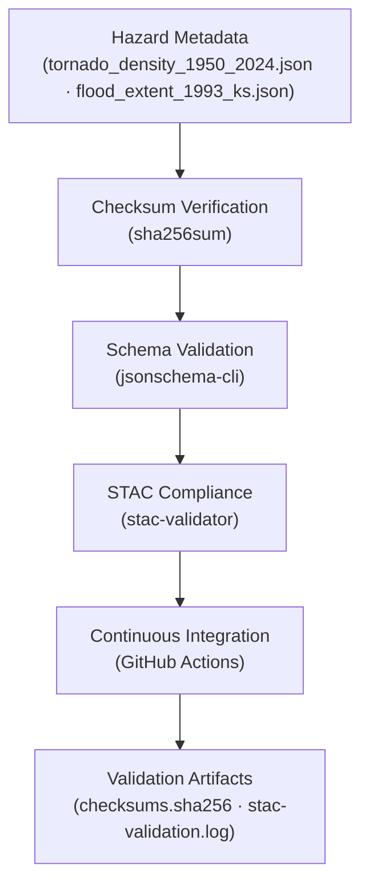

<div align="center">

# ⚠️ Kansas Frontier Matrix — Hazards Metadata Validation  
`data/derivatives/metadata/hazards/validation/`

**Purpose:** Maintain reproducible, auditable **validation logs and checksum manifests**  
for all hazard derivative metadata — ensuring STAC compliance, data integrity,  
and transparent provenance under the Master Coder Protocol (MCP).

[](../../../../../../.github/workflows/site.yml)
[](../../../../../../.github/workflows/stac-validate.yml)
[](../../../../../../.github/workflows/codeql.yml)
[](../../../../../../.github/workflows/trivy.yml)
[](../../../../../../docs/)
[](../../../../../../LICENSE)

</div>

---

## 📚 Overview

This directory records all **validation outputs and integrity checks**  
for the hazard derivative metadata registry under  
`data/derivatives/metadata/hazards/`.

Each validation artifact ensures:
- ✅ **Checksum integrity** of metadata JSONs  
- ✅ **Schema and STAC compliance**  
- ✅ **CI/CD reproducibility** through automated GitHub workflows  
- ✅ **Traceability** per the Master Coder Protocol (MCP)

---

## 🗂️ Directory Layout
```bash
data/derivatives/metadata/hazards/validation/
├── README.md              # This document
├── checksums.sha256       # SHA-256 hash signatures for hazard metadata JSONs
└── stac-validation.log    # Combined log for STAC + schema validation
````

---

## 🧭 Validation Flow



---

## 🧩 Validation Components

| Artifact                  | Description                                                | Tool                                  |
| :------------------------ | :--------------------------------------------------------- | :------------------------------------ |
| **`checksums.sha256`**    | Records SHA-256 hashes for every hazard metadata JSON file | `sha256sum`                           |
| **`stac-validation.log`** | Aggregated validation log for STAC and schema checks       | `stac-validator`, `jsonschema-cli`    |
| **CI/CD Pipeline**        | Automates validation upon push/PR                          | `.github/workflows/stac-validate.yml` |

---

## 🧠 Example: `checksums.sha256`

```text
b41e3d77a91dfb71deec48c3a54458cc099a6f24515e0323d31c7ebf29d0d79c  tornado_density_1950_2024.json
f0f1da9c53bfa0b8652b8014a92af73e44e7f76f9633aa19a6ed583dd72afed1  flood_extent_1993_ks.json
```

Each checksum is validated by the CI pipeline during pull requests.
Any change in content without an updated checksum triggers a validation error.

---

## 🧮 Validation Commands

| Step                   | Command                                                            | Purpose                                    |
| :--------------------- | :----------------------------------------------------------------- | :----------------------------------------- |
| **Generate Checksums** | `find .. -name "*.json" -exec sha256sum {} \; > checksums.sha256`  | Create integrity registry                  |
| **Validate Schema**    | `jsonschema -i ../*.json ../../schema/derivative_item.schema.json` | Enforce MCP-compliant metadata schema      |
| **Validate STAC**      | `stac-validator ../*.json --log stac-validation.log`               | Confirm STAC 1.0 + extensions compliance   |
| **Combine Reports**    | `cat checksums.sha256 >> stac-validation.log`                      | Append integrity hashes to validation logs |

Run via the Makefile target:
`make validate-hazards`

---

## 🧪 Continuous Integration (CI/CD)

The GitHub Actions workflow
[`.github/workflows/stac-validate.yml`](../../../../../../.github/workflows/stac-validate.yml)
automatically performs:

1. **Checksum generation and verification**
2. **Schema + STAC validation**
3. **Artifact upload and version logging**
4. **Error reporting + workflow status**

All logs are retained for transparency and audit under the MCP framework.

---

## 🧩 Related Documents

* [`../README.md`](../README.md) — Hazards derivative metadata registry
* [`../../schema/README.md`](../../schema/README.md) — Schema definitions for validation
* [`../../../../docs/standards/markdown_protocol.md`](../../../../docs/standards/markdown_protocol.md) — Markdown Documentation Framework
* [`../../../../../../.github/workflows/stac-validate.yml`](../../../../../../.github/workflows/stac-validate.yml) — CI validation workflow

---

## 🧾 Versioning & Changelog

| Version    | Date       | Author          | Notes                                                                                           |
| :--------- | :--------- | :-------------- | :---------------------------------------------------------------------------------------------- |
| **v1.0.0** | 2025-10-11 | Hazards QA Team | Initial creation of hazard validation directory; integrated checksum + STAC verification system |

---

## 🪶 License & Provenance

**License:** [CC-BY 4.0](../../../../../../LICENSE)
**Provenance:** Generated and maintained under the **Master Coder Protocol (MCP)** — ensuring documented, validated, and reproducible metadata workflows.
**Maintainers:** Kansas Frontier Matrix Hazards QA & Emergency Validation Team
**Last Updated:** 2025-10-11

```

---
