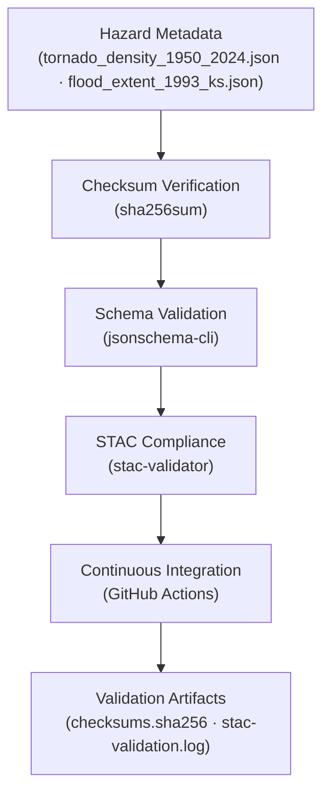

<div align="center">

# ⚠️ Kansas Frontier Matrix — Hazards Metadata Validation  
`data/derivatives/metadata/hazards/validation/`

**Purpose:** Maintain reproducible, auditable **validation logs and checksum manifests**  
for all hazard derivative metadata — ensuring **STAC compliance**, **data integrity**,  
and transparent **provenance** under the **Master Coder Protocol (MCP)**.

[](../../../../../../.github/workflows/site.yml)
[](../../../../../../.github/workflows/stac-validate.yml)
[](../../../../../../.github/workflows/codeql.yml)
[](../../../../../../.github/workflows/trivy.yml)
[](../../../../../../docs/)
[](../../../../../../LICENSE)

</div>

---

## 📚 Overview

This directory stores **automated validation outputs** and **integrity verification manifests**  
for the hazard derivative metadata registry (`data/derivatives/metadata/hazards/`).

Each artifact ensures:

- ✅ **Checksum integrity** — every metadata JSON has a unique SHA-256 signature  
- ✅ **Schema & STAC compliance** — validated via JSON Schema + `stac-validator`  
- ✅ **CI/CD reproducibility** — automated through GitHub Actions workflows  
- ✅ **Transparent provenance** — traceable and auditable per the **MCP** framework

---

## 🗂️ Directory Layout

```bash
data/derivatives/metadata/hazards/validation/
├── README.md              # This document (v1.1.0)
├── checksums.sha256       # SHA-256 integrity signatures
└── stac-validation.log    # STAC + JSON Schema validation output
````

---

## 🧭 Validation Workflow



<!-- END OF MERMAID -->

---

## 🧩 Validation Components

| Artifact                  | Description                                    | Tool / Source                         |
| :------------------------ | :--------------------------------------------- | :------------------------------------ |
| **`checksums.sha256`**    | SHA-256 integrity registry for hazard metadata | `sha256sum`                           |
| **`stac-validation.log`** | Aggregated STAC + schema validation log        | `stac-validator`, `jsonschema-cli`    |
| **CI/CD Pipeline**        | Automated validation on commit / PR            | `.github/workflows/stac-validate.yml` |
| **Makefile Target**       | Local execution wrapper                        | `make validate-hazards`               |

---

## 🧠 Example — `checksums.sha256`

```text
b41e3d77a91dfb71deec48c3a54458cc099a6f24515e0323d31c7ebf29d0d79c  tornado_density_1950_2024.json
f0f1da9c53bfa0b8652b8014a92af73e44e7f76f9633aa19a6ed583dd72afed1  flood_extent_1993_ks.json
```

Each checksum corresponds to a validated metadata file.
If a checksum mismatch is detected, the CI pipeline halts the merge and reports the discrepancy.

---

## 🧮 Validation Commands

| Step                   | Command                                                            | Purpose                                      |
| :--------------------- | :----------------------------------------------------------------- | :------------------------------------------- |
| **Generate Checksums** | `find .. -name "*.json" -exec sha256sum {} \; > checksums.sha256`  | Compute and record SHA-256 integrity hashes  |
| **Validate Schema**    | `jsonschema -i ../*.json ../../schema/derivative_item.schema.json` | Enforce structural conformance to KFM schema |
| **Validate STAC**      | `stac-validator ../*.json --log stac-validation.log`               | Ensure STAC 1.0 + extensions compliance      |
| **Combine Reports**    | `cat checksums.sha256 >> stac-validation.log`                      | Merge checksum + validation summaries        |

Run the full validation process via:

```bash
make validate-hazards
```

---

## ⚙️ Continuous Integration (CI/CD)

The [`.github/workflows/stac-validate.yml`](../../../../../../.github/workflows/stac-validate.yml)
workflow executes the full MCP validation chain:

1. **Checksum generation & verification**
2. **Schema + STAC validation**
3. **Artifact upload & version tagging**
4. **Error reporting + audit log retention**

Validation results are published as GitHub Action artifacts, preserving a permanent **QA/QC audit trail**.

---

## 🧩 Related Documents

| Path                                                                                                             | Purpose                                |
| :--------------------------------------------------------------------------------------------------------------- | :------------------------------------- |
| [`../README.md`](../README.md)                                                                                   | Hazards derivative metadata registry   |
| [`../../schema/README.md`](../../schema/README.md)                                                               | JSON Schema definitions                |
| [`../../../../docs/standards/markdown_protocol.md`](../../../../docs/standards/markdown_protocol.md)             | Markdown + MCP documentation standards |
| [`../../../../../../.github/workflows/stac-validate.yml`](../../../../../../.github/workflows/stac-validate.yml) | CI validation workflow specification   |

---

## ✅ MCP Compliance Checklist

| Principle           | Implemented | Evidence                   |
| :------------------ | :---------: | :------------------------- |
| Documentation-First |      ✅      | Frontmatter + README.md    |
| Provenance          |      ✅      | Checksums + STAC logs      |
| Reproducibility     |      ✅      | Makefile + CI workflow     |
| Schema Validation   |      ✅      | `jsonschema-cli` checks    |
| Transparency        |      ✅      | Logs retained as artifacts |

---

## 🧾 Versioning & Changelog

| Version    | Date       | Author          | Notes                                                             |
| :--------- | :--------- | :-------------- | :---------------------------------------------------------------- |
| **v1.1.0** | 2025-10-11 | Hazards QA Team | Added YAML frontmatter, MCP compliance table, expanded CI section |
| **v1.0.0** | 2025-10-11 | Hazards QA Team | Initial release — integrated checksum + STAC verification         |

---

## 🪶 License & Provenance

**License:** [CC-BY 4.0](../../../../../../LICENSE)
**Provenance:** Created under the **Master Coder Protocol (MCP)** — documentation-first, reproducible, and validated metadata workflows.
**Maintainers:** Kansas Frontier Matrix — Hazards QA & Emergency Validation Team
**Last Updated:** 2025-10-11

```

---
