<div align="center">

# 💧 Kansas Frontier Matrix — Hydrology Derivative Metadata  
`data/derivatives/metadata/hydrology/`

**Mission:** Define and maintain **hydrology derivative metadata** for the Kansas Frontier Matrix (KFM),  
providing full lineage, provenance, and schema validation for all hydrologic derivatives —  
including flow direction, accumulation, watershed delineation, and stream network products.

[](../../../../../.github/workflows/site.yml)
[](../../../../../.github/workflows/stac-validate.yml)
[](../../../../../.github/workflows/codeql.yml)
[](../../../../../.github/workflows/trivy.yml)
[](../../../../../docs/)
[](../../../../../LICENSE)

</div>

---

## 📚 Overview

The **Hydrology Metadata Registry** documents the **derived hydrologic datasets** within  
`data/derivatives/hydrology/`, ensuring consistent metadata structure, version tracking,  
and STAC-compliant interoperability for watershed-scale modeling and analysis.

All records conform to:
- **STAC 1.0.0 Core + KFM Derivative Metadata Schema v1.0**
- **MCP Provenance Framework** (document-first, reproducibility, and traceability)
- **ISO 19115** (geospatial metadata best practices)

---

## 🗂️ Directory Layout
```bash
data/derivatives/metadata/hydrology/
├── README.md                    # This document
├── flow_direction_1m_ks.json    # Flow direction raster metadata
├── flow_accumulation_1m_ks.json # Flow accumulation raster metadata
└── validation/
    ├── checksums.sha256         # SHA-256 checksum registry
    └── stac-validation.log      # STAC + schema validation logs
````

---

## 🧩 Core Metadata Schema

| Field             | Type   | Description                                             |
| :---------------- | :----- | :------------------------------------------------------ |
| `id`              | string | Unique STAC-compliant dataset identifier                |
| `title`           | string | Human-readable dataset title                            |
| `description`     | string | Concise dataset overview and derivation context         |
| `provenance`      | object | Source inputs, processing lineage, and responsible team |
| `spatial_extent`  | object | Bounding box or GeoJSON extent of dataset coverage      |
| `temporal_extent` | object | Time window (capture or derivation date range)          |
| `uncertainty`     | object | Accuracy metrics and model parameters                   |
| `stac_extensions` | array  | STAC extension URIs used for metadata enrichment        |
| `version`         | string | Semantic version number                                 |
| `created`         | string | Creation timestamp                                      |
| `last_updated`    | string | Last update timestamp                                   |

---

## 🧠 Example Metadata Record

```json
{
  "id": "kfm_hydrology_flow_direction_1m_ks_v1",
  "title": "Flow Direction (1m) — Kansas Watershed Grid",
  "description": "Derived from 1-meter LiDAR DEMs using D8 algorithm to define downslope flow directions for Kansas hydrologic analysis.",
  "provenance": {
    "sources": [
      "data/sources/usgs_lidar_dem_1m_ks.json"
    ],
    "processing": "Flow direction computed using TauDEM D8 algorithm; reprojection EPSG:26914.",
    "validation": "Checksum and STAC schema verified 2025-10-10."
  },
  "spatial_extent": {
    "bbox": [-102.05, 36.99, -94.59, 40.00],
    "crs": "EPSG:26914"
  },
  "temporal_extent": {
    "start": "2020-01-01",
    "end": "2021-12-31"
  },
  "uncertainty": {
    "hydrologic_rmse": 0.08,
    "confidence_interval": "95%"
  },
  "stac_extensions": [
    "https://stac-extensions.github.io/processing/v1.1.0/schema.json",
    "https://stac-extensions.github.io/provenance/v1.0.0/schema.json"
  ],
  "version": "1.0.0",
  "created": "2025-10-10",
  "last_updated": "2025-10-11"
}
```

---

## 🧭 Data Lineage

```mermaid
flowchart TD
    A["Source Elevation<br/>(USGS LiDAR DEM 1m)"]
        --> B["Hydrologic Processing<br/>TauDEM · GDAL · Python"]
    B --> C["Derived Products<br/>Flow Direction · Flow Accumulation"]
    C --> D["Metadata Registry<br/>(data/derivatives/metadata/hydrology)"]
    D --> E["STAC Catalog<br/>(data/stac/collections/hydrology_derivatives)"]
    E --> F["Web UI<br/>Hydrology Layers · Flow Networks · Catchments"]
```



---

## 🧪 Validation Workflow

| Stage                      | Description                             | Tool                                  |
| :------------------------- | :-------------------------------------- | :------------------------------------ |
| **Checksum Validation**    | Verify SHA-256 file integrity           | `sha256sum`                           |
| **Schema Validation**      | Validate structure via KFM schema       | `jsonschema-cli`                      |
| **STAC Validation**        | Confirm STAC 1.0 compliance             | `stac-validator`                      |
| **Continuous Integration** | Automated validation via CI/CD pipeline | `.github/workflows/stac-validate.yml` |

Results are logged to `validation/stac-validation.log`.

---

## 🔧 Makefile Integration

```make
validate-hydrology:
	jsonschema -i data/derivatives/metadata/hydrology/*.json \
	           data/derivatives/metadata/schema/derivative_item.schema.json
```

The target is automatically invoked by the global `make validate-metadata` process.

---

## 🧩 Related Documents

* [`../README.md`](../README.md) — Parent metadata registry
* [`../../hydrology/README.md`](../../hydrology/README.md) — Processed hydrology datasets
* [`../../schema/README.md`](../../schema/README.md) — JSON Schema documentation
* [`../../../../docs/standards/markdown_protocol.md`](../../../../docs/standards/markdown_protocol.md) — Markdown Documentation Framework
* [`../../../../docs/templates/model_card.md`](../../../../docs/templates/model_card.md) — Model documentation template

---

## 🧾 Versioning & Changelog

| Version    | Date       | Author             | Notes                                                                                              |
| :--------- | :--------- | :----------------- | :------------------------------------------------------------------------------------------------- |
| **v1.0.0** | 2025-10-11 | KFM Hydrology Team | Initial release documenting flow direction and accumulation metadata registry under MCP compliance |

---

## 🪶 License & Provenance

**License:** [CC-BY 4.0](../../../../../LICENSE)
**Provenance:** Authored under the **Master Coder Protocol (MCP)** — ensuring documentation-first, auditable, and reproducible hydrologic metadata.
**Maintainers:** Kansas Frontier Matrix Hydrology & Watershed Modeling Team
**Last Updated:** 2025-10-11

```

---
