<div align="center">

# 💧 Kansas Frontier Matrix — Hydrology Derivative Metadata

`data/derivatives/metadata/hydrology/`

**Mission:** Define and maintain **hydrology derivative metadata** for KFM — providing **lineage, provenance, and schema validation** for hydrologic derivatives (flow direction/accumulation, watersheds, stream networks).

[](../../../../../.github/workflows/site.yml)
[](../../../../../.github/workflows/stac-validate.yml)
[](../../../../../.github/workflows/codeql.yml)
[](../../../../../.github/workflows/trivy.yml)
[](../../../../../docs/)
[](../../../../../LICENSE)

</div>

---

## 🧭 Version & Governance

| Version    | Status | Last Updated | Maintainer              | Validation   |
| :--------- | :----: | :----------- | :---------------------- | :----------- |
| **v1.1.0** | Stable | 2025-10-11   | Hydrology Modeling Team | ✅ CI passing |

**Protocol:** Master Coder Protocol (MCP) · Documentation-First · Auditable · Reproducible
**License:** [CC-BY 4.0](../../../../../LICENSE)

---

## 📚 Overview

The **Hydrology Metadata Registry** standardizes documentation for hydrologic derivatives:

* **Flow Direction** (D8/D∞), **Flow Accumulation**, **Watershed/Catchment Delineation**, **Stream/River Networks**
* Derived primarily from **1 m LiDAR DEM** tiles (USGS 3DEP / Kansas DASC) and processed via **TauDEM/GDAL/Python**

All records conform to **STAC 1.0.0 + KFM Derivative Metadata Schema v1.1** and MCP reproducibility requirements.

---

## 🗂️ Directory Layout

```bash
data/derivatives/metadata/hydrology/
├── README.md                         # This document
├── flow_direction_1m_ks.json         # Flow direction (e.g., D8) metadata
├── flow_accumulation_1m_ks.json      # Accumulation cells/area metadata
└── validation/
    ├── checksums.sha256              # SHA-256 checksum registry
    └── stac-validation.log           # STAC + JSON Schema validation log
```

---

## 🧩 Core Metadata Schema (KFM Derivative v1.1)

| Field             | Type   | Description                                                           |
| :---------------- | :----- | :-------------------------------------------------------------------- |
| `id`              | string | Unique STAC-compliant identifier (e.g., `kfm_hydro_flowdir_1m_ks_v1`) |
| `title`           | string | Human-readable name                                                   |
| `description`     | string | Purpose, inputs, derivation summary                                   |
| `provenance`      | object | Sources, ETL lineage, processing environment, validation notes        |
| `spatial_extent`  | object | BBox/GeoJSON + CRS                                                    |
| `temporal_extent` | object | Source acquisition or processing window                               |
| `uncertainty`     | object | Metrics (e.g., vertical RMSE of DEM, pour-point sensitivity)          |
| `parameters`      | object | Algorithm/config (e.g., `method`, `threshold_cells`, `burn_streams`)  |
| `stac_extensions` | array  | STAC extension URLs (processing, provenance, raster)                  |
| `version`         | string | SemVer of the metadata record                                         |
| `created`         | string | ISO-8601 creation time                                                |
| `last_updated`    | string | ISO-8601 last modification                                            |

> **Hydrology notes:** capture `method` (D8/D∞), `pit_filling` strategy, `stream_burn_depth`, `accumulation_units` (cells, km²), and any **snap-to-stream** or **tauDEM** flags used.

---

## 🧠 Example Metadata Record

```json
{
  "id": "kfm_hydrology_flow_direction_1m_ks_v1",
  "title": "Flow Direction (1 m) — Kansas Watershed Grid",
  "description": "Flow direction derived from 1 m LiDAR DEM using TauDEM D8 algorithm; used for watershed modeling and network extraction.",
  "provenance": {
    "sources": ["data/sources/usgs_lidar_dem_1m_ks.json"],
    "processing": "Fill sinks (Planchon–Darboux); TauDEM D8; edge conditioning; reprojection EPSG:26914",
    "environment": { "gdal": "3.8.x", "taudem": "5.3.x", "python": "3.11", "os": "Ubuntu 22.04" },
    "validation": "Checksums + JSON Schema + STAC validation passed 2025-10-10"
  },
  "spatial_extent": { "bbox": [-102.05, 36.99, -94.59, 40.00], "crs": "EPSG:26914" },
  "temporal_extent": { "start": "2020-01-01", "end": "2021-12-31" },
  "uncertainty": { "dem_vertical_rmse": 0.15, "confidence_interval": "95%" },
  "parameters": { "method": "D8", "pit_filling": "on", "stream_burn_depth": 0.5 },
  "stac_extensions": [
    "https://stac-extensions.github.io/processing/v1.1.0/schema.json",
    "https://stac-extensions.github.io/provenance/v1.0.0/schema.json",
    "https://stac-extensions.github.io/raster/v1.1.0/schema.json"
  ],
  "version": "1.0.0",
  "created": "2025-10-10",
  "last_updated": "2025-10-11"
}
```

---

## 🧭 Data Lineage

```mermaid
flowchart TD
  A["Source Elevation<br/>USGS LiDAR DEM (1 m)"]
    --> B["Preprocess<br/>Sink fill · Reproject · Burn streams"]
  B --> C["Hydrologic Processing<br/>TauDEM · GDAL · Python"]
  C --> D["Derived Products<br/>FlowDir · FlowAcc · Watersheds · Streams"]
  D --> E["Metadata Registry<br/>data/derivatives/metadata/hydrology"]
  E --> F["STAC Catalog<br/>data/stac/collections/hydrology_derivatives"]
  F --> G["Web UI<br/>Hydrology layers · Flow networks · Catchments"]
```



<!-- END OF MERMAID -->

---

## 🧪 Validation Workflow

| Stage                      | Description                              | Tool / Location                             |
| :------------------------- | :--------------------------------------- | :------------------------------------------ |
| **Checksum Validation**    | Verify SHA-256 integrity of JSON records | `sha256sum` → `validation/checksums.sha256` |
| **Schema Validation**      | Enforce KFM Derivative v1.1 structure    | `jsonschema` (CLI)                          |
| **STAC Validation**        | Validate STAC core + extensions          | `stac-validator`                            |
| **Continuous Integration** | Automated checks on PR/push              | `.github/workflows/stac-validate.yml`       |

All results are logged to `validation/stac-validation.log`.

**Failure-Triage (quick guide)**

| Failure           | Typical Cause                        | Fix                                         |
| :---------------- | :----------------------------------- | :------------------------------------------ |
| Checksum mismatch | Edited JSON without rehash           | Regenerate `checksums.sha256`               |
| Schema invalid    | Missing `parameters`/required fields | Align JSON with schema v1.1                 |
| STAC invalid      | Wrong extension URL or field name    | Pin correct STAC extension URLs; fix fields |

---

## 🔧 Makefile Integration

```make
validate-hydrology:
	@echo "[KFM] Validating hydrology metadata..."
	find data/derivatives/metadata/hydrology -maxdepth 1 -name "*.json" \
	  -exec sha256sum {} \; > data/derivatives/metadata/hydrology/validation/checksums.sha256
	jsonschema -i data/derivatives/metadata/hydrology/*.json \
	  data/derivatives/metadata/schema/derivative_item.schema.json
	stac-validator data/derivatives/metadata/hydrology/*.json \
	  --log data/derivatives/metadata/hydrology/validation/stac-validation.log
	@echo "--- CHECKSUMS ---" >> data/derivatives/metadata/hydrology/validation/stac-validation.log
	@cat data/derivatives/metadata/hydrology/validation/checksums.sha256 >> \
	  data/derivatives/metadata/hydrology/validation/stac-validation.log
```

> Add `validate-hydrology` to the umbrella target `make validate-metadata`.

---

## 🔗 Related Documents

* [`../README.md`](../README.md) — Parent derivative metadata registry
* [`../../hydrology/README.md`](../../hydrology/README.md) — Processed hydrology datasets
* [`../../schema/README.md`](../../schema/README.md) — JSON Schema registry & rules
* [`../../../../docs/standards/markdown_protocol.md`](../../../../docs/standards/markdown_protocol.md) — Markdown/MCP standard
* [`../../../../docs/templates/model_card.md`](../../../../docs/templates/model_card.md) — Model/method documentation template

---

## 🧾 Versioning & Changelog

| Version    | Date       | Author                  | Notes                                                                                       |
| :--------- | :--------- | :---------------------- | :------------------------------------------------------------------------------------------ |
| **v1.1.0** | 2025-10-11 | Hydrology Modeling Team | Added governance table, `parameters` section (method/thresholds), CI triage, closed Mermaid |
| v1.0.0     | 2025-10-11 | Hydrology Team          | Initial registry (flow direction + accumulation) under MCP compliance                       |

---

## 🪶 Attribution

**Kansas Frontier Matrix — “Time · Terrain · History”**
Authored under **MCP** · **STAC-Compliant** · **Reproducible** · **Versioned** · **Auditable**
**Maintainers:** Kansas Frontier Matrix Hydrology & Watershed Modeling Team
**Last Updated:** 2025-10-11

---
