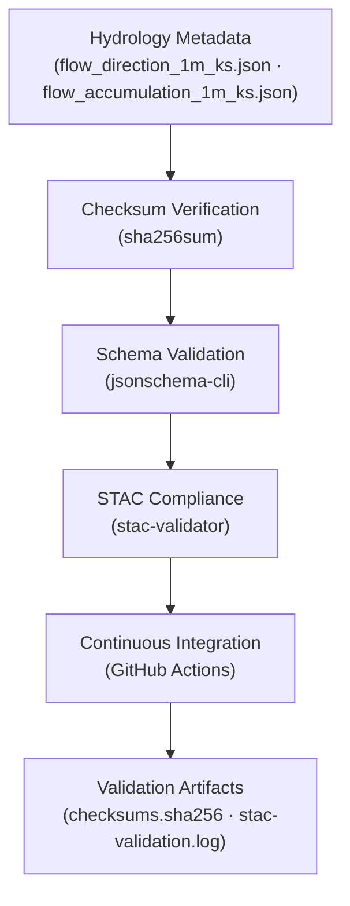

<div align="center">

# 💧 Kansas Frontier Matrix — Hydrology Metadata Validation  
`data/derivatives/metadata/hydrology/validation/`

**Purpose:** Maintain verifiable **QA/QC validation records** for all hydrologic derivative metadata,  
ensuring STAC compliance, checksum integrity, and full MCP reproducibility for Kansas Frontier Matrix (KFM) hydrology datasets.

[](../../../../../../.github/workflows/site.yml)
[](../../../../../../.github/workflows/stac-validate.yml)
[](../../../../../../.github/workflows/codeql.yml)
[](../../../../../../.github/workflows/trivy.yml)
[](../../../../../../docs/)
[](../../../../../../LICENSE)

</div>

---

## 📚 Overview

This directory stores **validation logs** and **checksum manifests** verifying the structural and  
semantic integrity of all hydrology metadata JSON files under  
`data/derivatives/metadata/hydrology/`.

Each validation artifact provides traceable proof of:
- ✅ **File integrity** via SHA-256 hashes  
- ✅ **STAC & schema compliance** through automated validation  
- ✅ **Reproducibility** under the Master Coder Protocol (MCP)  

---

## 🗂️ Directory Layout
```bash
data/derivatives/metadata/hydrology/validation/
├── README.md              # This document
├── checksums.sha256       # SHA-256 integrity signatures
└── stac-validation.log    # STAC and JSON Schema validation output
````

---

## 🧭 Validation Flow



---

## 🧩 Validation Components

| Artifact                  | Description                                              | Tool                                  |
| :------------------------ | :------------------------------------------------------- | :------------------------------------ |
| **`checksums.sha256`**    | File integrity hashes for all hydrology metadata JSONs   | `sha256sum`                           |
| **`stac-validation.log`** | Aggregated STAC and schema validation report             | `stac-validator`, `jsonschema-cli`    |
| **CI Workflow**           | Automated validation pipeline for all derivative domains | `.github/workflows/stac-validate.yml` |

---

## 🧠 Example: `checksums.sha256`

```text
c2a38f3b8b0fba233b9d9f68ec4c21916b0b74f7c6dcbe614ae01e7df57b2dc1  flow_direction_1m_ks.json
42b31f16f6a4b981a873aeefb8da1dcd4f11d1a51bba7ad94ad7f758c6e0b10b  flow_accumulation_1m_ks.json
```

Each hash corresponds to a verified metadata file.
CI compares current and historical hashes to flag any unauthorized modification or corruption.

---

## 🧮 Validation Commands

| Step                   | Command                                                            | Purpose                                       |
| :--------------------- | :----------------------------------------------------------------- | :-------------------------------------------- |
| **Generate Checksums** | `find .. -name "*.json" -exec sha256sum {} \; > checksums.sha256`  | Registers SHA-256 signatures for metadata     |
| **Validate Schema**    | `jsonschema -i ../*.json ../../schema/derivative_item.schema.json` | Ensures metadata structure follows KFM schema |
| **Validate STAC**      | `stac-validator ../*.json --log stac-validation.log`               | Verifies STAC and extension compliance        |
| **Aggregate Logs**     | `cat checksums.sha256 >> stac-validation.log`                      | Consolidates checksum and STAC logs           |

All steps are executed automatically via the Makefile target `make validate-hydrology`.

---

## 🧪 Continuous Integration (CI/CD)

The `.github/workflows/stac-validate.yml` pipeline performs:

1. **Checksum verification** — using `sha256sum`
2. **Schema validation** — via `jsonschema-cli`
3. **STAC compliance check** — using `stac-validator`
4. **Artifact publication** — to GitHub Actions build logs and artifacts

All logs are persisted for reproducibility and long-term audit under MCP.

---

## 🧩 Related Documents

* [`../README.md`](../README.md) — Hydrology derivative metadata registry
* [`../../schema/README.md`](../../schema/README.md) — JSON Schema definitions
* [`../../../../docs/standards/markdown_protocol.md`](../../../../docs/standards/markdown_protocol.md) — Markdown & MCP standards
* [`../../../../../../.github/workflows/stac-validate.yml`](../../../../../../.github/workflows/stac-validate.yml) — CI validation pipeline

---

## 🧾 Versioning & Changelog

| Version    | Date       | Author            | Notes                                                                                                     |
| :--------- | :--------- | :---------------- | :-------------------------------------------------------------------------------------------------------- |
| **v1.0.0** | 2025-10-11 | Hydrology QA Team | Initial release of validation framework for hydrology derivative metadata (flow direction & accumulation) |

---

## 🪶 License & Provenance

**License:** [CC-BY 4.0](../../../../../../LICENSE)
**Provenance:** Generated under the **Master Coder Protocol (MCP)** — ensuring documentation-first, validated, and reproducible QA/QC metadata.
**Maintainers:** Kansas Frontier Matrix Hydrology QA & Watershed Validation Team
**Last Updated:** 2025-10-11

```

---
