```mermaid
flowchart TD
    A["Hydrology Metadata<br/>(flow_direction_1m_ks.json · flow_accumulation_1m_ks.json)"]
        --> B["Checksum Verification<br/>(sha256sum)"]
    B --> C["Schema Validation<br/>(jsonschema-cli)"]
    C --> D["STAC Compliance<br/>(stac-validator)"]
    D --> E["Continuous Integration<br/>(GitHub Actions)"]
    E --> F["Validation Artifacts<br/>(checksums.sha256 · stac-validation.log)"]
```

<div align="center">

# 💧 Kansas Frontier Matrix — Hydrology Metadata Validation  
`data/derivatives/metadata/hydrology/validation/`

**Purpose:** Maintain verifiable **QA/QC validation records** for all hydrologic derivative metadata,  
ensuring **STAC compliance**, **checksum integrity**, and full **MCP reproducibility**  
for Kansas Frontier Matrix (KFM) hydrology datasets.

[](../../../../../../.github/workflows/site.yml)
[](../../../../../../.github/workflows/stac-validate.yml)
[](../../../../../../.github/workflows/codeql.yml)
[](../../../../../../.github/workflows/trivy.yml)
[](../../../../../../docs/)
[](../../../../../../LICENSE)

</div>

---

## 📚 Overview

The `validation/` directory stores **automated validation logs** and **checksum manifests**  
that verify the structural, semantic, and provenance integrity of all hydrology metadata JSON files  
under `data/derivatives/metadata/hydrology/`.

Each validation artifact provides traceable proof of:

- ✅ **File integrity** — via SHA-256 cryptographic hashes  
- ✅ **Schema & STAC compliance** — validated automatically via CI  
- ✅ **Reproducibility & provenance** — conforming to the Master Coder Protocol (MCP)

---

## 🗂️ Directory Layout

```bash
data/derivatives/metadata/hydrology/validation/
├── README.md              # This document (v1.1.0)
├── checksums.sha256       # SHA-256 integrity signatures
└── stac-validation.log    # STAC + JSON Schema validation output
````

---

## 🧭 Validation Workflow



<!-- END OF MERMAID -->

---

## 🧩 Validation Components

| Artifact                  | Description                                              | Tool / Source                         |
| :------------------------ | :------------------------------------------------------- | :------------------------------------ |
| **`checksums.sha256`**    | File integrity hashes for all hydrology metadata JSONs   | `sha256sum` CLI utility               |
| **`stac-validation.log`** | Aggregated STAC and schema validation report             | `stac-validator`, `jsonschema-cli`    |
| **CI Workflow**           | Automated validation pipeline for all derivative domains | `.github/workflows/stac-validate.yml` |
| **Makefile Target**       | Local validation automation                              | `make validate-hydrology`             |

---

## 🧠 Example — `checksums.sha256`

```text
c2a38f3b8b0fba233b9d9f68ec4c21916b0b74f7c6dcbe614ae01e7df57b2dc1  flow_direction_1m_ks.json
42b31f16f6a4b981a873aeefb8da1dcd4f11d1a51bba7ad94ad7f758c6e0b10b  flow_accumulation_1m_ks.json
```

Each checksum corresponds to a validated metadata file.
CI/CD workflows compare historical and current hashes to flag any unauthorized modifications or corruption.

---

## 🧮 Validation Commands

| Step                   | Command                                                            | Purpose                                   |
| :--------------------- | :----------------------------------------------------------------- | :---------------------------------------- |
| **Generate Checksums** | `find .. -name "*.json" -exec sha256sum {} \; > checksums.sha256`  | Registers SHA-256 signatures for metadata |
| **Validate Schema**    | `jsonschema -i ../*.json ../../schema/derivative_item.schema.json` | Ensures metadata conforms to KFM schema   |
| **Validate STAC**      | `stac-validator ../*.json --log stac-validation.log`               | Verifies STAC & extension compliance      |
| **Aggregate Logs**     | `cat checksums.sha256 >> stac-validation.log`                      | Consolidates checksum + STAC logs         |

All steps are wrapped in the Makefile target:

```bash
make validate-hydrology
```

---

## ⚙️ Continuous Integration (CI/CD)

The `.github/workflows/stac-validate.yml` pipeline executes:

1. **Checksum verification** — via `sha256sum`
2. **JSON Schema validation** — with `jsonschema-cli`
3. **STAC compliance check** — through `stac-validator`
4. **Artifact publication** — validation logs uploaded to GitHub Actions artifacts
5. **Result reporting** — badges and logs reflected on project pages

This ensures **full MCP reproducibility**, automated provenance tracking,
and transparent auditability across KFM’s hydrologic metadata lifecycle.

---

## 🔗 Related Documents

| Reference                                                                                            | Description                                      |
| :--------------------------------------------------------------------------------------------------- | :----------------------------------------------- |
| [`../README.md`](../README.md)                                                                       | Hydrology derivative metadata registry overview  |
| [`../../schema/README.md`](../../schema/README.md)                                                   | JSON Schema definitions and validation standards |
| [`../../../../docs/standards/markdown_protocol.md`](../../../../docs/standards/markdown_protocol.md) | Markdown and MCP documentation protocol          |
| [`.github/workflows/stac-validate.yml`](../../../../../../.github/workflows/stac-validate.yml)       | CI validation pipeline configuration             |

---

## 🧾 Versioning & Changelog

| Version    | Date       | Author            | Notes                                                                           |
| :--------- | :--------- | :---------------- | :------------------------------------------------------------------------------ |
| **v1.1.0** | 2025-10-11 | Hydrology QA Team | Added YAML frontmatter, standardized CI/CD integration, upgraded MCP compliance |
| **v1.0.0** | 2025-10-01 | Hydrology QA Team | Initial release of hydrology metadata validation framework                      |

---

## 🪶 License, Provenance & Maintenance

* **License:** [CC-BY 4.0](../../../../../../LICENSE)
* **Provenance:** Generated under the **Master Coder Protocol (MCP)** — documentation-first, reproducible, and validated metadata system.
* **Maintainers:** Kansas Frontier Matrix Hydrology QA & Watershed Validation Team
* **Last Updated:** 2025-10-11

---

### ✅ MCP Compliance Summary

| MCP Principle          | Implemented | Evidence                  |
| :--------------------- | :---------: | :------------------------ |
| Documentation-First    |      ✅      | README + frontmatter      |
| Reproducibility        |      ✅      | Makefile + CI/CD pipeline |
| Provenance             |      ✅      | STAC + checksums          |
| Schema Validation      |      ✅      | `jsonschema-cli`          |
| Continuous Integration |      ✅      | GitHub Actions workflow   |

---

> *Part of the Kansas Frontier Matrix hydrology metadata ecosystem.*
> *Forensics-ready. Audit-proof. Reproducible by design.*

```

---
