<div align="center">

# 🌿 Kansas Frontier Matrix — Landcover Derivative Metadata

`data/derivatives/metadata/landcover/`

**Mission:** Curate and validate **landcover derivative metadata** for KFM — documenting **provenance, schema compliance, lineage, and validation integrity** for remote-sensing vegetation and land classification products.

[](../../../../../.github/workflows/site.yml)
[](../../../../../.github/workflows/stac-validate.yml)
[](../../../../../.github/workflows/codeql.yml)
[](../../../../../.github/workflows/trivy.yml)
[](../../../../../docs/)
[](../../../../../LICENSE)

</div>

---

## 🧭 Version & Governance

| Version    | Status | Last Updated | Maintainer        | Validation   |
| :--------- | :----: | :----------- | :---------------- | :----------- |
| **v1.1.0** | Stable | 2025-10-11   | Landcover RS Team | ✅ CI passing |

**Protocol:** Master Coder Protocol (MCP) · Reproducible · Auditable · Versioned
**License:** [CC-BY 4.0](../../../../../LICENSE)

---

## 📚 Overview

The **Landcover Derivative Metadata Registry** standardizes documentation for:

* Vegetation indices (e.g., **NDVI**, EVI)
* Land classification (e.g., **NLCD** classes)
* **Change detection** (e.g., NLCD 1992–2021 deltas)
* Phenology summaries (growing season metrics)

Inputs commonly include **Landsat**, **Sentinel-2**, and **MODIS** surface reflectance products.

All metadata conforms to **STAC 1.0.0 + KFM Derivative Metadata Schema v1.1** and MCP documentation-first practices.

---

## 🗂️ Directory Layout

```bash
data/derivatives/metadata/landcover/
├── README.md                      # This document
├── ndvi_2021_ks.json              # NDVI (Normalized Difference Vegetation Index)
├── nlcd_1992_2021_change.json     # NLCD landcover change detection (1992–2021)
└── validation/
    ├── checksums.sha256           # Integrity hashes for landcover metadata JSONs
    └── stac-validation.log        # Validation report (STAC + JSON Schema)
```

---

## 🧩 Core Metadata Schema (KFM Derivative v1.1)

| Field             | Type   | Description                                                    |
| :---------------- | :----- | :------------------------------------------------------------- |
| `id`              | string | Unique STAC-compliant dataset identifier                       |
| `title`           | string | Human-readable dataset title                                   |
| `description`     | string | Methodology, purpose, scope                                    |
| `provenance`      | object | Sources, ETL lineage, processing environment                   |
| `spatial_extent`  | object | Bounding box / GeoJSON coverage + CRS                          |
| `temporal_extent` | object | Start/end acquisition or compositing period                    |
| `uncertainty`     | object | Accuracy metrics (RMSE, bias, CI)                              |
| `stac_extensions` | array  | Applied STAC extensions (processing, provenance, raster, etc.) |
| `version`         | string | SemVer of the metadata record                                  |
| `created`         | string | ISO-8601 creation timestamp                                    |
| `last_updated`    | string | ISO-8601 modification timestamp                                |

> **Recommended STAC extensions:** `processing`, `provenance`, `raster`, `classification`, `versions` (pin exact URLs in records).

---

## 🧠 Example Metadata Record

```json
{
  "id": "kfm_landcover_ndvi_2021_ks_v1",
  "title": "NDVI (Normalized Difference Vegetation Index) — Kansas 2021",
  "description": "Derived from Landsat 8 SR using NDVI = (NIR - Red) / (NIR + Red). Units: unitless [-1, 1].",
  "provenance": {
    "sources": ["data/sources/landsat8_surface_reflectance_2021.json"],
    "processing": "Cloud masking (QA band); NDVI via GDAL & NumPy; 30 m grid; reprojection EPSG:26914",
    "environment": {
      "gdal": "3.8.x",
      "numpy": "1.26.x",
      "os": "Ubuntu 22.04"
    },
    "validation": "Checksum + STAC validation passed 2025-10-10"
  },
  "spatial_extent": { "bbox": [-102.05, 36.99, -94.59, 40.00], "crs": "EPSG:26914" },
  "temporal_extent": { "start": "2021-01-01", "end": "2021-12-31" },
  "uncertainty": { "rmse": 0.023, "sensor_bias": "negligible", "confidence_interval": "95%" },
  "stac_extensions": [
    "https://stac-extensions.github.io/processing/v1.1.0/schema.json",
    "https://stac-extensions.github.io/provenance/v1.0.0/schema.json",
    "https://stac-extensions.github.io/raster/v1.1.0/schema.json"
  ],
  "version": "1.0.0",
  "created": "2025-10-10",
  "last_updated": "2025-10-11"
}
```

---

## 🧭 Data Lineage

```mermaid
flowchart TD
  A["Satellite SR Imagery<br/>(Landsat · Sentinel · MODIS)"]
    --> B["Preprocessing<br/>Cloud mask · Mosaics · Reproject"]
  B --> C["Index & Classification<br/>NDVI · EVI · NLCD change"]
  C --> D["Metadata Registry<br/>data/derivatives/metadata/landcover"]
  D --> E["STAC Catalog<br/>data/stac/collections/landcover_derivatives"]
  E --> F["Web UI<br/>Landcover layers · Vegetation analytics"]
```



<!-- END OF MERMAID -->

---

## 🧪 Validation Workflow

| Stage                     | Description                       | Tool / Location                             |
| :------------------------ | :-------------------------------- | :------------------------------------------ |
| **Checksum Verification** | Ensure file integrity (SHA-256)   | `sha256sum` → `validation/checksums.sha256` |
| **Schema Validation**     | Enforce KFM Derivative v1.1 shape | `jsonschema` (CLI)                          |
| **STAC Compliance**       | Validate core + extensions        | `stac-validator`                            |
| **Automated CI/CD**       | Run full pipeline on PR / push    | `.github/workflows/stac-validate.yml`       |

All logs are written to `validation/stac-validation.log`.

---

## 🔧 Makefile Targets

```make
validate-landcover:
	jsonschema -i data/derivatives/metadata/landcover/*.json \
	           data/derivatives/metadata/schema/derivative_item.schema.json

validate-landcover-stac:
	stac-validator data/derivatives/metadata/landcover/*.json \
	  --log data/derivatives/metadata/landcover/validation/stac-validation.log
```

> Add `validate-landcover` and `validate-landcover-stac` to your umbrella target `make validate-metadata`.

---

## 🧩 Related Documents

* [`../README.md`](../README.md) — Parent derivative metadata registry
* [`../../landcover/README.md`](../../landcover/README.md) — Processed landcover datasets
* [`../../schema/README.md`](../../schema/README.md) — Metadata schema definitions
* [`../../../../docs/standards/markdown_protocol.md`](../../../../docs/standards/markdown_protocol.md) — Markdown & MCP framework
* [`../../../../docs/templates/model_card.md`](../../../../docs/templates/model_card.md) — Model/method documentation template

---

## 🧾 Versioning & Changelog

| Version    | Date       | Author            | Notes                                                               |
| :--------- | :--------- | :---------------- | :------------------------------------------------------------------ |
| **v1.1.0** | 2025-10-11 | Landcover RS Team | Added governance table, clarified STAC extensions, CI targets split |
| v1.0.0     | 2025-10-11 | Landcover RS Team | Initial NDVI & NLCD change metadata under MCP schema compliance     |

---

## 🪶 Attribution

**Kansas Frontier Matrix — “Time · Terrain · History”**
Authored under **MCP** · **STAC-compliant** · **Reproducible** · **Versioned** · **Auditable**
**Maintainers:** Kansas Frontier Matrix Landcover & Remote Sensing Team
**Last Updated:** 2025-10-11

---
