<div align="center">

# 🌿 Kansas Frontier Matrix — Landcover Derivative Metadata  
`data/derivatives/metadata/landcover/`

**Mission:** Curate and validate **landcover derivative metadata** for Kansas Frontier Matrix (KFM)  
products — documenting provenance, schema compliance, lineage, and validation integrity for all  
remote sensing–derived vegetation and land classification datasets.

[](../../../../../.github/workflows/site.yml)
[](../../../../../.github/workflows/stac-validate.yml)
[](../../../../../.github/workflows/codeql.yml)
[](../../../../../.github/workflows/trivy.yml)
[](../../../../../docs/)
[](../../../../../LICENSE)

</div>

---

## 📚 Overview

The **landcover derivative metadata registry** provides standardized documentation for  
vegetation indices, land classification products, and change detection datasets derived  
from **satellite imagery and remote sensing analyses** (Landsat, Sentinel, MODIS).

All metadata follows **STAC 1.0.0 + KFM Derivative Metadata Schema v1.0**  
and aligns with MCP’s documentation-first reproducibility principles.

---

## 🗂️ Directory Layout
```bash
data/derivatives/metadata/landcover/
├── README.md                     # This document
├── ndvi_2021_ks.json             # NDVI (Normalized Difference Vegetation Index)
├── nlcd_1992_2021_change.json    # NLCD landcover change detection (1992–2021)
└── validation/
    ├── checksums.sha256          # Integrity hashes for all landcover metadata JSONs
    └── stac-validation.log       # Validation report (STAC + schema)
````

---

## 🧩 Core Metadata Schema

| Field             | Type   | Description                                      |
| :---------------- | :----- | :----------------------------------------------- |
| `id`              | string | Unique STAC-compliant dataset identifier         |
| `title`           | string | Human-readable dataset title                     |
| `description`     | string | Dataset overview (methodology, purpose, scope)   |
| `provenance`      | object | Source references, ETL lineage, processing chain |
| `spatial_extent`  | object | Bounding box or GeoJSON coverage                 |
| `temporal_extent` | object | Start and end ISO timestamps                     |
| `uncertainty`     | object | Accuracy, bias, and validation metrics           |
| `stac_extensions` | array  | STAC extensions applied                          |
| `version`         | string | Semantic version identifier                      |
| `created`         | string | ISO 8601 creation timestamp                      |
| `last_updated`    | string | ISO 8601 last modification timestamp             |

---

## 🧠 Example Metadata Record

```json
{
  "id": "kfm_landcover_ndvi_2021_ks_v1",
  "title": "NDVI (Normalized Difference Vegetation Index) — Kansas 2021",
  "description": "Derived from Landsat 8 imagery using the NDVI index (B5 - B4)/(B5 + B4).",
  "provenance": {
    "sources": [
      "data/sources/landsat8_surface_reflectance_2021.json"
    ],
    "processing": "NDVI computed with GDAL and NumPy; resampled to 30m grid (EPSG:26914)",
    "validation": "STAC schema validated and checksum verified 2025-10-10"
  },
  "spatial_extent": {
    "bbox": [-102.05, 36.99, -94.59, 40.00],
    "crs": "EPSG:26914"
  },
  "temporal_extent": {
    "start": "2021-01-01",
    "end": "2021-12-31"
  },
  "uncertainty": {
    "rmse": 0.023,
    "sensor_bias": "negligible",
    "confidence_interval": "95%"
  },
  "stac_extensions": [
    "https://stac-extensions.github.io/processing/v1.1.0/schema.json",
    "https://stac-extensions.github.io/provenance/v1.0.0/schema.json"
  ],
  "version": "1.0.0",
  "created": "2025-10-10",
  "last_updated": "2025-10-11"
}
```

---

## 🧭 Data Lineage

```mermaid
flowchart TD
    A["Satellite Imagery<br/>(Landsat · Sentinel)"]
        --> B["Processing Pipeline<br/>GDAL · RasterIO · NumPy"]
    B --> C["Derived Products<br/>NDVI · NLCD Change"]
    C --> D["Metadata Registry<br/>(data/derivatives/metadata/landcover)"]
    D --> E["STAC Catalog<br/>(data/stac/collections/landcover_derivatives)"]
    E --> F["Web UI<br/>Landcover Layers · Vegetation Analytics"]
```



---

## 🧪 Validation Workflow

| Stage                     | Description                                     | Tool                                  |
| :------------------------ | :---------------------------------------------- | :------------------------------------ |
| **Checksum Verification** | Ensure file integrity across JSON records       | `sha256sum`                           |
| **Schema Validation**     | Validate metadata structure against KFM schema  | `jsonschema-cli`                      |
| **STAC Compliance**       | Confirm item-level STAC and extension fields    | `stac-validator`                      |
| **Automated CI/CD**       | Run full validation pipeline via GitHub Actions | `.github/workflows/stac-validate.yml` |

Logs and reports are stored in `validation/`.

---

## 🔧 Makefile Target

```make
validate-landcover:
	jsonschema -i data/derivatives/metadata/landcover/*.json \
	           data/derivatives/metadata/schema/derivative_item.schema.json
```

---

## 🧩 Related Documents

* [`../README.md`](../README.md) — Parent derivative metadata registry
* [`../../landcover/README.md`](../../landcover/README.md) — Processed landcover datasets
* [`../../schema/README.md`](../../schema/README.md) — Metadata schema definitions
* [`../../../../docs/standards/markdown_protocol.md`](../../../../docs/standards/markdown_protocol.md) — Markdown & MCP framework
* [`../../../../docs/templates/model_card.md`](../../../../docs/templates/model_card.md) — Model and method documentation template

---

## 🧾 Versioning & Changelog

| Version    | Date       | Author             | Notes                                                                               |
| :--------- | :--------- | :----------------- | :---------------------------------------------------------------------------------- |
| **v1.0.0** | 2025-10-11 | KFM Landcover Team | Initial release documenting NDVI & NLCD change metadata under MCP schema compliance |

---

## 🪶 License & Provenance

**License:** [CC-BY 4.0](../../../../../LICENSE)
**Provenance:** Authored under the **Master Coder Protocol (MCP)** — ensuring reproducibility, traceability,
and audit-ready metadata for all landcover derivatives.
**Maintainers:** Kansas Frontier Matrix Landcover & Remote Sensing Team
**Last Updated:** 2025-10-11

```

---
