<div align="center">

# ✅ Kansas Frontier Matrix — Landcover Metadata Validation  
`data/derivatives/metadata/landcover/validation/`

**Purpose:** Maintain **QA/QC validation artifacts** for landcover derivative metadata,  
verifying STAC and schema compliance, checksum integrity, and MCP documentation reproducibility.

[](../../../../../../.github/workflows/site.yml)
[](../../../../../../.github/workflows/stac-validate.yml)
[](../../../../../../.github/workflows/codeql.yml)
[](../../../../../../.github/workflows/trivy.yml)
[](../../../../../../docs/)
[](../../../../../../LICENSE)

</div>

---

## 📚 Overview

This directory stores **validation logs and checksum manifests** used to verify  
the **accuracy, reproducibility, and integrity** of all **landcover derivative metadata files**,  
including NDVI and NLCD landcover change datasets.

All validation artifacts follow MCP’s *documentation-first reproducibility rule* —  
ensuring that no dataset exists without a verifiable, logged validation chain.

---

## 🗂️ Directory Layout
```bash
data/derivatives/metadata/landcover/validation/
├── README.md              # This document
├── checksums.sha256       # SHA-256 hash registry for all landcover metadata files
└── stac-validation.log    # STAC and schema validation report
````

---

## 🧭 Validation Flow

```mermaid
flowchart TD
    A["Landcover Metadata<br/>(ndvi_2021_ks.json · nlcd_1992_2021_change.json)"]
        --> B["Checksum Verification<br/>(sha256sum)"]
    B --> C["Schema Validation<br/>(jsonschema-cli)"]
    C --> D["STAC Validation<br/>(stac-validator)"]
    D --> E["Continuous Integration<br/>(GitHub Actions)"]
    E --> F["Validation Logs<br/>(checksums.sha256 · stac-validation.log)"]
```



---

## 🧩 Validation Components

| Artifact                  | Description                                       | Tool                                  |
| :------------------------ | :------------------------------------------------ | :------------------------------------ |
| **`checksums.sha256`**    | Registry of SHA-256 hashes for all metadata files | `sha256sum`                           |
| **`stac-validation.log`** | Log output from STAC and JSON Schema validation   | `stac-validator`, `jsonschema-cli`    |
| **CI Workflow**           | Continuous automated checks on each PR and commit | `.github/workflows/stac-validate.yml` |

---

## 🧠 Example: `checksums.sha256`

```text
ed914b94ae5fefbc2fd218fbd3b410e3c23c6f83b8b2b9a64d45b40c3acb47a2  ndvi_2021_ks.json
4a4b71e8399d2d38c2fc95c421f81d9e7d77ce028e1b3a1e3e4c5a8137b0c56f  nlcd_1992_2021_change.json
```

Each checksum corresponds to a validated JSON metadata file.
CI compares these hashes against committed versions to detect unauthorized or accidental modifications.

---

## 🧮 Validation Commands

| Step                   | Command                                                            | Description                                   |
| :--------------------- | :----------------------------------------------------------------- | :-------------------------------------------- |
| **Generate Checksums** | `find .. -name "*.json" -exec sha256sum {} \; > checksums.sha256`  | Creates SHA-256 hash registry                 |
| **Validate Schema**    | `jsonschema -i ../*.json ../../schema/derivative_item.schema.json` | Ensures metadata structure matches KFM schema |
| **Validate STAC**      | `stac-validator ../*.json --log stac-validation.log`               | Confirms STAC and extension compliance        |
| **Combine Reports**    | `cat checksums.sha256 >> stac-validation.log`                      | Consolidates logs for archival and audit      |

All steps are executed automatically via the Makefile target:
`make validate-landcover`.

---

## 🧪 Continuous Integration (CI/CD)

Validation is automated under the **STAC Validate Workflow**:
`.github/workflows/stac-validate.yml`.

**Pipeline Stages:**

1. 🧾 Generate `checksums.sha256` for all JSON metadata.
2. 🔍 Validate against KFM derivative schema.
3. 🌐 Run STAC compliance checks.
4. 📤 Upload logs to build artifacts for transparency.

All results are visible in the GitHub Actions dashboard.

---

## 🧩 Related Documents

* [`../README.md`](../README.md) — Landcover derivative metadata registry
* [`../../schema/README.md`](../../schema/README.md) — Schema definitions and rules
* [`../../../../docs/standards/markdown_protocol.md`](../../../../docs/standards/markdown_protocol.md) — Markdown & MCP documentation standards
* [`../../../../../../.github/workflows/stac-validate.yml`](../../../../../../.github/workflows/stac-validate.yml) — Automated validation workflow

---

## 🧾 Versioning & Changelog

| Version    | Date       | Author            | Notes                                                             |
| :--------- | :--------- | :---------------- | :---------------------------------------------------------------- |
| **v1.0.0** | 2025-10-11 | Landcover QA Team | Initial release for landcover derivative validation (NDVI + NLCD) |

---

## 🪶 License & Provenance

**License:** [CC-BY 4.0](../../../../../../LICENSE)
**Provenance:** Generated under the **Master Coder Protocol (MCP)** — ensuring documented, reproducible, and auditable validation workflows.
**Maintainers:** Kansas Frontier Matrix Landcover QA & Remote Sensing Validation Team
**Last Updated:** 2025-10-11

```

---
