<div align="center">

# ✅ Kansas Frontier Matrix — Landcover Metadata Validation

`data/derivatives/metadata/landcover/validation/`

**Mission:** Maintain reproducible **QA/QC validation artifacts** for all **landcover derivative metadata**,
verifying **STAC & schema compliance**, **checksum integrity**, and **MCP documentation reproducibility**.

[](../../../../../../.github/workflows/site.yml)
[](../../../../../../.github/workflows/stac-validate.yml)
[](../../../../../../.github/workflows/codeql.yml)
[](../../../../../../.github/workflows/trivy.yml)
[](../../../../../../docs/)
[](../../../../../../LICENSE)

</div>

---

## 🧭 Version & Governance

| Version    | Status | Last Updated | Maintainer        | Validation   |
| :--------- | :----: | :----------- | :---------------- | :----------- |
| **v1.1.0** | Stable | 2025-10-11   | Landcover QA Team | ✅ CI passing |

**Protocol:** Master Coder Protocol (MCP) — Documentation-First · Reproducible · Auditable
**License:** [CC-BY 4.0](../../../../../../LICENSE)

---

## 📚 Overview

This directory stores **validation logs and checksum manifests** verifying the accuracy, reproducibility,
and integrity of all **landcover derivative metadata** — including NDVI, NLCD, and other vegetation-based products.

Each artifact is part of the **MCP provenance chain** ensuring no dataset exists without a logged, verifiable validation history.

---

## 🗂️ Directory Layout

```bash
data/derivatives/metadata/landcover/validation/
├── README.md              # This document
├── checksums.sha256       # SHA-256 hash registry for metadata JSON files
└── stac-validation.log    # Combined STAC + JSON Schema validation report
```

---

## 🧭 Validation Flow

```mermaid
flowchart TD
  A["Landcover Metadata<br/>(ndvi_2021_ks.json · nlcd_1992_2021_change.json)"]
      --> B["Checksum Verification<br/>sha256sum"]
  B --> C["Schema Validation<br/>jsonschema-cli"]
  C --> D["STAC Compliance<br/>stac-validator"]
  D --> E["Continuous Integration<br/>GitHub Actions"]
  E --> F["Validation Artifacts<br/>checksums.sha256 · stac-validation.log"]
```



<!-- END OF MERMAID -->

---

## 🧩 Validation Components

| Artifact                  | Description                                            | Tool                                  |
| :------------------------ | :----------------------------------------------------- | :------------------------------------ |
| **`checksums.sha256`**    | SHA-256 hash registry for all landcover metadata JSONs | `sha256sum`                           |
| **`stac-validation.log`** | Aggregated log of JSON Schema + STAC validation        | `jsonschema`, `stac-validator`        |
| **CI Workflow**           | Automated QA for each commit/PR                        | `.github/workflows/stac-validate.yml` |

---

## 🧠 Example Artifacts

**`checksums.sha256`**

```text
ed914b94ae5fefbc2fd218fbd3b410e3c23c6f83b8b2b9a64d45b40c3acb47a2  ndvi_2021_ks.json
4a4b71e8399d2d38c2fc95c421f81d9e7d77ce028e1b3a1e3e4c5a8137b0c56f  nlcd_1992_2021_change.json
```

**Excerpt — `stac-validation.log`**

```text
[jsonschema] PASS: ../ndvi_2021_ks.json valid per derivative_item.schema.json
[stac-validator] PASS: ../ndvi_2021_ks.json conforms to STAC 1.0 + processing/provenance
[jsonschema] PASS: ../nlcd_1992_2021_change.json valid per derivative_item.schema.json
[stac-validator] PASS: ../nlcd_1992_2021_change.json conforms to STAC 1.0 + classification
--- CHECKSUMS ---
<sha256>  ndvi_2021_ks.json
<sha256>  nlcd_1992_2021_change.json
```

---

## 🧮 Validation Commands

| Step                   | Command                                                                                          | Purpose                              |
| :--------------------- | :----------------------------------------------------------------------------------------------- | :----------------------------------- |
| **Generate Checksums** | `find .. -name "*.json" -exec sha256sum {} \; > checksums.sha256`                                | Register integrity of metadata JSONs |
| **Schema Validation**  | `jsonschema -i ../*.json ../../schema/derivative_item.schema.json`                               | Enforce KFM Derivative Schema v1.1   |
| **STAC Validation**    | `stac-validator ../*.json --log stac-validation.log`                                             | Validate STAC core + extensions      |
| **Aggregate Reports**  | `echo "--- CHECKSUMS ---" >> stac-validation.log && cat checksums.sha256 >> stac-validation.log` | Append checksum results for archival |

All executed automatically via **`make validate-landcover`**.

---

## 🔧 Makefile Integration

```make
validate-landcover:
	@echo "[KFM] Validating landcover metadata..."
	find data/derivatives/metadata/landcover -maxdepth 1 -name "*.json" \
	  -exec sha256sum {} \; > data/derivatives/metadata/landcover/validation/checksums.sha256
	jsonschema -i data/derivatives/metadata/landcover/*.json \
	  data/derivatives/metadata/schema/derivative_item.schema.json
	stac-validator data/derivatives/metadata/landcover/*.json \
	  --log data/derivatives/metadata/landcover/validation/stac-validation.log
	@echo "--- CHECKSUMS ---" >> data/derivatives/metadata/landcover/validation/stac-validation.log
	@cat data/derivatives/metadata/landcover/validation/checksums.sha256 >> \
	  data/derivatives/metadata/landcover/validation/stac-validation.log
```

---

## 🧪 CI/CD Integration

**Workflow:** `.github/workflows/stac-validate.yml`

| Stage                     | Description                                        | Outcome                             |
| :------------------------ | :------------------------------------------------- | :---------------------------------- |
| 1️⃣ Checksum Verification | Detect untracked or modified JSONs                 | Fail on mismatch                    |
| 2️⃣ Schema Validation     | Validate structure & required fields               | Fail on schema errors               |
| 3️⃣ STAC Compliance       | Verify STAC core + extension adherence             | Fail on missing/invalid fields      |
| 4️⃣ Artifact Upload       | Publish `stac-validation.log` + `checksums.sha256` | Stored under workflow run artifacts |

**Failure-Triage Quick Guide**

| Failure Type      | Likely Cause               | Fix                                  |
| :---------------- | :------------------------- | :----------------------------------- |
| Checksum mismatch | JSON edited w/out new hash | Regenerate `checksums.sha256`        |
| Schema invalid    | Missing required fields    | Align JSON to schema v1.1            |
| STAC invalid      | Incorrect field/extension  | Update metadata or STAC version URLs |

---

## 🧩 Related Documents

* [`../README.md`](../README.md) — Landcover derivative metadata registry
* [`../../schema/README.md`](../../schema/README.md) — Metadata schema definitions
* [`../../../../docs/standards/markdown_protocol.md`](../../../../docs/standards/markdown_protocol.md) — Markdown & MCP framework
* [`../../../../../../.github/workflows/stac-validate.yml`](../../../../../../.github/workflows/stac-validate.yml) — CI validation workflow

---

## 🧾 Versioning & Changelog

| Version    | Date       | Author            | Notes                                                                     |
| :--------- | :--------- | :---------------- | :------------------------------------------------------------------------ |
| **v1.1.0** | 2025-10-11 | Landcover QA Team | Added version table, triage matrix, Makefile section, GitHub-safe Mermaid |
| v1.0.0     | 2025-10-10 | Landcover QA Team | Initial validation directory + NDVI/NLCD workflow                         |

---

## 🪶 Attribution

**Kansas Frontier Matrix — “Time · Terrain · History”**
Authored under **MCP** · STAC-Compliant · Reproducible · Versioned · Auditable
**Maintainers:** Kansas Frontier Matrix Landcover QA & Remote Sensing Team
**Last Updated:** 2025-10-11

---
