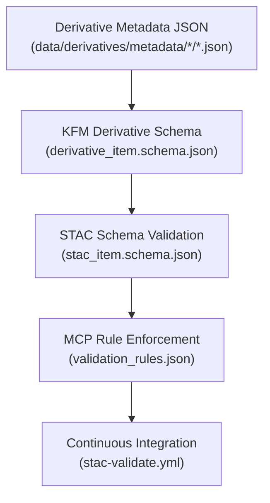

<div align="center">

# 🧩 Kansas Frontier Matrix — Derivative Metadata Schema Registry

`data/derivatives/metadata/schema/`

**Mission:** Define, govern, and maintain **JSON Schema specifications** that validate all derivative metadata
across KFM domains — guaranteeing **reproducibility, STAC conformance, and MCP auditability**.

[](../../../../.github/workflows/site.yml)
[](../../../../.github/workflows/stac-validate.yml)
[](../../../../.github/workflows/codeql.yml)
[](../../../../.github/workflows/trivy.yml)
[](../../../../docs/)
[](../../../../LICENSE)

</div>

---

## 🧭 Version & Governance

| Version    | Status | Last Updated | Maintainer                       | Validation                           |
| :--------- | :----: | :----------- | :------------------------------- | :----------------------------------- |
| **v1.1.0** | Stable | 2025-10-11   | Data Standards & Provenance Team | ✅ CI-validated (`stac-validate.yml`) |

**Protocol:** Master Coder Protocol (MCP) · Documentation-first · Auditable · Versioned
**License:** [CC-BY 4.0](../../../../LICENSE)

---

## 📚 Overview

The **Schema Registry** provides authoritative, version-locked **blueprints** governing every JSON metadata record in
`data/derivatives/metadata/`.

Schemas enforce **interoperability**, **traceability**, and **reproducibility** by guaranteeing:

* ✅ **Required fields** — `id`, `title`, `description`, `version`, etc.
* 🔗 **Provenance linkage** to sources & processing lineage
* 🌐 **Alignment** with **STAC 1.0**, **schema.org/Dataset**, and **ISO 19115**
* 🧮 **Validation logic** via MCP audit rules (`validation_rules.json`)

Every schema version is immutable and tied to a changelog entry for reproducibility.

---

## 🗂️ Directory Layout

```bash
data/derivatives/metadata/schema/
├── README.md                       # This document
├── derivative_item.schema.json      # Core schema for all derivative metadata
├── stac_item.schema.json            # Pinned STAC 1.0 Item spec
└── validation_rules.json            # MCP overlay: provenance & checksum rules
```

---

## 🧮 Schema Architecture

| File                              | Layer       | Description                                                               |
| :-------------------------------- | :---------- | :------------------------------------------------------------------------ |
| **`derivative_item.schema.json`** | Core        | Defines canonical KFM Derivative Metadata structure (extending STAC 1.0). |
| **`stac_item.schema.json`**       | Base        | Mirrors official STAC 1.0 schema for local validation/pinning.            |
| **`validation_rules.json`**       | MCP Overlay | Adds custom MCP logic (provenance, checksum, conditional fields).         |

All schemas comply with **JSON Schema Draft 2020-12** and validate in both local and CI pipelines.

> 🧠 **Governance rule:** Every schema change must bump its version, update the changelog, and pass peer review for MCP compliance.

---

## 🧠 Example Schema Stub

```json
{
  "$schema": "https://json-schema.org/draft/2020-12/schema",
  "$id": "https://kansasfrontiermatrix.org/schema/derivative_item.schema.json",
  "title": "KFM Derivative Metadata Schema",
  "description": "Standard schema definition for all derivative metadata records within the Kansas Frontier Matrix.",
  "type": "object",
  "properties": {
    "id": { "type": "string", "description": "Unique dataset identifier" },
    "title": { "type": "string" },
    "description": { "type": "string" },
    "provenance": { "$ref": "#/$defs/provenance" },
    "spatial_extent": { "$ref": "#/$defs/spatial_extent" },
    "temporal_extent": { "$ref": "#/$defs/temporal_extent" },
    "stac_extensions": { "type": "array", "items": { "type": "string" } },
    "version": { "type": "string", "pattern": "^v?[0-9]+\\.[0-9]+\\.[0-9]+$" },
    "created": { "type": "string", "format": "date-time" },
    "last_updated": { "type": "string", "format": "date-time" }
  },
  "required": ["id", "title", "description", "version", "provenance"],
  "additionalProperties": false
}
```

---

## 🧭 Validation Flow



<!-- END OF MERMAID -->

---

## 🧪 Validation Workflow

| Step                 | Command                                                                            | Purpose                                              |
| :------------------- | :--------------------------------------------------------------------------------- | :--------------------------------------------------- |
| **Local validation** | `jsonschema -i ../terrain/slope_1m_ks.json derivative_item.schema.json`            | Validate a single metadata record                    |
| **Batch validation** | `for f in ../*/**/*.json; do jsonschema -i "$f" derivative_item.schema.json; done` | Validate all derivative metadata records             |
| **STAC check**       | `stac-validator ../terrain/slope_1m_ks.json`                                       | Ensure STAC core + extension compliance              |
| **CI pipeline**      | `.github/workflows/stac-validate.yml`                                              | Run automated schema/STAC validation on PRs & pushes |

Validation logs live in each domain’s `validation/` subfolder for transparency.

---

## 🧩 Related Directories

| Path                                                                                                 | Description                                   |
| :--------------------------------------------------------------------------------------------------- | :-------------------------------------------- |
| [`../terrain/`](../terrain/)                                                                         | Terrain derivative metadata & validation logs |
| [`../climate/`](../climate/)                                                                         | Climate derivative metadata schemas           |
| [`../hydrology/`](../hydrology/)                                                                     | Hydrology derivative metadata                 |
| [`../landcover/`](../landcover/)                                                                     | Land-cover derivative metadata                |
| [`../hazards/`](../hazards/)                                                                         | Hazards derivative metadata                   |
| [`../../../../docs/standards/markdown_protocol.md`](../../../../docs/standards/markdown_protocol.md) | Markdown Protocol Standard (MCP)              |

---

## 🧾 Versioning & Changelog

Each schema is SemVer-versioned and recorded within the MCP provenance chain.

| Version    | Date       | Author                           | Notes                                                                      |
| :--------- | :--------- | :------------------------------- | :------------------------------------------------------------------------- |
| **v1.1.0** | 2025-10-11 | Data Standards & Provenance Team | Enhanced structure · Added CI lineage diagram · Governance policy expanded |
| v1.0.0     | 2025-10-10 | KFM Data Standards Team          | Initial schema registry established                                        |

---

## 🪶 Attribution & Provenance

> **Kansas Frontier Matrix — Derivative Metadata Schema Registry v1.1**
> Authored under **Master Coder Protocol (MCP)** · Documented · Versioned · Auditable
> Maintainers: Kansas Frontier Matrix Data Standards & Provenance Engineering Team
> Last Updated: 2025-10-11
> License: [CC-BY 4.0](../../../../LICENSE)

---

**Kansas Frontier Matrix — “Time · Terrain · History”**
*STAC-Compliant · MCP-Certified · Reproducible · Governed · Version-Locked*
