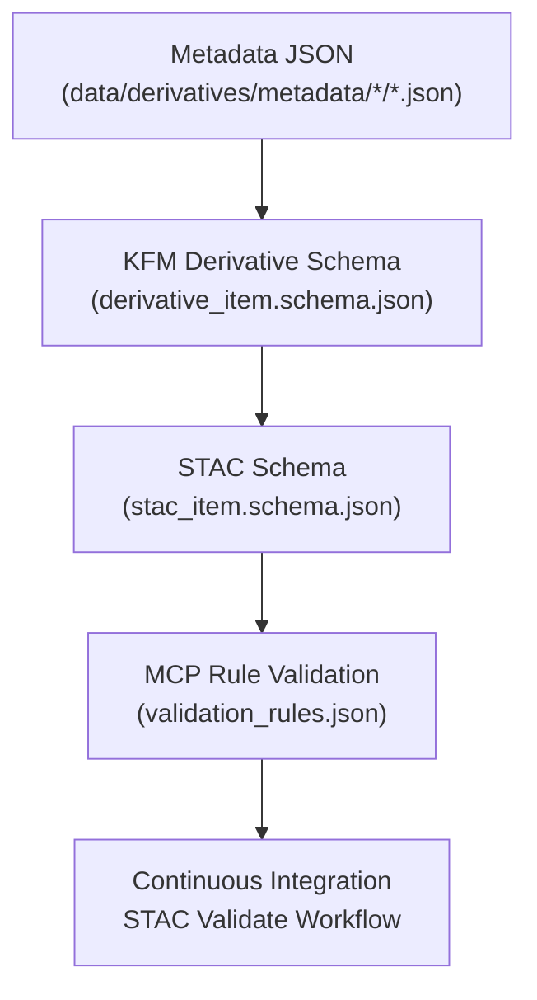

<div align="center">

# 🧩 Kansas Frontier Matrix — Derivative Metadata Schemas  
`data/derivatives/metadata/schema/`

**Purpose:** Define and maintain **JSON Schema specifications** for validating all derivative metadata records  
across terrain, hydrology, landcover, climate, and hazard domains — ensuring consistency, traceability,  
and MCP-aligned documentation for every KFM derivative dataset.

[](../../../../.github/workflows/site.yml)
[](../../../../.github/workflows/stac-validate.yml)
[](../../../../.github/workflows/codeql.yml)
[](../../../../docs/)
[](../../../../LICENSE)

</div>

---

## 📚 Overview

This directory contains **schema definitions** that govern the structure and validation  
of all JSON metadata within `data/derivatives/metadata/`.  

Each schema enforces:
- **Required fields** (`id`, `title`, `description`, `version`, etc.)  
- **Data lineage** and provenance traceability  
- **Compliance** with STAC 1.0 and schema.org Dataset conventions  
- **MCP reproducibility rules** (environment, software, checksum validation)

---

## 🗂️ Directory Layout
```bash
data/derivatives/metadata/schema/
├── README.md                       # This document
├── derivative_item.schema.json      # Core schema for all derivative metadata records
├── stac_item.schema.json            # Reference STAC 1.0 Item schema (mirrored/pinned)
└── validation_rules.json            # MCP custom rule set (conditional logic, required fields)
````

---

## 🧮 Schema Architecture

| Schema File                       | Role          | Description                                                                          |
| :-------------------------------- | :------------ | :----------------------------------------------------------------------------------- |
| **`derivative_item.schema.json`** | Primary       | Defines KFM-specific schema for all derivative metadata types.                       |
| **`stac_item.schema.json`**       | Secondary     | Mirrors the STAC 1.0 schema to ensure STAC-compliant validation.                     |
| **`validation_rules.json`**       | Supplementary | Adds MCP-specific logic (conditional rules, dependency checks, required provenance). |

All schemas follow **JSON Schema Draft 2020-12**, and validation is enforced locally and via GitHub Actions.

---

## 🧠 Example — Core Schema Stub

```json
{
  "$schema": "https://json-schema.org/draft/2020-12/schema",
  "$id": "https://kansasfrontiermatrix.org/schema/derivative_item.schema.json",
  "title": "KFM Derivative Metadata Schema",
  "description": "Schema definition for all derivative metadata records in the Kansas Frontier Matrix.",
  "type": "object",
  "properties": {
    "id": { "type": "string", "description": "Unique dataset identifier" },
    "title": { "type": "string" },
    "description": { "type": "string" },
    "provenance": { "$ref": "#/$defs/provenance" },
    "spatial_extent": { "$ref": "#/$defs/spatial_extent" },
    "temporal_extent": { "$ref": "#/$defs/temporal_extent" },
    "stac_extensions": { "type": "array", "items": { "type": "string" } },
    "version": { "type": "string", "pattern": "^v?[0-9]+\\.[0-9]+\\.[0-9]+$" },
    "created": { "type": "string", "format": "date-time" },
    "last_updated": { "type": "string", "format": "date-time" }
  },
  "required": ["id", "title", "description", "version", "provenance"],
  "additionalProperties": false
}
```

---

## 🧭 Validation Flow



---

## 🧪 Schema Validation Workflow

| Step                 | Command                                                                            | Description                       |
| :------------------- | :--------------------------------------------------------------------------------- | :-------------------------------- |
| **Local validation** | `jsonschema -i ../terrain/slope_1m_ks.json derivative_item.schema.json`            | Validate a single metadata record |
| **Batch validation** | `for f in ../*/**/*.json; do jsonschema -i "$f" derivative_item.schema.json; done` | Validate all derivative metadata  |
| **STAC check**       | `stac-validator ../terrain/slope_1m_ks.json`                                       | Confirm STAC item compliance      |
| **CI pipeline**      | GitHub Action: `.github/workflows/stac-validate.yml`                               | Automated validation for every PR |

---

## 🧩 Related Directories

| Path                             | Description                   |
| :------------------------------- | :---------------------------- |
| [`../terrain/`](../terrain/)     | Terrain derivative metadata   |
| [`../climate/`](../climate/)     | Climate derivative metadata   |
| [`../hydrology/`](../hydrology/) | Hydrology derivative metadata |
| [`../landcover/`](../landcover/) | Landcover derivative metadata |
| [`../hazards/`](../hazards/)     | Hazards derivative metadata   |

---

## 🧾 Versioning & Changelog

| Version    | Date       | Author                  | Notes                                                                              |
| :--------- | :--------- | :---------------------- | :--------------------------------------------------------------------------------- |
| **v1.0.0** | 2025-10-11 | KFM Data Standards Team | Initial release of derivative metadata schema definitions and MCP rule integration |

---

## 🪶 License & Provenance

**License:** [CC-BY 4.0](../../../../LICENSE)
**Provenance:** Developed under the **Master Coder Protocol (MCP)** — ensuring documentation-first, validated, and reproducible data architecture.
**Maintainers:** Kansas Frontier Matrix Data Standards Team
**Last Updated:** 2025-10-11

```

---
