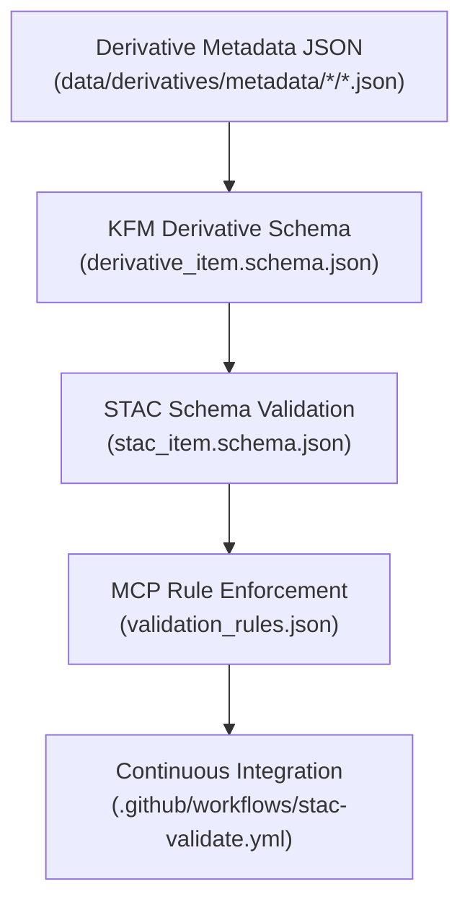

<div align="center">

# 🧩 Kansas Frontier Matrix — Derivative Metadata Schema Registry  
`data/derivatives/metadata/schema/`

**Mission:** Define, govern, and maintain **JSON Schema specifications** used to validate derivative metadata  
across all KFM domains — ensuring reproducibility, STAC conformance, and audit-ready MCP documentation.

[](../../../../.github/workflows/site.yml)
[](../../../../.github/workflows/stac-validate.yml)
[](../../../../.github/workflows/codeql.yml)
[](../../../../.github/workflows/trivy.yml)
[](../../../../docs/)
[](../../../../LICENSE)

</div>

---

## 📚 Overview

This directory defines **schema blueprints** governing every JSON metadata record  
under `data/derivatives/metadata/`.  

Schemas ensure **interoperability, traceability, and reproducibility** by enforcing:

- ✅ **Required fields** (`id`, `title`, `description`, `version`, etc.)  
- 🔁 **Provenance linkage** to sources and processing environments  
- 🌐 **Compliance** with **STAC 1.0**, **schema.org/Dataset**, and **ISO 19115**  
- 🧮 **Validation logic** under MCP’s reproducibility and audit protocols  

Each schema version is locked and version-controlled to preserve long-term compatibility.

---

## 🗂️ Directory Layout
```bash
data/derivatives/metadata/schema/
├── README.md                       # This document
├── derivative_item.schema.json      # Core schema for all derivative metadata records
├── stac_item.schema.json            # Reference STAC 1.0 Item schema (mirrored/pinned)
└── validation_rules.json            # MCP custom validation rules (conditional, required fields)
````

---

## 🧮 Schema Architecture

| Schema File                       | Layer       | Description                                                                               |
| :-------------------------------- | :---------- | :---------------------------------------------------------------------------------------- |
| **`derivative_item.schema.json`** | Core        | Defines the Kansas Frontier Matrix standard metadata structure (extends STAC 1.0).        |
| **`stac_item.schema.json`**       | Base        | Mirrors official STAC 1.0 schema for local validation and schema pinning.                 |
| **`validation_rules.json`**       | MCP Overlay | Adds custom logic: required provenance, checksum verification, and MCP conditional rules. |

All schemas use **JSON Schema Draft 2020-12** and are validated via both local and CI workflows.

> 🧠 **Governance principle:** All schema changes require version bumps, changelog updates, and
> a peer-reviewed PR with documented MCP compliance.

---

## 🧠 Example — Derivative Schema Stub

```json
{
  "$schema": "https://json-schema.org/draft/2020-12/schema",
  "$id": "https://kansasfrontiermatrix.org/schema/derivative_item.schema.json",
  "title": "KFM Derivative Metadata Schema",
  "description": "Standard schema definition for all derivative metadata records within the Kansas Frontier Matrix.",
  "type": "object",
  "properties": {
    "id": { "type": "string", "description": "Unique dataset identifier" },
    "title": { "type": "string" },
    "description": { "type": "string" },
    "provenance": { "$ref": "#/$defs/provenance" },
    "spatial_extent": { "$ref": "#/$defs/spatial_extent" },
    "temporal_extent": { "$ref": "#/$defs/temporal_extent" },
    "stac_extensions": { "type": "array", "items": { "type": "string" } },
    "version": { "type": "string", "pattern": "^v?[0-9]+\\.[0-9]+\\.[0-9]+$" },
    "created": { "type": "string", "format": "date-time" },
    "last_updated": { "type": "string", "format": "date-time" }
  },
  "required": ["id", "title", "description", "version", "provenance"],
  "additionalProperties": false
}
```

---

## 🧭 Validation Flow



---

## 🧪 Validation Workflow

| Step                 | Command                                                                            | Description                                      |
| :------------------- | :--------------------------------------------------------------------------------- | :----------------------------------------------- |
| **Local validation** | `jsonschema -i ../terrain/slope_1m_ks.json derivative_item.schema.json`            | Validate individual metadata files               |
| **Batch validation** | `for f in ../*/**/*.json; do jsonschema -i "$f" derivative_item.schema.json; done` | Validate all derivative metadata in batch        |
| **STAC check**       | `stac-validator ../terrain/slope_1m_ks.json`                                       | Ensure STAC compliance                           |
| **CI pipeline**      | `.github/workflows/stac-validate.yml`                                              | Runs automatic schema and STAC validation on PRs |

All validation outputs are logged in domain-specific `validation/` folders under each derivative domain.

---

## 🧩 Related Directories

| Path                                                                                                 | Description                                   |
| :--------------------------------------------------------------------------------------------------- | :-------------------------------------------- |
| [`../terrain/`](../terrain/)                                                                         | Terrain derivative metadata & validation logs |
| [`../climate/`](../climate/)                                                                         | Climate derivative metadata schemas           |
| [`../hydrology/`](../hydrology/)                                                                     | Hydrology derivative metadata                 |
| [`../landcover/`](../landcover/)                                                                     | Landcover derivative metadata                 |
| [`../hazards/`](../hazards/)                                                                         | Hazards derivative metadata                   |
| [`../../../../docs/standards/markdown_protocol.md`](../../../../docs/standards/markdown_protocol.md) | Markdown Documentation Framework Standard     |

---

## 🧾 Versioning & Governance

Each schema follows **semantic versioning (SemVer)** and is traceable via the MCP provenance chain.

| Version    | Date       | Author                           | Description                                                               |
| :--------- | :--------- | :------------------------------- | :------------------------------------------------------------------------ |
| **v1.1.0** | 2025-10-11 | Data Standards & Provenance Team | Refined structure, added CI lineage diagram and governance policy section |
| **v1.0.0** | 2025-10-10 | KFM Data Standards Team          | Initial schema registry for derivative metadata                           |

---

## 🪶 License & Provenance

**License:** [CC-BY 4.0](../../../../LICENSE)
**Provenance:** Authored under the **Master Coder Protocol (MCP)** — documentation-first, version-controlled,
and reproducible across schema evolution.
**Maintainers:** Kansas Frontier Matrix Data Standards & Provenance Engineering Team
**Last Updated:** 2025-10-11

```

---
