<div align="center">

# 🏔️ Kansas Frontier Matrix — Terrain Derivative Metadata  
`data/derivatives/metadata/terrain/`

**Purpose:** Document, validate, and maintain **terrain derivative metadata** across the Kansas Frontier Matrix (KFM)  
— capturing provenance, lineage, schema compliance, and validation history for all elevation-based products.

[](../../../../../.github/workflows/site.yml)
[](../../../../../.github/workflows/stac-validate.yml)
[](../../../../../.github/workflows/codeql.yml)
[](../../../../../.github/workflows/trivy.yml)
[](../../../../../docs/)
[](../../../../../LICENSE)

</div>

---

## 📚 Overview

The **terrain metadata registry** defines standardized metadata for all **derived elevation products**,  
including slope, hillshade, aspect, and digital terrain models derived from the Kansas LiDAR (USGS 3DEP) datasets.  

Each metadata JSON:
- Describes the **derivation process**, software, and lineage  
- Includes spatial and temporal coverage  
- Stores STAC-compliant metadata for inclusion in the global catalog  
- Links to source datasets, checksums, and validation logs  

All files follow the **KFM Derivative Metadata Schema v1.0**, and each item is validated via automated CI pipelines.

---

## 🗂️ Directory Layout
```bash
data/derivatives/metadata/terrain/
├── README.md                 # This document
├── slope_1m_ks.json          # 1-meter slope (degrees)
├── hillshade_1m_ks.json      # Hillshade derived from DEM
└── validation/
    ├── checksums.sha256      # File integrity hashes
    └── stac-validation.log   # STAC schema validation report
````

---

## 🧩 Core Metadata Fields

| Field             | Type   | Description                                             |
| :---------------- | :----- | :------------------------------------------------------ |
| `id`              | string | Unique STAC-compliant dataset identifier                |
| `title`           | string | Human-readable dataset name                             |
| `description`     | string | Dataset summary and processing context                  |
| `provenance`      | object | Source references, processing lineage, responsible team |
| `spatial_extent`  | object | Bounding box or GeoJSON coverage                        |
| `temporal_extent` | object | Date of dataset creation or source capture              |
| `uncertainty`     | object | Elevation model accuracy metrics                        |
| `stac_extensions` | array  | STAC extensions applied                                 |
| `version`         | string | Semantic version of metadata record                     |
| `created`         | string | ISO 8601 creation timestamp                             |
| `last_updated`    | string | ISO 8601 last update timestamp                          |

---

## 🧠 Example Metadata Record

```json
{
  "id": "kfm_terrain_slope_1m_ks_v1",
  "title": "Slope (1m) — Kansas Statewide",
  "description": "1-meter slope raster derived from Kansas LiDAR DEM (USGS 3DEP). Units: degrees.",
  "provenance": {
    "sources": [
      "data/sources/usgs_lidar_dem_1m_ks.json"
    ],
    "processing": "GDAL slope algorithm using horn method; reprojection EPSG:26914",
    "validation": "Checksum + STAC validation passed 2025-10-10"
  },
  "spatial_extent": {
    "bbox": [-102.05, 36.99, -94.59, 40.00],
    "crs": "EPSG:26914"
  },
  "temporal_extent": {
    "start": "2019-01-01",
    "end": "2020-12-31"
  },
  "uncertainty": {
    "vertical_rmse": 0.15,
    "confidence_interval": "95%"
  },
  "stac_extensions": [
    "https://stac-extensions.github.io/processing/v1.1.0/schema.json",
    "https://stac-extensions.github.io/provenance/v1.0.0/schema.json"
  ],
  "version": "1.0.0",
  "created": "2025-10-10",
  "last_updated": "2025-10-11"
}
```

---

## 🧭 Data Lineage

```mermaid
flowchart TD
    A["Source Data<br/>(USGS LiDAR DEM 1m)"]
        --> B["ETL Processing<br/>GDAL · Python · RasterIO"]
    B --> C["Derived Terrain Products<br/>Slope · Hillshade"]
    C --> D["Metadata Registry<br/>(data/derivatives/metadata/terrain)"]
    D --> E["STAC Catalog<br/>(data/stac/collections/terrain_derivatives)"]
    E --> F["Web UI<br/>Elevation · Relief · Visualization Layers"]
```



---

## 🧪 Validation Workflow

| Stage                      | Description                              | Tool                                  |
| :------------------------- | :--------------------------------------- | :------------------------------------ |
| **Checksum Validation**    | Verify file integrity using SHA-256      | `sha256sum`                           |
| **Schema Validation**      | Validate metadata JSON structure         | `jsonschema-cli`                      |
| **STAC Compliance**        | Confirm valid STAC fields and extensions | `stac-validator`                      |
| **Continuous Integration** | Automated checks in GitHub Actions       | `.github/workflows/stac-validate.yml` |

All reports are logged under `validation/stac-validation.log`.

---

## 🔧 Makefile Integration

```make
validate-terrain:
	jsonschema -i data/derivatives/metadata/terrain/*.json \
	           data/derivatives/metadata/schema/derivative_item.schema.json
```

This target runs as part of the global **metadata validation pipeline** invoked via `make validate-metadata`.

---

## 🧩 Related Documents

* [`../README.md`](../README.md) — Parent derivative metadata registry
* [`../../terrain/README.md`](../../terrain/README.md) — Processed terrain datasets
* [`../../../../docs/standards/markdown_protocol.md`](../../../../docs/standards/markdown_protocol.md) — Markdown & MCP documentation rules
* [`../../../../docs/templates/model_card.md`](../../../../docs/templates/model_card.md) — Template for model documentation

---

## 🧾 Versioning & Changelog

| Version    | Date       | Author                   | Notes                                                                       |
| :--------- | :--------- | :----------------------- | :-------------------------------------------------------------------------- |
| **v1.0.0** | 2025-10-11 | Terrain Integration Team | Initial release of terrain derivative metadata registry (slope + hillshade) |

---

## 🪶 License & Provenance

**License:** [CC-BY 4.0](../../../../../LICENSE)
**Provenance:** Authored under **Master Coder Protocol (MCP)** — document-first, auditable, and reproducible.
**Maintainers:** Kansas Frontier Matrix Terrain & Geospatial Integration Team
**Last Updated:** 2025-10-11

```

---
