<div align="center">

# 🏔️ Kansas Frontier Matrix — Terrain Derivative Metadata

`data/derivatives/metadata/terrain/`

**Mission:** Establish an authoritative, reproducible registry for **terrain derivative metadata**,
capturing **provenance, lineage, schema compliance, and validation history** for all KFM elevation products.

[](../../../../../.github/workflows/site.yml)
[](../../../../../.github/workflows/stac-validate.yml)
[](../../../../../.github/workflows/codeql.yml)
[](../../../../../.github/workflows/trivy.yml)
[](../../../../../docs/)
[](../../../../../LICENSE)

</div>

---

## 🧭 Version & Provenance

| Version    | Status | Last Updated | Maintainer               | Validation                           |
| :--------- | :----- | :----------- | :----------------------- | :----------------------------------- |
| **v1.1.0** | Stable | 2025-10-11   | Terrain Integration Team | ✅ CI-validated (`stac-validate.yml`) |

**License:** [CC-BY 4.0](../../../../../LICENSE)
**Governance:** Documented under **Master Coder Protocol (MCP)** — emphasizing reproducibility, traceability, and provenance.

---

## 📚 Overview

The **Terrain Derivative Metadata Registry** defines standardized metadata for **derived elevation datasets** such as:

* Slope · Aspect · Hillshade · Terrain Ruggedness · Relief
* Derived from **USGS 3DEP LiDAR 1 m DEM** tiles (via Kansas DASC)

Each JSON metadata record:

* Defines the **derivation method** and software lineage
* Includes spatial/temporal coverage and uncertainty estimates
* Embeds **STAC 1.0.0** + STAC extensions (processing / provenance / validation)
* Links to upstream sources, checksum logs, and CI validation reports

All metadata conforms to **KFM Derivative Metadata Schema v1.1**.

---

## 🗂️ Directory Layout

```bash
data/derivatives/metadata/terrain/
├── README.md                    # This document
├── slope_1m_ks.json             # 1-m slope (degrees)
├── hillshade_1m_ks.json         # Hillshade from DEM
└── validation/
    ├── checksums.sha256         # Integrity hashes
    └── stac-validation.log      # STAC schema validation report
```

---

## 🧩 Core Metadata Fields

| Field             | Type   | Description                                                   |
| :---------------- | :----- | :------------------------------------------------------------ |
| `id`              | string | Unique STAC-compliant ID (e.g., `kfm_terrain_slope_1m_ks_v1`) |
| `title`           | string | Human-readable dataset name                                   |
| `description`     | string | Summary + derivation context                                  |
| `provenance`      | object | Source references · processing lineage · responsible team     |
| `spatial_extent`  | object | Bounding box / GeoJSON coverage                               |
| `temporal_extent` | object | Source acquisition or processing period                       |
| `uncertainty`     | object | Accuracy metrics (RMSE, confidence)                           |
| `stac_extensions` | array  | Extensions applied (processing, provenance)                   |
| `version`         | string | Metadata record semantic version                              |
| `created`         | string | ISO 8601 creation timestamp                                   |
| `last_updated`    | string | ISO 8601 last modification                                    |

---

## 🧠 Example Metadata Record

```json
{
  "id": "kfm_terrain_slope_1m_ks_v1",
  "title": "Slope (1 m) — Kansas Statewide",
  "description": "1-meter slope raster derived from Kansas LiDAR DEM (USGS 3DEP). Units: degrees.",
  "provenance": {
    "sources": [
      "data/sources/usgs_lidar_dem_1m_ks.json"
    ],
    "processing": "GDAL Slope algorithm (Horn method); Reprojection EPSG:26914",
    "validation": "Checksum + STAC validation passed 2025-10-10"
  },
  "spatial_extent": {
    "bbox": [-102.05, 36.99, -94.59, 40.00],
    "crs": "EPSG:26914"
  },
  "temporal_extent": {
    "start": "2019-01-01",
    "end": "2020-12-31"
  },
  "uncertainty": {
    "vertical_rmse": 0.15,
    "confidence_interval": "95%"
  },
  "stac_extensions": [
    "https://stac-extensions.github.io/processing/v1.1.0/schema.json",
    "https://stac-extensions.github.io/provenance/v1.0.0/schema.json"
  ],
  "version": "1.0.0",
  "created": "2025-10-10",
  "last_updated": "2025-10-11"
}
```

---

## 🧭 Data Lineage

```mermaid
flowchart TD
    A["Source Data<br/>(USGS LiDAR DEM 1 m)"]
        --> B["ETL Processing<br/>GDAL · Python · RasterIO"]
    B --> C["Derived Terrain Products<br/>Slope · Hillshade · Aspect"]
    C --> D["Metadata Registry<br/>(data/derivatives/metadata/terrain)"]
    D --> E["STAC Catalog<br/>(data/stac/collections/terrain_derivatives)"]
    E --> F["Web UI<br/>Elevation · Relief · Visualization Layers"]
```



<!-- END OF MERMAID -->

---

## 🧪 Validation Workflow

| Stage                      | Description                        | Tool                                  |
| :------------------------- | :--------------------------------- | :------------------------------------ |
| **Checksum Validation**    | Verify file integrity (SHA-256)    | `sha256sum`                           |
| **Schema Validation**      | Validate metadata JSON structure   | `jsonschema-cli`                      |
| **STAC Compliance**        | Check STAC fields & extensions     | `stac-validator`                      |
| **Continuous Integration** | Automated checks in GitHub Actions | `.github/workflows/stac-validate.yml` |

Reports are stored in `validation/stac-validation.log`.

---

## 🔧 Makefile Integration

```make
validate-terrain:
	jsonschema -i data/derivatives/metadata/terrain/*.json \
	           data/derivatives/metadata/schema/derivative_item.schema.json
```

Included within the global `make validate-metadata` pipeline.

---

## 🔗 Related Documents

* [`../README.md`](../README.md) — Parent Derivative Metadata Registry
* [`../../terrain/README.md`](../../terrain/README.md) — Processed Terrain Layers
* [`../../../../docs/standards/markdown_protocol.md`](../../../../docs/standards/markdown_protocol.md) — Markdown & MCP Standards
* [`../../../../docs/templates/model_card.md`](../../../../docs/templates/model_card.md) — Model Card Template

---

## 🧾 Versioning & Changelog

| Version    | Date       | Author                   | Notes                                                                                                       |
| :--------- | :--------- | :----------------------- | :---------------------------------------------------------------------------------------------------------- |
| **v1.1.0** | 2025-10-11 | Terrain Integration Team | Updated to Markdown Protocol v1.1 · Enhanced lineage diagram · CI details expanded · Table clarity improved |
| v1.0.0     | 2025-10-10 | Terrain Integration Team | Initial release (slope + hillshade) registry established                                                    |

---

## 🪶 Citation & Attribution

> Kansas Frontier Matrix — Terrain Derivative Metadata Registry v1.1
> Authored under **Master Coder Protocol (MCP)** · © 2025 Kansas Frontier Matrix Project
> Cite as: Barta A. et al. (2025). *Terrain Derivative Metadata — Kansas Frontier Matrix v1.1.*
> License: [CC-BY 4.0](../../../../../LICENSE)

---

### ✅ Summary

* **Schema:** KFM Derivative Metadata Schema v1.1
* **Validation:** CI-enforced (STAC + JSON Schema + Checksum)
* **Scope:** Statewide derived terrain products (slope, hillshade, aspect)
* **Provenance:** USGS 3DEP LiDAR DEM → GDAL processing → KFM STAC catalog
* **Purpose:** Ensure reproducibility, traceability, and integrity of elevation-based derivatives

---

**Kansas Frontier Matrix — “Time · Terrain · History”**
*Documented under MCP · STAC-compliant · Reproducible · Versioned · Auditable*
