<div align="center">

# ✅ Kansas Frontier Matrix — Terrain Metadata Validation  
`data/derivatives/metadata/terrain/validation/`

**Purpose:** Provide reproducible **QA/QC validation logs** for all terrain derivative metadata,  
ensuring scientific integrity, STAC compliance, and MCP reproducibility across Kansas Frontier Matrix (KFM) datasets.

[](../../../../../../.github/workflows/site.yml)
[](../../../../../../.github/workflows/stac-validate.yml)
[](../../../../../../.github/workflows/codeql.yml)
[](../../../../../../.github/workflows/trivy.yml)
[](../../../../../../docs/)
[](../../../../../../LICENSE)

</div>

---

## 📚 Overview

This directory stores **validation artifacts** that confirm the accuracy and reproducibility  
of all **terrain derivative metadata** within the KFM repository.

It includes checksum manifests and STAC validation logs for derivative metadata files such as  
`slope_1m_ks.json` and `hillshade_1m_ks.json`, which describe terrain surfaces derived from Kansas LiDAR (USGS 3DEP).

---

## 🗂️ Directory Layout
```bash
data/derivatives/metadata/terrain/validation/
├── README.md              # This document
├── checksums.sha256       # SHA-256 hash registry for terrain metadata JSON files
└── stac-validation.log    # Validation report for STAC and JSON Schema compliance
````

---

## 🧭 Validation Flow

```mermaid
flowchart TD
    A["Terrain Metadata<br/>(slope_1m_ks.json · hillshade_1m_ks.json)"]
        --> B["Checksum Verification<br/>(sha256sum)"]
    B --> C["Schema Validation<br/>(jsonschema-cli)"]
    C --> D["STAC Compliance<br/>(stac-validator)"]
    D --> E["Continuous Integration<br/>(GitHub Actions)"]
    E --> F["Validation Logs<br/>(checksums.sha256 · stac-validation.log)"]
```



---

## 🧩 Validation Components

| Artifact                  | Description                                             | Tool                                  |
| :------------------------ | :------------------------------------------------------ | :------------------------------------ |
| **`checksums.sha256`**    | SHA-256 hash values for all terrain metadata JSON files | `sha256sum`                           |
| **`stac-validation.log`** | Output log of STAC and JSON Schema validation checks    | `stac-validator`, `jsonschema-cli`    |
| **CI Validation**         | Continuous testing on each PR or push event             | `.github/workflows/stac-validate.yml` |

---

## 🧠 Example: `checksums.sha256`

```text
4c9b18b2397b8c14ff323cae6f3077f5bca88e58a1ebd657b3a1a3e2af7a3c44  slope_1m_ks.json
2e8fc37c2ed7d8b8418ff992e57c48c3df3162eece1ac15abf4db7cfac7b9a9d  hillshade_1m_ks.json
```

These hashes are verified by GitHub Actions upon each commit to ensure that metadata
has not been corrupted or altered outside approved workflows.

---

## 🧮 Validation Commands

| Step                    | Command                                                            | Purpose                               |
| :---------------------- | :----------------------------------------------------------------- | :------------------------------------ |
| **Checksum generation** | `find .. -name "*.json" -exec sha256sum {} \; > checksums.sha256`  | Registers all terrain metadata hashes |
| **Schema validation**   | `jsonschema -i ../*.json ../../schema/derivative_item.schema.json` | Ensures schema compliance             |
| **STAC validation**     | `stac-validator ../*.json --log stac-validation.log`               | Checks STAC and extensions            |
| **Report aggregation**  | `cat checksums.sha256 >> stac-validation.log`                      | Combines validation logs              |

All commands can be executed via the Makefile target `make validate-terrain`.

---

## 🧪 Integration in CI/CD

The `.github/workflows/stac-validate.yml` pipeline automatically executes:

1. **Checksum verification**
2. **JSON Schema validation**
3. **STAC compliance validation**
4. **Artifact upload** for each validation log

Results are visible in GitHub Actions → *STAC Validate* workflow logs.

---

## 🧾 Versioning & Changelog

| Version    | Date       | Author          | Notes                                                                  |
| :--------- | :--------- | :-------------- | :--------------------------------------------------------------------- |
| **v1.0.0** | 2025-10-11 | Terrain QA Team | Initial creation of validation directory and schema-based QA workflows |

---

## 🧩 Related Documents

* [`../README.md`](../README.md) — Terrain derivative metadata registry
* [`../../schema/derivative_item.schema.json`](../../schema/derivative_item.schema.json) — Validation schema
* [`../../../../../../docs/standards/markdown_protocol.md`](../../../../../../docs/standards/markdown_protocol.md) — Markdown / MCP standards
* [`../../../../../../.github/workflows/stac-validate.yml`](../../../../../../.github/workflows/stac-validate.yml) — STAC validation workflow

---

## 🪶 License & Provenance

**License:** [CC-BY 4.0](../../../../../../LICENSE)
**Provenance:** Generated under the **Master Coder Protocol (MCP)** — ensuring transparent, documented, and reproducible validation practices.
**Maintainers:** Kansas Frontier Matrix Terrain QA Team
**Last Updated:** 2025-10-11

```

---

