<div align="center">

# ✅ Kansas Frontier Matrix — Terrain Metadata Validation

`data/derivatives/metadata/terrain/validation/`

**Mission:** Maintain reproducible **QA/QC validation artifacts** for all terrain derivative metadata —
ensuring **scientific integrity, STAC compliance, and MCP reproducibility** across KFM datasets.

[](../../../../../../.github/workflows/site.yml)
[](../../../../../../.github/workflows/stac-validate.yml)
[](../../../../../../.github/workflows/codeql.yml)
[](../../../../../../.github/workflows/trivy.yml)
[](../../../../../../docs/)
[](../../../../../../LICENSE)

</div>

---

## 🧭 Version & Governance

| Version    | Status | Last Updated | Maintainer      | Validation   |
| :--------- | :----: | :----------- | :-------------- | :----------- |
| **v1.1.0** | Stable | 2025-10-11   | Terrain QA Team | ✅ CI passing |

**License:** [CC-BY 4.0](../../../../../../LICENSE)
**Protocol:** **Master Coder Protocol (MCP)** — documentation-first, auditable, reproducible.

---

## 📚 Overview

This directory stores **validation artifacts** that verify the accuracy and reproducibility of all **terrain derivative metadata** (e.g., `slope_1m_ks.json`, `hillshade_1m_ks.json`) describing products derived from **USGS 3DEP LiDAR**. Artifacts include:

* **`checksums.sha256`** — integrity registry for metadata JSON
* **`stac-validation.log`** — combined JSON Schema + STAC validation output

---

## 🗂️ Directory Layout

```bash
data/derivatives/metadata/terrain/validation/
├── README.md                # This document
├── checksums.sha256         # SHA-256 hashes for metadata JSONs
└── stac-validation.log      # STAC + JSON Schema validation report
```

---

## 🧭 Validation Flow

```mermaid
flowchart TD
  A["Terrain Metadata<br/>slope_1m_ks.json · hillshade_1m_ks.json"]
    --> B["Checksum Verification<br/>sha256sum"]
  B --> C["Schema Validation<br/>jsonschema-cli"]
  C --> D["STAC Compliance<br/>stac-validator"]
  D --> E["CI Orchestration<br/>GitHub Actions"]
  E --> F["Artifacts Published<br/>checksums.sha256 · stac-validation.log"]
```



<!-- END OF MERMAID -->

---

## 🧩 Validation Components

| Artifact                  | Description                                      | Tool(s)                               |
| :------------------------ | :----------------------------------------------- | :------------------------------------ |
| **`checksums.sha256`**    | SHA-256 values for each metadata JSON            | `sha256sum`                           |
| **`stac-validation.log`** | Consolidated output of schema + STAC checks      | `jsonschema` (CLI), `stac-validator`  |
| **CI Validation**         | Automated on PR/Push (quality gates + artifacts) | `.github/workflows/stac-validate.yml` |

---

## 🧮 Commands (local reproduction)

| Step                    | Command                                                                                               | Purpose                              |
| :---------------------- | :---------------------------------------------------------------------------------------------------- | :----------------------------------- |
| **Checksum generation** | `find .. -maxdepth 1 -name "*.json" -exec sha256sum {} \; > checksums.sha256`                         | Register integrity of metadata JSONs |
| **Schema validation**   | `jsonschema -i ../*.json ../../schema/derivative_item.schema.json`                                    | Enforce JSON Schema compliance       |
| **STAC validation**     | `stac-validator ../*.json --log stac-validation.log`                                                  | Validate STAC core + extensions      |
| **Report aggregation**  | `echo -e "\n--- CHECKSUMS ---" >> stac-validation.log && cat checksums.sha256 >> stac-validation.log` | Append hashes to the log             |

> Tip: Run all steps via `make validate-terrain`.

---

## 🔧 Makefile Integration

```make
validate-terrain:
	@echo "[KFM] Terrain metadata validation..."
	find data/derivatives/metadata/terrain -maxdepth 1 -name "*.json" -exec sha256sum {} \; > data/derivatives/metadata/terrain/validation/checksums.sha256
	jsonschema -i data/derivatives/metadata/terrain/*.json \
	           data/derivatives/metadata/schema/derivative_item.schema.json
	stac-validator data/derivatives/metadata/terrain/*.json --log data/derivatives/metadata/terrain/validation/stac-validation.log
	@echo "--- CHECKSUMS ---" >> data/derivatives/metadata/terrain/validation/stac-validation.log
	@cat data/derivatives/metadata/terrain/validation/checksums.sha256 >> data/derivatives/metadata/terrain/validation/stac-validation.log
```

---

## 🧪 CI/CD Integration (quality gates)

The **STAC Validate** workflow (`.github/workflows/stac-validate.yml`) executes:

1. **Checksum verification** — fail on mismatch
2. **JSON Schema validation** — fail on invalid shape or required fields
3. **STAC validation** — fail on non-conformant metadata or extensions
4. **Artifact upload** — `stac-validation.log` + `checksums.sha256` retained per run

**Exit codes & triage**

| Failure Class     | Typical Cause                       | Where to Fix                                       |
| :---------------- | :---------------------------------- | :------------------------------------------------- |
| Checksum mismatch | Edited JSON without re-hashing      | Rebuild `checksums.sha256` via Makefile            |
| Schema invalid    | Missing/incorrect fields or types   | Update JSON to match `derivative_item.schema.json` |
| STAC invalid      | Bad links/extension versions/fields | Align with STAC core + extension versions          |

---

## 🧠 Example Artifacts

**`checksums.sha256`**

```text
4c9b18b2397b8c14ff323cae6f3077f5bca88e58a1ebd657b3a1a3e2af7a3c44  slope_1m_ks.json
2e8fc37c2ed7d8b8418ff992e57c48c3df3162eece1ac15abf4db7cfac7b9a9d  hillshade_1m_ks.json
```

**Excerpt from `stac-validation.log`**

```text
[jsonschema] PASS: ../slope_1m_ks.json conforms to derivative_item.schema.json
[stac-validator] PASS: ../slope_1m_ks.json (STAC 1.0.0 + processing/provenance)
[jsonschema] PASS: ../hillshade_1m_ks.json conforms to derivative_item.schema.json
[stac-validator] PASS: ../hillshade_1m_ks.json (STAC 1.0.0 + processing/provenance)
--- CHECKSUMS ---
<sha256>  slope_1m_ks.json
<sha256>  hillshade_1m_ks.json
```

---

## 🔗 Related Documents

* [`../README.md`](../README.md) — Terrain derivative metadata registry
* [`../../schema/derivative_item.schema.json`](../../schema/derivative_item.schema.json) — JSON Schema (derivative item)
* [`../../../../../../.github/workflows/stac-validate.yml`](../../../../../../.github/workflows/stac-validate.yml) — CI workflow (STAC validate)
* [`../../../../../../docs/standards/markdown_protocol.md`](../../../../../../docs/standards/markdown_protocol.md) — Markdown/MCP standards

---

## 🧾 Versioning & Changelog

| Version    | Date       | Author          | Notes                                                                    |
| :--------- | :--------- | :-------------- | :----------------------------------------------------------------------- |
| **v1.1.0** | 2025-10-11 | Terrain QA Team | Added version table, triage matrix, Makefile target, GitHub-safe Mermaid |
| v1.0.0     | 2025-10-11 | Terrain QA Team | Initial validation directory + schema/STAC QA workflow                   |

---

## 🪶 Attribution

**Kansas Frontier Matrix — “Time · Terrain · History”**
Authored under **MCP** · **STAC-compliant** · **Reproducible** · **Versioned** · **Auditable**

---
