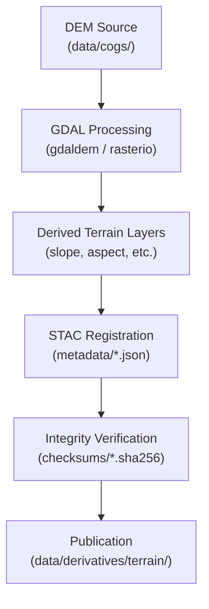

<div align="center">

# 🏔️ Kansas Frontier Matrix — Terrain Derivatives  
`data/derivatives/terrain/`

**Mission:** Curate and maintain all **terrain-derived raster products** — slope, aspect, curvature, hillshade,  
and elevation composites — generated from canonical DEMs in `data/cogs/`.

[](../../../.github/workflows/site.yml)
[](../../../.github/workflows/stac-validate.yml)
[](../../../.github/workflows/codeql.yml)
[](../../../.github/workflows/trivy.yml)
[](../../../.github/workflows/pre-commit.yml)
[](../../../docs/)
[](../../../LICENSE)
[](../../../LICENSE)

</div>

---

## 📚 Table of Contents
- [Overview](#overview)
- [Directory Layout](#directory-layout)
- [Core Terrain Products](#core-terrain-products)
- [STAC Metadata](#stac-metadata)
- [Processing Workflow](#processing-workflow)
- [Reproducibility & Validation](#reproducibility--validation)
- [Contributing New Terrain Layers](#contributing-new-terrain-layers)
- [Changelog](#changelog)
- [References](#references)

---

## 🗺️ Overview

This directory contains **terrain analysis products** derived from Kansas’s statewide and regional  
**Digital Elevation Models (DEMs)**. These datasets quantify **slope, aspect, hillshade, and curvature**,  
providing the physical foundation for hydrology, geomorphology, land use, and historical topography research.

All data conform to **open geospatial standards** (GeoTIFF/COG, STAC, DCAT), and are fully documented  
in the [STAC catalog](../../stac/) with provenance, checksum, and license metadata for each derivative.

---

## 🧱 Directory Layout

```bash
data/
└── derivatives/
    └── terrain/
        ├── slope_1m_ks.tif              # Percent slope from 1-m LiDAR DEM
        ├── aspect_1m_ks.tif             # Azimuth orientation of slope faces
        ├── curvature_1m_ks.tif          # Combined plan/profile curvature
        ├── hillshade_1m_ks.tif          # Analytical hillshade (45° illumination)
        ├── elevation_10m_hist.tif       # Historical DEM reconstruction (10 m)
        ├── metadata/
        │   ├── slope_1m_ks.json
        │   ├── aspect_1m_ks.json
        │   └── hillshade_1m_ks.json
        ├── checksums/
        │   ├── slope_1m_ks.tif.sha256
        │   └── aspect_1m_ks.tif.sha256
        └── README.md                    # (this file)
````

> 🧩 **Note:** Each `.tif` has an associated `.sha256` for integrity verification and `.json` for STAC metadata.

---

## 🌄 Core Terrain Products

| Product             | File                     | Description                               | Source DEM    | Units    | Format        |
| :------------------ | :----------------------- | :---------------------------------------- | :------------ | :------- | :------------ |
| 🟤 **Slope**        | `slope_1m_ks.tif`        | Rate of elevation change (% rise)         | KS 1-m LiDAR  | %        | GeoTIFF (COG) |
| 🧭 **Aspect**       | `aspect_1m_ks.tif`       | Orientation of slope faces (azimuth)      | KS 1-m LiDAR  | °        | GeoTIFF (COG) |
| ⛰ **Curvature**     | `curvature_1m_ks.tif`    | Combined plan/profile curvature           | KS 1-m LiDAR  | unitless | GeoTIFF (COG) |
| 🌞 **Hillshade**    | `hillshade_1m_ks.tif`    | Simulated illumination (az=315°, alt=45°) | KS 1-m LiDAR  | DN 0–255 | GeoTIFF (COG) |
| 🕰 **Historic DEM** | `elevation_10m_hist.tif` | Generalized 19th-century terrain model    | USGS archives | m        | GeoTIFF       |

All raster outputs are **Cloud-Optimized GeoTIFFs (COGs)**, designed for web streaming and rapid rendering
in MapLibreGL, QGIS, and STAC-aware applications.

---

## 🧩 STAC Metadata

Each derivative raster is registered as a **STAC Item** with full spatial, temporal, and processing provenance.

```json
{
  "type": "Feature",
  "stac_version": "1.0.0",
  "id": "hillshade_1m_ks",
  "properties": {
    "title": "Hillshade — Kansas LiDAR 1 m DEM",
    "datetime": "2020-01-01T00:00:00Z",
    "description": "Analytical hillshade generated from Kansas 1 m LiDAR DEM (azimuth 315°, altitude 45°).",
    "processing:software": "GDAL 3.8.0",
    "mcp_provenance": "sha256:fb2e5e…",
    "license": "CC-BY 4.0",
    "derived_from": ["data/cogs/dem_1m_ks.tif"]
  },
  "assets": {
    "data": {
      "href": "./hillshade_1m_ks.tif",
      "type": "image/tiff; application=geotiff; profile=cloud-optimized",
      "roles": ["data"]
    }
  }
}
```

> 🧠 **Tip:** Use consistent naming — `terrain_<product>_<resolution>_<region>` — for STAC IDs and filenames.

---

## ⚙️ Processing Workflow

Terrain derivatives are generated through a **deterministic, reproducible ETL pipeline** using GDAL, rasterio,
and Makefile automation (`make terrain`).

Example sequence:

```bash
# 1️⃣ Slope (% rise)
gdaldem slope dem_1m_ks.tif slope_1m_ks.tif -s 111120

# 2️⃣ Aspect (degrees)
gdaldem aspect dem_1m_ks.tif aspect_1m_ks.tif -zero_for_flat yes

# 3️⃣ Curvature (topographic roughness index)
gdaldem TRI dem_1m_ks.tif curvature_1m_ks.tif

# 4️⃣ Hillshade (az=315°, alt=45°)
gdaldem hillshade dem_1m_ks.tif hillshade_1m_ks.tif -az 315 -alt 45 -z 1.0

# 5️⃣ Convert to Cloud-Optimized GeoTIFF
rio cogeo create <input>.tif <output>.tif --overview-level=5 --web-optimized
```



<!-- END OF MERMAID -->

---

## 🔁 Reproducibility & Validation

| Check                      | Description                                                        |
| :------------------------- | :----------------------------------------------------------------- |
| 🧮 **Checksums**           | Each `.tif` includes a `.sha256` file for byte-level verification. |
| 🧾 **Metadata Validation** | All JSON metadata validated against STAC 1.0 schema via CI.        |
| 🧰 **Makefile Targets**    | `make terrain` (build) · `make validate-terrain` (QA).             |
| 🐳 **Dockerized Builds**   | Processing runs in standardized GDAL container.                    |
| 🛰 **QA Visualization**    | Automated test tiles rendered with MapLibre for verification.      |

---

## 🧠 Contributing New Terrain Layers

1. **Prepare Source:** Place DEM or processing script in `data/cogs/` or `tools/terrain/`.
2. **Process Raster:** Output as COG GeoTIFF (EPSG 4326).
3. **Add Metadata:** Create STAC JSON under `metadata/` and checksum under `checksums/`.
4. **Document:** Add `DERIVATION.md` outlining parameters and sources.
5. **Validate:**

   ```bash
   make validate-terrain
   ```
6. **Submit PR:** Include dataset summary, license, and suggested visualization style.

---

## 🧾 Changelog

| Version    | Date       | Description                                                                                                             |
| :--------- | :--------- | :---------------------------------------------------------------------------------------------------------------------- |
| **v1.1.0** | 2025-10-11 | Upgraded to Markdown Protocol v1.0, added frontmatter + versioning, refined layout, and added Mermaid workflow diagram. |
| **v1.0.0** | 2025-09-28 | Initial publication of terrain derivatives and STAC metadata.                                                           |

---

## 📖 References

* 🗺 [GDAL DEM Utilities](https://gdal.org/programs/gdaldem.html)
* 📘 [STAC Specification](https://stacspec.org)
* ☁️ [COG Format](https://www.cogeo.org)
* 🛰 [USGS 3DEP LiDAR](https://www.usgs.gov/3DEP)
* 🧩 [Kansas DASC GIS Hub](https://hub.kansasgis.org)
* 📑 [Master Coder Protocol Docs](../../../docs/standards/)

---

<div align="center">
<i>“Every contour holds a story — from prairie swales to frontier bluffs, Kansas terrain is the canvas of history.”</i>
</div>
```
