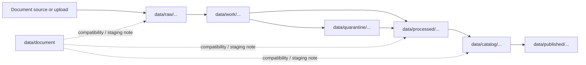

<!-- [KFM_META_BLOCK_V2]
doc_id: kfm://doc/data-document-readme
title: data/document/README.md — Document Data Compatibility README
version: v0.1
type: readme; data-lifecycle-note; compatibility-segment-note
status: draft; PROPOSED; COMPATIBILITY-LANE; data-root; document; lifecycle-boundary; needs-verification
owners: OWNER_TBD — Data steward · Docs steward · Source steward · Catalog steward · Evidence steward · Policy steward · Release steward
created: NEEDS VERIFICATION — placeholder existed before v0.1 expansion
updated: 2026-06-25
policy_label: public-doc; data; document; compatibility; lifecycle; governed
tags: [kfm, data, document, documents, lifecycle, compatibility, RAW, WORK, QUARANTINE, PROCESSED, CATALOG, PUBLISHED, EvidenceBundle, SourceDescriptor, ReleaseManifest]
related:
  - ../README.md
  - ../../README.md
  - ../../docs/doctrine/directory-rules.md
  - ../../docs/doctrine/lifecycle-law.md
  - ../../docs/doctrine/trust-membrane.md
  - ../../docs/sources/
  - ../raw/
  - ../work/
  - ../quarantine/
  - ../processed/
  - ../catalog/
  - ../proofs/
  - ../receipts/
  - ../published/
  - ../registry/
  - ../../release/
notes:
  - "This file replaces a placeholder at `data/document/README.md`."
  - "`data/document/` is not yet verified as a canonical lifecycle root; treat it as a PROPOSED compatibility lane until an ADR, path map, or migration note decides the boundary."
  - "Human-facing documentation belongs under `docs/`; this lane must not become a docs authority root."
  - "Document source captures, extracted text, OCR outputs, catalog records, proofs, receipts, and release decisions each belong in their proper lifecycle or authority root."
  - "Rollback target for this replacement is previous placeholder blob SHA `e25f1814e51579d5f55c0f1fe0135ddb28a47f4a`."
[/KFM_META_BLOCK_V2] -->

<a id="top"></a>

# data/document

> Compatibility README for document-related data under the `data/` lifecycle root. This path is PROPOSED and must not become a parallel documentation, source, catalog, proof, release, schema, policy, or implementation authority.

<p>
  
  
  
  
  
</p>

**Status:** draft / PROPOSED / COMPATIBILITY-LANE  
**Path:** `data/document/README.md`  
**Owning root:** `data/`  
**Canonical posture:** NEEDS VERIFICATION — `data/document/` is not proven as a canonical lifecycle root in the inspected evidence  
**Exposure posture:** not public by default; public exposure requires release linkage through governed catalog/published paths  
**Truth posture:** CONFIRMED target was a placeholder · CONFIRMED `data/` is the lifecycle data root · CONFIRMED Directory Rules say root folders encode responsibility and lifecycle · NEEDS VERIFICATION for whether this path should remain, redirect, or be migrated.

**Quick jumps:** [Purpose](#purpose) · [Lifecycle boundary](#lifecycle-boundary) · [Repo fit](#repo-fit) · [Accepted contents](#accepted-contents) · [Exclusions](#exclusions) · [Document-data handling](#document-data-handling) · [Guardrails](#guardrails) · [Evidence ledger](#evidence-ledger) · [Validation checklist](#validation-checklist) · [Rollback](#rollback)

---

## Purpose

`data/document/` is a proposed compatibility lane for document-related data references while the repository decides whether document data should live here or be distributed across the canonical lifecycle roots.

This README exists to prevent the folder from becoming an accidental authority root. It does not authorize storing all document material here, and it does not replace `docs/`, `data/raw/`, `data/processed/`, `data/catalog/`, `data/proofs/`, `data/receipts/`, or `release/`.

## Lifecycle boundary

```text
RAW -> WORK / QUARANTINE -> PROCESSED -> CATALOG / TRIPLET -> PUBLISHED
```

Document-related material must follow the same lifecycle as every other KFM data family:



## Repo fit

| Responsibility | Correct home | Rule |
|---|---|---|
| Human-facing documentation | `docs/` | Not this lane. |
| Source-native document captures | `data/raw/` | Store source captures by source/domain/lifecycle policy. |
| Working extraction/OCR/intermediate output | `data/work/` | Not public; may need quarantine. |
| Failed, unsafe, rights-unclear, or sensitive holds | `data/quarantine/` | Fail closed until reviewed. |
| Normalized extracted document data | `data/processed/` | Upstream of catalog. |
| Catalog records for documents or extracted datasets | `data/catalog/` | CATALOG-stage, release-gated. |
| Evidence/proof records | `data/proofs/` | EvidenceBundle and proof records. |
| Receipts | `data/receipts/` | RunReceipt, validation, transform, review, correction, and release receipts. |
| Source registry records | `data/registry/` | SourceDescriptor/source-admission records. |
| Release decisions | `release/` | Publication authority. |
| Published public material | `data/published/` | Public-safe materialization after release. |
| Schemas and policy | `schemas/`, `policy/` | Separate roots. |
| Code/tests | implementation roots and test roots | Not this lane. |

## Accepted contents

Until an ADR/path map confirms a stronger role, accepted contents are limited to:

- This README.
- Migration notes, inventories, or crosswalks explaining where document-related data currently lives and where it should move.
- Pointers to canonical lifecycle homes for raw captures, work products, quarantine, processed outputs, catalog records, proofs, receipts, source registry entries, published outputs, and releases.
- Small placeholder indexes that do not contain source content, proof content, sensitive data, release decisions, or executable behavior.

## Exclusions

- Human-facing doctrine, architecture, manuals, runbooks, guides, and standards. Use `docs/`.
- RAW document files or source-native uploads. Use `data/raw/`.
- OCR/extraction scratch output. Use `data/work/` unless promoted by lifecycle rules.
- Quarantined or rights-unclear material. Use `data/quarantine/`.
- Processed extracted text, tables, embeddings, manifests, or derivatives. Use `data/processed/` or another accepted lifecycle root.
- Catalog records. Use `data/catalog/`.
- EvidenceBundle/proof records. Use `data/proofs/`.
- Receipts. Use `data/receipts/`.
- SourceDescriptor/source registry records. Use `data/registry/`.
- Release decisions. Use `release/`.
- Published outputs. Use `data/published/`.
- Schemas, policies, validators, tests, packages, pipelines, app/UI/API code.

## Document-data handling

Document-related data can be high-risk because it may contain rights restrictions, private details, cultural or jurisdictional sensitivity, OCR errors, extractive summaries, or uncertain provenance. Treat fluent summaries, extracted tables, OCR text, embeddings, and generated descriptions as downstream carriers, not truth roots.

Before any document-derived material becomes public, it should have source identity, rights posture, sensitivity review, extraction/transformation receipt, validation receipt, evidence reference where claims depend on evidence, catalog record, release state, correction path, and rollback target.

## Guardrails

- Do not use `data/document/` as a convenience bucket.
- Do not use this lane as a substitute for `docs/`.
- Do not publish directly from this lane.
- Do not store source-native files, proofs, receipts, source descriptors, release decisions, schemas, policy rules, or implementation code here.
- If this path is retained, document the decision in an ADR/path map and add migration/rollback notes.
- If this path is not retained, migrate any real contents into the correct lifecycle roots and restore this file to a redirect/alias note or remove the folder through governed migration.

## Evidence ledger

| Source | Status | Supports | Limits |
|---|---|---|---|
| Previous file | CONFIRMED | Target existed as a placeholder. | Did not define lane boundaries. |
| `data/README.md` | CONFIRMED | `data/` is the lifecycle data root and excludes code, schemas, policy rules, and release decisions. | Does not confirm `data/document/` as canonical. |
| `docs/doctrine/directory-rules.md` | CONFIRMED doctrine / PROPOSED path specifics | Root folders encode responsibility and data uses lifecycle phases. | Does not approve this specific folder as canonical. |
| Repository search | CONFIRMED no exact hit in this session | No existing exact `data/document` guidance was found through repository search. | Search is not a complete filesystem inventory. |

## Validation checklist

- [ ] Confirm whether `data/document/` should exist at all.
- [ ] Confirm whether this path should remain as compatibility, redirect, or be removed.
- [ ] Confirm no source files, proofs, receipts, release decisions, schemas, policy, or implementation code are stored here.
- [ ] Confirm any document-derived data has a lifecycle home under RAW, WORK, QUARANTINE, PROCESSED, CATALOG/TRIPLET, or PUBLISHED.
- [ ] Confirm source, rights, sensitivity, validation, receipts, release, correction, and rollback linkage before any public exposure.

## Rollback

Rollback is required if this lane becomes a parallel docs root, source-data root, proof store, source-registry root, receipt store, catalog root, release-decision root, published-output root, schema root, policy root, validator root, implementation root, public API shortcut, or public exposure shortcut.

Rollback target for this replacement: previous placeholder blob SHA `e25f1814e51579d5f55c0f1fe0135ddb28a47f4a`.

<p align="right"><a href="#top">Back to top</a></p>
