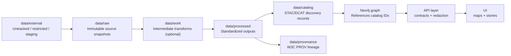

# 📦 `data/external/` — External Data Staging (Local-Only)


> [!IMPORTANT]
> `data/external/` is a **staging area** for data that is **not yet publishable** (or may never be publishable) inside the version-controlled KFM data lifecycle.
>
> **Nothing in here should be assumed “trusted,” “clean,” or “redistributable.”**  
> If it becomes part of KFM, it must be promoted into the canonical pipeline (`data/raw → data/processed → catalog + provenance`) ✅

---

## 🧭 Why this folder exists

This directory exists to hold **external inputs** that are:

- 🔒 **License-restricted / non-redistributable** (e.g., copyrighted scans, partner-only files)
- 🧱 **Too large** or too volatile for git history (huge rasters, bulk exports, temporary drops)
- 🧪 **Experimental** or **pre-QA** (needs cleaning, schema work, redaction, or validation)
- 🧰 **Cache-like** (downloaded archives that pipelines unpack during transforms)

**Goal:** keep the repo clean + reproducible without forcing questionable data into version control.

---

## ✅ What belongs here

- Raw downloads / vendor drops / one-off exports (ZIP, TAR, GeoTIFF, SHP bundles, PDFs, etc.)
- Temporary staging to support pipelines (e.g., you need to unpack + inspect before standardizing)
- Files pending governance review (license unclear, sensitivity unclear, provenance incomplete)
- Data that will be used **only to produce** derived, publishable outputs (after redaction & provenance)

---

## ❌ What does *not* belong here

- 🚫 **Final** or **published** datasets that the platform serves
- 🚫 Anything intended to be loaded directly into PostGIS / API without going through pipelines
- 🚫 Secrets (API keys, credentials), private notes with sensitive identifiers, etc.
- 🚫 “Mystery data” with no source, no date, no license, no contact

> [!TIP]
> If the UI should ever show it, the API should ever serve it, or the graph should ever reference it — it **must** be promoted into the canonical lifecycle with metadata + provenance.

---

## 🗺️ Canonical lifecycle (where “real” data lives)

Once an external dataset is accepted into KFM, it **moves out of here** and follows the pipeline:



---

## 🧱 Recommended folder layout

Keep external data **organized by source and dataset** so we can audit + promote cleanly.

```text
data/external/
├─ README.md                 # (this file) ✅ tracked
├─ _cache/                   # downloads/unpacked scratch ❌ gitignored
├─ _scratch/                 # experiments & throwaways ❌ gitignored
└─ <provider>/               # e.g., usgs / noaa / partnerX
   └─ <dataset_slug>/        # short, stable identifier
      ├─ MANIFEST.yml        # metadata-only ✅ tracked (recommended)
      ├─ LICENSE.txt         # if provided ✅ tracked (only if redistributable)
      └─ <version_or_date>/  # YYYY-MM-DD or v1.2.3
         └─ ...files...      # ❌ typically gitignored
```

### Naming conventions ✍️
- **provider**: lowercase (`usgs`, `noaa`, `kansas_gov`, `partner_x`)
- **dataset_slug**: lowercase + underscores (`nhd_flowlines`, `census_1900_tables`)
- **version**: `YYYY-MM-DD` (download date) *or* `vX.Y.Z`
- Avoid spaces. Keep paths boring. Boring = reliable. ✅

---

## 🧾 `MANIFEST.yml` (required for anything serious)

Even if the actual data stays untracked, we still need **reproducibility**.

Create a `MANIFEST.yml` next to the dataset folder:

```yaml
# data/external/<provider>/<dataset_slug>/MANIFEST.yml

dataset_id: <provider>__<dataset_slug>
title: "Human-friendly title"
description: >
  What this is, why we pulled it, and what we intend to produce from it.

source:
  provider: "<provider org/name>"
  url: "<source landing page or download endpoint>"
  citation: "Preferred citation text (if provided)"
  retrieved_at: "YYYY-MM-DD"
  contact: "<email or org contact (optional)>"

license:
  name: "<e.g., Public Domain / CC-BY-4.0 / Proprietary>"
  redistributable: false
  notes: "Any restrictions / attribution requirements / share-alike requirements"

sensitivity:
  access_level: "public | restricted | private"
  rationale: "Why classified this way (CARE/safety/etc.)"
  redaction_required: true
  redaction_notes: "What needs to be removed/blurred/generalized"

integrity:
  checksums:
    - path: "<relative path to file>"
      algo: "sha256"
      value: "<hash>"
  expected_files:
    - "<pattern or filename>"

processing_intent:
  target_domain: "<kfm domain module>"
  planned_outputs:
    - "data/processed/<domain>/<output_name>.geojson"
    - "data/processed/<domain>/<output_name>.tif"
  pipeline_entrypoint: "<pipelines/... script or command>"
  notes: "Any assumptions, parameters, CRS notes, QA notes"
```

> [!NOTE]
> Keep manifests **non-secret**. If you must store credentials for fetching, use environment variables or secret managers — never commit keys.

---

## ✅ Promotion checklist (External → KFM)

Before moving anything from `data/external/` into `data/raw/` + `data/processed/`, confirm:

### Legal / licensing 🧑‍⚖️
- [ ] License is known and compatible with KFM’s intended use
- [ ] Attribution / citation requirements are documented
- [ ] Redistributability is explicitly determined (true/false)

### Provenance & traceability 🔎
- [ ] Source URL (or archival reference) is captured
- [ ] Retrieval date is captured
- [ ] Checksums exist for source artifacts

### Metadata completeness 🗂️
- [ ] Spatial reference / CRS is known
- [ ] Temporal coverage is documented (where applicable)
- [ ] Field definitions / schema notes exist (even if rough)

### Governance & safety 🛡️
- [ ] Sensitivity classification is set (public/restricted/private)
- [ ] Redaction/generalization needs are identified
- [ ] If culturally sensitive / sovereignty-related, a governance review is triggered

### Publishing requirements 📦
- [ ] Raw snapshot is placed in `data/raw/<domain>/...` (immutable)
- [ ] Processed output is placed in `data/processed/<domain>/...`
- [ ] Catalog entries exist (STAC/DCAT as applicable)
- [ ] PROV lineage record exists (pipeline run, agents, inputs, outputs, params)

---

## ⚖️ Governance notes (FAIR + CARE)

External data is where governance risk tends to start. Treat it accordingly:

- 🧩 **FAIR**: don’t promote data without findability + metadata + reuse clarity  
- 🪶 **CARE**: respect authority-to-control, sensitivity, and takedown/withdrawal realities  
- 🔐 If data is restricted, ensure the *processed outputs* and API exposure are restricted too (redaction is not optional).

> [!WARNING]
> If you can’t answer **“Where did this come from, under what license, and who is accountable?”**  
> it doesn’t graduate from `data/external/`.

---

## 🧪 Common workflows

<details>
<summary><strong>1) New external dataset (pre-ingest)</strong></summary>

1. Create folder: `data/external/<provider>/<dataset_slug>/`
2. Add `MANIFEST.yml` (minimum: source, retrieved_at, license, sensitivity)
3. Drop files into a dated version folder (usually gitignored)
4. Run exploration/QA locally (don’t assume CRS, encoding, units)
5. Decide: **discard**, **derive-only**, or **promote** into KFM lifecycle

</details>

<details>
<summary><strong>2) Promote into KFM (publish)</strong></summary>

1. Copy immutable snapshot into `data/raw/<domain>/...`
2. Run deterministic pipeline to generate standardized outputs in `data/processed/<domain>/...`
3. Generate catalog + provenance artifacts
4. Commit processed + metadata + provenance and open PR  
5. Ensure CI passes (missing license/metadata/provenance should block merges)

</details>

---

## 🧯 Troubleshooting

- **“I don’t know the license.”**  
  → Keep it in `data/external/` until resolved. Add manifest notes + open a governance issue.

- **“It’s too big to commit.”**  
  → Keep raw artifacts external; commit **manifests + checksums + fetch instructions**. Promote only derived, small, or legally redistributable outputs.

- **“It contains sensitive locations/PII.”**  
  → Do not publish raw. Plan redaction/generalization in the pipeline. Ensure restricted access policies.

---

## 🧩 TODOs for maintainers

- [ ] Ensure `.gitignore` enforces “local-only” behavior for bulk files in this folder
- [ ] Add a small “fetch helper” pattern for repeatable downloads (config-driven)
- [ ] Add validation scripts for manifests (schema + required fields)