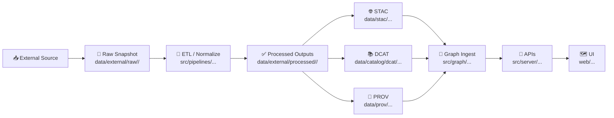

# 🗺️ External Dataset Mapping — `<dataset_slug>`


> 🎯 **Goal:** this folder documents *how* the external source dataset maps into KFM’s governed boundary artifacts (📦 STAC + 📚 DCAT + 🧾 PROV) and where its raw/processed assets live.  
> Treat this as the **human-readable contract** that keeps ETL, catalogs, graph ingest, and UI in sync.

---

## 🧭 Quick Nav

- [📦 What lives here](#-what-lives-here)
- [🔖 Dataset identity](#-dataset-identity)
- [🌐 Source + access](#-source--access)
- [🧱 Canonical pipeline placement](#-canonical-pipeline-placement)
- [🌐 STAC mapping](#-stac-mapping)
- [📚 DCAT mapping](#-dcat-mapping)
- [🧾 PROV mapping](#-prov-mapping)
- [🔗 Cross-layer linkage checklist](#-cross-layer-linkage-checklist)
- [🧪 Validation](#-validation)
- [⚖️ Governance, FAIR+CARE, sovereignty](#-governance-faircare-sovereignty)
- [🕰️ Change log](#-change-log)
- [✅ Definition of done](#-definition-of-done)
- [🔗 Related KFM docs](#-related-kfm-docs)

---

## 📦 What lives here

This directory is the **mapping/runbook** for a single dataset:

```text
📁 data/external/mappings/<dataset_slug>/
├── 📄 README.md                👈 you are here (authoritative mapping notes)
├── 📄 decisions.md             (optional) ADR-style mapping decisions + rationale
├── 📄 field_map.csv            (optional) source→canonical field mapping table
├── 📄 stac_mapping.md          (optional) STAC-specific notes + asset rules
├── 📄 dcat_mapping.md          (optional) DCAT-specific notes + distribution rules
├── 📄 prov_mapping.md          (optional) PROV-specific notes + lineage graph shape
└── 📁 attachments/             (optional) screenshots, sample rows, schemas, etc.
```

### 🗂️ Expected sibling locations (domain staging)

> These are **recommended** KFM “homes” for the dataset’s staged assets:

- 🧊 Raw snapshot (read-only): `../../raw/<dataset_slug>/`
- 🧪 Work/intermediate outputs: `../../work/<dataset_slug>/`
- ✅ Processed outputs (stable): `../../processed/<dataset_slug>/`
- 🌐 STAC outputs: `../../../stac/collections/…` + `../../../stac/items/…`
- 📚 DCAT outputs: `../../../catalog/dcat/…`
- 🧾 PROV bundles: `../../../prov/…`

---

## 🔖 Dataset identity

| Field | Value |
|---|---|
| Dataset name | `<human_friendly_name>` |
| Dataset slug | `<dataset_slug>` |
| Domain | `external` |
| Dataset ID (canonical) | `<uuid-or-urn>` |
| Source provider | `<provider_name>` |
| Source system/type | `<api|file|registry|archive|tbd>` |
| Primary spatial type | `<raster|vector|table|none>` |
| Temporal coverage | `<YYYY–YYYY>` / `<event-based>` |
| Update cadence | `<one-off|monthly|annual|unknown>` |
| License | `<SPDX-ID-or-TBD>` |
| Citation / attribution text | `<paste required citation here>` |

✅ **ID rule of thumb:** pick one canonical dataset_id and reuse it consistently in STAC, DCAT, and PROV.

---

## 🌐 Source + access

### 🔗 Source links

- Homepage: `<https://…>`
- Direct download/API base: `<https://…>`
- Terms / license: `<https://…>`
- Upstream docs: `<https://…>`

### 📥 Acquisition notes

- Access method: `<download|api|scrape|manual>`
- Auth: `<none|api-key|oauth|…>` (🚫 **never** commit secrets; use `.env` / secret store)
- Snapshot strategy:
  - ✅ Prefer immutable releases (tag/version/DOI)  
  - ✅ If “latest”, record retrieval date + ETag/hash + pagination parameters

### 🔒 Integrity + immutability

- Snapshot identifier: `<etag|release|doi|timestamp>`
- Checksums recorded: `<sha256:…>` (recommended)
- Known upstream quirks: `<rate limits, missing fields, etc.>`

<details>
<summary>📄 Suggested <code>source_manifest.yml</code> template (optional)</summary>

```yaml
dataset_slug: "<dataset_slug>"
retrieved_at: "<YYYY-MM-DD>"
source:
  provider: "<provider_name>"
  url: "<https://…>"
  terms_url: "<https://…>"
snapshot:
  id: "<etag|release|doi|timestamp>"
  files:
    - path: "data/external/raw/<dataset_slug>/<file>"
      sha256: "<sha256>"
      size_bytes: <int>
```
</details>

---

## 🧱 Canonical pipeline placement

KFM’s non-negotiable ordering (don’t leapfrog stages):



### 🎛️ ETL contract (what the pipeline must guarantee)

- Deterministic / idempotent outputs (same inputs ⇒ same outputs) ✅
- Raw files are read-only snapshots ✅
- All transforms are documented here (units, CRS, cleaning rules, joins) ✅
- Outputs are cataloged (STAC/DCAT) + traced (PROV) ✅

---

## 🌐 STAC mapping

> STAC is the **geospatial indexing layer**. Even “mostly non-spatial” datasets often still get a Collection for consistency.

### 📌 STAC targets

- Collection JSON: `../../../stac/collections/<stac_collection_id>.json`
- Item JSONs: `../../../stac/items/<stac_collection_id>/…` *(or your project’s convention)*

### 🧩 Collection-level decisions

- `id`: `<stac_collection_id>`
- `title`: `<human_friendly_name>`
- `description`: `<what it is + why it matters>`
- `extent.spatial.bbox`: `<minx,miny,maxx,maxy>`
- `extent.temporal.interval`: `<start/end>`
- `license`: `<SPDX or "proprietary">`
- Providers/attribution: `<who created it, who hosts it, who processed it>`

### 📎 Asset rules (what gets linked)

| Output asset | Location | STAC `assets` key | Media type | Roles | Notes |
|---|---|---|---|---|---|
| `<file>` | `../../processed/<dataset_slug>/…` | `<asset_key>` | `<type>` | `<data|metadata|thumbnail>` | `<notes>` |

### 🧬 Field mapping (geometry + properties)

| Source field | Source type | Canonical meaning | STAC field/property | Transform | Notes |
|---|---|---|---|---|---|
| `<src_col>` | `<type>` | `<meaning>` | `properties.<name>` | `<rule>` | `<edge cases>` |

✅ **Spatial normalization:** document CRS assumptions and any reprojection here.  
✅ **Temporal normalization:** document time parsing rules + timezone assumptions here.

---

## 📚 DCAT mapping

> DCAT is the **discovery layer** (catalog of datasets). Keep it high-level, with clean distribution links.

### 📌 DCAT targets

- Dataset JSON-LD: `../../../catalog/dcat/<dataset_slug>.jsonld` *(or your convention)*

### 🧩 Dataset-level fields

- Title: `<title>`
- Description: `<description>`
- Keywords/themes: `<keywords>`
- Publisher: `<publisher>`
- Contact point: `<email or url>`
- License: `<license>`
- Spatial/temporal coverage: `<summary>`

### 📦 Distributions (links out)

| Distribution | URL / Path | Format | Points to | Notes |
|---|---|---|---|---|
| STAC Collection | `data/stac/collections/<stac_collection_id>.json` | `application/json` | STAC | ✅ preferred |
| Direct download | `<https://…>` | `<csv|geotiff|…>` | Source/processed | include access notes |

---

## 🧾 PROV mapping

> PROV is the **lineage layer**: raw inputs → activities → outputs, with agents + parameters.

### 📌 PROV targets

- Bundle location: `../../../prov/<dataset_slug>/…` *(or per-run convention)*

### 🧠 Required lineage shape (minimum)

- **Entities**
  - `raw:<file-or-snapshot>` — raw input(s)
  - `proc:<output>` — processed outputs
  - `cfg:<config>` — pipeline config used
- **Activity**
  - `act:<run_id>` — the ETL run (with start/end time)
- **Agents**
  - `agent:person:<name>` (optional)
  - `agent:software:<pipeline_name>` (recommended)

### 🧪 Run identity

| Field | Value |
|---|---|
| Run ID | `<run_id>` |
| Pipeline path | `src/pipelines/<…>` |
| Commit hash | `<git_sha>` |
| Parameters/config | `<path or embedded json>` |
| Runtime environment | `<docker image tag, python env, etc.>` |

### 🧩 Transformation notes (human-readable)

- Inputs used: `<list>`
- Steps performed: `<cleaning, joins, reprojection, OCR, etc.>`
- Known limitations / uncertainty: `<missing fields, geocoding confidence, etc.>`

---

## 🔗 Cross-layer linkage checklist

- [ ] 🌐 STAC Items link to **real assets** in `data/**/processed/**` (or stable storage)
- [ ] 📚 DCAT distributions link to **STAC and/or downloads**
- [ ] 🧾 PROV links **raw → work → processed** and references run/config/commit
- [ ] 🧠 Graph nodes reference catalog IDs (STAC/DCAT/DOI) instead of duplicating payloads
- [ ] 🏷️ License + attribution are present at *every* relevant layer (STAC/DCAT + assets)

---

## 🧪 Validation

### ✅ Minimum local sanity checks

- [ ] Raw snapshot exists and is immutable (no edits after ingest)
- [ ] Processed outputs are reproducible from raw + config
- [ ] STAC JSON validates against KFM STAC profile (and base STAC)
- [ ] DCAT JSON-LD validates against KFM DCAT profile (and DCAT)
- [ ] PROV bundle validates against KFM PROV profile (and PROV)

> 🔍 Tip: check `tools/` + CI workflows for the canonical validators used in this repo.

### 🧯 Common failure modes

- Missing license / unclear terms
- STAC assets point to nonexistent paths
- DCAT distributions stale or broken
- PROV missing run identifiers or raw inputs
- Sensitive coordinates exposed without review/redaction

---

## ⚖️ Governance, FAIR+CARE, sovereignty

### 🧷 Classification + access

- Classification: `<public|internal|restricted>`
- Release constraints: `<none|redact|aggregate|delay|approval_required>`
- Review gate required? `<yes/no>` (explain trigger)

### 🪶 CARE / sovereignty notes (if applicable)

- Community/tribal relevance: `<tbd>`
- Data handling constraints: `<tbd>`
- Redaction/generalization rules: `<tbd>`

### 🧭 Ethical flags

- Sensitive locations? `<yes/no>`
- Personally identifying info (PII)? `<yes/no>`
- Dual-use risk? `<yes/no>`
- Mitigations applied: `<tbd>`

---

## 🕰️ Change log

| Date | Version | Change | Author |
|---|---:|---|---|
| 2026-01-29 | 0.1.0 | Initial mapping scaffold | `<name>` |
| `<YYYY-MM-DD>` | `<x.y.z>` | `<what changed>` | `<name>` |

---

## ✅ Definition of done

- [ ] Source links + terms/licensing captured
- [ ] Raw snapshot strategy documented (version/etag/hash + retrieval date)
- [ ] Field mapping documented (units/CRS/time parsing)
- [ ] ✅ Processed outputs exist in `data/external/processed/<dataset_slug>/`
- [ ] 🌐 STAC Collection + Items produced and validate
- [ ] 📚 DCAT dataset produced and validate
- [ ] 🧾 PROV bundle produced and traces raw→processed with run/config/commit
- [ ] Cross-links verified (STAC↔DCAT↔PROV)
- [ ] Governance section complete (classification + CARE/sovereignty + redaction rules)
- [ ] Change log updated
- [ ] Optional: `decisions.md` captures any non-obvious choices

---

## 🔗 Related KFM docs

- 📘 Master pipeline + structure: `docs/MASTER_GUIDE_v13.md`
- 🧱 Repository structure standard: `docs/standards/KFM_REPO_STRUCTURE_STANDARD.md`
- 📝 Markdown protocol: `docs/standards/KFM_MARKDOWN_WORK_PROTOCOL.md`
- 🌐 STAC profile: `docs/standards/KFM_STAC_PROFILE.md`
- 📚 DCAT profile: `docs/standards/KFM_DCAT_PROFILE.md`
- 🧾 PROV profile: `docs/standards/KFM_PROV_PROFILE.md`
- ⚖️ Governance root: `docs/governance/ROOT_GOVERNANCE.md`
- 🪶 Sovereignty: `docs/governance/SOVEREIGNTY.md`

---

### 🙋 Contacts

- Domain steward: `<name>`
- Data pipeline owner: `<name>`
- Governance reviewer: `<name or team>`

