# 📎 Attachments — `<dataset_slug>`


> 🧾 **Why this folder exists:** KFM is **provenance-first**. These attachments are the “paper trail” that backs the mapping work for this external dataset. Treat them like evidence.

---

## 🎯 What belongs here

This folder is for **supporting artifacts** that justify or explain how the external dataset was interpreted and mapped into KFM.

Typical examples ✅

- 🗺️ **Original source files**: PDFs, scans, TIFFs, ZIPs, vendor docs, standards PDFs, etc.
- 🧷 **Licensing & permissions**: license text, ToS snapshots, usage grants, attribution requirements.
- 📸 **Web snapshots**: screenshots of dataset landing pages, documentation pages, API docs (especially if pages change over time).
- 🧪 **Method notes**: small “how we interpreted X” notes *when they are directly tied to a specific attachment*.
- 🧾 **Correspondence artifacts**: only if allowed + not sensitive (e.g., permission emails with redactions).

---

## 🚫 What does *not* belong here

Keep this folder clean and legally safe:

- ❌ **Processed outputs** (COGs, cleaned GeoJSON, derived CSVs, normalized schemas)  
  → those go in KFM’s normal data lifecycle folders (raw/work/processed), not “attachments”.
- ❌ **Anything with sensitive/PII** unless it’s explicitly allowed and properly redacted.
- ❌ **Massive binaries** that don’t need to live in git (see “Large files” below).
- ❌ **Random working files** (scratch exports, temp files, QGIS autosaves, etc.)

---

## 🧭 Where attachments fit in the pipeline

```mermaid
flowchart LR
  A["📎 attachments/ (evidence)"] --> B["🧩 mapping docs (how we interpret + map)"]
  B --> C["📥 data/raw/... (ingested snapshots)"]
  C --> D["🛠️ ETL / normalization"]
  D --> E["📦 data/processed/... (published outputs)"]
  E --> F["🗃️ STAC/DCAT/PROV (catalog + lineage)"]
  F --> G["🧠 Graph/API/UI (downstream consumers)"]
```



---

## 🗂️ Suggested subfolders (optional but recommended)

You *can* keep everything flat, but this structure scales better:

```text
attachments/
  README.md                       # you are here ✅
  manifest.yml                    # index of attachments (recommended)
  checksums.sha256                # sha256 per file (recommended)
  source/                         # original downloads / scans
  license/                        # license text, ToS snapshots, permissions
  screenshots/                    # webpage captures, UI captures, etc.
  notes/                          # brief interpretation notes tied to evidence
```

> 💡 If you add subfolders, **keep them boring and predictable**. Future-you will thank you.

---

## 🏷️ File naming convention

Aim for filenames that are:
- ✅ stable
- ✅ sortable
- ✅ readable
- ✅ descriptive (without being a novel)

**Recommended pattern**

`YYYYMMDD__source__short-description__vNN.ext`

Examples:
- `20260129__usgs__historical-topo-index__v01.pdf`
- `20251205__kansas-geo-survey__metadata-spec__v02.html`
- `20260110__arcgis-rest__service-endpoints__v01.txt`

Rules of thumb:
- Use **kebab-case** for words (`short-description`)
- Use `__` as a visual separator between “fields”
- Include a `vNN` if you may update/replace it later
- If you truly must keep the original filename (for legal/audit reasons), keep it — but still record it in `manifest.yml`

---

## 🧾 `manifest.yml` (recommended)

A manifest makes attachments **discoverable** and **auditable**.

Create `attachments/manifest.yml` with one entry per file:

```yaml
dataset_slug: "<dataset_slug>"
attachments:
  - file: "source/20260129__example-source__dataset-doc__v01.pdf"
    retrieved: "YYYY-MM-DD"
    source_url: "https://example.org/datasets/<id>"
    license: "TBD (add proof in license/)"
    sha256: "sha256:TO_BE_FILLED"
    role: "documentation"
    notes: "What this file proves / why it matters."
```

> 🧠 Think of `manifest.yml` as the “index card” the evidence locker needs.

---

## 🔐 `checksums.sha256` (recommended)

Create `attachments/checksums.sha256` to lock evidence integrity:

```text
<sha256>  source/20260129__example-source__dataset-doc__v01.pdf
<sha256>  screenshots/20260129__landing-page__v01.png
```

Quick commands:

```bash
# Compute a checksum (Linux/macOS)
shasum -a 256 "source/20260129__example-source__dataset-doc__v01.pdf"

# Or (GNU coreutils)
sha256sum "source/20260129__example-source__dataset-doc__v01.pdf" >> checksums.sha256
```

---

## 🔗 How to reference attachments from mapping docs

Mapping docs should reference attachments **by relative path** so links survive repo moves.

Example snippet you can paste into your mapping doc:

```md
### Evidence

- Source documentation: `attachments/source/20260129__example-source__dataset-doc__v01.pdf`
- Landing page snapshot: `attachments/screenshots/20260129__landing-page__v01.png`

> Checksums are recorded in `attachments/checksums.sha256`.
```

If your mapping doc uses YAML/JSON, store the same information there too (especially `sha256`).

---

## 📦 Large files policy (keep git healthy)

If an attachment is **too large for normal git**, prefer one of these:

- ✅ **Git LFS** (if the repo supports it)
- ✅ External storage + **store only**:
  - stable URL
  - retrieval date
  - checksum
  - license proof

**Never** let “it was big” be the reason provenance is missing.

---

## 🧯 Safety, ethics, and licensing

Before committing any attachment:

- ✅ confirm it is legally storable (license/ToS/permission)
- ✅ redact sensitive content (names/emails/IDs) if necessary
- ✅ avoid storing credentials/tokens (yes, it happens)
- ✅ if culturally sensitive, mark it clearly and restrict access if required

---

## ✅ Definition of Done — adding an attachment

Use this checklist in your PR description (or just self-check):

- [ ] File is placed in the correct subfolder (`source/`, `license/`, `screenshots/`, etc.)
- [ ] Filename follows the convention (or original name preserved intentionally)
- [ ] Entry added to `attachments/manifest.yml`
- [ ] SHA256 recorded in `attachments/checksums.sha256`
- [ ] Mapping doc links to the attachment (relative path)
- [ ] License/provenance proof exists (and is referenced in manifest notes)
- [ ] No sensitive info / secrets included

---

## 🧩 FAQ

<details>
  <summary><strong>Can I edit an attachment (e.g., crop a PDF)?</strong></summary>

Prefer **no**. Keep original evidence immutable.

If you must create a modified version:
- keep the original intact
- store the modified file as a *separate* file (with `__derived__` or a new version)
- record both in `manifest.yml` and explain the relationship
</details>

<details>
  <summary><strong>Where do georeferenced rasters and derived GeoJSON go?</strong></summary>

Not here. Put derivatives in the normal data lifecycle paths (raw/work/processed), and reference them via STAC/DCAT/PROV as appropriate.
</details>

<details>
  <summary><strong>Do I have to use manifest + checksums?</strong></summary>

If you want this mapping to scale and stay trustworthy, yes — it’s the simplest way to keep the evidence chain intact.
</details>

