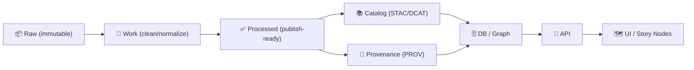

# 📥 Intake — External Dataset Mapping: `<dataset_slug>`


> [!NOTE]
> This intake note lives at:
>
> `data/external/mappings/<dataset_slug>/attachments/notes/2026-01-29__intake.md`
>
> The goal: capture **source facts**, **rights/licensing**, **mapping decisions**, and a **publishable plan** (so we can move cleanly through Raw → Processed → Catalog/Prov → DB → API → UI). ✅

---

## 🧭 TL;DR (fill this first)

| Field | Value |
|---|---|
| Dataset (human name) | `<dataset_name>` |
| Slug | `<dataset_slug>` |
| Domain (where it lands) | `<domain>` |
| Coverage | `<Kansas statewide | county | corridor | site | multi-state>` |
| Time range | `<YYYY–YYYY>` |
| Data type | `<vector/raster/tabular/mixed>` |
| Geometry | `<points/lines/polygons/raster>` |
| License | `<license_name>` |
| Intended use in KFM | `<map layer | story node evidence | reference table | graph enrichment>` |

---

## 🎯 Intake Goals

- [ ] Identify **authoritative source** and retrieval method 🧾
- [ ] Confirm **license/rights** and redistribution permission ⚖️
- [ ] Capture **spatial + temporal characteristics** 🗺️⏳
- [ ] Define **schema/field mapping** to canonical entities 🧬
- [ ] Specify **deterministic pipeline plan** (no manual steps in “official” runs) 🤖
- [ ] List required **boundary artifacts** (catalog + provenance) 📚🧾

---

## 📦 Expected Repo Layout (attachments + lifecycle)

### 📎 Mapping Workspace (this dataset)
```text
📁 data/
  📁 external/
    📁 mappings/
      📁 <dataset_slug>/
        📁 attachments/
          📁 raw/                 # original downloads / scans (as-received)
          📁 license/             # license text, ToS screenshots, emails
          📁 notes/               # intake + decision logs (this file lives here)
          📁 qa/                  # QA exports, screenshots, validation outputs
          📁 correspondence/      # optional: emails/letters granting permission
          📁 excerpts/            # optional: small excerpts used for testing
          📄 README.md            # optional: mapping-specific readme
        📄 mapping.yaml           # optional: formal field mapping spec
        📄 transform.md           # optional: transform rules + edge cases
```

### 🏗️ Data Lifecycle Targets (where it eventually goes)
```text
📁 data/
  📁 raw/<domain>/                # immutable source snapshots
  📁 work/<domain>/               # intermediate processing
  📁 processed/<domain>/          # publish-ready outputs
  📁 stac/collections/            # STAC collections (if used here)
  📁 stac/items/                  # STAC items (if used here)
  📁 catalog/dcat/                # DCAT dataset entries (if used here)
  📁 prov/                        # PROV lineage bundles (if used here)
```

---

## 🔎 Source & Acquisition

### Source identity
- **Publisher / owner**: `<publisher>`
- **Citation (preferred)**: `<formal citation string>`
- **Primary URL**: `<source_url>`
- **Secondary mirrors**: `<mirror_urls_or_none>`

### Acquisition log
- **Method**: `<download | API | scrape | scan | manual request>`
- **Retrieved by**: `<name_or_handle>`
- **Retrieved on**: `2026-01-29`
- **Auth required**: `<yes/no>`
- **Checksum strategy**: `<sha256 for each raw file | signed archive | none>`

> [!TIP]
> Attach the **exact raw artifact** you downloaded/received (zip, pdf, tif, csv) under `attachments/raw/` and do not modify it. Any edits happen downstream.

---

## ⚖️ License, Rights, & Ethics (FAIR + CARE)

### License summary
- **License name**: `<license>`
- **License URL / terms**: `<url_or_path_in_attachments/license/>`
- **Redistribution**: `<allowed | restricted | unknown>`
- **Attribution requirements**: `<yes/no/details>`
- **Share-alike / copyleft**: `<yes/no/details>`
- **Commercial use**: `<allowed/restricted/unknown>`

### Sensitive content check
- **PII present?** `<none | possible | confirmed>`
- **Indigenous/tribal or culturally sensitive data?** `<yes/no/unknown>`
- **Redaction required before publishing?** `<yes/no/unknown>`
- **Notes**: `<constraints, community requests, access limits>`

> [!IMPORTANT]
> If licensing is unclear, this dataset must not advance beyond “raw + notes” until clarified. Add evidence (screenshots / emails) into `attachments/license/`.

---

## 🗺️ Spatial Characteristics

| Field | Value |
|---|---|
| Geometry type | `<point/line/polygon/raster>` |
| CRS as delivered | `<EPSG:#### | WKT | “unknown”>` |
| Spatial extent | `<bbox or description>` |
| Resolution / scale | `<e.g., 30m; 1:24,000; parcel-level; etc>` |
| Positional accuracy | `<stated accuracy or inferred>` |
| Topology expectations | `<must not self-intersect; boundaries snap; etc>` |

### CRS / projection notes
- Metadata file(s) that specify CRS: `<path(s) under attachments/raw/>`
- If unknown: plan to infer via `<prj file | accompanying documentation | control points | provider contact>`

### Recommended target CRS (for publish-ready outputs)
- **Web-ready**: `<WGS84 lon/lat for GeoJSON or API outputs>`
- **Analysis-ready**: `<Kansas-appropriate projected CRS if needed>`

---

## ⏳ Temporal Characteristics

| Field | Value |
|---|---|
| Time coverage | `<YYYY–YYYY>` |
| Temporal granularity | `<day/month/year/era/unknown>` |
| Time field(s) | `<source field names>` |
| Calendar / dating quirks | `<Julian/Gregorian, “circa”, ambiguous years, etc>` |
| Uncertainty model | `<exact | range | fuzzy | needs design>` |

---

## 🧬 Canonical Mapping Plan (Source → KFM)

### 1) What does this dataset represent?
- **Primary entities**: `<e.g., LandParcel, HistoricalEvent, SurveyRecord, RouteSegment, TreatyBoundary>`
- **Relationships**: `<e.g., event→place; parcel→owner; route→town>`
- **Evidence artifacts**: `<scanned map, transcription, OCR table, etc>`

### 2) Field mapping (draft)

<details>
<summary>🧾 Draft Field Mapping Table (expand)</summary>

| Source field | Type | Example | Canonical field | Transform | Notes |
|---|---:|---|---|---|---|
| `<src_field_1>` | `<str/int/float/date>` | `<example>` | `<canon_field_1>` | `<trim/parse/join/reproject>` | `<edge cases>` |
| `<src_field_2>` |  |  |  |  |  |
| `<src_field_3>` |  |  |  |  |  |

</details>

### 3) ID strategy (must be stable)
- **Source primary key**: `<field or none>`
- **Canonical ID**: `<uuidv5(namespace, source_pk) | hash | other>`
- **Dedup rules**: `<by geometry + name + date window, etc>`

### 4) Normalization rules
- Names: `<casefolding, punctuation, alias tables>`
- Units: `<miles→meters, acres→hectares, etc>`
- Dates: `<YYYY vs YYYY-MM-DD; approximate dates>`
- Geometry: `<snap tolerance; simplify; dissolve; multipart handling>`

---

## 🔁 Pipeline Plan (deterministic + reviewable)



### Planned artifacts (checklist)
- [ ] Raw files stored (as received) in `data/raw/<domain>/…` **or** `attachments/raw/…` (if interim holding)
- [ ] Work/intermediate outputs in `data/work/<domain>/…`
- [ ] Final processed outputs in `data/processed/<domain>/…`
- [ ] Catalog records created/updated (STAC/DCAT as applicable)
- [ ] PROV lineage bundle created/updated
- [ ] Dataset appears through API contracts (and respects redaction/classification)
- [ ] UI layer/story integration references catalog + provenance (no raw-direct shortcuts)

### Determinism guardrails
- Pipeline must be runnable end-to-end with **no interactive prompts**
- Re-running on identical raw inputs should not create duplicate outputs
- Output files should be stable (ordering, formatting, projection, schema)

---

## ✅ QA / Validation Plan

### Data validation
- [ ] Schema validation (required columns, types, null rules)
- [ ] Geometry validation (valid geometries, no insane coordinates)
- [ ] CRS sanity check (bounds look like Kansas / expected AOI)
- [ ] Duplicate detection (IDs + near-duplicate geometries)
- [ ] Spot checks against source (N = `<10/25/50>` features)

### Visual validation (maps)
- [ ] Quick render in `<QGIS | MapLibre | Kepler | other>`
- [ ] Compare overlay against reference layers (counties, rivers, towns)
- [ ] Screenshot evidence stored in `attachments/qa/`

---

## 📚 Catalog + Provenance (publication boundary)

### Catalog records (fill once planned filenames exist)
- STAC Collection: `<path>`
- STAC Item(s): `<path(s)>`
- DCAT Dataset entry: `<path>`
- Notes: `<linkage strategy: item→collection; DCAT→STAC; etc>`

### Provenance bundle
- PROV file: `<path>`
- Inputs listed: `<raw filenames + checksums>`
- Activity listed: `<pipeline script + version>`
- Agents listed: `<human + software agent>`
- Output entities listed: `<processed filenames + checksums>`

---

## 🧱 Integration Notes (DB / API / UI)

### PostGIS / spatial DB
- Target table(s): `<schema.table>`
- Indexing needs: `<GiST on geom; btree on date; etc>`
- Partitioning needs (if time series): `<yes/no>`

### Graph (Neo4j or equivalent)
- Node types: `<Entity>`
- Relationship types: `<RELATES_TO>`
- Provenance linkage: `<entity↔prov↔source>`

### API
- Endpoint(s): `<GET /datasets | /features | /search>`
- Access controls: `<public | gated | redacted>`

### UI
- Layer name: `<human-friendly>`
- Default styling: `<line weight, opacity, palette>`
- Legend text: `<short>`
- Story node references: `<if applicable>`

---

## 🧩 Open Questions / Risks

- [ ] CRS is unclear: `<plan to resolve>`
- [ ] License is unclear: `<plan to resolve>`
- [ ] Temporal ambiguity: `<plan>`
- [ ] Geometry quality issues: `<plan>`
- [ ] Join keys missing: `<plan>`

---

## 🗒️ Changelog

- **2026-01-29** — Created intake note (draft). Next: fill source/license/CRS + draft mapping table.

---

## ✅ Next Actions (1–3 hour wins)

- [ ] Drop raw download(s) into `attachments/raw/` (and/or `data/raw/<domain>/`)
- [ ] Save license/terms evidence into `attachments/license/`
- [ ] Fill the TL;DR table + Spatial/Temporal sections
- [ ] Draft the field mapping table (even if partial)
- [ ] Create `mapping.yaml` skeleton if we want machine-readable mappings
- [ ] Add 3–5 QA screenshots into `attachments/qa/`
