# QA Notes — `<dataset_slug>` 🧪🗺️


> 📌 **Purpose:** This note captures the QA pass for the dataset mapping in  
> `📁 data/external/mappings/<dataset_slug>/`  
> with a focus on **traceability**, **metadata completeness**, **spatial/temporal correctness**, and **KFM governance alignment**.

---

## 📍 File + Folder Context

**This file lives at:**
- `📄 data/external/mappings/<dataset_slug>/attachments/notes/2026-01-30__qa.md`

**Expected sibling context (typical):**
```text
📁 data/external/
├─ 📁 raw/<dataset_slug>/                       # immutable snapshots
├─ 📁 processed/<dataset_slug>/                 # cleaned/standardized outputs
├─ 📁 catalog/<dataset_slug>/                   # STAC/DCAT descriptors
├─ 📁 provenance/<dataset_slug>/                # PROV lineage docs
└─ 📁 mappings/<dataset_slug>/
   ├─ 📄 mapping.(yml|yaml|json)                # mapping contract/spec
   └─ 📁 attachments/
      ├─ 📁 notes/
      ├─ 📁 media/
      └─ 📁 refs/
```

> 🧭 **Key principle:** we do not “jump” stages. Any dataset that ends up in the UI must be validated and cataloged through the canonical pipeline.  [oai_citation:0‡Kansas Frontier Matrix (KFM) – Comprehensive Technical Blueprint.pdf](sediment://file_000000006dbc71f89a5094ce310a452d)

---

## 🔗 Quick Links

Fill these in once the mapping + artifacts exist:

- **Mapping spec:** `../mapping.(yml|yaml|json)`
- **Raw snapshot:** `../../raw/<dataset_slug>/...`
- **Processed outputs:** `../../processed/<dataset_slug>/...`
- **Catalog records:** `../../catalog/<dataset_slug>/...`
- **Provenance (PROV):** `../../provenance/<dataset_slug>/...`
- **DB target:** `postgis.<schema>.<table>`
- **API endpoint(s):** `/api/<route>` (FastAPI)
- **UI layer usage:** `<map-layer-id>` / `<story-node-id>` (if applicable)

---

## 🧱 KFM Pipeline Alignment

```mermaid
flowchart LR
  A[📥 Raw] --> B[🧼 Processed]
  B --> C[🗂️ Catalog + 🔗 Provenance]
  C --> D[🗄️ Database]
  D --> E[🔌 API]
  E --> F[🖥️ UI]
```



**Non-negotiables (QA lens):**
- ✅ Data follows **Raw → Processed → Catalog/Prov → Database → API → UI**.  [oai_citation:1‡Kansas Frontier Matrix (KFM) – Comprehensive Technical Blueprint.pdf](sediment://file_000000006dbc71f89a5094ce310a452d)
- ✅ Governance is **fail-closed**: missing license / checks failing must block merge or release.  [oai_citation:2‡Kansas Frontier Matrix (KFM) – Comprehensive Technical Blueprint.pdf](sediment://file_000000006dbc71f89a5094ce310a452d)
- ✅ FAIR + CARE principles show up as **real checks** (metadata, licensing, access tiers, etc.).  [oai_citation:3‡Kansas Frontier Matrix (KFM) – Comprehensive Technical Blueprint.pdf](sediment://file_000000006dbc71f89a5094ce310a452d)

---

## ✅ Definition of Done

A QA pass is “done” when **all** are true:

- [ ] 🧾 **License** is explicit + compatible + stored with the dataset submission (and enforced).
- [ ] 🧬 **Provenance** can trace every processed record back to a raw artifact (checksums + lineage steps).
- [ ] 🗂️ **Catalog metadata** exists (STAC/DCAT) and is complete enough for discovery + reuse.
- [ ] 🧭 **Spatial reference** is unambiguous (CRS/datum) and transformations are documented.
- [ ] 🕰️ **Temporal semantics** are unambiguous (timezone/granularity; no “mystery dates”).
- [ ] 🧹 Core data-quality issues are addressed (missing/duplicate/implausible/outdated/wrong/ambiguous).
- [ ] 🗄️ DB load validates constraints; API surfaces expected outputs; UI consumes API only.

---

## 🧪 QA Run Log

| Run ID | Date (local) | Dataset Version / Commit | Sampled Rows | Result | Notes |
|---|---:|---|---:|---|---|
| QA-001 | 2026-01-30 | `<commit-or-tag>` | `<n>` | ⬜ Pass / ⬜ Fail | `<summary>` |

---

## 🔍 QA Checklist

> Tip: Treat checkboxes as **merge gates** for this dataset mapping.

### 1) 📥 Intake, Evidence & Licensing

- [ ] **Source identified** (publisher/owner, URL/citation, retrieval date).
- [ ] **Snapshot captured** under `data/external/raw/<dataset_slug>/` (no silent updates).
- [ ] **Checksums recorded** (at least raw artifacts; ideally processed too).
- [ ] **License present** and explicit (no “unknown” / “assume open”).  
  - [ ] If license is missing → **fail closed** (block).  [oai_citation:4‡Kansas Frontier Matrix (KFM) – Comprehensive Technical Blueprint.pdf](sediment://file_000000006dbc71f89a5094ce310a452d)
- [ ] **Use constraints** documented (redistribution? derivative works? attribution?).

**Evidence notes:**
- Source(s): `<fill>`
- Retrieval method: `<fill>`
- License: `<fill>`

---

### 2) 🗂️ Metadata Completeness

Dependable GIS data should carry metadata that includes identification, quality, spatial representation, spatial reference, entity/attribute info, distribution/use policy, citation, temporal, and contact info.  [oai_citation:5‡making-maps-a-visual-guide-to-map-design-for-gis.pdf](sediment://file_00000000602471f786dfbbaac9329fb9)

| Metadata Area | Required | Status | Where | Notes |
|---|:---:|:---:|---|---|
| Identification (what is it?) | ✅ | ⬜ | `<file>` | |
| Quality (accuracy/completeness) | ✅ | ⬜ | `<file>` | |
| Spatial data organization | ✅ | ⬜ | `<file>` | |
| Spatial reference (CRS/projection/datum) | ✅ | ⬜ | `<file>` | |
| Entity & attribute definitions | ✅ | ⬜ | `<file>` | |
| Distribution + use policy | ✅ | ⬜ | `<file>` | |
| Citation instructions | ✅ | ⬜ | `<file>` | |
| Temporal collection/update info | ✅ | ⬜ | `<file>` | |
| Contact/maintainer info | ✅ | ⬜ | `<file>` | |

> 🧩 Standards improve interoperability across systems.  [oai_citation:6‡making-maps-a-visual-guide-to-map-design-for-gis.pdf](sediment://file_00000000602471f786dfbbaac9329fb9)

---

### 3) 🧭 Spatial QA (CRS / Datum / Geometry)

#### 3.1 CRS + datum sanity
- [ ] CRS is explicitly declared (EPSG + WKT if possible).
- [ ] Datum is known (e.g., WGS84 vs NAD83) and consistent.
- [ ] If multiple layers are joined/combined, confirm projection/datum compatibility.  
  Projection/datum mismatches will break alignment.  [oai_citation:7‡making-maps-a-visual-guide-to-map-design-for-gis.pdf](sediment://file_00000000602471f786dfbbaac9329fb9)
- [ ] Any reprojection steps are documented (source → canonical).

#### 3.2 Geometry validation (PostGIS)
Use/record results of at least these checks (adapt table/geom names):

```sql
-- invalid geometries
SELECT COUNT(*) AS invalid_geoms
FROM <schema>.<table>
WHERE geom IS NOT NULL AND NOT ST_IsValid(geom);

-- empties
SELECT COUNT(*) AS empty_geoms
FROM <schema>.<table>
WHERE geom IS NOT NULL AND ST_IsEmpty(geom);

-- bbox sanity (replace with expected region bounds)
SELECT
  MIN(ST_XMin(geom)) AS xmin, MIN(ST_YMin(geom)) AS ymin,
  MAX(ST_XMax(geom)) AS xmax, MAX(ST_YMax(geom)) AS ymax
FROM <schema>.<table>
WHERE geom IS NOT NULL;
```

- [ ] Invalid geometries handled (fix, drop with justification, or quarantine).
- [ ] Geometry type matches expected (POINT/LINESTRING/POLYGON/etc).
- [ ] Units sanity check after projection (meters vs degrees, etc).  
  (Projection distortions are more visible at global scale and can appear when combining layers with different projections.)  [oai_citation:8‡making-maps-a-visual-guide-to-map-design-for-gis.pdf](sediment://file_00000000602471f786dfbbaac9329fb9)

#### 3.3 Topology / duplicates (if applicable)
- [ ] Duplicate geometries detected (exact or near-identical).
- [ ] Self-intersections / spikes / rings validated (for polygons).
- [ ] If network/linework: check disconnected segments, overshoots/undershoots.

---

### 4) 🕰️ Temporal QA (if dataset has dates/times)

Time-oriented data is especially prone to quality issues (“dirty data”) and problems may not show up until visualization/analysis starts.  [oai_citation:9‡Visualization of Time-Oriented Data.pdf](sediment://file_000000001468722f929b8752236e5a72)

#### 4.1 Time semantics
- [ ] Identify time fields (`event_date`, `start_date`, `end_date`, etc).
- [ ] Confirm timezone handling (explicit timezone or clearly “local time”).
- [ ] Confirm granularity (date-only vs timestamp; calendar system if relevant).
- [ ] Handle ambiguous formats (`05-12` vs `12-05`, etc).  [oai_citation:10‡Visualization of Time-Oriented Data.pdf](sediment://file_000000001468722f929b8752236e5a72)

#### 4.2 Quality checks (single-source)
- [ ] Missing values identified and policy chosen (impute? drop? flag).  [oai_citation:11‡Visualization of Time-Oriented Data.pdf](sediment://file_000000001468722f929b8752236e5a72)
- [ ] Duplicate records handled.  [oai_citation:12‡Visualization of Time-Oriented Data.pdf](sediment://file_000000001468722f929b8752236e5a72)
- [ ] Implausible dates handled (future dates, end < start, etc).  [oai_citation:13‡Visualization of Time-Oriented Data.pdf](sediment://file_000000001468722f929b8752236e5a72)
- [ ] Outdated records flagged (if dataset is periodically updated).  [oai_citation:14‡Visualization of Time-Oriented Data.pdf](sediment://file_000000001468722f929b8752236e5a72)
- [ ] Wrong/ambiguous times corrected or quarantined.  [oai_citation:15‡Visualization of Time-Oriented Data.pdf](sediment://file_000000001468722f929b8752236e5a72)

#### 4.3 Irregular sampling (time series)
- [ ] If measurements are irregular, record gaps and uncertainty implications.  
  Irregular intervals are common and complicate what can be inferred between measurements.  [oai_citation:16‡Visualization of Time-Oriented Data.pdf](sediment://file_000000001468722f929b8752236e5a72)

---

### 5) 🧩 Mapping Spec QA (Schema + Semantics)

A “mapping” is not just column renames — it’s a **semantic contract** (types, units, enums, join keys, nullability, transforms).

- [ ] Mapping file exists and is readable: `../mapping.(yml|yaml|json)`
- [ ] Every source field that is used has:
  - [ ] destination field
  - [ ] type coercion rules
  - [ ] null-handling rules
  - [ ] unit conversions (if any)
  - [ ] enum/code normalization (if any)
- [ ] Every destination field has:
  - [ ] definition (what it means)
  - [ ] constraints (range, regex, FK, etc)
  - [ ] provenance notes (source-of-truth)

**Mapping table (fill in):**
| Source Field | Dest Field | Transform | Constraints | Notes |
|---|---|---|---|---|
| `<src>` | `<dest>` | `<rule>` | `<constraint>` | |

> 🔗 Data-space style integrations often require clear schema mapping + entity mapping + provenance tracking + licensing clarity.  [oai_citation:17‡Kansas Frontier Matrix (KFM) – Comprehensive Technical Blueprint.pdf](sediment://file_000000006dbc71f89a5094ce310a452d)

---

### 6) 🧬 Provenance + Catalog Records

- [ ] **Catalog entry** exists and points to raw + processed artifacts.
- [ ] **Provenance doc** exists describing transformation lineage (W3C PROV style).
- [ ] Dataset is discoverable and traceable back to sources (the “map behind the map” idea).

> KFM’s goal is end-to-end traceability and a pipeline that turns raw files into trustworthy knowledge.  [oai_citation:18‡Kansas Frontier Matrix (KFM) – Comprehensive Technical Blueprint.pdf](sediment://file_000000006dbc71f89a5094ce310a452d)

---

### 7) 🗄️ Database + API Integration QA

- [ ] DB table created with appropriate types.
- [ ] Constraints added where safe (PK, NOT NULL, CHECK, FK).
- [ ] Spatial index exists (GiST/SP-GiST as appropriate).
- [ ] API endpoint(s) return expected features.
- [ ] UI consumes API outputs (not direct DB access).  [oai_citation:19‡Kansas Frontier Matrix (KFM) – Comprehensive Technical Blueprint.pdf](sediment://file_000000006dbc71f89a5094ce310a452d)

---

### 8) ⚡ Performance & Scale Notes (as needed)

If the dataset is large, record query and indexing choices.

- [ ] Baseline query timings captured (p50/p95).
- [ ] Hot queries identified (tiles, bbox filters, joins, time slicing).
- [ ] Index strategy recorded (spatial + attribute + time).
- [ ] If caching/materialization is used, record policy and invalidation.

> Reusing intermediate results can improve query execution, but caching has tradeoffs and needs careful policy.  [oai_citation:20‡Scalable Data Management for Future Hardware.pdf](sediment://file_000000007d74722fa87beabc663630f7)

---

### 9) 🔐 Privacy, Rights, Community Governance

- [ ] Sensitive fields assessed (PII, locations that require tiering, restricted records).
- [ ] Access tier documented (public vs restricted vs community-controlled).
- [ ] Retraction path exists if community requests removal (CARE alignment).

---

### 10) 🗺️ UI Map-Readiness (if this becomes a layer)

- [ ] Symbology plan noted (classification, color, scale ranges).
- [ ] Generalization strategy noted (for zoom levels).
- [ ] Copyright risk checked: “map representation” can be copyrighted even if facts are not.  [oai_citation:21‡making-maps-a-visual-guide-to-map-design-for-gis.pdf](sediment://file_00000000602471f786dfbbaac9329fb9)

---

## 🧾 Findings & Remediation Log

| ID | Finding | Severity | Status | Fix / Notes | Owner |
|---:|---|:---:|:---:|---|---|
| 1 | `<issue>` | 🟥 High / 🟧 Med / 🟨 Low | ⬜ Open / ⬜ Fixed | `<how>` | `<who>` |

---

## 🧠 Open Questions / Needed Confirmations

- [ ] `<question 1>`
- [ ] `<question 2>`

---

## ✍️ Sign-off

- **QA owner:** `<name>`
- **Reviewer(s):** `<names>`
- **Decision:** ⬜ Approve ⬜ Approve w/ fixes ⬜ Block

---

## 📚 Sources (project docs used)

> These links/citations justify the QA structure and gating rules.

- **KFM blueprint (pipeline, fail-closed, FAIR/CARE, architecture):**  [oai_citation:22‡Kansas Frontier Matrix (KFM) – Comprehensive Technical Blueprint.pdf](sediment://file_000000006dbc71f89a5094ce310a452d)  
  - Canonical pipeline order.  [oai_citation:23‡Kansas Frontier Matrix (KFM) – Comprehensive Technical Blueprint.pdf](sediment://file_000000006dbc71f89a5094ce310a452d)  
  - Fail-closed governance.  [oai_citation:24‡Kansas Frontier Matrix (KFM) – Comprehensive Technical Blueprint.pdf](sediment://file_000000006dbc71f89a5094ce310a452d)  
  - FAIR/CARE embedded in architecture.  [oai_citation:25‡Kansas Frontier Matrix (KFM) – Comprehensive Technical Blueprint.pdf](sediment://file_000000006dbc71f89a5094ce310a452d)

- **KFM markdown/repo guide (staging, domain layout, mappings placement):**  [oai_citation:26‡Scalable Data Management for Future Hardware.pdf](sediment://file_000000007d74722fa87beabc663630f7)  
  - Standard staged pipeline and folder norms.  [oai_citation:27‡Scalable Data Management for Future Hardware.pdf](sediment://file_000000007d74722fa87beabc663630f7) [oai_citation:28‡Scalable Data Management for Future Hardware.pdf](sediment://file_000000007d74722fa87beabc663630f7)

- **Making Maps (metadata expectations, standards, copyright, CRS/datum risks):**  [oai_citation:29‡making-maps-a-visual-guide-to-map-design-for-gis.pdf](sediment://file_00000000602471f786dfbbaac9329fb9)  
  - Metadata categories checklist.  [oai_citation:30‡making-maps-a-visual-guide-to-map-design-for-gis.pdf](sediment://file_00000000602471f786dfbbaac9329fb9)  
  - Standards → interoperability.  [oai_citation:31‡making-maps-a-visual-guide-to-map-design-for-gis.pdf](sediment://file_00000000602471f786dfbbaac9329fb9)  
  - Projection/datum compatibility and conversions.  [oai_citation:32‡making-maps-a-visual-guide-to-map-design-for-gis.pdf](sediment://file_00000000602471f786dfbbaac9329fb9)  
  - Copyright considerations for map representations.  [oai_citation:33‡making-maps-a-visual-guide-to-map-design-for-gis.pdf](sediment://file_00000000602471f786dfbbaac9329fb9)

- **Visualization of Time-Oriented Data (temporal semantics + quality taxonomy):**  [oai_citation:34‡Visualization of Time-Oriented Data.pdf](sediment://file_000000001468722f929b8752236e5a72)  
  - Dirty data + time-oriented quality emphasis.  [oai_citation:35‡Visualization of Time-Oriented Data.pdf](sediment://file_000000001468722f929b8752236e5a72)  
  - Common quality issues + ambiguous date formats.  [oai_citation:36‡Visualization of Time-Oriented Data.pdf](sediment://file_000000001468722f929b8752236e5a72)  
  - Irregular sampling implications.  [oai_citation:37‡Visualization of Time-Oriented Data.pdf](sediment://file_000000001468722f929b8752236e5a72)

- **Data Spaces (schema/entity mapping + provenance/licensing expectations):**  [oai_citation:38‡Kansas Frontier Matrix (KFM) – Comprehensive Technical Blueprint.pdf](sediment://file_000000006dbc71f89a5094ce310a452d)  
  - Data protection, licensing, provenance tracking, schema/entity mapping.  [oai_citation:39‡Kansas Frontier Matrix (KFM) – Comprehensive Technical Blueprint.pdf](sediment://file_000000006dbc71f89a5094ce310a452d)

- **Archaeological 3D GIS (validation routines as a principle when integrating complex spatial data):**  [oai_citation:40‡Visualization of Time-Oriented Data.pdf](sediment://file_000000001468722f929b8752236e5a72)  
  - Need for robust acquisition + validation routines.  [oai_citation:41‡Cloud-Based Remote Sensing with Google Earth Engine-Fundamentals and Applications.pdf](sediment://file_00000000a58071f586f00793dee712d6)

- **Scalable Data Management (performance + caching tradeoffs):**  [oai_citation:42‡Scalable Data Management for Future Hardware.pdf](sediment://file_000000007d74722fa87beabc663630f7)  
  - Intermediate result reuse and caching considerations.  [oai_citation:43‡Scalable Data Management for Future Hardware.pdf](sediment://file_000000007d74722fa87beabc663630f7)
