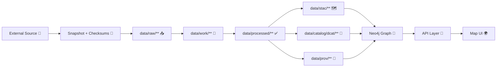

# 🗺️ Mapping Notes — `{{dataset_slug}}`


📍 **Location:** `data/external/mappings/{{dataset_slug}}/attachments/notes/README.md`  
🎯 **Goal:** Capture *decision-grade* notes + evidence references for mapping an external dataset into KFM (schema + entity + geometry + time + governance).

> ⚠️ **Non‑negotiable:** These notes should make the dataset reproducible and reviewable — “map behind the map” style. If it can’t be defended with evidence, it doesn’t ship.

---

## 🔗 Quick Links

- 📦 Mapping root: `data/external/mappings/{{dataset_slug}}/`
- 📎 Attachments root: `data/external/mappings/{{dataset_slug}}/attachments/`
- 🧾 KFM catalog standards (repo-root links):
  - STAC profile: `/docs/standards/KFM_STAC_PROFILE.md`
  - DCAT profile: `/docs/standards/KFM_DCAT_PROFILE.md`
  - PROV profile: `/docs/standards/KFM_PROV_PROFILE.md`
- ⚖ Governance:
  - Ethics: `/docs/governance/ETHICS.md`
  - Sovereignty: `/docs/governance/SOVEREIGNTY.md`

---

## 🧾 What This Folder Is

This `attachments/notes/` folder is the **living notebook** for the dataset mapping:

✅ **Put here**
- 📌 source & license interpretation notes (with evidence references)
- 🧩 schema / entity mapping decisions (what maps to what, and why)
- 🗺️ CRS/projection assumptions & conversions
- 🕰️ time semantics (event time vs publication time vs update time)
- 🧪 QA results summaries + spot-check notes
- 🧠 decision log (date, decision, rationale, evidence)
- 🧷 link-index to attachments (PDFs, screenshots, emails, exports) + checksums

🚫 **Do NOT put here**
- ❌ the actual raw dataset payload (that belongs in canonical `data/raw/**`)
- ❌ processed outputs (that belongs in `data/processed/**`)
- ❌ secrets / credentials / restricted PII
- ❌ “trust me” statements without evidence pointers

---

## 🗂️ Suggested Local Layout

> Your repo may differ — this is a recommended structure for clarity. Adjust to match what exists.

```text
📁 data/external/mappings/{{dataset_slug}}/
├── 📄 README.md                         # (optional) mapping overview at dataset root
├── 📁 mapping/                          # schema/entity mapping specs (YAML/CSV/JSON)
├── 📁 attachments/
│   ├── 📁 sources/                      # PDFs, screenshots, web captures, exports
│   ├── 📁 checksums/                    # sha256 manifests for attachments (recommended)
│   └── 📁 notes/
│       ├── 📄 README.md                 # 👈 you are here
│       ├── 📄 2026-01-29__intake.md      # example: intake notes
│       └── 📄 2026-01-30__qa.md          # example: QA notes
└── 📁 runs/                             # pipeline run logs / metrics / snapshots (optional)
```

---

## 🧭 Mapping at a Glance

Fill this in as soon as possible — it drives governance + pipeline work.

| Field | Value |
|---|---|
| Dataset slug | `{{dataset_slug}}` |
| Human name | `TBD` |
| Source org / publisher | `TBD` |
| Source URL(s) | `TBD` |
| Access date (UTC) | `TBD` |
| License / terms | `TBD` |
| Sensitivity / CARE label | `TBD (Public / Restricted / Tribal Sensitive / etc.)` |
| Update frequency | `TBD (one-time / annual / monthly / daily / streaming)` |
| Geometry type | `TBD (points / lines / polygons / raster / none)` |
| CRS (as delivered) | `TBD (EPSG:xxxx)` |
| Target CRS | `TBD (usually EPSG:4326 unless domain requires otherwise)` |
| Temporal coverage | `TBD` |
| Spatial coverage | `TBD (Kansas statewide? region? counties?)` |
| Primary join keys / IDs | `TBD` |

---

## 🗺️ End‑to‑End Flow



---

## 🧩 Schema Mapping

### 1) Field mapping table (template)

| Source field | Type | Example | Target field | Transform | Notes |
|---|---|---|---|---|---|
| `src_field_name` | string/int/… | `…` | `kfm_field_name` | `trim + titlecase` | why |
|  |  |  |  |  |  |

### 2) Entity mapping (template)

> Use this to explain how rows/features become **KFM entities** (and relationships).

| Source concept | Becomes KFM entity/edge | Matching rule | Confidence | Evidence |
|---|---|---|---|---|
| `…` | `LandParcel` / `HistoricalEvent` / `SurveyRecord` / `…` | `…` | High/Med/Low | `attachments/sources/...#page` |
|  |  |  |  |  |

### 3) Controlled vocab & normalization notes

- 🧾 **Units:** `TBD` → normalize to `TBD`
- 🏷️ **Categories:** `TBD` → map to controlled list: `TBD`
- 🧭 **Place names:** `TBD` strategy (gazetteer? exact string? fuzzy match?)
- 🧷 **IDs:** document stability + collisions + regeneration rules

---

## 🗺️ Geometry, CRS, and Spatial Assumptions

Document *exactly* what you received and what you changed.

- **Source CRS:** `EPSG:????` (datum? units?)
- **Target CRS:** `EPSG:4326` (or `TBD`)
- **Geometry validity rules:**  
  - [ ] no self-intersections  
  - [ ] polygons closed  
  - [ ] null/empty geometries handled  
  - [ ] multiparts normalized (if needed)

### CRS conversion notes
- Tooling: `gdal`, `geopandas`, `QGIS`, `TBD`
- Operation: `reproject`, `axis-order checks`, `precision rounding`, `TBD`

### Georeferencing / digitization (if applicable)
- Control points source: `TBD`
- RMS error: `TBD`
- Known distortions: `TBD`

---

## 🕰️ Time Semantics

Be explicit about what each date/time means.

- **Event time** (when the thing happened): `TBD`
- **Observation time** (when measured): `TBD`
- **Publication time** (when dataset released): `TBD`
- **Ingestion/run time** (when pipeline ran): `TBD`

✅ Recommended: store both “as-of” and “valid-time” fields when relevant.

---

## 🔁 Transformations & Rules

List transformations in the order they occur (and keep it deterministic).

1. **Parse / clean**: `TBD`
2. **Normalize units**: `TBD`
3. **Reproject**: `TBD`
4. **Derivations** (new columns): `TBD`
5. **Join / enrich** (external lookups): `TBD`
6. **Deduplicate**: `TBD`
7. **Output**: `TBD (GeoJSON/Parquet/COG/MBTiles/etc.)`

> 🧠 Tip: if a transformation changes semantics, add a **Decision Log** entry below.

---

## 🧪 QA / Validation

### Required checks (baseline)

- [ ] Row/feature counts recorded (before/after)
- [ ] Null-rate summary for key fields
- [ ] Duplicate ID checks (source + target)
- [ ] Geometry validity check results captured
- [ ] Bounding box sanity check (Kansas?)
- [ ] Spot-check 10–20 samples against source evidence
- [ ] License + attribution verified & recorded
- [ ] Sensitivity / CARE reviewed (if relevant)

### QA results (fill-in)

| Date | Run ID | Records in | Records out | Valid geom % | Notes | Evidence |
|---|---|---:|---:|---:|---|---|
| `YYYY-MM-DD` | `run_...` | 0 | 0 | 0% | `TBD` | `attachments/sources/...` |

---

## 📦 Required “Boundary Artifacts” Checklist

These are the **publish gates** before downstream use.

- [ ] 🗺️ **STAC** Collection + Items created and linked to assets  
- [ ] 🧾 **DCAT** Dataset entry created (license, keywords, distributions)  
- [ ] 🔗 **PROV** lineage bundle created (inputs️raw → work → processed, agents, params, timestamps)

**Where they usually live (repo-root):**
- `/data/stac/collections/`
- `/data/stac/items/`
- `/data/catalog/dcat/`
- `/data/prov/`

---

## 📎 Attachments Index

> Keep this table updated. Treat attachments like evidence artifacts: stable names + checksums.

**Suggested naming:**  
`YYYY-MM-DD__source__short_desc__v01.ext`

| File | What it is | Origin | License | Checksum | Notes |
|---|---|---|---|---|---|
| `TBD.pdf` | `TBD` | `TBD` | `TBD` | `sha256:TBD` | `TBD` |

---

## 🧠 Decision Log

> Decisions should be timestamped, minimal, and evidence-linked.

| Date | Decision | Rationale | Impact | Evidence |
|---|---|---|---|---|
| `YYYY-MM-DD` | `TBD` | `TBD` | `TBD` | `attachments/sources/...#page` |

---

## ⚠️ Known Issues / Caveats

- `TBD`
- `TBD`

---

## ✅ Definition of Done (for this mapping)

- [ ] Dataset summary table complete  
- [ ] Source snapshots + checksums captured  
- [ ] License/terms recorded (human-readable + machine-ready if possible)  
- [ ] Field/entity mapping documented  
- [ ] CRS/time semantics documented  
- [ ] Deterministic transformation steps listed  
- [ ] QA checks run + results recorded  
- [ ] STAC/DCAT/PROV produced + validated  
- [ ] Governance/sensitivity review completed (if triggered)  

---

## 🏷️ Changelog

- `v0.1.0` — Initial notes scaffold
- `v0.1.1` — `TBD`

---

## 🙋 Ownership

- **Mapping steward:** `@TBD`
- **Reviewer:** `@TBD`
- **Governance contact:** `@TBD`

