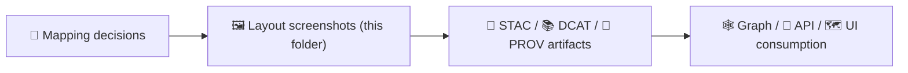

# 📸 Layout Screenshot Attachments (Template)


> **Path:** `data/external/mappings/<dataset_slug>/attachments/screenshots/layouts/`  
> **Dataset slug:** `<dataset_slug>` *(replace with the actual dataset folder name in your repo)*

This folder stores **layout-focused screenshots** that support **reproducible mapping decisions** (STAC/DCAT/PROV), georeferencing/digitization, and consistent UI cartography. 🧭🗺️

---

## 🧩 Folder contract

✅ **This folder is for:** small, human-readable images that capture *how the source presents the dataset* (map sheet layout, legend, title block, portal preview, etc.).  
🚫 **This folder is not for:** full-resolution scans, raw rasters, source downloads, or processed outputs.

> ⚠️ Rule of thumb: if it’s “data you analyze,” it probably doesn’t belong here. If it’s “evidence of what you saw / why you mapped it that way,” it belongs here.

---

## ✅ What belongs in `layouts/`

Use this as a guideline (not a straightjacket):

| Category | What it captures | Why it matters |
|---|---|---|
| 🗺️ **Full layout** | Whole map sheet / full web map viewport | Context + extents + “what exists” |
| 🧾 **Legend** | Legend panel / symbology / color ramps | Styling parity + classification notes |
| 🏷️ **Title block** | Map title, author/publisher, date, revision | Temporal metadata + attribution |
| 📐 **Scale & north** | Scale bar, north arrow, coordinate grid ticks | Georeferencing + measurement sanity |
| 🧭 **Insets / index** | Inset maps, index grids, locator maps | Helps interpret coverage & indexing |
| 🧩 **Callouts** | Any “fine print” notes on the layout | CRS hints, datum notes, caveats |

---

## 🧱 File naming conventions

Keep names **sortable**, **portable**, and **diff-friendly**.

### Recommended pattern (simple + consistent)
`<order>__<subject>__<detail>__v<NN>.<ext>`

**Examples**
- `010__map-sheet__full-layout__v01.png`
- `020__legend__symbology__v01.png`
- `030__title-block__publication-date__v01.png`
- `040__inset__index-grid__v01.png`

### Naming rules
- Use **3-digit order** (`010`, `020`, …) so files stay in narrative order.
- Use **kebab-case** words (`title-block`, not `Title Block`).
- Avoid spaces, emojis, or special characters in filenames.
- If you recapture, bump the version: `v01 → v02` (don’t overwrite without reason).

---

## 📝 Optional sidecar metadata (recommended)

If a screenshot is used as **evidence** for a mapping decision (license, temporal range, publisher, etc.), add a small sidecar file with the **same basename**:

- `020__legend__symbology__v01.png`
- `020__legend__symbology__v01.yml`

**Sidecar template (YAML)**
```yaml
capture:
  date: "YYYY-MM-DD"
  tool: "browser|qgis|arcgis-pro|other"
  operator: "<github_handle_or_name>"

source:
  url: "https://example.com/dataset/page"
  title: "Source page title (optional)"
  accessed: "YYYY-MM-DD"
  license_hint: "public-domain|cc-by|restricted|unknown"

context:
  purpose: "Why this screenshot exists (1 sentence)"
  mapping_notes:
    - "What decision it supports (e.g., 'Temporal coverage states 1870–1872')"
    - "Any caveat or ambiguity"

redaction:
  contains_pii: false
  notes: ""
```

> 💡 Sidecars are tiny, but they dramatically improve auditability later.

---

## 🔗 How to reference screenshots from mapping docs

When writing or updating mapping docs (within `data/external/mappings/<dataset_slug>/...`), embed screenshots with **relative paths** and **meaningful alt text**:

```md


*Figure: Source legend captured on YYYY-MM-DD (see sidecar for URL + context).*
```

**Best practice:** Every screenshot should be referenced at least once in:
- a mapping README / mapping notes, or
- a STAC/DCAT/PROV decision note, or
- a PR description that introduces the mapping.

If it’s not referenced anywhere, it’s likely clutter. 🧹

---

## 📸 Capture checklist

Before committing screenshots, verify:

- [ ] **Readable at 100% zoom** (no tiny illegible text).
- [ ] **Cropped to the relevant UI/layout** (avoid huge empty margins).
- [ ] **No sensitive info** (accounts, emails, tokens, browser bookmarks).
- [ ] **Source context preserved** (include title/legend/scale when relevant).
- [ ] **Versioned** (`v01`, `v02`, …) if recaptured.

---

## 🗜️ Formats & size guidance

**Preferred formats**
- **PNG** ✅ for UI/labels/linework (crisp text)
- **JPG** ✅ for photo-like imagery (smaller)
- **SVG** ✅ for diagrams you *author* (not screenshots)

**Keep repo weight sane**
- Aim for **< 1–2 MB** per screenshot when possible.
- If something is inherently huge, consider:
  - resizing to a readable but reasonable width (e.g., 1600–2400px), and/or
  - storing externally and committing only a **reference + checksum** elsewhere.

---

## 🧾 Attribution & licensing notes

Screenshots may include copyrighted UI or map content. Treat them as **documentation evidence**:
- Keep only what’s needed for reproducibility.
- Add attribution in captions when appropriate.
- If redistribution is questionable, store **only metadata + link** (and avoid committing the image).

---

## 🗂️ Example folder layout

```text
📁 data/
└─ 📁 external/
   └─ 📁 mappings/
      └─ 📁 <dataset_slug>/                              🧩 dataset mapping + evidence bundle
         └─ 📁 attachments/
            └─ 📁 screenshots/
               └─ 📁 layouts/                            🖼️ layout evidence (map sheets, legends, title blocks)
                  ├─ 📄 README.md                         👈 you are here (naming + capture rules + citations)
                  ├─ 🖼️ 010__map-sheet__full-layout__v01.png        🗺️ full map-sheet layout capture
                  ├─ 🖼️ 020__legend__symbology__v01.png             🎛️ legend/symbology capture
                  ├─ 🧾 020__legend__symbology__v01.yml             🧩 metadata sidecar (what/where/how captured)
                  └─ 🖼️ 030__title-block__publication-date__v01.png 🏷️ title block + publication date capture
```

---

## 🧠 Why this exists (traceability)



Keeping “what we saw” close to “what we mapped” makes the project easier to review, maintain, and defend later. ✅

---

## 🔄 Maintenance

- Remove stale screenshots when a dataset mapping is superseded.
- Prefer updating existing sequences (`010`, `020`, `030`) over adding random extras.
- When in doubt: **add a sidecar + a short caption** and you’re covered.

---

