# 🖼️ UI Screenshot Attachments — `<dataset_slug>`


This folder holds **UI screenshots** used as *visual evidence* for the mapping package at:

```text
data/external/mappings/<dataset_slug>/
└─ attachments/screenshots/ui/
```

These screenshots help reviewers (and future us) verify that:
- the dataset is presented correctly in the **Map UI**,
- critical cartographic affordances (legend/scale/coords) exist,
- and provenance + redaction expectations are visible in the interface.

> [!IMPORTANT]
> Screenshots here are **documentation artifacts**, not “pretty pictures.” Keep them **small**, **clear**, **repeatable**, and **safe** (no sensitive data leaks).

---

## 🧭 Where this fits in the KFM pipeline

KFM’s pipeline is ordered. UI is downstream of data + metadata + API contracts.

```mermaid
flowchart LR
  subgraph Data
    A["Raw Sources"] --> B["ETL + Normalization"]
    B --> C["STAC Items + Collections"]
    C --> D["DCAT Dataset Views"]
    C --> E["PROV Lineage Bundles"]
  end

  C --> G["Graph (references back to catalogs)"]
  G --> H["API Layer (contracts + redaction)"]
  H --> I["Map UI — React · MapLibre · (optional) Cesium"]
  I --> J["Story Nodes (governed narratives)"]
  J --> K["Focus Mode (provenance-linked context bundle)"]
```



✅ **Implication for screenshots:** capture proof that the UI is consuming **governed outputs** (via API) and exposing **provenance hooks** (legend/info/citations), rather than “mystery data.”

---

## 📦 What belongs here

### ✅ Yes
- UI screens that demonstrate:
  - 🗺️ **Map canvas** (base + overlays)
  - 🧩 **Layer panel / registry output**
  - 🧾 **Legend + symbology**
  - 🧷 **Provenance affordances** (e.g., “Source”, “Dataset”, “STAC/DCAT/PROV” links, citations)
  - 🧭 **Navigation aids** (scale bar, north arrow / orientation indicator, coordinate readout, grid overlays)
  - 🕰️ **Time controls** (timeline / time slider / time filters)
  - 🧪 **Error + empty states** (missing tiles, no results, unauthorized)
  - 🛡️ **Redaction behaviors** (blur/aggregation/hidden coords where required)

### ❌ No
- Raw data exports (GeoJSON, CSV, tiles, rasters) — those belong in data staging/processed/catalog flows.
- Screenshots containing secrets, personal data, restricted coordinates, or anything that violates sovereignty/governance rules.

---

## 🗂️ Suggested sub-structure

You *can* keep screenshots flat, but subfolders make larger sets easier to browse:

```text
ui/
├─ README.md
├─ map/
│  ├─ ...
├─ focus-mode/
│  ├─ ...
├─ layers/
│  ├─ ...
└─ states/
   ├─ ...
```

---

## 🧾 Minimum recommended screenshot set (per dataset)

| # | Screenshot | Why it matters |
|---:|-----------|----------------|
| 01 | **Map overview** (default extent) | Baseline rendering + visual sanity check |
| 02 | **Legend open** | Confirms symbology + classification readability |
| 03 | **Layer info / provenance panel** | Confirms “evidence-first” UI affordances |
| 04 | **Coordinates / grid overlay** | Confirms navigation + coordinate UX |
| 05 | **Time control** (if applicable) | Confirms time semantics are exposed correctly |
| 06 | **Redaction example** (if applicable) | Confirms safety constraints are visible + enforced |

> [!TIP]
> If a row is not applicable (e.g., no time dimension), still create an “N/A note” in the optional manifest so reviewers don’t wonder what’s missing.

---

## 🧰 Capture standards

### 📐 Resolution & consistency
- Prefer **1920×1080** (or the project’s standard viewport) for comparability.
- Keep UI chrome consistent:
  - same theme (light/dark) per series
  - same zoom-level where possible
  - same basemap style if your goal is overlay verification

### 🗺️ Cartographic essentials (when the map is the subject)
When relevant, screenshots should make it easy to see:
- **scale** (scale bar or stated scale),
- **legend** (symbols/categories),
- **direction/orientation** (north arrow or equivalent),
- **sources / attribution** (in UI or nearby panel),
- **coordinate system / coordinates** (UI readout / grid overlay).  

If any of these are intentionally absent, note that in the optional manifest.

### 🛡️ Safety & governance
- Do **not** capture sensitive information (tokens, user emails, private addresses, restricted site coordinates).
- If the dataset requires obfuscation, screenshot the **obfuscated** view *and* the **policy indicator** (e.g., banner, label, or “restricted” badge).
- Prefer screenshots captured from **seed/demo accounts** and **non-sensitive fixtures**.

### 🧼 File format
- ✅ PNG (crisp UI) or WebP (smaller)
- ❌ JPEG (UI text artifacts) unless there’s a specific reason
- Keep files reasonably small (compress where possible without making text unreadable).

---

## 🏷️ Naming convention

Use stable, sortable, no-spaces names. Recommended pattern:

```text
<nn>__ui__<area>__<subject>__<state>__<theme>__<YYYY-MM-DD>__<ref>.<png|webp>
```

**Where**
- `<nn>`: 2-digit order (01, 02, 03…)
- `<area>`: `map` | `layers` | `focus` | `search` | `settings` | `states`
- `<subject>`: short descriptor (`overview`, `legend`, `provenance`, `mgrs-grid`, `timeline`)
- `<state>`: `default` | `open` | `selected` | `hover` | `error` | `empty`
- `<theme>`: `light` | `dark`
- `<ref>`: short build reference (commit short-sha, tag, or “local”)

**Examples**
```text
01__ui__map__overview__default__light__2026-01-29__a1b2c3d.png
02__ui__map__legend__open__light__2026-01-29__a1b2c3d.webp
03__ui__layers__provenance__open__light__2026-01-29__a1b2c3d.png
06__ui__states__redaction__default__light__2026-01-29__a1b2c3d.png
```

### ✏️ Annotated variants
If you add callouts/boxes/arrows, suffix **`__annotated`**:

```text
03__ui__layers__provenance__open__light__2026-01-29__a1b2c3d__annotated.png
```

---

## 🧾 Optional: Screenshot manifest (recommended)

If this folder grows beyond a handful of images, add:

- `index.yml` (or `index.json`) alongside this README.

Suggested `index.yml` shape:

```yaml
# index.yml — UI screenshot manifest (optional but recommended)
dataset_slug: "<dataset_slug>"
captures:
  - file: "01__ui__map__overview__default__light__2026-01-29__a1b2c3d.png"
    purpose: "Baseline map rendering for dataset overlay"
    route: "/map?dataset=<dataset_slug>"
    ui_ref: "a1b2c3d"
    data_refs:
      dcat_dataset_id: "dcat:<id-or-slug>"
      stac_collection: "stac:collections/<id>"
    notes: "Zoom 7; basemap=terrain; overlay=on"
  - file: "03__ui__layers__provenance__open__light__2026-01-29__a1b2c3d.png"
    purpose: "Provenance affordance visible in layer info panel"
    route: "/map?layer=<layer_id>"
    ui_ref: "a1b2c3d"
    notes: "Info panel shows citations + source links"
```

---

## 🔗 Using screenshots in docs

Embed screenshots with meaningful alt text:

```md

```

If you reference screenshots from higher-level mapping docs, prefer relative paths and keep them stable (renames break links).

> [!NOTE]
> If a screenshot is decorative, you can use empty alt text. If it carries meaning, describe it briefly.

---

## ✅ Definition of Done (when adding/updating screenshots)

- [ ] Screenshot(s) match naming convention (sortable, no spaces)
- [ ] Captured at standard resolution (or noted why not)
- [ ] Legend + provenance affordances captured (when applicable)
- [ ] No sensitive info / secrets / restricted coordinates exposed
- [ ] File size is reasonable (compressed if needed)
- [ ] Any new screenshots are referenced from the relevant mapping doc
- [ ] (Optional) `index.yml` updated with route + refs

---

## 🧠 Quick reminder: UI obligations (why we’re strict)

If you add/modify UI layers for this dataset, screenshots should make it obvious that:
- the layer has an **info/legend path** that references its **data source**,
- and the UI behavior respects **redaction + CARE** expectations.
