# 📦 Source Attachments — `<dataset_slug>`

<p align="left">
  
  
  
  
</p>

**Path:** `data/external/mappings/<dataset_slug>/attachments/source/` 📁

> ⚠️ **Read-only evidence zone.** Files in `attachments/source/` should represent the upstream source **as retrieved**.  
> If something changes upstream, **add** a new versioned file + checksum + manifest entry — don’t “silently” overwrite.

---

## 🔎 Quick links
- [🎯 Purpose](#-purpose)
- [🧭 Where this fits in the KFM pipeline](#-where-this-fits-in-the-kfm-pipeline)
- [🗂️ What belongs here](#️-what-belongs-here)
- [📁 Recommended file layout](#-recommended-file-layout)
- [🧾 Source manifest](#-source-manifest)
- [🔐 Checksums & integrity verification](#-checksums--integrity-verification)
- [💾 Large files & restricted redistribution](#-large-files--restricted-redistribution)
- [♻️ Updating / refreshing the upstream source](#️-updating--refreshing-the-upstream-source)
- [🧰 Downstream mapping + pipeline hooks](#-downstream-mapping--pipeline-hooks)
- [✅ Review checklist](#-review-checklist-definition-of-done)
- [🕰️ Change log](#️-change-log-human-notes)
- [🙋 Ownership](#-ownership)

---

## 🎯 Purpose

This folder contains the authoritative “source-of-truth” attachments for the dataset mapping **`<dataset_slug>`** — the PDFs, CSVs, shapefiles, web snapshots, license text, etc. used to produce KFM-ready outputs.

KFM is **provenance-first**: this folder exists so every dataset layer can be **audited**, **reproduced**, and **reviewed** (the “map behind the map” 🗺️).

---

## 🧭 Where this fits in the KFM pipeline

KFM enforces a strict ordering: **Source → ETL → Processed → Catalogs (STAC/DCAT/PROV) → Graph/API → UI/Story**.  
No stage should bypass the prior stage’s artifacts ✅

```mermaid
flowchart LR
  A["📥 Source Attachments — attachments/source/"] --> B["🧰 ETL / Normalization — src/pipelines/..."]
  B --> C["📦 Processed Outputs — data/processed/..."]
  C --> D["🗺️ STAC + 🧾 DCAT + 🧬 PROV — data/stac · data/catalog/dcat · data/prov"]
  D --> E["🕸️ Graph + 🔌 API — Neo4j + src/server"]
  E --> F["🗺️ Map UI + 📖 Story Nodes — web/ + docs/reports/story_nodes"]
```



---

## 🗂️ What belongs here

✅ **Do store:**
- Original upstream files (**or pointers** for huge binaries)
- License/terms text + attribution requirements
- A **manifest** describing provenance (where it came from, when, how)
- **Checksums** for integrity verification
- “Human notes” explaining oddities (encoding, missing columns, known errors)

🚫 **Do NOT store:**
- Cleaned/normalized/derived data (that belongs in `data/work/` or `data/processed/`)
- Generated tiles, indexes, caches (unless explicitly treated as a *source artifact*)
- Secrets, API keys, tokens, credentials

---

## 📁 Recommended file layout

```text
📁 data/
└─ 📁 external/
   └─ 📁 mappings/
      └─ 📁 <dataset_slug>/                               🧩 dataset mapping + evidence bundle
         └─ 📁 attachments/
            └─ 📁 source/                                 🧾 upstream evidence (license, terms, provenance, snapshots)
               ├─ 📄 README.md                             📘 how to use/cite these attachments
               ├─ 🧾 source_manifest.yml                   ✅ required: provenance + file inventory (what/when/where)
               ├─ 🔐 checksums.sha256                      ✅ required: integrity hashes for every file here
               ├─ 📄 LICENSE.txt                           ✅ required: license text (or a link stub if text unavailable)
               ├─ 📄 TERMS.txt                             ◻️ optional (recommended): terms of use / access notes
               ├─ 📄 CITATION.bib                          ◻️ optional: upstream citation (if provided)
               └─ 📁 snapshots/                            ◻️ optional: HTML/PDF snapshots of landing pages
```

---

## 🧾 Source manifest

Maintain **one manifest entry per upstream artifact**.

### Required fields (minimum)

| Field | Example | Notes |
|---|---|---|
| `dataset_slug` | `kansas_counties_2020` | must match folder slug |
| `source_id` | `us_census_tiger_2020_county` | stable, human-readable |
| `retrieved_at` | `2026-01-29T00:00:00Z` | ISO 8601 |
| `retrieved_by` | `@your-handle` | GitHub handle or name |
| `upstream_url` | `https://...` | landing page or direct download |
| `license` | `Public Domain` | or SPDX identifier if known |
| `files[]` | see below | list of retrieved files |

<details>
<summary>📄 Example <code>source_manifest.yml</code></summary>

```yaml
dataset_slug: "<dataset_slug>"
dataset_name: "<human friendly title>"
domain: "<optional: historical | hydrology | air-quality | ...>"

source:
  source_id: "<source_id>"
  publisher: "<publisher/agency>"
  upstream_url: "<landing_page_or_download_url>"
  retrieved_at: "2026-01-29T00:00:00Z"
  retrieved_by: "<name_or_github_handle>"
  license:
    name: "<license name>"
    url: "<license url (if any)>"
    redistribution: "<allowed | restricted | unknown>"
  citation:
    preferred: "<preferred citation text (if provided)>"
    doi: "<doi if any>"
  notes: |
    <anything weird about the upstream source: encoding, missing fields, known errors>

files:
  - path: "<filename.ext>"
    description: "<what it is>"
    byte_size: <int>
    sha256: "<sha256hex>"
    media_type: "<e.g., text/csv, application/zip>"
    version: "<upstream version string if any>"
    valid_time:
      start: "<YYYY-MM-DD>"
      end: "<YYYY-MM-DD>"
```

</details>

---

## 🔐 Checksums & integrity verification

### Create `checksums.sha256` (recommended)
Linux:
```bash
# Hash only files in this folder (excluding the checksum file itself)
find . -maxdepth 1 -type f ! -name 'checksums.sha256' -exec sha256sum {} \; > checksums.sha256
```

macOS:
```bash
# Uses shasum; output format differs slightly but still verifiable
find . -maxdepth 1 -type f ! -name 'checksums.sha256' -exec shasum -a 256 {} \; > checksums.sha256
```

### Verify integrity (later)
Linux:
```bash
sha256sum -c checksums.sha256
```

macOS:
```bash
shasum -a 256 -c checksums.sha256
```

> 💡 If you store **pointer files** (Git LFS or “download scripts”), checksum the pointer **and** record any remote object hash/ETag/version in the manifest.

---

## 💾 Large files & restricted redistribution

### Large files (size/ops reality check)
- Prefer **Git LFS** for large binaries, or
- Store a **pointer + deterministic fetch script**, and record **checksum(s)** and **source URL** in `source_manifest.yml`

### Restricted redistribution (license/terms)
If the upstream terms prohibit redistribution:
- **Do not** commit the raw file itself
- **Do** commit:
  - `source_manifest.yml` (with retrieval instructions)
  - `checksums.sha256` (if you can checksum locally)
  - a `FETCH.md` (or script) describing how authorized users can obtain it

---

## ♻️ Updating / refreshing the upstream source

When the upstream source changes (new release, correction, revised license, etc.):

1. **Add** the new upstream file(s) into this folder  
   - Prefer versioned filenames: `*_vYYYYMMDD.*` or `*_revN.*`
2. Update `source_manifest.yml` (new `retrieved_at`, version notes, file entries)
3. Update `checksums.sha256`
4. Run the pipeline that consumes this source (see next section)
5. Confirm downstream catalogs were regenerated (STAC/DCAT/PROV) and link them below
6. Record a short note in **Change Log** (human-readable)

---

## 🧰 Downstream mapping + pipeline hooks

Fill these in so reviewers can jump straight to “how this becomes a map layer” 🧭

- 🔧 Pipeline entrypoint: `src/pipelines/<...>/<dataset_slug>.py`
- 🗺️ Layer/mapping config: `data/external/mappings/<dataset_slug>/mapping.yml`
- 📦 Output dataset(s): `data/processed/<domain>/<dataset_slug>/...`
- 🧬 Provenance bundle: `data/prov/<run_id>__<dataset_slug>.*`
- 🗺️ STAC:
  - Collection: `data/stac/collections/<collection_id>.json`
  - Items: `data/stac/items/<item_id>.json`
- 🧾 DCAT:
  - Dataset: `data/catalog/dcat/<dataset_slug>.jsonld`

---

## ✅ Review checklist (Definition of Done)

Before marking this source “ready” ✅

- [ ] Source files present (or pointer stubs)
- [ ] `source_manifest.yml` complete
- [ ] `checksums.sha256` verifies cleanly
- [ ] License/terms captured and redistribution is compliant
- [ ] Any sensitive fields assessed (PII / precise locations / restricted cultural knowledge)
- [ ] Pipeline run is repeatable (idempotent)
- [ ] STAC + DCAT + PROV artifacts created/updated
- [ ] Mapping layer renders correctly in the UI

---

## 🕰️ Change log (human notes)

> Git history is the canonical record; this is for quick scanning 👀

- **YYYY-MM-DD** — Initial import from `<source>`
- **YYYY-MM-DD** — Updated to upstream release `<version>` (what changed?)

---

## 🙋 Ownership

- Steward: `<name or @handle>`
- Review gate: `<domain steward | governance | TBD>`

