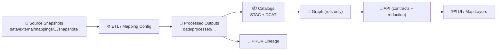

# 🧊 Source Snapshots — `<dataset_slug>`


> [!IMPORTANT]
> **This folder is “write-once evidence.”** Treat everything here as *raw source artifacts* used to support ingestion, mapping, audits, and reproducibility.  
> ✅ Add new snapshots when sources change. ❌ Never “quietly” edit existing snapshot files.

---

## 🧭 What is this folder?

This directory stores **immutable snapshots of upstream source materials** used by the mapping dataset at:

📁 `data/external/mappings/<dataset_slug>/attachments/source/snapshots/`

Think of this as *the map behind the map* 🗺️: the preserved “original evidence” that allows anyone to:

- 🔁 **Reproduce** any downstream transformation deterministically  
- 🔍 **Audit** where a field, geometry, boundary, or classification came from  
- 🧾 **Verify licensing** and attribution for every upstream artifact  
- 🧬 **Support provenance** (STAC/DCAT/PROV) so the system stays traceable end-to-end

---

## ✅ Snapshot contract (non‑negotiables)

### 🧊 Immutability
- Snapshots are **read-only** after commit.
- If the upstream source updates, **add a new snapshot** instead of modifying an old one.

### 🧾 License + attribution required
- Every snapshot must include (or point to) **license terms** and **source attribution**.
- If the license is unclear → **do not ingest**. (Governance should fail-closed 🚫)

### 🔐 Integrity & repeatability
- Include a checksum file (recommended: **SHA-256**) so the exact bytes can be verified later.
- Prefer storing the **exact downloaded artifact** (original zip, original PDF, etc.).

### 🧠 Provenance linkage
- Each snapshot should be linkable to downstream metadata artifacts:
  - **STAC** (assets/items)  
  - **DCAT** (dataset/distribution discovery)  
  - **PROV** (lineage: raw → processed → published)

---

## 🗂️ Recommended layout

You can store snapshots as **subfolders**, one per retrieval event/version:

```text
📁 snapshots/
├─ 📄 README.md
├─ 📁 2026-01-29__<provider>__<artifact>__v1/
│  ├─ 📦 original_download.zip
│  ├─ 🧾 LICENSE.txt
│  ├─ 🔐 checksums.sha256
│  └─ 🧷 snapshot.meta.yml
└─ 📁 2026-03-10__<provider>__<artifact>__v2/
   ├─ 📦 original_download.zip
   ├─ 🧾 LICENSE.txt
   ├─ 🔐 checksums.sha256
   └─ 🧷 snapshot.meta.yml
```

> [!NOTE]
> If a file is too large for normal Git, use **Git LFS** or a **pointer file** (still include checksum + metadata in-repo).

---

## 🏷️ Naming conventions

### Folder naming (recommended)
`YYYY-MM-DD__<provider>__<artifact>__vN`

Examples:
- `2026-01-29__usgs__3dep_dem_kansas__v1`
- `2026-02-12__kansas_gov__county_boundaries__v3`

### File naming (recommended)
- Keep upstream filenames **as-is** when possible.
- If you must rename, preserve provenance in metadata (`original_filename`, `download_url`, etc.).

---

## 🧷 Snapshot metadata (sidecar)

Include a sidecar file per snapshot (recommended: `snapshot.meta.yml`).

<details>
<summary><strong>📄 Minimal <code>snapshot.meta.yml</code> template</strong></summary>

```yaml
id: "<dataset_slug>__2026-01-29__<provider>__<artifact>__v1"
retrieved_at: "2026-01-29T00:00:00Z"
retrieved_by: "<name_or_service_account>"
source:
  name: "<publisher/provider>"
  url: "<source_download_or_landing_page>"
  upstream_version: "<if-known>"
license:
  spdx: "<SPDX-ID-if-known>"
  file: "LICENSE.txt"
artifacts:
  - path: "original_download.zip"
    sha256: "<sha256>"
notes: |
  What this snapshot contains, why it matters, and any quirks (CRS, missing fields, etc.).
```

</details>

---

## 📋 Snapshot inventory

Keep a lightweight inventory table here (or update it as snapshots are added):

| Snapshot ID | Retrieved | Provider | Artifact | Files | Notes |
|---|---:|---|---|---|---|
| `<dataset_slug>__YYYY-MM-DD__...__v1` | `YYYY-MM-DD` | `<provider>` | `<artifact>` | `original_download.zip` | `<why/what changed>` |

---

## ➕ Adding a new snapshot (checklist)

> [!TIP]
> This is designed to be “copy/paste friendly” for PRs ✅

1. 📥 Download the source artifact(s) from the upstream provider  
2. 📁 Create a new snapshot folder: `YYYY-MM-DD__<provider>__<artifact>__vN/`  
3. 📦 Place the **original** file(s) inside (zip/pdf/csv/etc.)  
4. 🔐 Generate checksums:
   ```bash
   sha256sum * > checksums.sha256
   ```
5. 🧾 Add license text (`LICENSE.txt`) or a license pointer (with terms + URL)  
6. 🧷 Add `snapshot.meta.yml` (see template above)  
7. 🔗 Ensure downstream linkage is possible:
   - the ETL config references this snapshot
   - provenance records can point to it
8. ✅ Commit via PR with a clear message:
   - “Add upstream snapshot for `<dataset_slug>` (YYYY-MM-DD, vN)”

---

## 🔍 Integrity verification

To verify a snapshot later:

```bash
cd data/external/mappings/<dataset_slug>/attachments/source/snapshots/<snapshot_folder>
sha256sum -c checksums.sha256
```

---

## 🧬 Where this fits in the KFM pipeline



**Rule of thumb:** snapshots are the *ground truth inputs*; everything else should be derivable from them.

---

## 🚫 What does *not* belong here

- ❌ “Fixed” versions of source files (that’s processed/work output)  
- ❌ Outputs produced by scripts/pipelines (belongs in `data/processed/` or `data/work/`)  
- ❌ Temporary scratch files, exports, cache, notebooks  
- ❌ Anything without license clarity, or with restricted distribution terms

---

## 🔗 Related (expected) sibling artifacts

Depending on how `<dataset_slug>` is wired, you should expect to see **downstream** artifacts elsewhere, e.g.:

- 📁 `data/work/<domain>/...` (intermediate results)
- 📁 `data/processed/<domain>/...` (final data products)
- 📁 `data/stac/collections/` + `data/stac/items/` (asset metadata)
- 📁 `data/catalog/dcat/` (dataset discovery metadata)
- 📁 `data/prov/` (lineage bundles)

> [!NOTE]
> This folder is intentionally boring. 🧊  
> Boring = trustworthy = reproducible.

---
