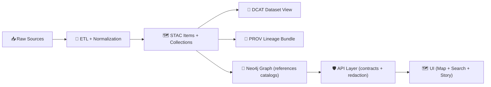

# 🧾 DCAT Mapping Plan — `<dataset_slug>`


This document is the **source-of-truth plan** for how the external dataset **`<dataset_slug>`** will be represented as a **DCAT Dataset entry** in the KFM catalog, including **distribution links** that connect DCAT → STAC → actual data, plus explicit pointers into **PROV lineage**. 🧬

> ✅ Goal: make this dataset **discoverable, citable, and traceable** end-to-end (raw ➜ processed ➜ metadata ➜ graph/API/UI).  
> 🚫 Anti-goal: inventing ad-hoc metadata fields outside the governed KFM profiles.

---

## 🗂️ Where this plan lives

**File path (this doc):**
- `data/external/mappings/<dataset_slug>/dcat.plan.md`

**Recommended sibling mapping docs (optional but encouraged):**
- `data/external/mappings/<dataset_slug>/stac.plan.md`
- `data/external/mappings/<dataset_slug>/prov.plan.md`
- `data/external/mappings/<dataset_slug>/schema.plan.md` (source → internal schema mapping)

**Expected domain layout (reference):**
```text
📁 data/
└─ 📁 external/
   ├─ 📁 raw/                                🧾 immutable source snapshots (read-only / never overwrite)
   ├─ 📁 work/                               🧪 ingestion staging + intermediate artifacts (safe to prune)
   ├─ 📁 processed/                          ✅ promoted external outputs (ready for DB/API/UI)
   ├─ 📁 mappings/                           🧩 mapping packs + dataset publishing plans
   │  └─ 📁 <dataset_slug>/                  🏷️ dataset-specific mapping + plan bundle
   │     ├─ 📄 dcat.plan.md                  👈 you are here (DCAT discovery plan)
   │     ├─ 📄 stac.plan.md                  ◻️ optional (recommended): STAC collections/items plan
   │     └─ 📄 prov.plan.md                  ◻️ optional (recommended): provenance/receipt plan
   └─ 📄 README.md                           📘 external lane overview + rules of the road
```

---

## 🧭 KFM pipeline context (why DCAT is “boundary metadata”)



---

## 🎯 Scope

| ✅ In scope | 🚫 Out of scope |
|---|---|
| Mapping *dataset-level* metadata into **DCAT** | Implementing ETL itself |
| Defining **distributions** (download/API/STAC) | Designing the UI |
| Defining required **cross-links** (DCAT → STAC → data, DCAT/PROV version links) | Defining new KFM standards (use standards process) |
| Validation checks to ensure conformance | Publishing to external catalogs (data.gov, CKAN) *(future)* |

---

## 📥 Inputs we must gather (source-of-truth)

Fill these before writing any DCAT JSON-LD.

### 1) Dataset identity & stewardship
- **Source name:** `<provider_org_or_program>`
- **Dataset title (human):** `<title>`
- **Dataset slug (machine):** `<dataset_slug>`
- **Publisher / owning org:** `<publisher>`
- **Point of contact:** `<name/email/role>`
- **Maintainer (KFM):** `<github_handle_or_team>`

### 2) Source access & terms
- **Landing page:** `<url>`
- **Direct download(s):** `<url(s)>` *(if any)*
- **API endpoint(s):** `<url(s)>` *(if any)*
- **License / use policy:** `<license_identifier + link>`
- **Attribution requirement:** `<yes/no + details>`
- **Access restrictions:** `<none|registration|token|sensitive>`  
  - If restricted: document the enforcement plan at the API boundary (never UI-direct).

### 3) Spatial + temporal + thematic coverage
- **Spatial extent:** `<bbox/geometry + CRS>`
- **Temporal extent:** `<start/end or single date>`
- **Update cadence:** `<annual|monthly|irregular|one-time>`
- **Themes / keywords:** `<controlled terms + free keywords>`

### 4) Processing outputs (what DCAT will actually distribute)
- **Processed artifact(s):** `data/external/processed/<dataset_slug>/...`
- **Preferred formats:** `<geojson|gpkg|parquet|tif|csv|...>`
- **STAC coverage:** `<collection only|collection + items|items per tile/time/...>`
- **PROV bundle path:** `data/prov/<dataset_slug>.prov.json`

---

## 🧱 DCAT target (what we will produce)

### Output file
- `data/catalog/dcat/<dataset_slug>.jsonld`

> Optional: also emit Turtle as a secondary artifact if/when needed:  
> `data/catalog/dcat/<dataset_slug>.ttl`

### DCAT object model (minimum + KFM extensions)

**DCAT Dataset**
- **Must** be a `dcat:Dataset`
- **Must** have: title, description, license, keywords, and at least one distribution
- **Should** include: publisher, contact point, spatial + temporal coverage, issued/modified

**DCAT Distributions**
- Each distribution is a `dcat:Distribution` that points to one of:
  - ✅ a STAC Collection/Item (best for geospatial discovery), *or*
  - ✅ the underlying processed data artifact (download), *or*
  - ✅ a governed API endpoint (if the data is served, not shipped)

---

## 🧩 Required fields checklist (fill-in worksheet)

> Treat this as the “definition of completeness” for the first DCAT iteration. ✅

| Category | DCAT / DCTerms field | Required? | Source of truth | Notes |
|---|---:|:---:|---|---|
| Identifier | `@id` / `dct:identifier` | ✅ | KFM | Stable ID strategy documented below |
| Title | `dct:title` | ✅ | Source + KFM | Human-readable |
| Description | `dct:description` | ✅ | Source + KFM | Include purpose + coverage + caveats |
| Keywords | `dcat:keyword` | ✅ | KFM taxonomy + source | Prefer controlled terms + a few free keywords |
| License | `dct:license` | ✅ | Source | Must be explicit |
| Publisher | `dct:publisher` | ⭐ | Source | Org or entity |
| Contact | `dcat:contactPoint` | ⭐ | Source/KFM | Email/role |
| Landing page | `dcat:landingPage` | ⭐ | Source/KFM | Human-facing |
| Themes | `dcat:theme` | ⭐ | KFM | Use KFM theme taxonomy when available |
| Spatial coverage | `dct:spatial` | ⭐ | STAC + source | Reuse bbox/geometry logic where possible |
| Temporal coverage | `dct:temporal` | ⭐ | STAC + source | Start/end |
| Issued | `dct:issued` | ⭐ | Source/KFM | First publish |
| Modified | `dct:modified` | ⭐ | KFM | Last update (pipeline run) |
| Frequency | `dct:accrualPeriodicity` | ⭐ | Source/KFM | |
| Distributions | `dcat:distribution` | ✅ | KFM | See distribution plan below |
| Provenance link | *(KFM extension or `dct:provenance`)* | ⭐ | PROV | Must point to `data/prov/...` |

Legend: ✅ = required for merge, ⭐ = strongly recommended

---

## 📤 Distribution plan (DCAT → STAC/data/API)

Define **every** distribution we plan to publish from DCAT.

### Distribution matrix

| Dist ID | Type | Points to | Path/URL | Format / mediaType | Auth? | Notes |
|---|---|---|---|---|---:|---|
| `<dataset_slug>-stac-collection` | STAC | Collection | `data/stac/collections/<dataset_slug>.json` | `application/json` | No | Primary discovery link |
| `<dataset_slug>-stac-items` | STAC | Items index or glob | `data/stac/items/<dataset_slug>/...` | `application/json` | No | Optional if items are numerous |
| `<dataset_slug>-download-01` | Download | Data artifact | `data/external/processed/<dataset_slug>/...` | `<mediaType>` | No | Use stable artifact naming |
| `<dataset_slug>-api-01` | API | Endpoint | `<https://.../api/...>` | `application/json` | Maybe | Must be governed (no UI direct) |

**Rules of thumb 🧠**
- If it’s geospatial and has itemized assets ➜ prefer **STAC** as the main distribution.
- If it’s tabular / non-spatial ➜ still okay to include a STAC Collection for consistency, but the main distribution may be a download/API.
- If a distribution is **too large** for Git, use a reference strategy (hash + fetch script) and ensure DCAT points to a stable access URL + checksum.

---

## 🔗 Cross-layer linking requirements

### DCAT → STAC/data
- DCAT distributions must include links that resolve to:
  - the STAC record(s), and/or
  - the underlying processed data resources

### DCAT ↔ PROV
- DCAT must point to the dataset’s PROV bundle (direct link, or via a governed KFM field).
- PROV must capture raw inputs ➜ work steps ➜ processed outputs that DCAT distributes.

### Graph references (FYI)
- If/when the dataset is represented in the Neo4j graph, store **references to catalog records** (IDs/URLs), not the payload itself.

---

## 🧬 Versioning plan (dataset-level)

### Version identifier strategy
Pick **one** approach and stick to it:

1) **Semantic dataset versions**  
   - Example: `<dataset_slug> v1`, `v2`, etc.
2) **Date-based dataset versions**  
   - Example: `<dataset_slug> 2026-01`, etc.
3) **Repo commit/tag as authoritative version**  
   - Example: DCAT includes commit hash in provenance metadata and/or a release tag.

### Revision links
When producing a new dataset version:
- DCAT should include a revision link (e.g., `prov:wasRevisionOf`) to the prior dataset version.
- PROV should indicate the activity that derived v2 from v1 (if applicable).

---

## 🧪 Validation & CI gates (definition of “mergeable”)

> Add or update checks until this becomes boring and automatic. ✅

### Required validation checks
- [ ] DCAT JSON-LD is syntactically valid (no broken JSON, no invalid JSON-LD structure)
- [ ] Conforms to `docs/standards/KFM_DCAT_PROFILE.md`
- [ ] All **required** fields present: title, description, license, keywords, ≥1 distribution
- [ ] Every distribution link resolves to a real repo path or a reachable URL
- [ ] If dataset has STAC, DCAT includes distribution link(s) to STAC
- [ ] DCAT includes a provenance pointer (to `data/prov/<dataset_slug>.prov.json` or equivalent)
- [ ] License is explicit (fail-closed if missing)

### Suggested local workflow (placeholder commands)
> Replace these with real repo scripts once they exist.

```bash
# 1) Build/emit DCAT JSON-LD
python pipelines/<dataset_slug>/emit_dcat.py

# 2) Validate metadata profiles
python tools/validate_metadata.py --dataset <dataset_slug>

# 3) Link-check distributions
python tools/check_links.py data/catalog/dcat/<dataset_slug>.jsonld
```

---

## 🧾 Metadata completeness checklist (GIS-friendly)

Use this as a sanity pass before review (helps prevent “thin metadata”). 🧭

- [ ] **Identification**: what is this dataset?
- [ ] **Quality**: known caveats, uncertainty, QA/QC notes
- [ ] **Spatial organization**: features/rasters/tiles? granularity?
- [ ] **Spatial reference**: CRS/projection declared and consistent
- [ ] **Entity & attributes**: schema + units + codebooks
- [ ] **Distribution**: who distributes, how to access, policy
- [ ] **Metadata reference**: who authored the metadata
- [ ] **Citation**: how should this be cited
- [ ] **Temporal**: collection dates + update dates
- [ ] **Contact**: human contact path

---

## ⚖️ Governance, FAIR+CARE, and safety notes

- If the dataset contains sensitive information (locations, people, protected sites, etc.), document:
  - classification level
  - redaction strategy
  - access controls (API boundary enforcement)
  - whether the dataset should be “discoverable but not directly downloadable”
- Ensure license + attribution are unambiguous.
- If the dataset impacts Indigenous data sovereignty or community governance concerns, route through the sovereignty review gate before publication.

---

## ✅ Definition of Done

This plan is **complete** when:

- [ ] All input fields are filled (identity, terms, spatial/temporal coverage, outputs)
- [ ] Distribution matrix is complete and realistic
- [ ] Versioning strategy chosen and documented
- [ ] Validation checklist is achievable and mapped to CI tasks
- [ ] Links to KFM standards are correct (DCAT/STAC/PROV profiles)
- [ ] Governance / licensing / sensitivity considerations are explicit

---

## 📎 Appendix A — DCAT JSON-LD skeleton (template)

<details>
<summary>Click to expand 📦</summary>

```json
{
  "@context": [
    "https://www.w3.org/ns/dcat2.jsonld",
    "https://www.w3.org/ns/prov.jsonld"
  ],
  "@id": "kfm:dataset/<dataset_slug>",
  "@type": "dcat:Dataset",
  "dct:title": "<title>",
  "dct:description": "<description>",
  "dcat:keyword": ["<keyword1>", "<keyword2>"],
  "dct:license": "<license_url_or_identifier>",
  "dct:publisher": {
    "@type": "foaf:Organization",
    "foaf:name": "<publisher_name>"
  },
  "dcat:distribution": [
    {
      "@type": "dcat:Distribution",
      "dct:title": "<dataset_slug> STAC Collection",
      "dcat:accessURL": "data/stac/collections/<dataset_slug>.json",
      "dct:format": "application/json"
    }
  ]
}
```

</details>

---

## 📎 Appendix B — Internal references (do not remove)

- `docs/standards/KFM_DCAT_PROFILE.md`
- `docs/standards/KFM_STAC_PROFILE.md`
- `docs/standards/KFM_PROV_PROFILE.md`
- `docs/governance/ROOT_GOVERNANCE.md`
- `docs/governance/ETHICS.md`
- `docs/governance/SOVEREIGNTY.md`

