# 🧾 Provenance Plan — `{{dataset_slug}}`

   

> [!IMPORTANT]
> **This plan is the “contract” for bringing `{{dataset_slug}}` into KFM.**  
> No dataset is considered “publishable” until **Processed data + STAC + DCAT + PROV** exist and cross-link cleanly.

---

## 🧭 Purpose

This document defines **how `{{dataset_slug}}` will be ingested, transformed, cataloged, and traced** end-to-end so that:

- Every derived output can be traced back to raw evidence 🧬
- Every processing step is reproducible (inputs, parameters, environment, versions) ♻️
- Metadata is **governed** and discoverable (STAC/DCAT) 🔎
- Lineage is explicit (PROV entities ↔ activities ↔ agents) 🧾
- Downstream systems (graph → API → UI → story nodes) consume **only contracted outputs** ✅

---

## 📍 File Location

- **This file:** `data/external/mappings/{{dataset_slug}}/prov.plan.md`

Recommended sibling files in the same folder:

```text
📁 data/external/mappings/{{dataset_slug}}/
├── 🧾 prov.plan.md                # ← you are here
├── 🧩 mapping.spec.yml            # field mapping + transforms (machine-readable)
├── 🧪 qa.rules.yml                # validation rules / expectations
├── 🧷 sources.yml                 # source URLs, access notes, license, attribution
├── 🧰 pipeline.notes.md           # runbook notes (optional)
└── 📄 README.md                   # human summary + quickstart (optional)
```

---

## 🧱 Repo & Artifact Contract

### Canonical flow (dataset-specific)

```mermaid
flowchart LR
  R["📥 Raw (immutable)"] --> W["🧰 Work (intermediate)"]
  W --> P["📦 Processed (publishable)"]
  P --> S["🗂️ STAC Items/Collections"]
  P --> D["📜 DCAT Dataset Entry"]
  P --> V["🧾 PROV Lineage Bundle"]
  S --> G["🧠 Graph (references catalogs)"]
  D --> G
  V --> G
  G --> A["🛰️ API (contracts + redaction)"]
  A --> U["🗺️ UI (Map + Narrative)"]
```



### Required output locations (v13-style)

```text
📁 data/
├── 📁 stac/
│   ├── 📁 collections/
│   └── 📁 items/
├── 📁 catalog/
│   └── 📁 dcat/
├── 📁 prov/
└── 📁 external/
    ├── 📁 raw/
    ├── 📁 work/
    ├── 📁 processed/
    └── 📁 mappings/
```

> [!TIP]
> If your repo still uses a legacy `data/provenance/` folder, keep **one** canonical PROV home (don’t split).

---

## 🚦 Plan Status

- [ ] draft
- [ ] in_progress (ETL started)
- [ ] in_review (metadata + provenance review)
- [ ] approved (ready to publish)
- [ ] published (catalog + downstream integration complete)

---

## 🪪 Dataset Identity

Fill these in **before** writing ETL:

- **Slug (`dataset_slug`):** `{{dataset_slug}}`  
  _Rule of thumb:_ lowercase, hyphenated, stable name; put versions in `dataset_version`, not the slug.
- **Human name:** `{{dataset_title}}`
- **Provider / maintainer:** `{{source_org}}`
- **Primary source URL(s):** `{{source_url_1}}`, `{{source_url_2}}`
- **Access method:** direct download | API | scrape | manual | other
- **Access date (first snapshot):** `{{yyyy-mm-dd}}`
- **Update cadence:** one-time | annual | monthly | weekly | daily | unknown
- **Geography:** Kansas statewide | county | township | multi-state | other
- **Temporal coverage:** `{{start_year}}`–`{{end_year}}` (or “unknown”)
- **Data type:** vector | raster | tabular | text corpus | mixed
- **Primary geometry type:** point | line | polygon | multipolygon | none
- **Sensitive content?** yes | no | unknown
- **KFM target use:** graph enrichment | map layer | analysis artifact | story evidence | other

---

## 📜 License, Attribution, and Governance

### License & usage

- **License name:** `{{license_name}}`
- **License URL:** `{{license_url}}`
- **Attribution text (exact):**  
  `{{attribution_text}}`

### Restrictions / obligations

- [ ] Redistribution allowed?
- [ ] Commercial use allowed?
- [ ] Share-alike required?
- [ ] Derivatives allowed?
- [ ] Attribution required?
- [ ] Takedown / terms compliance plan documented

### Classification (KFM governance)

- **Classification:** public | internal | restricted | confidential
- **Propagation rule:** outputs must not be less restricted than inputs.
- **Ethics / CARE notes (if relevant):** `{{care_notes}}`

> [!WARNING]
> If license/permission is unclear, treat as **blocked** until resolved. Don’t publish “mystery-license” data.

---

## 📥 Source Acquisition Plan

### Source inventory (inputs)

| Source asset | Type | How obtained | Expected format | Expected size | Notes |
|---|---:|---|---|---:|---|
| `{{source_asset_1}}` | raw | `{{api/download/manual}}` | `{{csv/shp/tif/pdf/...}}` | `{{size}}` | `{{notes}}` |
| `{{source_asset_2}}` | raw | `{{...}}` | `{{...}}` | `{{...}}` | `{{...}}` |

### Raw snapshot policy ✅

- Raw data is **write-once** (immutable evidence).  
- Store **exact** upstream downloads (no edits).  
- Record **checksums** and **access timestamps**.

### Raw storage path

- `data/external/raw/{{dataset_slug}}/{{source_snapshot_id}}/…`

Where `source_snapshot_id` is something like:
- `{{yyyy-mm-dd}}` (simple)  
- or `{{provider_version}}__{{yyyy-mm-dd}}` (better)

### Integrity & reproducibility

- [ ] SHA-256 for every raw file (`checksums.sha256`)
- [ ] Record HTTP headers / API params (if available)
- [ ] Save a minimal retrieval script (preferred) OR detailed manual steps

---

## 🧾 PROV Model Plan (W3C PROV)

### What we must capture (minimum viable lineage)

#### Entities (things)
- Raw files (with checksum + source URL)
- Intermediate “work” artifacts (optional but recommended)
- Final processed outputs (publishable)
- Configuration file(s) / parameters
- Environment fingerprints (container tag, pip freeze, GDAL version, etc.)

#### Activities (actions)
- download/snapshot
- extract/unzip/parse
- normalize/clean
- transform CRS / geometry fix
- join/enrich/dedupe
- validate/QA
- export/package
- publish metadata (STAC/DCAT)
- graph build/import (if applicable)

#### Agents (who/what)
- Human operator(s)
- Pipeline script(s)
- Runtime environment (container, CI job)

### Identifier conventions (recommended)

- **Entity IDs:** `entity:external:{{dataset_slug}}:<kind>:<name_or_hash>`
- **Activity IDs:** `activity:etl:external:{{dataset_slug}}:{{run_id}}:<step>`
- **Agent IDs:** `agent:person:<handle>` and `agent:software:<tool>@<version>`

### PROV file naming

- `data/prov/{{dataset_slug}}__{{dataset_version}}__{{run_id}}.prov.json`
  - `dataset_version`: upstream version or KFM release version
  - `run_id`: pipeline run identifier (timestamp or CI run number)

> [!NOTE]
> Keep **one** PROV bundle per pipeline run (best), and optionally a “latest” pointer file.

---

## 🧰 ETL / Transformation Plan

### Staging paths (per this dataset)

- Raw: `data/external/raw/{{dataset_slug}}/…`
- Work: `data/external/work/{{dataset_slug}}/…`
- Processed: `data/external/processed/{{dataset_slug}}/{{dataset_version}}/…`

### Step plan (fill this table)

| Step | Activity ID | Inputs (Entities) | Outputs (Entities) | Tooling | Parameters captured? | QA gate |
|---:|---|---|---|---|---:|---|
| 0 | `activity:download:...` | source URL(s) | raw files | curl/wget/python | ✅ | checksum |
| 1 | `activity:extract:...` | raw archive | extracted files | unzip/7z | ✅ | file count |
| 2 | `activity:parse:...` | extracted | normalized tables | python/pandas | ✅ | schema check |
| 3 | `activity:geo:...` | normalized | valid geometries | GDAL/Shapely | ✅ | geom validity |
| 4 | `activity:export:...` | work outputs | processed outputs | gdal/pyarrow | ✅ | diff + stats |
| 5 | `activity:catalog:...` | processed outputs | STAC/DCAT/PROV | scripts | ✅ | validation |

---

## 🗺️ Spatial Semantics Plan

### Coordinate reference system (CRS)

- **Source CRS:** `{{source_epsg_or_wkt}}`
- **Target CRS for processed outputs:** `{{target_epsg}}`

Rules:
- Always record CRS explicitly where possible.
- If GeoJSON lacks CRS, verify coordinate ranges and document assumptions.

### Geometry rules

- Geometry type expected: `{{Point/LineString/Polygon/...}}`
- Validity requirements:
  - [ ] no self-intersections (if polygons)
  - [ ] closed rings (if polygons)
  - [ ] no empty geometries
  - [ ] no Z/M unless intended (document if 3D)

### Bounds / extent

- Expected bbox: `{{minx, miny, maxx, maxy}}`
- Check that all features fall within the intended region.

---

## 🕰️ Temporal Semantics Plan

Define which time fields are present and how KFM should interpret them:

- **Event/valid time fields:** `{{start_date}}`, `{{end_date}}`
- **Record/transaction time fields:** `{{ingested_at}}`, `{{updated_at}}`
- **Uncertainty:** approx dates? ranges? “circa”? (document encoding)

Rules:
- Use ISO-8601 where possible.
- If only a year is known, decide: `YYYY-01-01` vs explicit “year-only” field. Document it.

---

## 🧩 Field Mapping Plan

### Mapping spec file

- `data/external/mappings/{{dataset_slug}}/mapping.spec.yml`

### Field mapping table (human-readable)

| Source field | Type / units | Example | Target field (KFM) | Transform | Notes |
|---|---|---|---|---|---|
| `{{src_field}}` | `{{type}}` | `{{example}}` | `{{target_field}}` | `{{rule}}` | `{{notes}}` |

### ID strategy (critical)

- **Source stable ID exists?** yes | no  
- **If no:** define deterministic ID generation: `hash(source_fields...)`
- **Collision strategy:** `{{strategy}}`
- **ID persistence policy:** `{{policy}}`

---

## ✅ QA / Validation Plan

### Raw checks

- [ ] checksum match
- [ ] file count expected
- [ ] schema / headers present (for tabular)
- [ ] CRS present or verified (for spatial)

### Processed checks

- [ ] record count within expected range
- [ ] no null IDs
- [ ] duplicate rate below threshold: `{{threshold}}`
- [ ] geometry validity: 100% valid (or documented exceptions)
- [ ] bbox within expected extent
- [ ] temporal fields parse cleanly
- [ ] summary statistics emitted (min/max, counts, missingness)

### Metadata checks (publishing gate)

- [ ] STAC validates against schema/profile
- [ ] DCAT validates against schema/profile
- [ ] PROV bundle present, complete, and references all key inputs/outputs
- [ ] STAC Item assets href → real processed files
- [ ] DCAT distributions link → STAC and/or processed assets
- [ ] All identifiers consistent across artifacts

---

## 🗂️ Cataloging Plan (STAC + DCAT)

### STAC

- **Collection file:** `data/stac/collections/{{dataset_slug}}.json`
- **Item files:** `data/stac/items/{{dataset_slug}}__{{dataset_version}}__*.json`

Minimum STAC expectations:
- Collection describes the dataset at a high level (extent, license, providers)
- Items describe each asset/partition (bbox, datetime, assets)

### DCAT

- **Dataset entry:** `data/catalog/dcat/{{dataset_slug}}.json` (JSON-LD)

Minimum DCAT expectations:
- Title/description
- License
- Publisher
- Distributions that point to STAC collection and/or asset downloads

> [!TIP]
> If this dataset is an “evidence artifact” (analysis output / OCR / AI layer), treat it as a first-class dataset with full STAC/DCAT/PROV.

---

## 🧠 Graph + API Integration Plan

### Graph strategy

- Graph nodes should **reference** catalog identifiers (STAC/DCAT IDs) rather than duplicating full dataset content.
- Define what gets modeled as:
  - Nodes: `{{LandParcel/HistoricalEvent/...}}`
  - Relationships: `{{RELATIONSHIP_TYPES}}`

### API endpoints impacted

- New endpoint? `{{yes/no}}`
- Existing endpoints enriched? `{{list}}`
- Redaction rules? `{{policy_notes}}`

---

## 🗺️ UI & Map Layer Considerations (Optional)

If `{{dataset_slug}}` becomes a visible layer:

- Layer type: vector tiles | GeoJSON | raster tiles | WMS | other
- Zoom levels: `{{min}}–{{max}}`
- Simplification/generalization plan: `{{strategy}}`
- Styling/legend notes: `{{notes}}`
- Performance budget:
  - max features per tile: `{{n}}`
  - max payload size: `{{kb}}`

---

## 🤖 Automation & CI Gates

- [ ] Deterministic pipeline run (same inputs + same config → same outputs)
- [ ] Idempotent rerun behavior documented
- [ ] Validators wired into CI:
  - STAC validation
  - DCAT validation
  - PROV validation
  - schema + QA checks
- [ ] CI blocks publish if required artifacts are missing

---

## ✅ Publishing Checklist

### Pre-ETL
- [ ] License confirmed
- [ ] Sources inventoried
- [ ] Raw storage path decided
- [ ] Checksums planned
- [ ] Mapping spec started

### ETL
- [ ] Raw snapshot stored
- [ ] Work artifacts created (if needed)
- [ ] Processed outputs generated
- [ ] QA gates passed

### Metadata & provenance
- [ ] STAC collection created
- [ ] STAC items created
- [ ] DCAT entry created
- [ ] PROV bundle created and complete
- [ ] Cross-links verified (STAC ↔ data ↔ DCAT ↔ PROV)

### Downstream
- [ ] Graph ingestion plan executed (if applicable)
- [ ] API contracts updated (if applicable)
- [ ] UI layer configured (if applicable)

---

## 📝 Decision Log

| Date | Decision | Why | Impact |
|---|---|---|---|
| 2026-01-29 | Created plan skeleton | Start ETL with governance | Enables reproducible ingestion |

---

## 🗓️ Change Log

- **2026-01-29:** initial draft template created.

