# 🧩 External Dataset Mappings (Ingestion Contracts)


This folder contains **mapping specs** that translate **external data sources** (CSV/GeoJSON/Shapefile/GeoPackage/COG/etc.) into **KFM’s canonical schemas**.  
Think of these as **ingestion contracts**: config-driven, versioned, and reproducible. ✅

> 🎯 Goal: make “add a new dataset” mostly a **configuration change** (plus raw data + provenance), not a bespoke code rewrite.

---

## 🗂️ What belongs here

✅ **YES** — small, versioned, reviewable “contracts”:

- `*.yml` / `*.yaml` / `*.json` mapping specs (preferred: YAML for readability)
- Value crosswalks (small): `*.csv` / `*.tsv` (e.g., code ➜ label)
- Field dictionaries / rename tables
- CRS/geometry hints that help normalize spatial data
- QA rules / expectations for the pipeline (ranges, not-null, allowed enums)
- Licensing + attribution references (or pointers to where those live)

🚫 **NO** — not in this folder:

- Raw datasets (put under `data/raw/<domain>/...`)
- Intermediate artifacts (put under `data/work/<domain>/...`)
- Final outputs (put under `data/processed/<domain>/...`)
- UI styling (`style.json`, MapLibre layer styling) — belongs in `web/` (or equivalent UI config home)
- Credentials / API keys / tokens (use env vars or secrets management)

---

## 🧭 Where this fits in the KFM pipeline

```mermaid
flowchart LR
  A["🌍 External Source<br/>(download/API/export)"] --> B["📥 Raw intake<br/>data/raw/<domain>/..."]
  B --> C["🧩 Mapping spec<br/>data/external/mappings/..."]
  C --> D["🧼 ETL + Normalize<br/>(pipelines)"]
  D --> E["📦 Processed outputs<br/>data/processed/<domain>/..."]
  E --> F["🌐 Catalogs<br/>STAC + DCAT + PROV"]
  F --> G["🗄️ Datastores<br/>PostGIS / Neo4j"]
  G --> H["🧰 API"]
  H --> I["🗺️ UI + Story Nodes"]
```



> 🔒 Invariant: **no stage leapfrogs** the prior stage. Mappings are part of making ingestion deterministic and auditable.

---

## 📁 Suggested folder layout

Use either **source-first** or **domain-first**. Pick one and stay consistent.

### Option A — Source-first (recommended when many domains share one provider)

```
📁 data/
└─ 📁 external/
   └─ 📁 mappings/                              🧩 mapping packs + crosswalks for external sources
      ├─ 📦 usgs/                               🛰️ USGS-derived mappings (hydro, elevation, imagery, etc.)
      │  ├─ 🧩 nhd_flowlines__v1.0.0.yml         🧠 NHD flowlines → KFM canonical hydro schema mapping
      │  └─ 📄 README.md                        ◻️ optional source notes + quirks + validation guidance
      ├─ 📦 census/                             🧮 U.S. Census / TIGER-derived boundary & tabular mappings
      │  ├─ 🧩 tiger_counties__v1.0.0.yml         🗺️ TIGER counties → KFM admin-boundary schema mapping
      │  └─ 🧩 tiger_tracts__v1.0.0.yml           🧭 TIGER tracts → KFM census-tract schema mapping
      └─ 📦 local/                              🏛️ County/city/local partner mappings + bespoke crosswalks
         ├─ 🧩 county_parcels__v0.3.0.yml         🧾 Local parcels → KFM parcel schema mapping (iterating)
         └─ 🧾 crosswalk_parcel_use_codes.csv     🔁 Parcel use codes → KFM land-use domain crosswalk
```

### Option B — Domain-first (recommended when domains are “owned” by stewards)

```
📁 data/
└─ 📁 external/
   └─ 📁 mappings/                                   🧩 mapping packs for external thematic sources
      ├─ 🏛️ historical/                               📜 historical documents → KFM canonical schemas
      │  └─ 🧩 land_treaties_sourceX__v1.0.0.yml        🧭 Land treaties (Source X) → KFM treaty/land-cession mapping
      ├─ 🌾 agriculture/                               🚜 agriculture datasets → KFM soils/crops/land-use schemas
      │  └─ 🧩 sda_soils__v2.1.0.yml                    🧱 Soil survey (SDA) → KFM soils + attributes mapping
      └─ 🌦️ climate/                                   🌎 climate grids/time-series → KFM climate schema mapping
         └─ 🧩 prism_precip__v1.2.0.yml                 💧 PRISM precipitation → KFM climate-precip mapping
```

---

## 🏷️ Naming rules (please follow)

**Filename format (recommended):**

`<source>__<dataset>__v<MAJOR.MINOR.PATCH>.yml`

Examples:
- `usgs__nhd_flowlines__v1.0.0.yml`
- `census__tiger_counties__v1.1.0.yml`
- `local__county_parcels__v0.3.0.yml`

**Why?**
- Helps review diffs
- Makes reproducibility easy
- Supports deterministic rebuilds (“re-run v1.0.0 mapping against the same raw input”)

---

## 🧾 Mapping spec: minimal required fields

> This is a pragmatic schema. If/when a canonical JSON Schema exists in `schemas/`, treat that as the source of truth. ✅

### Minimal contract (YAML)

```yaml
id: usgs__nhd_flowlines
version: 1.0.0

source:
  name: "USGS NHD"
  homepage: "https://www.usgs.gov/"
  license: "Public Domain (verify per dataset)"
  retrieved_at: "2026-01-29"   # ISO date preferred
  citation: "See data/sources/usgs_nhd.md (or equivalent)"

target:
  domain: hydrography
  canonical_schema: "schemas/domains/hydrography/flowline.schema.json"
  output_dataset: "data/processed/hydrography/nhd_flowlines/"

spatial:
  geometry_type: "LineString"
  crs_epsg: 4269   # example: NAD83
  enforce_valid_geometries: true

primary_key:
  source_field: "NHDPlusID"
  target_field: "flowline_id"

field_map:
  flowline_id: "NHDPlusID"
  name: "GNIS_NAME"
  ftype: "FTYPE"
  fcode: "FCODE"
  length_km: "LENGTHKM"

transforms:
  - field: "length_km"
    op: "to_float"
  - field: "name"
    op: "trim"

qa:
  not_null: ["flowline_id"]
  ranges:
    length_km: { min: 0 }

governance:
  sensitivity: "public"  # public | internal | restricted
  notes: "Downstream artifacts must not be less restricted than inputs."
```

---

## 🔁 Versioning expectations

✅ **Do:**
- Bump `MAJOR` when the mapping changes meaningfully (field semantics, geometry logic, keys)
- Bump `MINOR` when adding new mapped fields in a backward-compatible way
- Bump `PATCH` for bugfixes (typos, safe transform fixes)

🚫 **Don’t:**
- Edit an already-published mapping **in place** if it has produced published outputs  
  → create a new version file and re-run the pipeline.

---

## ✅ “Definition of Done” for adding a new external mapping

When you add a mapping spec here, the corresponding dataset work should usually include:

- [ ] Raw source landed under `data/raw/<domain>/...` (or referenced via stable retrieval method)
- [ ] Mapping spec created in this folder (versioned + reviewed)
- [ ] Pipeline run produces outputs under `data/processed/<domain>/...`
- [ ] STAC Collection + Item(s) created/updated (`data/stac/...`)
- [ ] DCAT dataset entry created/updated (`data/catalog/dcat/...`)
- [ ] PROV lineage bundle created/updated (`data/prov/...`) referencing:
  - inputs (raw)
  - activity (pipeline run)
  - outputs (processed)
  - **this mapping file** as a configuration artifact ✅
- [ ] Licensing + attribution validated and preserved end-to-end
- [ ] Sensitivity tags (CARE/FAIR) reviewed where applicable

---

## 🧪 QA & validation (recommended patterns)

### 1) Structural validation
- Ensure required top-level keys exist (`id`, `version`, `source`, `target`, `field_map`).
- Ensure `version` is valid SemVer.

### 2) Schema validation
- `canonical_schema` should exist and be versioned
- mapped fields should be valid for the target schema

### 3) Data validation (during ETL)
- geometry validity checks (fix or reject)
- CRS normalization + explicit `EPSG`
- expected ranges, enums, nullability
- record count sanity checks (optional but useful)

<details>
<summary>🧰 Suggested “mapping lint” checklist</summary>

- [ ] No duplicate target fields in `field_map`
- [ ] No silent drops of required fields
- [ ] Primary key is stable + unique
- [ ] All transforms are deterministic (no time-based randomness)
- [ ] Unit conversions documented (feet➜meters, acres➜hectares, etc.)
- [ ] Enumerations/crosswalks are versioned (CSV committed)
- [ ] Any redactions/aggregations are explicit + justified
</details>

---

## 🔐 Governance, licensing, and sovereignty (non-negotiable)

- **No secrets** in mapping specs (tokens, passwords, signed URLs).
- **Respect licenses**: mapping a dataset does *not* remove attribution requirements.
- **Restriction propagation**: outputs must be **≥** the restriction level of inputs.
- For culturally sensitive data, prefer:
  - aggregation/generalization
  - access controls via API layer
  - explicit labeling in metadata

> 🧭 If you’re unsure, treat it as **restricted** until reviewed.

---

## 🧠 Tips for maintainers

- Keep mappings **small and boring** 😄 — the boring part is what makes them reproducible.
- If a mapping starts to grow “logic tentacles,” consider:
  - extracting transforms into a reusable pipeline step
  - keeping the mapping as a contract and moving heavy logic to code (still deterministic!)
- Prefer explicit `crs_epsg` and documented assumptions; don’t rely on “whatever the file says.”

---

## 📌 FAQ

**Q: Why is this in `data/` instead of `src/`?**  
A: These mappings are **data contracts** that evolve alongside datasets and provenance. They’re reviewed and versioned like data artifacts.

**Q: Can I store MapLibre styles here?**  
A: Please don’t. UI styling belongs in the UI subsystem (`web/` or equivalent). This folder is about **ingestion + normalization**.

**Q: What if a source provides multiple variants (county vs statewide extracts)?**  
A: Treat them as different dataset IDs or different versions—whichever reflects reality more clearly. Consistency beats cleverness.

---

## 🔗 Related (project conventions)

- `data/raw/` → immutable source intake  
- `data/work/` → intermediate processing  
- `data/processed/` → served outputs  
- `data/stac/`, `data/catalog/dcat/`, `data/prov/` → publication “boundary artifacts”  
- `schemas/` → canonical schema contracts

---

*Last updated:* **2026-01-29** 🗓️

