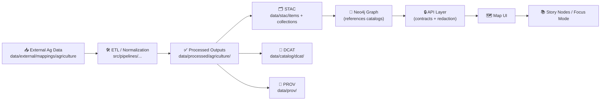

# 🌾 Agriculture Mapping (External) — `data/external/mappings/agriculture`


> **What this folder is:** a curated landing zone for **external agriculture-related geospatial datasets** used by KFM.  
> **What this folder is NOT:** a place to “just drop files” and then wire them directly into UI/analysis. Everything must move through the governed pipeline (ETL → catalogs → graph → API → UI). :contentReference[oaicite:0]{index=0} :contentReference[oaicite:1]{index=1}

---

## 📌 TL;DR Rules (non‑negotiable)

- ✅ **Raw snapshots are read-only** (don’t “fix” source files in-place). :contentReference[oaicite:2]{index=2} :contentReference[oaicite:3]{index=3}  
- ✅ **Pipelines must be deterministic + idempotent** (same inputs → same outputs; safe re-runs). :contentReference[oaicite:4]{index=4} :contentReference[oaicite:5]{index=5}  
- ✅ **Every dataset needs license + metadata + provenance** (STAC/DCAT/PROV) *before* it’s considered publishable. :contentReference[oaicite:6]{index=6} :contentReference[oaicite:7]{index=7}  
- ✅ **Large binaries** (e.g., big rasters) should use **Git LFS or pointer/checksum references** to keep repo manageable. :contentReference[oaicite:8]{index=8}  
- ❌ **No stage leapfrogging** (no “raw → UI”, “processed → UI”, or “UI → graph direct”). :contentReference[oaicite:9]{index=9}  

---

## 🧭 Where this fits in the KFM pipeline

KFM’s ordering is strict: **ETL → STAC/DCAT/PROV catalogs → Neo4j graph → APIs → Map/UI → Story Nodes → Focus Mode**. :contentReference[oaicite:10]{index=10}



> **Note on v13 canonical staging:** Raw/work/processed should live under `data/raw/<domain>/`, `data/work/<domain>/`, `data/processed/<domain>/`. This folder (`data/external/...`) is treated as **“source staging”** for agriculture mapping data and should map cleanly into those canonical stages via ETL. :contentReference[oaicite:11]{index=11}

---

## 🗂️ Recommended layout inside this folder

> Keep it boring & predictable 😄—it makes provenance + automation easier.

```text
📁 data/external/mappings/agriculture/
├─ 📄 README.md                       👈 you are here
├─ 📁 sources/                        # per-provider or per-dataset staging
│  ├─ 📁 <dataset_id>/
│  │  ├─ 📁 <version_or_date>/
│  │  │  ├─ 📄 download_manifest.yml  # where it came from + license + checksums
│  │  │  └─ 🗃️ <raw_files...>         # zipped or untouched source files
│  │  └─ 📄 NOTES.md                  # human notes (optional)
│  └─ 📁 _incoming/                   # scratchpad; keep short-lived
└─ 📁 _samples/                       # tiny sample extracts for tests/docs only
```

### 🧩 Dataset ID conventions

Use **kebab-case** and make it stable:

- `usda-nass-cdl`
- `usgs-landsat-sr`
- `sentinel-2-l2a`
- `nrcs-ssurgo`

---

## 📦 Data types we expect (agriculture mapping)

### 🛰️ Raster (imagery + gridded products)
Typical: crop classification, vegetation indices (NDVI/GCVI/EVI), soil moisture proxies, evapotranspiration, etc.

- Prefer **GeoTIFF** for raw; prefer **COG (Cloud Optimized GeoTIFF)** for processed outputs where possible. :contentReference[oaicite:12]{index=12}  
- Treat time as first-class (seasonality/phenology is signal). In agricultural environments, time-series indices + labeled crop data are common inputs to supervised classification workflows (e.g., Random Forest) and are evaluated with accuracy measures like confusion matrices. :contentReference[oaicite:13]{index=13}

### 🧭 Vector (boundaries + zones + networks)
Typical: fields/parcels, county boundaries, irrigation districts, conservation zones, transport/market proximity.

- Prefer **GeoPackage** (`.gpkg`) for processed vectors (single-file, robust).  
- GeoJSON is great for web interchange; remember **GeoJSON defaults to WGS84 (EPSG:4326)**. :contentReference[oaicite:14]{index=14}  

### 📈 Tabular / time-series
Typical: yields, planting progress, rainfall, temperature, management practice surveys.

- Prefer **Parquet** for processed time-series tables (fast + schema-friendly).  
- Always include join keys (e.g., GEOID, field_id, or stable geometry linkage).

---

## 🧷 CRS / projection guidance (so acreage stays honest)

Map projections preserve some properties and distort others; **for area-focused agricultural maps (acreage, land cover)**, use an **equal-area** projection for analysis products where area comparisons matter. :contentReference[oaicite:15]{index=15}

- 🌍 **Web/UI default:** EPSG:4326 (and/or standard web mercator via tiling), because it’s interoperable. :contentReference[oaicite:16]{index=16}  
- 📏 **Analysis default:** choose an **equal-area** projection appropriate for the region/extent (avoid doing acreage math in a projection that distorts area). :contentReference[oaicite:17]{index=17}  

> KFM pipelines may standardize on EPSG:4326 and/or a Kansas-specific projection; when in doubt, follow the domain pipeline config and document the choice. :contentReference[oaicite:18]{index=18}

---

## 🧰 Tooling (expected stack)

KFM’s workflow favors reproducible automation:

- **GDAL / PROJ / PyProj** for projection transforms  
- **Rasterio** for raster I/O  
- **GeoPandas + Fiona** for vector I/O and spatial joins  
- **Rtree** for spatial indexing (when needed) :contentReference[oaicite:19]{index=19}  
- **QGIS** for one-off tasks (e.g., manual georeferencing) but pipelines should capture final transforms deterministically :contentReference[oaicite:20]{index=20}  

---

## 🧪 Common workflow patterns (ag mapping)

### 1) 🛰️ Crop classification (remote sensing → labeled training → model)
A typical agriculture workflow uses multi-date imagery + vegetation indices and a labeled crop layer for training, then validates results with accuracy metrics (e.g., confusion matrix), often holding out test data. :contentReference[oaicite:21]{index=21}

**Output expectations (KFM-style):**
- processed raster(s) in `data/processed/agriculture/...`
- STAC item(s) for the raster(s)
- DCAT entry for dataset discovery
- PROV record linking raw inputs → processing run → outputs :contentReference[oaicite:22]{index=22}

### 2) 🧭 Vector joins for context (“within distance” / proximity analyses)
Spatial operations like “select features within X km of Y” can be formalized as deterministic vector ops (including joins and distance filters). :contentReference[oaicite:23]{index=23}

### 3) 👩‍🌾 Ground truth + field sampling (optional but powerful)
If we collect field observations, treat them as governed datasets too: raw → processed → catalog/prov → graph/api/ui. Use coordinate conventions consistently (lat/long + optional UTM/MGRS). :contentReference[oaicite:24]{index=24} :contentReference[oaicite:25]{index=25}

---

## 🗃️ Metadata + provenance (required to “publish” anything)

Every dataset/evidence artifact must have:

- **STAC Collection + Item(s)** for spatial assets  
- **DCAT Dataset** entry for discovery  
- **PROV lineage** capturing inputs, activities, agents, parameters, timestamps :contentReference[oaicite:26]{index=26}

> **Fail-closed:** if a dataset is missing license/metadata, it should be blocked (CI should fail, merges should not land). :contentReference[oaicite:27]{index=27}

### ✅ Minimal “download_manifest.yml” template

<details>
<summary><b>📄 Click to expand template</b></summary>

```yaml
dataset_id: usda-nass-cdl
version: "2020"
stage: external-source-snapshot

source:
  provider: "USDA NASS"
  title: "Cropland Data Layer"
  access_date: "YYYY-MM-DD"
  retrieval_method: "manual|script|api"
  license: "REQUIRED: paste exact license name or URL"
  citation: "REQUIRED: provider citation text or reference"

files:
  - path: "cdl_2020_kansas.tif"
    sha256: "REQUIRED"
    notes: "raw download; untouched"

processing_intent:
  will_write_processed_to:
    - "data/processed/agriculture/<...>"
  will_emit_metadata:
    stac: "data/stac/items/<...>.json"
    dcat: "data/catalog/dcat/<...>.jsonld"
    prov: "data/prov/<...>.json"
```

</details>

---

## ➕ Adding a new dataset (checklist)

- [ ] Create `sources/<dataset_id>/<version_or_date>/`
- [ ] Add **download_manifest.yml** (license + checksums required) :contentReference[oaicite:28]{index=28}  
- [ ] Add raw files (or pointers/LFS for large rasters) :contentReference[oaicite:29]{index=29}  
- [ ] Implement/extend ETL pipeline (deterministic, no manual steps) :contentReference[oaicite:30]{index=30} :contentReference[oaicite:31]{index=31}  
- [ ] Write processed outputs to `data/processed/agriculture/...` :contentReference[oaicite:32]{index=32}  
- [ ] Emit STAC/DCAT/PROV records in canonical locations :contentReference[oaicite:33]{index=33} :contentReference[oaicite:34]{index=34}  
- [ ] Validate geometry/CRS; document projection choice for analysis products :contentReference[oaicite:35]{index=35}  
- [ ] Add/Update tests (smoke tests + metadata validation)

---

## 🧼 QA/QC guardrails (quick)

✅ **Data integrity**
- checksums recorded
- raw files untouched
- no “mystery edits” in processed outputs (pipeline-only)

✅ **Spatial sanity**
- CRS documented (and consistent)
- bounds match expected extent
- pixel size / resolution consistent with source

✅ **Governance**
- license present
- classification tags respected; derivatives never become “less restricted” than inputs :contentReference[oaicite:36]{index=36}  
- provenance complete (raw → work → processed) :contentReference[oaicite:37]{index=37}  

---

## 🎨 Cartography notes (because maps should *communicate*, not just exist)

When producing reference maps (thumbnails, previews, Story Node figures):

- Use map elements (legend/scale/north arrow) where it improves comprehension (especially for non-GIS audiences). :contentReference[oaicite:38]{index=38}  
- Pick projection to match purpose (area vs shape vs distance). :contentReference[oaicite:39]{index=39}  

---

## 🔗 Project references used to shape this README

- **KFM Master Guide v13 (draft)** — canonical pipeline ordering, staging (`raw/work/processed`), STAC/DCAT/PROV requirements, governance invariants :contentReference[oaicite:40]{index=40}  
- **KFM Comprehensive Technical Blueprint** — provenance-first system, deterministic pipelines, fail-closed governance, monorepo + large-file strategy (LFS/pointers) :contentReference[oaicite:41]{index=41} :contentReference[oaicite:42]{index=42}  
- **Cloud-Based Remote Sensing with Google Earth Engine** — agriculture-oriented remote sensing workflows + accuracy evaluation patterns :contentReference[oaicite:43]{index=43}  
- **Making Maps (GIS cartographic design)** — projection tradeoffs; equal-area guidance for area mapping :contentReference[oaicite:44]{index=44}  
- **Map Reading & Land Navigation (FM 3-25.26)** — UTM grid concepts (useful for coordinate display + field ops alignment) :contentReference[oaicite:45]{index=45}  
- **Python Geospatial Analysis Cookbook** — practical Python geospatial library ecosystem + CRS conventions :contentReference[oaicite:46]{index=46} :contentReference[oaicite:47]{index=47}  
- **KFM Open-Source Geospatial Historical Mapping Hub Design** — GDAL/Rasterio/GeoPandas pipeline tooling + processed format targets (COGs/GeoJSON) :contentReference[oaicite:48]{index=48}  

---

