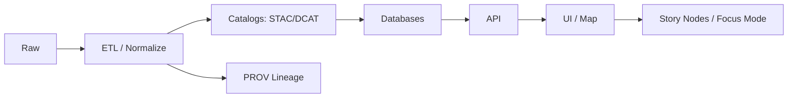

# 🌾 Agriculture Source — `<dataset_id>`


> ✅ **What this folder is:** the **source-of-truth “runbook”** for the external agriculture dataset **`<dataset_id>`** (where it came from, how we fetch it, how we map/normalize it, and how it becomes governed KFM-ready outputs).
>
> ⚠️ **Template note:** Replace every `<...>` placeholder (search: `<dataset_`) and keep this README updated whenever the source or mapping changes.

---

## 📌 Table of Contents

- [🎯 Purpose](#-purpose)
- [🧾 Dataset Summary](#-dataset-summary)
- [📦 Folder Contents](#-folder-contents)
- [⬇️ Acquisition](#️-acquisition)
- [🧹 Normalize & Map](#-normalize--map)
- [📤 Output Contract](#-output-contract)
- [🗂️ Catalog & Provenance Requirements](#️-catalog--provenance-requirements)
- [✅ Validation Checklist](#-validation-checklist)
- [⚖️ Licensing, Governance, CARE/FAIR](#️-licensing-governance-carefair)
- [🧯 Known Issues](#-known-issues)
- [🧱 Change Log](#-change-log)
- [👥 Maintainers](#-maintainers)

---

## 🎯 Purpose

This README documents:

- **Source**: where `<dataset_id>` originates (provider, URLs, citation, licensing).
- **Reproducible ingest**: how we acquire the raw material (download/API/export).
- **Deterministic mapping**: how we normalize fields, units, codes, geometries, and time.
- **Governed publishing**: how the dataset becomes a **published artifact** (catalog + provenance) before it is used downstream (graph/API/UI/story).

---

## 🧾 Dataset Summary

| Field | Value |
|---|---|
| **Dataset ID** | `<dataset_id>` |
| **Human name** | `<dataset_name>` |
| **Provider / Owner** | `<provider_org>` |
| **Source type** | `raster` / `vector` / `tabular` / `mixed` |
| **Primary theme** | `crop type` / `yield` / `land cover` / `irrigation` / `soil` / `drought` / `other` |
| **Spatial coverage** | `<bbox_or_description>` |
| **Temporal coverage** | `<start_date>` → `<end_date_or_present>` |
| **Update cadence** | `static` / `annual` / `monthly` / `daily` / `event-based` |
| **Native CRS** | `<epsg_or_wkt>` |
| **KFM target CRS** | `EPSG:4326 (recommended)` unless otherwise justified |
| **License** | `<license_name + link>` |
| **Restrictions** | `public` / `internal` / `restricted` (+ reason) |
| **Last fetched** | `<YYYY-MM-DD>` |
| **Pinned version** | `<upstream_version_or_release_or_snapshot>` |

<details>
<summary>📎 Suggested citation (fill in)</summary>

**Citation (APA-ish):**  
`<provider_org>. (<year>). <dataset_name> (Version <v>). <publisher>. <url>`

**KFM short citation:**  
`<provider_org> <year>, "<dataset_name>"`

</details>

---

## 📦 Folder Contents

> This folder should stay **lightweight**: mapping configs, metadata drafts, checksums, and notes.  
> Large binaries should be stored via **Git LFS** or referenced by **checksum + fetch script**.

### 📁 Recommended structure

```text
data/external/mappings/agriculture/sources/<dataset_id>/
├─ 📄 README.md                  # you are here
├─ 📄 source.yml                 # upstream URLs, access method, version pins
├─ 📄 mapping.yml                # field/code mappings → KFM canonical schema
├─ 📄 checksums.txt              # sha256 for any vendored files (or remote snapshots)
├─ 📁 examples/                  # small samples only (tiny csv/geojson snippets)
├─ 📁 notes/                     # provider quirks, gotchas, emails, screenshots (no secrets)
└─ 📁 licenses/                  # license text if required by upstream
```

If your dataset requires domain-specific transforms (joins, clipping, reprojecting), also include:

```text
├─ 📁 transforms/
│  ├─ 🧩 sql/                    # optional: deterministic transforms for PostGIS
│  ├─ 🐍 python/                 # optional: ETL scripts (or references to central pipeline)
│  └─ ⚙️ params/                 # optional: config snapshots used for reproducibility
```

---

## ⬇️ Acquisition

### 1) Upstream access

- **Primary URL / endpoint:** `<source_url>`
- **Backup mirrors:** `<mirror_url_1>`, `<mirror_url_2>`
- **Authentication:** `none` / `API key` / `account` (DO NOT store secrets here)
- **Rate limits / quotas:** `<notes>`

### 2) Fetch method (choose one)

#### Option A — Manual download (acceptable for one-offs)
1. Download from `<source_url>`
2. Save raw files to:
   - `data/raw/agriculture/<dataset_id>/...`
3. Record:
   - snapshot date (`Last fetched`)
   - upstream version / release id
   - `sha256` checksums in `checksums.txt`

#### Option B — Scripted fetch (preferred ✅)
- Script path: `<path_to_fetch_script_or_make_target>`
- Example:

```bash
# example — replace with real command(s)
python -m pipelines.agriculture.fetch --dataset <dataset_id> --out data/raw/agriculture/<dataset_id>
```

### 3) Storage strategy (big files)

If files are large:
- Prefer **Git LFS** for binaries committed into the repo, or  
- Store remotely and track via **stable URL + checksum + fetch script**.

---

## 🧹 Normalize & Map

### 🎛️ Normalization goals

- **Deterministic outputs** (same inputs/config → same outputs).
- **Explainable attributes** (no cryptic codes without a mapping table).
- **Units standardized** (document conversions here).
- **Geospatial consistency**:
  - Reproject to **a common CRS** for outputs unless there is a strong reason to preserve a projected CRS.
  - Validate geometry and bounding extents.

### 🗺️ Mapping notes

#### Field mapping (source → canonical)

| Source field | Canonical field | Type | Rule / transform | Notes |
|---|---|---:|---|---|
| `<src_field_1>` | `<kfm_field_1>` | `<type>` | `<rule>` | `<notes>` |
| `<src_field_2>` | `<kfm_field_2>` | `<type>` | `<rule>` | `<notes>` |

#### Code mapping (classification → human-readable)

| Source code | Meaning | Canonical value | Notes |
|---:|---|---|---|
| `<1>` | `<meaning>` | `<canonical>` | `<notes>` |

#### Spatial considerations (agriculture-specific 🧠)

- Crop classifications often change across years—document:
  - year-specific legend differences
  - reclass rules
  - “unknown / no data” handling
- If raster:
  - specify nodata value(s)
  - specify pixel size / resolution
  - consider publishing as **COG** (Cloud Optimized GeoTIFF) for web-friendly access

---

## 📤 Output Contract

> **Rule:** Nothing is “published” until it has **catalog + provenance** and can be traced end-to-end.

### ✅ Produced artifacts

Fill these in with real paths once created:

| Artifact | Path (expected) | Notes |
|---|---|---|
| Raw snapshot | `data/raw/agriculture/<dataset_id>/...` | Raw inputs only |
| Work intermediates | `data/work/agriculture/<dataset_id>/...` | Optional, may be ephemeral |
| Processed dataset | `data/processed/agriculture/<dataset_id>/...` | Authoritative outputs |
| STAC Collection | `data/stac/collections/agriculture/<dataset_id>.json` | Collection-level metadata |
| STAC Item(s) | `data/stac/items/agriculture/<dataset_id>/...` | Item-level assets |
| DCAT entry | `data/catalog/dcat/agriculture/<dataset_id>.jsonld` | Discovery entry |
| PROV bundle | `data/prov/<dataset_id>.prov.json` | Lineage & processing |

### 🧩 Dataset naming conventions

- Use stable IDs:
  - `<dataset_id>` for the dataset family
  - `<dataset_id>__<year_or_period>__v<kfm_version>` for released outputs
- Prefer explicit temporal scoping for agriculture:
  - `...__2018__v1`, `...__2018-2020__v2`, etc.

---

## 🗂️ Catalog & Provenance Requirements

### 🔒 Non‑negotiable pipeline order (KFM)



### 🧾 What PROV must capture (minimum)

Your provenance record should answer: **“How was this produced?”**

- **Entities**: input raw files (filename + checksum and/or source URL) and output files  
- **Activity**: the process run (script/tool + timestamp + environment/run info)  
- **Agents**: who/what performed it (software version + human trigger if applicable)  
- **Parameters**: thresholds, reclass rules, reprojection, clipping, joins, filters  
- **Notes**: outliers removed, assumptions, external algorithm references

> Tip: If you ever can’t explain a value, add a mapping rule or a note here 📌

---

## ✅ Validation Checklist

### 📦 Source integrity
- [ ] Upstream URL(s) recorded and still accessible
- [ ] Snapshot date and upstream version pinned
- [ ] Checksums recorded (`sha256`) for any stored artifacts
- [ ] License captured (link + any required text included)

### 🧭 Geospatial sanity
- [ ] CRS documented (native + target)
- [ ] BBOX/extent verified
- [ ] Geometry validated (no self-intersections, valid polygons/lines)
- [ ] For rasters: nodata and resolution documented

### 🧪 Data quality & schema
- [ ] Attribute domains validated (e.g., crop codes exist in mapping table)
- [ ] Units documented & standardized
- [ ] Null/unknown handling documented
- [ ] Small sample checked in `examples/` (optional but helpful)

### 🗂️ Publishing gate
- [ ] Processed outputs exist in `data/processed/...`
- [ ] STAC created (collection + item(s))
- [ ] DCAT entry created
- [ ] PROV bundle created and links inputs → outputs
- [ ] (If applicable) Graph ingest uses catalog references (not raw payloads)

---

## ⚖️ Licensing, Governance, CARE/FAIR

- **License compliance:** ensure redistribution is allowed (or document constraints clearly).
- **Attribution:** include required credit language from upstream.
- **CARE/FAIR:** if dataset touches sensitive land, communities, or sovereignty concerns:
  - clearly label restrictions
  - ensure derivatives cannot be *less restricted* than inputs
  - document any redaction/generalization rules (if applicable)

---

## 🧯 Known Issues

| Issue | Impact | Mitigation |
|---|---|---|
| `<issue_1>` | `<impact>` | `<mitigation>` |
| `<issue_2>` | `<impact>` | `<mitigation>` |

---

## 🧱 Change Log

| Date | Change | Author |
|---:|---|---|
| `<YYYY-MM-DD>` | Initialized dataset README scaffold | `<name_or_handle>` |
| `<YYYY-MM-DD>` | Added mapping rules + checksums | `<name_or_handle>` |

---

## 👥 Maintainers

- **Domain steward:** `<name>` (`@handle`)
- **Technical owner:** `<name>` (`@handle`)
- **Escalation / governance:** `<link_or_process>`

---

### 🧭 Quick “Done Means Done” ✅

A dataset source is considered **ready** when:
1) acquisition is reproducible,  
2) mapping rules are explicit,  
3) processed outputs exist, and  
4) STAC + DCAT + PROV are present and consistent.

✨ If you can’t trace it, you can’t trust it.

