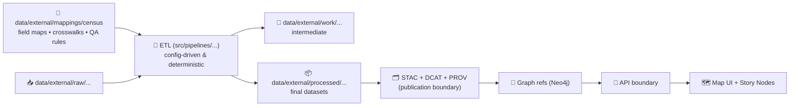

# 🧾🗺️ Census Mappings (External Domain)


> 📍 **Path:** `data/external/mappings/census/README.md`  
> 🎯 **Mission:** Keep all **schema/field mappings, crosswalks, and “how we join it” rules** for Census-derived datasets in one place — so pipelines stay **deterministic**, **auditable**, and **repeatable**.

---

## 🧠 What lives here

This folder is for **mapping artifacts** (not the data itself):

✅ **Belongs here**
- 🧬 **Field maps** (source → canonical columns)
- 🧷 **Join-key definitions** (GEOID/FIPS rules, padding, concat rules)
- 🔁 **Crosswalks** (county ⇄ tract ⇄ block group ⇄ place, vintage bridges, etc.)
- 🧪 **QA expectations** (row counts, unique-key checks, geometry validity rules)
- 📝 **Source notes** (license, attribution strings, caveats, known issues)

🚫 **Does NOT belong here**
- 📦 Raw downloads (put those in `data/external/raw/...`)
- 🧱 Intermediate scratch outputs (put those in `data/external/work/...`)
- ✅ Published outputs (put those in `data/external/processed/...`)
- 🔑 Secrets / API keys / tokens (never commit)

---

## 🔩 Where this fits in the KFM pipeline

This `mappings/census/` folder is the **configuration + contract glue** that powers Census ETL.  
Pipelines should consume these artifacts so **no “mystery joins”** or one-off transformations slip in.



---

## 📁 Suggested layout inside `census/`

> This is a recommended structure — evolve as needed, but keep it predictable.

```text
📁 data/external/mappings/census/
├── 📄 README.md                      # you are here
├── 📁 field_maps/                    # source fields → canonical fields
│   ├── 🧾 acs_5yr__tract__demographics.yml
│   ├── 🧾 decennial__county__population.yml
│   └── 🧾 tiger__county__boundaries.yml
├── 📁 crosswalks/                    # geography bridges + lookups
│   ├── 🔁 tract_to_county.csv
│   ├── 🔁 blockgroup_to_tract.csv
│   └── 🔁 place_to_county.csv
├── 📁 keys/                          # join-key standards & helpers
│   ├── 🔑 geoid_rules.md
│   └── 🔑 fips_padding_rules.md
├── 📁 qa/                            # “what good looks like” checks
│   ├── ✅ expected_counts.yml
│   └── ✅ geometry_checks.md
└── 📁 sources/                       # attribution + license notes
    ├── 🪪 census_license_and_attribution.md
    └── 📝 known_issues.md
```

---

## 🧷 Canonical conventions (so joins don’t become folklore)

### 1) Join keys (GEOID/FIPS) ✅
- Treat join keys as **strings**, not integers.
- Always define:
  - **source key**
  - **canonical key**
  - **padding rules**
  - **concatenation rules**
  - **uniqueness expectations**

**Common patterns**
- `STATEFP` (2) + `COUNTYFP` (3) → county GEOID (5)
- county GEOID (5) + tract (6) → tract GEOID (11)
- tract GEOID (11) + block group (1) → BG GEOID (12)

> 📌 Put the *exact* rule in `keys/` and reference it from each field map.

---

### 2) Time / vintage 📅
Census-style data is inherently time-bound:
- **Decennial**: point-in-time (e.g., 1900, 1910, …)
- **ACS**: multi-year period (e.g., 2019–2023 5-year)

✅ Every mapping spec should declare:
- `vintage_year` (or `vintage_start` / `vintage_end`)
- `reference_date` (when the observation is meant to represent)
- `boundary_vintage` (for geometries — these drift over time)

---

### 3) Geometry & CRS 🌍
- Persist published geometries in a **stable CRS** (WGS84/EPSG:4326 is the usual safe default).
- If you calculate area/distance, do it explicitly in an appropriate projected CRS and store the result with units.

✅ Every boundary mapping should declare:
- geometry type (Polygon/MultiPolygon)
- CRS
- simplification rules (if any)
- validity repair strategy (if any)

---

## 🧬 Mapping spec template (recommended)

> Keep mapping specs small, explicit, and pipeline-friendly.

```yaml
# 📄 data/external/mappings/census/field_maps/decennial__county__population.yml
id: decennial__county__population
title: "Decennial Census – County Population"
source:
  publisher: "U.S. Census Bureau"
  product: "Decennial Census"
  license: "Public domain / US Gov (verify per dataset notes)"
  citation: "See sources/census_license_and_attribution.md"
vintage:
  year: 1900
geography:
  level: county
  key:
    source_fields: ["STATEFP", "COUNTYFP"]
    canonical_field: "geoid"
    rule_ref: "../keys/geoid_rules.md#county-geoid"
inputs:
  - path: "data/external/raw/census/decennial/1900/..."
outputs:
  processed_path: "data/external/processed/census/decennial/1900/county_population.geojson"
schema:
  canonical_fields:
    - name: geoid
      type: string
      required: true
    - name: population_total
      type: integer
      required: true
field_map:
  geoid:
    from: ["STATEFP", "COUNTYFP"]
    transform: "concat_pad(STATEFP,2) + concat_pad(COUNTYFP,3)"
  population_total:
    from: ["POP"]
    transform: "to_int(POP)"
qa:
  unique_key: "geoid"
  required_fields: ["geoid", "population_total"]
  checks:
    - "row_count > 0"
    - "no_nulls(geoid)"
    - "all_length(geoid)==5"
```

---

## 🧪 QA rules (minimum bar)

At minimum, every Census mapping should define:

- ✅ **Uniqueness**: expected unique key(s)
- ✅ **Completeness**: required fields not null
- ✅ **Shape sanity** (for boundaries): valid geometries, non-empty, within expected bbox
- ✅ **Counts sanity**: row counts align with expected geography universe (or explain why not)

> Tip: Put *expected* values (counts, key lengths) in `qa/expected_counts.yml` so it can be reused by multiple pipelines.

---

## 🧷 “Adding a new Census mapping” checklist

### A) Create/Update mapping artifacts 🧾
- [ ] Add a `field_maps/*.yml` mapping spec for the dataset  
- [ ] Add/extend crosswalks in `crosswalks/` (if needed)  
- [ ] Add/extend join rules in `keys/` (if needed)  
- [ ] Add QA expectations in `qa/`

### B) Wire it into an ETL pipeline 🧪
- [ ] Pipeline reads raw inputs from `data/external/raw/...`
- [ ] Pipeline consumes this folder’s mapping spec(s) (no hard-coded joins)
- [ ] Pipeline writes intermediates to `data/external/work/...`
- [ ] Pipeline writes finals to `data/external/processed/...`

### C) Publish “boundary artifacts” 🗂️
- [ ] Create/update STAC Item/Collection  
- [ ] Create/update DCAT dataset entry  
- [ ] Create/update PROV lineage bundle

### D) Downstream usage 🔌
- [ ] If it enters the graph, store **references** back to catalogs (don’t duplicate payloads)
- [ ] Expose only via governed API boundaries (redaction/classification applies)

---

## 🧯 Governance notes (Census is usually public… but still be careful)

Even “public” data can become sensitive when combined:
- Microdata / person-level records: **high risk** (do not commit without explicit governance + redaction strategy)
- Small-area aggregates (e.g., tiny geographies): can increase re-identification risk when mixed with other datasets
- Layers intersecting culturally sensitive geographies: treat carefully (CARE-minded review)

✅ Always include:
- License / attribution notes (see `sources/`)
- Any transformations that materially change meaning (normalizations, imputation, smoothing)
- Any redaction/generalization policy if applicable

---

## 🔗 Related (high-value) repo touchpoints

- 📘 `docs/MASTER_GUIDE_v13.md` — canonical staging, catalogs, CI gates  
- 🧱 `schemas/` — contract-first schemas (if/when mapping specs are validated in CI)  
- 🧪 `src/pipelines/` — ETL jobs (should read mapping specs from here)  
- 🗂️ `data/stac/`, `data/catalog/dcat/`, `data/prov/` — publication boundary artifacts  

---

## 🧭 TODOs / Future upgrades

- [ ] Add a **JSON Schema** for mapping specs + CI validation
- [ ] Add a tiny “golden” sample dataset per mapping to support unit tests
- [ ] Add automated checks for GEOID length/padding across all mappings
- [ ] Add a “vintage bridge” pattern for boundary changes across decades

---

*Last updated:* _keep this current as mappings evolve_ ✨

