# 🔢 FIPS & GEOID Padding Rules (Census Keys)


This document defines **canonical, project-wide** padding + normalization rules for **FIPS-coded fields** and **Census GEOIDs** so that joins across:

- 🗺️ TIGER/Line boundary files (shapefiles / geodatabases)
- 📊 Census tabular extracts / APIs
- 🧩 3rd-party datasets that “kind of” include FIPS

…work reliably without silent mismatches.

---

## 📌 Quick “Never Break These” Rules

> ✅ **Treat FIPS / GEOIDs as strings, not numbers.**  
> ✅ **Left-pad with zeros** to the required fixed width.  
> ✅ **Build composite GEOIDs by concatenation** of padded components.  
> ✅ **Validate final length** (fail fast if wrong).  
> ❌ Never store join keys in floats/ints (Excel will ruin your day).

---

## 🧠 Vocabulary

- **FIPS code**: A numeric code identifying a geographic entity (state, county, etc.). In TIGER/Line, fields like `STATEFP`, `COUNTYFP`, `PLACEFP` typically contain FIPS codes.
- **GEOID**: A **concatenated identifier** used by Census to uniquely identify a geographic entity (e.g., tract GEOID = state + county + tract).
- **Component fields**: The “pieces” (like `STATEFP`, `COUNTYFP`, `TRACTCE`) used to build the final `GEOID`.

---

## 📏 Canonical Widths (Most Used)

These are the **minimum keys we standardize everywhere** in KFM.

| Geography 🗺️ | Component fields 🧩 | Pad widths 📏 | Canonical key ✅ | Final length 🔢 |
|---|---|---:|---|---:|
| State | `STATEFP` | 2 | `state_geoid = STATEFP` | 2 |
| County | `STATEFP` + `COUNTYFP` | 2 + 3 | `county_geoid = STATEFP + COUNTYFP` | 5 |
| Census Tract | `STATEFP` + `COUNTYFP` + `TRACTCE` | 2 + 3 + 6 | `tract_geoid = STATEFP + COUNTYFP + TRACTCE` | 11 |
| Block Group | `STATEFP` + `COUNTYFP` + `TRACTCE` + `BLKGRPCE` | 2 + 3 + 6 + 1 | `bg_geoid = STATEFP + COUNTYFP + TRACTCE + BLKGRPCE` | 12 |
| Census Block (2020) | `STATEFP20` + `COUNTYFP20` + `TRACTCE20` + `BLOCKCE20` | 2 + 3 + 6 + 4 | `block_geoid20 = ...` | 15 |
| Place | `STATEFP` + `PLACEFP` | 2 + 5 | `place_geoid = STATEFP + PLACEFP` | 7 |
| County Subdivision | `STATEFP` + `COUNTYFP` + `COUSUBFP` | 2 + 3 + 5 | `cousub_geoid = ...` | 10 |
| Congressional District | `STATEFP` + `CDxxxFP` | 2 + 2 | `cd_geoid = ...` | 4 |
| State Leg District (Lower) | `STATEFP` + `SLDLST` | 2 + 3 | `sldl_geoid = ...` | 5 |

---

## 🧬 GEOID Composition Map

```mermaid
flowchart TD
  A["🏛️ STATEFP (2)"] --> B["🏞️ COUNTYFP (3)"]
  B --> C["🗺️ TRACTCE (6)"]
  C --> D["🧩 BLKGRPCE (1)"]
  C --> E["🏠 BLOCKCE20 (4)"]

  D --> BG["🧩 GEOID (Block Group) = 2+3+6+1 = 12"]
  C --> TR["🗺️ GEOID (Tract) = 2+3+6 = 11"]
  B --> CO["🏞️ GEOID (County) = 2+3 = 5"]
  A --> ST["🏛️ GEOID (State) = 2"]
  E --> BLK["🏠 GEOID20 (Block) = 2+3+6+4 = 15"]

  classDef k fill:#f6f8fa,stroke:#8c959f,color:#24292f;
```



---

## 🧩 Normalization Algorithm (Canonical)

Given a value `v` and required width `n`:

1. **If `v` is null/empty** → return null
2. Convert to string and trim whitespace
3. **Strip non-digits** (unless the field explicitly allows a non-digit suffix; see “Suffixed Blocks”)
4. If digits length `> n` → **error** (or quarantine record)
5. Left-pad with zeros to width `n`

> 💡 **Important:** We never right-pad. We never truncate. Wrong length means wrong join.

---

## 🧪 Examples

### ✅ County GEOID
- Inputs: `STATEFP=20`, `COUNTYFP=173`
- Padding: `STATEFP="20"`, `COUNTYFP="173"`
- Output: `county_geoid="20173"` (length 5)

### ✅ Tract GEOID
- Inputs: `STATEFP=20`, `COUNTYFP=001`, `TRACTCE=35`
- Padding: `STATEFP="20"`, `COUNTYFP="001"`, `TRACTCE="000035"`
- Output: `tract_geoid="20001000035"` (length 11)

### ✅ Block Group GEOID
- Inputs: `STATEFP=20`, `COUNTYFP=001`, `TRACTCE=35`, `BLKGRPCE=2`
- Output: `bg_geoid="200010000352"` (length 12)

### ✅ 2020 Census Block GEOID (15 digits)
- Inputs: `STATEFP20=20`, `COUNTYFP20=173`, `TRACTCE20=6701`, `BLOCKCE20=1000`
- Padding: `STATEFP20="20"`, `COUNTYFP20="173"`, `TRACTCE20="006701"`, `BLOCKCE20="1000"`
- Output: `block_geoid20="201730067011000"` (length 15)

---

## ⚠️ Suffixed Blocks (If You Use Them)

Some “current suffixed” block products include a **1-character suffix** appended after the base block GEOID. Treat them as:

- `block_geoid15` (15 digits) + `suffix` (1 char) = `GEOID` length 16

Rules:
- ✅ Build the **15-digit base** normally
- ✅ Append suffix **as-is**
- ❌ Do not “zfill” the 16-length as a single numeric field
- ❌ Do not assume suffix is always numeric

---

## 🛠️ Reference Implementations

<details>
<summary><strong>🐍 Python (pure)</strong></summary>

```python
import re
from typing import Optional, Union

DigitsLike = Union[str, int]

def zfill_digits(value: Optional[DigitsLike], width: int) -> Optional[str]:
    """
    Canonical FIPS padding:
      - None/"" -> None
      - keep digits only
      - left-pad to `width`
      - error if length exceeds width
    """
    if value is None:
        return None
    s = str(value).strip()
    if s == "":
        return None

    digits = re.sub(r"\D+", "", s)
    if digits == "":
        return None

    if len(digits) > width:
        raise ValueError(f"Value {value!r} has {len(digits)} digits; expected <= {width}")

    return digits.zfill(width)

def geoid_county(statefp, countyfp) -> str:
    return zfill_digits(statefp, 2) + zfill_digits(countyfp, 3)

def geoid_tract(statefp, countyfp, tractce) -> str:
    return zfill_digits(statefp, 2) + zfill_digits(countyfp, 3) + zfill_digits(tractce, 6)

def geoid_bg(statefp, countyfp, tractce, blkgrpce) -> str:
    return geoid_tract(statefp, countyfp, tractce) + zfill_digits(blkgrpce, 1)

def geoid_block20(statefp20, countyfp20, tractce20, blockce20) -> str:
    return zfill_digits(statefp20, 2) + zfill_digits(countyfp20, 3) + zfill_digits(tractce20, 6) + zfill_digits(blockce20, 4)
```
</details>

<details>
<summary><strong>🐼 Pandas (string-safe)</strong></summary>

```python
import pandas as pd

# Prefer pandas' "string" dtype over object; keeps NA as <NA> instead of "nan"
df["STATEFP"]  = df["STATEFP"].astype("string").str.replace(r"\D+", "", regex=True).str.zfill(2)
df["COUNTYFP"] = df["COUNTYFP"].astype("string").str.replace(r"\D+", "", regex=True).str.zfill(3)
df["TRACTCE"]  = df["TRACTCE"].astype("string").str.replace(r"\D+", "", regex=True).str.zfill(6)
df["BLKGRPCE"] = df["BLKGRPCE"].astype("string").str.replace(r"\D+", "", regex=True).str.zfill(1)

df["GEOID_TRACT"] = df["STATEFP"] + df["COUNTYFP"] + df["TRACTCE"]
df["GEOID_BG"]    = df["GEOID_TRACT"] + df["BLKGRPCE"]

# Optional: validate lengths (will raise if not)
assert (df["GEOID_TRACT"].str.len() == 11).all()
assert (df["GEOID_BG"].str.len() == 12).all()
```
</details>

<details>
<summary><strong>🧮 SQL (Postgres)</strong></summary>

```sql
-- Canonical padding
SELECT
  LPAD(REGEXP_REPLACE(statefp::text,  '\D', '', 'g'), 2, '0') AS statefp,
  LPAD(REGEXP_REPLACE(countyfp::text, '\D', '', 'g'), 3, '0') AS countyfp,
  LPAD(REGEXP_REPLACE(tractce::text,  '\D', '', 'g'), 6, '0') AS tractce,
  LPAD(REGEXP_REPLACE(blkgrpce::text, '\D', '', 'g'), 1, '0') AS blkgrpce,
  -- composite
  LPAD(REGEXP_REPLACE(statefp::text,  '\D', '', 'g'), 2, '0')
  || LPAD(REGEXP_REPLACE(countyfp::text, '\D', '', 'g'), 3, '0')
  || LPAD(REGEXP_REPLACE(tractce::text,  '\D', '', 'g'), 6, '0') AS geoid_tract
FROM staging_table;
```
</details>

<details>
<summary><strong>🟨 JavaScript / TypeScript</strong></summary>

```ts
const digitsOnly = (v: unknown) => String(v ?? "").trim().replace(/\D+/g, "");

export const zfillDigits = (v: unknown, width: number): string | null => {
  const d = digitsOnly(v);
  if (!d) return null;
  if (d.length > width) throw new Error(`Too many digits: "${v}" (${d.length} > ${width})`);
  return d.padStart(width, "0");
};

export const geoidTract = (statefp: unknown, countyfp: unknown, tractce: unknown) =>
  zfillDigits(statefp, 2)! + zfillDigits(countyfp, 3)! + zfillDigits(tractce, 6)!;
```
</details>

---

## ✅ Validation Checklist (Use in Pipelines)

- [ ] All component fields are **string-typed** in processed outputs
- [ ] `STATEFP` is always `^\d{2}$`
- [ ] `COUNTYFP` is always `^\d{3}$`
- [ ] `TRACTCE` is always `^\d{6}$`
- [ ] `BLKGRPCE` is always `^\d{1}$`
- [ ] `GEOID` matches expected length for the geography (5/11/12/15/etc.)
- [ ] Joins between geometry + attributes use **exact string equality**, not numeric casts
- [ ] CSV exports quote GEOIDs (e.g., `"20173"`), and Excel ingestion is discouraged for key fields

---

## 🧯 Common Failure Modes

- **Excel auto-format**: turns `"001"` into `1`
- **Leading zeros lost** when reading CSV as numeric
- **Mixed formats**: some sources give `20-173`, others give `20173`
- **Hidden whitespace**: `"20173 "` won’t join
- **Suffixed block mismatch**: mixing 15-digit and 16-length “suffixed” block IDs

---

## 🔗 References (Human-friendly)

- TIGER/Line Shapefiles Technical Documentation (record layouts / field lengths)  
  ↳ https://www2.census.gov/geo/pdfs/maps-data/data/tiger/tgrshp2025/TGRSHP2025_TechDoc_F-S.pdf
- Understanding Geographic Identifiers (GEOIDs)  
  ↳ https://www.census.gov/programs-surveys/geography/guidance/geo-identifiers.html

---

## 🧭 This File’s Home (Repo Path)

```text
📁 data/
└─ 📁 external/
   └─ 📁 mappings/
      └─ 📦 census/                                  🧮 Census/TIGER mapping packs + key registries
         └─ 🔑 keys/                                 🗝️ canonical IDs, dictionaries, and crosswalks
            └─ 📝 fips_padding_rules.md               👈 you are here (FIPS/GEOID padding + formatting rules)
```

