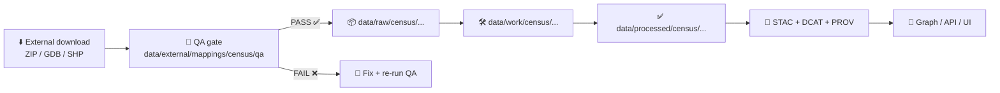

# 🧪🗺️ Census Mapping QA

`🧪 QA: gated` `🗺️ Domain: census mappings` `📦 Stage: external intake` `🔗 Join key: GEOID` `🧾 Metadata: STAC/DCAT/PROV`

> [!IMPORTANT]
> This folder is the **QA gate** for external Census boundary + crosswalk assets used by **Kansas Frontier Matrix (KFM)**.
> If it doesn’t pass here, it **doesn’t** get promoted into the canonical data lifecycle.

---

<details>
<summary><strong>📌 Table of Contents</strong></summary>

- [🎯 What this QA gate protects](#-what-this-qa-gate-protects)
- [🧭 Where this fits in KFM](#-where-this-fits-in-kfm)
- [🗂️ Directory layout](#️-directory-layout)
- [📥 What belongs here](#-what-belongs-here)
- [✅ QA gates](#-qa-gates)
- [🧪 Running QA](#-running-qa)
- [🚦Promotion workflow](#-promotion-workflow)
- [🧾 QA reports](#-qa-reports)
- [🧷 Definition of done](#-definition-of-done)
- [🧰 Contributing new checks](#-contributing-new-checks)
- [🧯 Common failures](#-common-failures)
- [🔗 Related docs](#-related-docs)

</details>

---

## 🎯 What this QA gate protects

Census boundary layers are **foundational** for joins, aggregations, and maps. A single failure (wrong CRS, broken geometry, bad GEOID field) can silently poison everything downstream.

This QA gate exists to:

- 🧩 Ensure boundary geometries are **valid + usable**
- 🧭 Ensure CRS/datum are **present, consistent, and convertible**
- 🔗 Ensure join keys (e.g., GEOID) are **unique, complete, and stable**
- 🧾 Ensure every ingest has **traceable metadata + provenance**
- 🛡️ Prevent accidental inclusion of **PII / sensitive locations** in publishable layers

---

## 🧭 Where this fits in KFM



> [!NOTE]
> The QA gate is **not** a replacement for ETL validation — it’s the *first* line of defense that stops bad/unsafe assets before they become “official raw evidence.”

---

## 🗂️ Directory layout

Recommended contents for this folder (you can scaffold as needed):

```text
data/external/mappings/census/qa/
├─ README.md                  # 👈 you are here
├─ 📐 schemas/                 # JSON Schema / frictionless specs / column contracts
├─ ✅ expectations/            # Great Expectations / custom rules (YAML/JSON)
├─ 🧪 tests/                   # pytest-based QA checks (fast, deterministic)
├─ 🧩 fixtures/                # tiny sample datasets for regression tests (small!)
├─ 📊 reports/                 # generated QA outputs (MD/JSON), per dataset run
└─ 🛠️ scripts/                 # helpers (checksums, validators, report builders)
```

---

## 📥 What belongs here

✅ **Belongs here**
- QA rules & contracts (schemas, expectations)
- Deterministic tests (CI-friendly)
- Small fixtures for regression tests
- QA reports (human-readable + machine-readable)

🚫 **Does NOT belong here**
- Full external source archives (unless your repo policy allows it)
- Large binaries without pointers/checksums
- “Final” published datasets (those belong in `data/processed/...`)

> [!TIP]
> Treat large source downloads as **referenced evidence**: store a pointer (source URL, version/vintage, checksum) and keep the rest reproducible.

---

## ✅ QA gates

### ✅ Must-pass gates

**1) 📦 Intake integrity**
- Source archive is readable (ZIP/GDB/etc.)
- For shapefiles: required sidecars exist (`.shp/.shx/.dbf` and *ideally* `.prj`)
- Files are non-empty; counts are non-zero where expected

**2) 🔐 Reproducibility**
- Record and verify a checksum (sha256) for every source artifact
- Verify “same inputs ⇒ same outputs” for any normalization step (idempotent)

**3) 🧭 CRS + datum sanity**
- CRS is present and recognizable
- Coordinates fall in plausible bounds for the intended geography (Kansas / US / etc.)
- If CRS conversion is required, the target CRS is documented and consistent

**4) 🧩 Geometry validity**
- No empty geometries
- Geometry validity checks pass (self-intersections, ring closure, etc.)
- Multipolygon vs polygon types are consistent with the layer definition

**5) 🏷️ Schema + identifiers**
- Required ID fields exist (e.g., `GEOID` or a documented alternative)
- IDs are **non-null**, **unique**, and **type-stable** (string vs int issues)
- Field naming is consistent for the intended vintage (document if it isn’t)

**6) 🔗 Joinability**
- Join keys match the expected grain (tract vs block vs county, etc.)
- Crosswalk tables cover all expected features (no silent drop of areas)

**7) 🛡️ Safety + governance**
- No direct PII fields (names, emails, addresses, phone numbers)
- No “sensitive location” layer is accidentally marked publishable without governance review
- Classification does not get downgraded through processing without an approved de-identification step

---

### ⚠️ Tracked warnings

These should be **reported** (and ideally fixed) but may not always block (depending on policy):

- 🕳️ Minor slivers / small holes
- 🧵 Small multipart artifacts below area threshold
- 📉 Unexpected attribute sparsity (too many nulls in non-key fields)
- 📏 Highly suspicious area/perimeter outliers (flag for review)

---

## 🧪 Running QA

> [!NOTE]
> Command names vary by repo — treat these as **patterns**. The goal is: *fast deterministic checks that CI can run.*

### Local pattern

- Run QA in the same environment as CI (often the API container):

```bash
# Example pattern (adjust to your repo)
docker-compose exec api pytest -k census_mappings -q
```

### Dataset-targeted pattern

```bash
# Example pattern (adjust paths + module names)
python -m pipelines.qa.census_mappings \
  --input "data/external/mappings/census/sources/<source>/<vintage>/" \
  --report-out "data/external/mappings/census/qa/reports/<source>_<vintage>/"
```

---

## 🚦 Promotion workflow

When QA passes, promote the asset into KFM’s canonical lifecycle:

1) **📌 Register the external source**
   - Record: source name, vintage, license, checksum, and where it came from

2) **📦 Stage as raw evidence**
   - Place/point the raw evidence under `data/raw/<domain>/...`

3) **🛠️ Transform deterministically**
   - Write intermediate artifacts to `data/work/<domain>/...`
   - Produce curated outputs to `data/processed/<domain>/...`

4) **🧾 Publish boundary artifacts**
   - Generate STAC (items/collections), DCAT entry, and PROV lineage bundle

5) **✅ CI gate**
   - CI should validate: tests pass, metadata present, policies satisfied

---

## 🧾 QA reports

QA should output **both**:

- 🧠 `report.json` (machine-readable; can be enforced by CI)
- 🧑‍🏫 `report.md` (human-readable; reviewer-friendly)

Recommended report sections:

- Dataset identity (source, vintage, geography level)
- Checks executed (pass/warn/fail)
- CRS + bbox summary
- Feature counts + attribute completeness summary
- Join key integrity summary
- Geometry validity & repair notes (if any)
- Safety scan results (PII/sensitive indicators)
- Next actions (what to fix)

> [!IMPORTANT]
> If a QA report is going to be treated as an “evidence artifact” (shared, used downstream, or shown in UI),
> store it like a first-class output with provenance — don’t leave it as an untracked log blob.

---

## 🧷 Definition of done

Before merging a new census mapping source:

- [ ] ✅ Source identified + versioned (vintage clearly stated)
- [ ] 🔐 Checksum recorded (sha256)
- [ ] ⚖️ License captured and compatible
- [ ] 🧪 QA gates pass (no red failures)
- [ ] 🧾 Metadata produced (STAC/DCAT/PROV) for publishable outputs
- [ ] 🛡️ Safety scans clean (or governance review completed)
- [ ] 👀 Reviewer can reproduce the pipeline + QA deterministically

---

## 🧰 Contributing new checks

Guidelines:

- 🧊 **Deterministic**: no manual prompts, no interactive steps
- 🧪 **Fast**: keep QA cheap enough for CI
- 🧾 **Actionable**: every failure message must tell the dev what to fix
- 🧩 **Contract-first**: schemas/expectations are first-class and versioned

Suggested pattern:
- Add/adjust schema in `📐 schemas/`
- Add expectation in `✅ expectations/`
- Add a small regression fixture in `🧩 fixtures/`
- Add a test in `🧪 tests/`
- Ensure the report format stays stable (CI-friendly)

---

## 🧯 Common failures

- ❌ **Missing license** in metadata (often a CI policy hard-fail)
- ❌ **Missing CRS / missing `.prj`**
- ❌ **Geometry invalid** (self-intersections; mixed geometry types)
- ❌ **GEOID duplicates / nulls**
- ❌ **Wrong join grain** (tract key used for block layer, etc.)
- ❌ **Classification downgrade** (confidential → public) without approved redaction
- ❌ **External source changes** without checksum update (breaks reproducibility)

---

## 🔗 Related docs

- 📘 KFM Master guide + repo invariants  
  - `/docs/MASTER_GUIDE_v13.md`
- 🌐 Metadata standards  
  - `/docs/standards/KFM_STAC_PROFILE.md`  
  - `/docs/standards/KFM_DCAT_PROFILE.md`  
  - `/docs/standards/KFM_PROV_PROFILE.md`
- ⚖️ Governance + ethics + sovereignty  
  - `/docs/governance/ROOT_GOVERNANCE.md`  
  - `/docs/governance/ETHICS.md`  
  - `/docs/governance/SOVEREIGNTY.md`
- 🛠️ Pipelines  
  - `/pipelines/` (deterministic ETL + validations)

