<!-- Path: data/external/mappings/census/qa/geometry_checks.md -->

# 🧭 Census Geometry QA — Geometry Checks


> ✅ **Goal:** ensure every census boundary layer we ingest (blocks → block groups → tracts → counties → state) is **valid**, **topologically coherent**, and **safe for overlays, joins, and cartography**.

---

## 📌 Contents
- [Scope](#scope)
- [How this fits into KFM](#how-this-fits-into-kfm)
- [Minimum acceptance criteria](#minimum-acceptance-criteria)
- [Check suite](#check-suite)
  - [1) File + schema checks](#1-file--schema-checks)
  - [2) Geometry validity checks](#2-geometry-validity-checks)
  - [3) Topology checks](#3-topology-checks)
  - [4) Hierarchy checks](#4-hierarchy-checks)
  - [5) Numeric sanity checks](#5-numeric-sanity-checks)
  - [6) Repair strategy](#6-repair-strategy)
- [Reporting + CI gating](#reporting--ci-gating)
- [PR checklist](#pr-checklist)
- [Failure triage playbook](#failure-triage-playbook)
- [Related files](#related-files)
- [Glossary](#glossary)

---

## Scope

### 🧩 Layers covered (typical)
- 🟦 **Census Blocks**
- 🟩 **Block Groups**
- 🟨 **Census Tracts**
- 🟥 **Counties**
- 🟪 **State boundary** (often used as an “expected coverage” geometry)

### 📦 Formats supported
- ✅ Shapefile / GeoPackage / GeoJSON (polygonal vector)
- ✅ PostGIS tables (preferred for heavy QA and hierarchy checks)

### 🔐 Privacy note (still relevant even in geometry QA)
We work with **aggregated geographies** (block+), not address-level points. Any pipeline that introduces address-level geometries or person-identifiable geometry should be treated as **policy-restricted** and blocked by default. 🛑

---

## How this fits into KFM

```mermaid
flowchart LR
  A[data/raw/ 🧱] --> B[pipelines/ 🛠️]
  B --> C[data/processed/ ✨]
  C --> D[data/catalog + data/provenance 🧾]
  D --> E[PostGIS / DB 🗄️]
  E --> F[API 🧪]
  F --> G[UI 🗺️]

  B -. runs .-> Q[Geometry QA ✅]
  Q -. writes .-> R[data/external/mappings/census/qa/reports 📄]
```



> 🔒 **Fail closed:** if a geometry check fails at **ERROR** severity, the dataset is considered **not loadable** (CI should block the merge).  
> ♻️ **Deterministic:** same raw inputs → same processed geometry + same QA summary.  
> 🧾 **Provenance-first:** QA outputs are part of the evidence trail.

---

## Minimum acceptance criteria

A census polygon layer is “green-lit” when:

- [ ] Geometry column exists and is polygonal (`POLYGON` / `MULTIPOLYGON`)
- [ ] CRS/SRID is known and consistent across all features
- [ ] No `NULL` geometries; no empty geometries
- [ ] No invalid geometries **or** invalid geometries are repaired **and** repair is recorded
- [ ] No overlaps (area overlaps > tolerance) within layers that partition space
- [ ] Coverage is complete for the target extent (no gaps > tolerance) **when** the layer is expected to partition an extent
- [ ] ID/key uniqueness holds (e.g., `GEOID` unique)
- [ ] Hierarchy constraints hold (each child belongs to exactly one parent)

---

## Check suite

> 💡 Tip: Implement these as **idempotent** checks that emit structured results (JSON) plus optional debug GeoJSON layers for QGIS.

### 1) File + schema checks

**What to check ✅**
- Geometry type is polygonal
- Coordinate dimension is 2D (unless Z is explicitly required)
- Attribute key presence + uniqueness (`GEOID`, etc.)
- Expected columns exist
- No duplicate features by key
- Optional: no duplicate geometries (exact or near-exact)

**Implementation ideas**
- PostGIS: `ST_GeometryType`, `ST_SRID`, `ST_CoordDim`, unique index on `GEOID`
- GeoPandas: `gdf.geom_type`, `gdf.crs`, `gdf.duplicated(subset=["GEOID"])`

<details>
<summary>🧱 PostGIS snippets (schema checks)</summary>

```sql
-- Geometry type distribution
SELECT ST_GeometryType(geom) AS gtype, COUNT(*) 
FROM census.layer
GROUP BY 1;

-- SRID distribution (should be single-valued)
SELECT ST_SRID(geom) AS srid, COUNT(*)
FROM census.layer
GROUP BY 1;

-- GEOID uniqueness
SELECT GEOID, COUNT(*)
FROM census.layer
GROUP BY GEOID
HAVING COUNT(*) > 1;
```
</details>

---

### 2) Geometry validity checks

**What to check ✅**
- `is_valid` (no self-intersections, ring issues, etc.)
- Not empty / not null
- No “degenerate” geometries (collapsed rings / ~zero area)
- Optional: ring orientation normalization

**Implementation ideas**
- PostGIS: `ST_IsValid`, `ST_IsValidReason`, `ST_IsEmpty`
- Shapely: `geom.is_valid`

<details>
<summary>🧼 PostGIS snippets (validity checks)</summary>

```sql
-- Find invalid geometries + reasons
SELECT GEOID, ST_IsValidReason(geom) AS reason
FROM census.layer
WHERE NOT ST_IsValid(geom);

-- Find empties
SELECT GEOID
FROM census.layer
WHERE geom IS NULL OR ST_IsEmpty(geom);
```
</details>

---

### 3) Topology checks

These prevent the classic “map *looks* fine but spatial joins explode” situation 😅

#### 3.1 Overlaps (within the same layer)
**What to check ✅**
- Polygons that overlap by **area** (not just touch at border)
- Overlap area above tolerance (ignore micro floating-point artifacts)

<details>
<summary>🧩 PostGIS snippet (overlap detection)</summary>

```sql
-- Pairwise overlap (avoid double-count with GEOID < GEOID)
SELECT a.GEOID AS a_geoid,
       b.GEOID AS b_geoid,
       ST_Area(ST_Intersection(a.geom, b.geom)) AS overlap_area
FROM census.layer a
JOIN census.layer b
  ON a.GEOID < b.GEOID
 AND ST_Intersects(a.geom, b.geom)
WHERE ST_Area(ST_Intersection(a.geom, b.geom)) > 0;
```
</details>

#### 3.2 Gaps (coverage holes)
**When applicable:** a child layer is expected to partition a parent extent (e.g., tracts cover a county; blocks cover a tract).

**What to check ✅**
- `gap = parent - union(children)`
- Flag gaps above tolerance
- Export gap polygons as debug layer

**Implementation sketch**
- PostGIS: `ST_Difference(parent, ST_UnaryUnion(children))`
- Compare gap area against tolerance

#### 3.3 Slivers / spikes / micro-polygons
**What to check ✅**
- Extremely small polygons vs median area
- High perimeter-to-area ratio (“spiky” shapes)
- Narrow slivers created by snapping/overlay

**Implementation ideas**
- Absolute + relative area thresholds
- Heuristic: `ST_Perimeter(geom) / NULLIF(ST_Area(geom), 0)`

---

### 4) Hierarchy checks

Census geographies are hierarchical. QA should confirm the relationship in **geometry**, not only attributes.

#### 4.1 Child containment
Examples:
- block ⟶ within block group  
- block group ⟶ within tract  
- tract ⟶ within county  
- county ⟶ within state  

**What to check ✅**
- Every child is covered by **exactly one** parent
- No child overlaps multiple parents (beyond tolerance)
- Child boundary is not outside parent beyond tolerance

**Implementation idea**
- Spatial join then group-count parents per child
- PostGIS: `ST_CoveredBy` / `ST_Within` (+ tolerance via buffering/snapping as needed)

#### 4.2 Partition equality (parent ≈ union(children))
**What to check ✅**
- `symdiff_area = area(symdifference(parent, union(children)))`
- Pass if `symdiff_area < tolerance`

---

### 5) Numeric sanity checks

Some geometry problems won’t show up as “invalid” but will look numerically absurd.

**What to check ✅**
- Extent sanity (e.g., KS-only data shouldn’t include Hawaii 🌺)
- Area distribution outliers
- Vertex counts outliers (performance killer)

**Implementation ideas**
- PostGIS: `ST_Extent`, `ST_Area`, `ST_NPoints`
- Python: bounds checks + quantiles

---

### 6) Repair strategy

> ⚠️ Repairs must be **explicit**, **repeatable**, and **recorded** (what changed + why).  
> ✅ If repair happens, emit both:
> - the repaired output layer ✨
> - a “repair log” 🧾 (counts + methods + parameters)

#### 6.1 Preferred (PostGIS)
- `ST_MakeValid` for invalid polygons
- Normalize to MultiPolygon when needed
- Force 2D if Z/M not required

#### 6.2 Precision + snapping (reduce micro gaps)
- Snap to grid before unioning:
  - `ST_SnapToGrid(geom, grid_size)`
- Optional: `ST_Snap` to a reference geometry when aligning borders across layers

#### 6.3 Last-resort fixes (be careful)
- Buffer(0) “cleaning” trick (can distort)
- Simplification (can break boundaries)

<details>
<summary>🛠️ PostGIS repair template</summary>

```sql
-- 1) Force 2D (optional)
UPDATE census.layer
SET geom = ST_Force2D(geom)
WHERE ST_CoordDim(geom) > 2;

-- 2) Make valid
UPDATE census.layer
SET geom = ST_MakeValid(geom)
WHERE NOT ST_IsValid(geom);

-- 3) Coerce GeometryCollection → MultiPolygon (if needed)
UPDATE census.layer
SET geom = ST_Multi(ST_CollectionExtract(geom, 3))
WHERE ST_GeometryType(geom) = 'ST_GeometryCollection';
```
</details>

---

## Reporting + CI gating

Every QA run should produce:

- ✅ **Human summary** (counts, pass/fail, worst offenders)
- ✅ **Machine report** (JSON) for CI gating
- ✅ Optional: **GeoJSON error layers** for quick debugging in QGIS

### Suggested report schema (JSON)
```json
{
  "dataset": "tiger_2020_tracts_ks",
  "layer": "tract",
  "srid": 4269,
  "checks": {
    "schema":   {"status": "pass", "details": {}},
    "validity": {"status": "fail", "invalid_count": 12},
    "overlaps": {"status": "pass", "overlap_pairs": 0},
    "gaps":     {"status": "warn", "gap_area_sq_m": 13.4}
  },
  "artifacts": {
    "invalid_geojson": "data/external/mappings/census/qa/reports/invalid_tracts.geojson"
  }
}
```

> 🧨 **Severity rule of thumb**
- **ERROR** → block merge / block load  
- **WARN** → allow merge only if explicitly acknowledged (and documented)  
- **INFO** → metrics only  

---

## PR checklist

When adding or updating census boundary layers:

- [ ] Raw source is stored under the correct `data/**/raw/` location 🧱
- [ ] A deterministic pipeline produces normalized outputs to `data/**/processed/` ✨
- [ ] Catalog + provenance are updated (`data/catalog/` + `data/provenance/`) 🧾
- [ ] Geometry QA report JSON is generated and committed (or attached as CI artifact) 📄
- [ ] Any repairs are documented (method + parameters + before/after counts) 🛠️
- [ ] Reviewer can load the “error layer” GeoJSON in QGIS (if failures occurred) 🧭

---

## Failure triage playbook

| Symptom 😬 | Likely cause | First move ✅ |
|---|---|---|
| `is_valid = false` | self-intersection / bowties | run `MakeValid`, export offenders |
| Tiny gaps everywhere | precision mismatch | `SnapToGrid` then union/compare |
| Overlaps along borders | mixed vintages / misaligned sources | verify year + snap to parent |
| Child intersects 2 parents | parent layer mismatch | validate parent first, then rerun |
| QA is very slow | huge union / no index | chunk by county, add spatial indexes |

### Debugging workflow 🕵️
1. Export offenders as GeoJSON
2. Open in QGIS, overlay with parent boundary
3. Identify pattern (systemic vs isolated)
4. Apply deterministic repair step (record parameters)
5. Re-run QA and compare report diffs

---

## Related files

```text
📁 data/
└── 📁 external/
    └── 📁 mappings/
        └── 📁 census/
            ├── 📁 raw/                🧱 source downloads (zips/shapefiles)
            ├── 📁 processed/          ✨ normalized GeoPackage/GeoJSON
            └── 📁 qa/
                ├── ✅ geometry_checks.md   👈 you are here
                ├── 📁 reports/             📄 json + debug geojson
                └── 📁 notebooks/           📓 optional ad-hoc inspection
```

---

## Glossary

- **Validity** ✅: geometry follows OGC rules (no self-intersections, proper rings, etc.)
- **Topology** 🧠: relationships between geometries (touching, overlapping, gaps)
- **Gap** 🕳️: uncovered area when a layer is expected to partition an extent
- **Sliver** 🪡: very thin polygon typically caused by overlay/snapping
- **Tolerance** 🎚️: threshold to ignore micro-errors caused by precision artifacts

