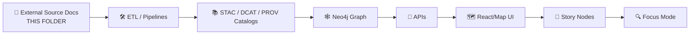

# 🧾 Census Sources Registry (External) 🗺️  
`data/external/mappings/census/sources/`


> [!IMPORTANT]
> This directory is **documentation-first**: it stores **source manifests, licensing notes, and mapping runbooks** for U.S. Census-derived inputs used by KFM.  
> **It is not the place for large downloads** (those belong in `data/external/raw/...`).

---

## 🎯 What this folder is for

This folder exists to keep **external Census sources**:
- ✅ **discoverable** (what we use + why)
- ✅ **reproducible** (how to fetch + exact vintage/release)
- ✅ **governable** (license + privacy + handling rules)
- ✅ **mappable to KFM metadata** (STAC/DCAT/PROV + lineage hooks)

In KFM terms, these docs sit in the **“mappings”** lane: *dataset → STAC/DCAT/PROV mapping docs* 🧬.

---

## 🧬 Where the actual data lives (and where this lives)

KFM domains follow a predictable data lifecycle layout:

```text
📁 data/
└── 📁 external/
    ├── 📁 raw/                # ⛔ immutable source downloads (zip/csv/shp/etc)
    ├── 📁 work/               # 🧪 intermediate transforms (scratch, joins, QA)
    ├── 📁 processed/          # ✅ curated outputs (analysis-ready)
    ├── 📁 mappings/           # 🧾 mapping docs (this is where we are)
    │   └── 📁 census/
    │       └── 📁 sources/    # 📌 upstream registries + manifests
    │           └── 📄 README.md
    └── 📄 README.md           # external domain runbook
```

> [!NOTE]
> Keep this folder **small + reviewable**. Prefer “download recipes + checksums” over committing giant archives.

---

## 🔁 Where this sits in the KFM pipeline

KFM has a strict, non-leapfroggable ordering. This folder supports the earliest stages (ETL + cataloging):



---

## ✅ What belongs here

### 📌 Source registry artifacts
- `source.<id>.yaml` (or `.json`) with **required fields** (see template below)
- `LICENSES.md` or `license_notes.md` (if the source has special terms)
- `schema_notes.md` (key columns, join keys like `GEOID`, field quirks)
- `download.md` (curl/wget instructions, portal steps, API recipes)
- `checksums/` (sha256 lists for reproducibility)
- `docs/` (tiny snapshots: errata notes, data dictionaries, “what changed” PDFs)

### 🧭 Mapping-to-KFM metadata notes
- how the source becomes:
  - a **STAC Collection/Item**
  - a **DCAT Dataset/Distribution**
  - a **PROV activity bundle** (lineage)

---

## 🚫 What does *not* belong here

- ❌ raw TIGER zip archives, full ACS extracts, bulk NHGIS downloads  
  ➜ put those in `data/external/raw/census/...` (or reference them by URL + checksum)
- ❌ processed outputs  
  ➜ those go in `data/external/processed/...`
- ❌ secrets (API keys, portal credentials)  
  ➜ use environment variables + `.env` + secrets manager policies

---

## 📚 Primary upstream sources we expect to track here

Below are the **usual suspects** for Census mapping workflows. If we use any of them, we track it here with a manifest.

### 1) 🧭 U.S. Census Bureau — TIGER/Line Shapefiles
**Best for:** authoritative legal boundaries + features (roads, water, etc.)  
**Notes to capture:**
- *vintage year* (e.g., 2025)  
- “boundaries/names as of” date (Census uses a “legal boundaries as of Jan 1” concept)
- release date + retrieval date
- which layers (county/tract/block/place/ZCTA/roads/etc.)

**Links (landing + archive):**
- TIGER/Line landing page: `https://www.census.gov/geographies/mapping-files/time-series/geo/tiger-line-file.html`  
- TIGER archive root: `https://www2.census.gov/geo/tiger/`

---

### 2) 🗺️ U.S. Census Bureau — Cartographic Boundary Files
**Best for:** *small-scale thematic maps* (simplified geometry)  
**Notes to capture:**
- generalized scale (e.g., 500k / 5m / 20m)
- vintage year
- which geography levels (state/county/tract/etc.)

**Landing page:**  
`https://www.census.gov/geographies/mapping-files/time-series/geo/carto-boundary-file.html`

---

### 3) 🧷 U.S. Gazetteer Files
**Best for:** quick reference tables (codes + names + area + representative lat/long)  
**Notes to capture:**
- geography types included for the year
- join keys (`GEOID`/FIPS) and coordinate fields

**Landing page:**  
`https://www.census.gov/geographies/reference-files/time-series/geo/gazetteer-files.html`

---

### 4) 📊 ACS via Census API
**Best for:** attributes (demographics, housing, economy) joined to boundaries  
**Notes to capture:**
- dataset (`acs/acs5`, `acs/acs1`, etc.)
- vintage year(s)
- variable list + definitions (store or reference a variables snapshot)
- query recipes (exact URL patterns)
- API key handling (env var only)

**Landing page:**  
`https://www.census.gov/programs-surveys/acs/data/data-via-api.html`

---

### 5) 🏛️ IPUMS NHGIS (Historical boundaries & harmonized tables)
**Best for:** historical GIS boundaries + long-run time series harmonization  
**⚠️ License constraint:** NHGIS use is typically allowed, but redistribution is restricted—**do not commit bulk NHGIS downloads** without explicit permission.  
**Notes to capture:**
- NHGIS extract definition (what you requested)
- version/DOI used
- allowed redistribution scope (usually “subset for publication”)

**Landing pages:**
- GIS files overview: `https://www.nhgis.org/gis-files`  
- Citation/use terms: `https://www.nhgis.org/citation-and-use-nhgis-data`

---

## 🧾 Source manifest standard (template)

Create one manifest per upstream artifact family (example: TIGER counties for a specific year).

```yaml
# source.uscb_tigerline_2025_county.yaml
id: uscb_tigerline_2025_county
title: "U.S. Census Bureau TIGER/Line Shapefiles — County (2025)"
provider:
  name: "U.S. Census Bureau"
  org_id: "uscb"
product:
  name: "TIGER/Line Shapefiles"
  type: "vector"
vintage:
  year: 2025
  boundaries_as_of: "2025-01-01"   # if known
release:
  release_date: "YYYY-MM-DD"       # if known
  accessed_date: "YYYY-MM-DD"
coverage:
  geography: ["county"]
  scope: ["US", "Kansas"]
  state_fips: ["20"]               # Kansas
files:
  - role: "source_archive"
    uri: "https://www2.census.gov/geo/tiger/TIGER2025/COUNTY/..."
    local_path_hint: "data/external/raw/census/tigerline/2025/county/..."
    checksum_sha256: "..."
schema:
  primary_join_keys: ["GEOID"]
  notes: "Preserve leading zeros; treat as strings."
crs:
  source_crs: "EPSG:4269 or EPSG:4326 (confirm per release)"
  kfm_preferred_storage: "EPSG:4326"
license:
  summary: "Record Census terms/disclaimers; verify any redistribution notes."
  license_url: "https://www.census.gov/geographies/mapping-files/time-series/geo/tiger-line-file.html"
privacy:
  risk_level: "low"
  notes: "Boundaries only; no person-level records."
kfm:
  domain: "external"
  raw_path: "data/external/raw/census/..."
  pipeline: "src/pipelines/<domain>/census/..."
  outputs_expected:
    - "data/external/processed/census/..."
  catalogs_expected:
    stac_collection: "data/stac/collections/..."
    stac_items: "data/stac/items/..."
    dcat_dataset: "data/catalog/dcat/..."
    prov_bundle: "data/prov/..."
qa:
  geometry_validity: true
  topology_checks: ["self_intersections", "duplicate_rings", "empty_geoms"]
```

> [!TIP]
> If you don’t know a field (e.g., exact CRS for a release), write `UNKNOWN` and add a `todo:` note.  
> The point is to *surface uncertainty explicitly* instead of letting it leak into downstream outputs.

---

## 🔗 Join keys & naming hygiene (Census gotchas)

- ✅ Treat geographic IDs as **strings** (leading zeros matter).
- ✅ Store the **exact** join keys used (`GEOID`, `STATEFP`, `COUNTYFP`, etc.).
- ✅ If you normalize keys (trim, pad, cast), document it in `schema_notes.md`.
- ✅ Track boundary **vintage** separately from attribute **vintage** (ACS year ≠ boundary year).

---

## 🔒 Privacy & sensitivity rules (non-negotiable)

Even when working with Census products, **privacy expectations apply**:

- ✅ Prefer **aggregated geographies** (block group / tract / county / state).
- ❌ Do not attempt to reconstruct address-level/person-level data.
- ✅ If a layer could enable re-identification when combined with other sources, flag it as `risk_level: medium/high` and add governance notes.

> [!IMPORTANT]
> If any source includes sensitive attributes or raises sovereignty concerns, add a **governance note** here and ensure downstream handling follows Focus Mode rules.

---

## ✅ Definition of Done for a new Census source entry

A source is “registered” when it has:

- [ ] `source.<id>.yaml` with **provider, product, vintage, license, retrieval date**
- [ ] download link(s) + at least one **checksum** reference
- [ ] documented join keys + schema quirks
- [ ] a clear mapping target for **STAC/DCAT/PROV**
- [ ] privacy/governance notes (even if “low risk”)
- [ ] a pointer to the pipeline step that consumes it (`src/pipelines/...`)

---

## 🧭 Handy internal references (KFM)

- `docs/MASTER_GUIDE_v13.md` 📘 (canonical pipeline + governance)
- `docs/governance/ETHICS.md` ⚖️
- `docs/governance/SOVEREIGNTY.md` 🪶
- `schemas/` 🧷 (validation schemas)
- `data/stac/` + `data/catalog/dcat/` + `data/prov/` 🧬 (catalog outputs)

---

## 🧩 Suggested folder naming pattern (optional, but recommended)

```text
```text
📁 sources/
├─ 📁 uscb/                                              🏛️ U.S. Census Bureau sources (USCB)
│  ├─ 📁 tigerline/                                       🗺️ TIGER/Line boundary products + notes
│  │  └─ 📁 2025/                                         🗓️ vintage/year bucket (update as new vintages arrive)
│  │     ├─ 📄 source.uscb_tigerline_2025_county.yaml      ✅ source record (what/where/how acquired + citations)
│  │     ├─ 📄 download.md                                📥 retrieval steps (URLs, commands, mirrors; no secrets)
│  │     └─ 📄 schema_notes.md                             🧾 field/geometry quirks + normalization notes
│  └─ 📁 acs_api/                                         📊 ACS API source + query playbooks
│     ├─ 📄 source.uscb_acs_api.yaml                       ✅ source record (endpoints, params, rate limits, citations)
│     ├─ 📄 queries.md                                     🧪 saved query recipes + examples (sanitized)
│     └─ 📄 variables_snapshot.md                          📚 variable notes/snapshots (what changed + why it matters)
└─ 📁 nhgis/                                              🧭 NHGIS extracts + licensing notes
   ├─ 📄 source.nhgis_extract_<id>.yaml                    ✅ extract record (ID, geography, vintage, retrieval notes)
   └─ 📄 license_notes.md                                  📜 license interpretation + citations/links
```

> [!NOTE]
> This is a recommended shape. If your repo already has a different convention, align to the existing one—just keep the **manifest fields + DoD** consistent.

