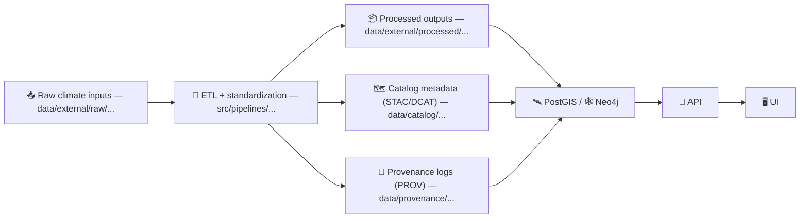

# 🌦️ Climate — External Dataset Mappings (KFM)


> **Purpose:** This folder is the *mapping layer* 🧭 for external climate datasets—how we describe, validate, and connect them to **KFM’s provenance-first “truth path”** (Raw → Processed → Catalog/Prov → Database → API → UI).

---

## 📌 What lives here (and what does not)

### ✅ Lives here
- 📄 **Dataset mapping docs** (dataset → STAC/DCAT/PROV)
- 🗂️ **Manifests / indices** for climate sources & variables
- 🧾 **Units + CRS + temporal semantics** decisions (the “rules of the road”)
- 🧪 **Validation notes** (quality checks, edge cases, known issues)
- 🔐 **License + attribution** requirements (fail-closed by default)

### ❌ Does *not* live here
- 🌧️ Raw rasters / NetCDF / CSV dumps (those belong in `data/external/raw/...`)
- 🧱 Processed outputs (those belong in `data/external/processed/...`)
- 🧠 Derived analysis products (those belong in `data/derived/...` or a domain-specific derived folder)

---

## 🧬 Canonical “Truth Path” for Climate Data



> **Rule:** No skipping steps. The UI should never “touch” raw climate files directly.

---

## 📁 Expected structure

> This repo can be organized several ways; the **pattern** below is the one this README assumes.

```text
📁 data/
└── 📁 external/
    ├── 📁 raw/
    │   └── 📁 climate/                 # immutable source drops
    ├── 📁 processed/
    │   └── 📁 climate/                 # standardized outputs for loading/serving
    ├── 📁 mappings/
    │   └── 📁 climate/                 # ✅ you are here
    │       ├── 📄 README.md
    │       ├── 📁 manifests/           # dataset registry, variable specs
    │       ├── 📁 stac/                # STAC collection/item templates or generated examples
    │       ├── 📁 dcat/                # DCAT dataset templates or generated examples
    │       ├── 📁 prov/                # PROV templates or lineage conventions
    │       └── 📁 policies/            # optional: OPA policy notes for access/licensing
    └── 📁 cache/
        └── 📁 climate/                 # optional: downloads, tiles, temp exports (gitignored)
```

---

## 🧩 Mapping artifacts (what you should create)

### 1) 📋 Dataset manifest(s)
A machine-readable “source of truth” for:
- dataset ID
- provider / source
- variables & units
- spatial & temporal coverage
- license
- ingest method (API / manual / Earth Engine export)
- update cadence
- checksums / hashes (when applicable)

**Recommended format:** YAML or JSON.

<details>
<summary>🧾 Minimal manifest example (YAML)</summary>

```yaml
id: gridmet_daily
title: "GridMET Daily Climate"
source:
  provider: "University of Idaho / gridMET"
  access: "earthengine|http|manual"
license:
  spdx: "CC-BY-4.0"     # or "unknown" (but unknown should fail CI)
variables:
  - name: tmmx
    title: "Daily max temperature"
    units: "K"
    temporal_resolution: "daily"
  - name: pr
    title: "Daily precipitation"
    units: "mm"
    temporal_resolution: "daily"
spatial:
  crs: "EPSG:4326"
  resolution: "0.0416667deg"
temporal:
  start: "1979-01-01"
  end: null              # null = still updating
provenance:
  captured_by: "src/pipelines/climate/..."
  hash_method: "sha256"
```

</details>

---

### 2) 🗺️ STAC mapping
Climate rasters/time series should be discoverable via STAC:
- one **Collection** per dataset (or per variable family)
- one **Item** per time slice (daily/monthly) *or* per chunk (yearly tiles), depending on scale

**Goal:** Make climate layers *findable + interoperable*.

<details>
<summary>🧱 STAC “required fields” checklist</summary>

- `id`, `title`, `description`
- `extent.spatial.bbox`
- `extent.temporal.interval`
- `license`
- `providers`
- `keywords`
- `assets` (COG/NetCDF/Parquet + thumbnails/metadata sidecars if used)
- **Projection info** (CRS, transform, shape) for raster assets
</details>

---

### 3) 🧾 DCAT mapping
DCAT is for “dataset catalog” interoperability (portals, cross-org sharing):
- dataset-level description
- distribution formats
- licensing + attribution
- contact/maintainer (if applicable)

---

### 4) 🧬 PROV mapping
Provenance should answer:
- Where did the data come from?
- What did we do to it?
- With what parameters?
- When?
- What outputs were produced?

**Minimum lineage fields to capture**
- input identifier(s) + version/date retrieved
- processing script path + git commit hash
- parameter set (CRS, resampling, aggregation, AOI)
- output checksums + row/pixel counts
- validation report pointer

---

## 🏷️ Naming conventions (files + dataset IDs)

### Dataset IDs
Use **lowercase, hyphen/underscore**, stable identifiers:
- ✅ `gridmet_daily`
- ✅ `prism_monthly_normals`
- ✅ `era5_land_hourly`
- ❌ `GridMET Daily (v2)`

### Files
Use a consistent, sortable pattern:

`<dataset>__<variable>__<temporal>__<spatial>__<crs>__<time-range>__v<version>.<ext>`

Examples:
- `gridmet_daily__tmmx__1d__4km__epsg4326__2001-2020__v1.parquet`
- `prism_monthly__ppt__1mo__800m__epsg4326__1990-2020__v1.tif`

---

## 🌍 CRS, projections, and map-readiness

**Principle:** preserve the original CRS in raw, standardize in processed.

Suggested defaults:
- 🌐 **Raw:** keep native CRS (often EPSG:4326)
- 📐 **Analysis:** prefer equal-area or domain-standard CRS (project decision)
- 🧭 **Web tiles:** EPSG:3857 (only for display)

✅ Always record:
- CRS (`EPSG:####`)
- pixel size / resolution
- resampling method (nearest/bilinear/cubic/avg)
- nodata value

---

## 🕰️ Time semantics (climate is tricky)

Climate data is time-oriented by nature—avoid ambiguity by storing **both**:
- **Observation time** (what date/hour the measurement represents)
- **Ingest/updated time** (when we fetched/processed it)

Checklist:
- ISO-8601 dates (UTC by default)
- explicit calendar handling (leap days, missing days)
- explicit aggregation rules (e.g., daily → monthly mean vs sum)
- no “floating” local-time timestamps

---

## ☁️ Google Earth Engine export playbook (when used)

When Earth Engine is part of the pipeline:
- batch exports by **time windows** (e.g., yearly chunks)
- export only required columns/fields (avoid massive `.geo` payloads)
- keep a stable **join key** (e.g., GEOID) so geometry can be rejoined downstream

<details>
<summary>📉 Scaling tip: “Selectors” to avoid gigantic CSVs</summary>

**Why:** exporting geometry for every row explodes file size.

**Pattern:** export only `id + date + bands` and join geometry later (PostGIS / vector layer).
</details>

---

## 🧪 Validation gates (fail-closed ✅)

Before a climate dataset is “servable”:
- ✅ license present + compatible
- ✅ manifest entry exists
- ✅ STAC/DCAT records generated (or updated)
- ✅ PROV lineage generated
- ✅ basic QA checks pass:
  - missing dates (%)
  - min/max sanity (units)
  - nodata proportion
  - CRS + bounds match expectations
  - reproducible checksum

> If any check fails, the contribution should **not** merge.

---

## 🗺️ Visualization notes (so maps don’t lie)

When designing climate layers for UI:
- prefer perceptually uniform ramps for continuous variables 🌈
- show units prominently (°C vs K, mm vs inches)
- include temporal context (baseline period, anomaly definition)
- offer “then/now” comparisons + time slider support

---

## 🧑‍🤝‍🧑 Adding a new climate dataset (workflow)

1) 📥 Put source material in `data/external/raw/climate/<dataset>/` *(or document the API/GEE source)*  
2) 🧾 Add/extend a manifest in `manifests/`  
3) 🧹 Implement or update pipeline in `src/pipelines/...`  
4) 🗺️ Generate/validate STAC + DCAT + PROV artifacts  
5) ✅ Run validation gates (CI/local)  
6) 🔀 Open PR with:
   - mapping docs
   - metadata/prov outputs (or reproducible generation steps)
   - notes about known limitations

---

## 🆘 Troubleshooting

- **CRS mismatch in UI** → confirm processed assets are in the “UI CRS” (or have tiles generated)  
- **Huge exports** → chunk by time/space; drop unused columns; avoid embedding geometries per record  
- **Temporal gaps** → verify source cadence; handle missing days explicitly; don’t silently interpolate  
- **Unit confusion** → standardize early; record conversions in PROV

---

## 📚 Project library (recommended reading)

- 📘 *Kansas Frontier Matrix (KFM) – Comprehensive Technical Blueprint* (architecture, truth path, governance)
- 📗 *Cloud-Based Remote Sensing with Google Earth Engine* (scalable climate time series extraction & exports)
- 📙 *Visualization of Time-Oriented Data* (temporal QA + visualization pitfalls)
- 📕 *Data Spaces* (machine-readable metadata, licensing, provenance as first-class requirements)

---

## ✅ Status

- [ ] Add `manifests/` starter files (dataset index + variable registry)
- [ ] Add mapping templates for STAC/DCAT/PROV
- [ ] Wire validation gates for license + metadata completeness
- [ ] Document “official” CRS/time/unit standards for KFM climate layers

