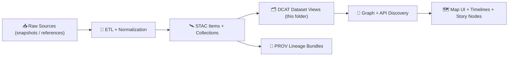

# 🌦️ Climate DCAT Mappings (External) — `data/external/mappings/climate/dcat/`


> 🎯 **Purpose:** This folder is the **authoring + mapping layer** for **DCAT dataset records** (typically **JSON-LD**) describing **climate-related datasets** that KFM uses (often via external sources/endpoints).  
> These DCAT records are a **discovery layer**: they make climate datasets **findable**, **linkable**, and **auditable** across the KFM pipeline (📦 data → 🗂️ catalogs → 🧠 graph → 🌐 API → 🗺️ UI).

---

## 🧭 Where this fits in the KFM pipeline

KFM treats DCAT as a **catalog-facing** dataset view that points users and tooling to:
- **STAC** (geospatial asset detail)
- **PROV** (how it was produced / sourced)
- **Distributions** (downloads, API endpoints, STAC Items, etc.)



---

## 📁 Directory context

```text
📁 data/
└─ 📁 external/
   └─ 📁 mappings/
      └─ 🌦️ climate/                      🌎 climate mapping packs + publishing plans
         └─ 📁 dcat/                       👈 you are here (DCAT templates/plans for climate datasets)
```

### ✅ Expected contents (in this folder)

- `*.jsonld` — **one DCAT Dataset record per dataset** (recommended)
- `*.ttl` — optional RDF/Turtle equivalents (only if needed)
- `examples/` — optional templates/snippets for contributors
- `README.md` — this runbook

### 🚫 Not expected here

- Raw data files (go to `data/raw/...` when ingested)
- Processed data outputs (go to `data/processed/...`)
- Canonical published catalog outputs (often centralized under `data/catalog/dcat/`)

---

## ✅ What goes here vs what doesn’t

| ✅ Put here (do) | 🚫 Don’t put here (avoid) |
|---|---|
| DCAT dataset entries describing climate datasets | Raw/processed payloads (store elsewhere) |
| Stable dataset identifiers + keywords + descriptions | Secrets, API keys, private tokens |
| Distribution links to STAC / downloads / APIs | “Mystery metadata” (missing license, source, or provenance) |
| Pointers to PROV lineage artifacts | Ad-hoc fields that bypass the project profiles |

---

## 🧾 Naming conventions

### Filenames (recommended)
Use deterministic, greppable names:

- `dataset__<slug>__v<major>.<minor>.<patch>.jsonld`

Examples:
- `dataset__drought_index__monthly__v1.0.0.jsonld`
- `dataset__precip__daily__stations__v0.2.0.jsonld`

### Dataset IDs (recommended)
Use stable IDs that survive filename moves:

- `kfm:dataset/climate/<slug>/v<semver>`

💡 **Rule of thumb:** bump **version** when you change meaning, structure, spatial/temporal coverage rules, variable definitions, or distributions in a non-trivial way.

---

## 📌 Minimum required metadata (DCAT “done” checklist)

> If you can’t check all of these, the dataset is **not publishable** (and should not be used in downstream layers).

- [ ] **Title** (`dct:title`)
- [ ] **Description** (`dct:description`)
- [ ] **Keywords/tags** (`dcat:keyword`)
- [ ] **License** (`dct:license`) — include SPDX URL when possible
- [ ] **Publisher / contact** (`dct:publisher`, `dcat:contactPoint`)
- [ ] **Spatial coverage** (`dct:spatial`) — Kansas-wide or explicit geometry/bbox strategy
- [ ] **Temporal coverage** (`dct:temporal`) — start/end (and update cadence if ongoing)
- [ ] **Distributions** (`dcat:distribution`) — STAC link and/or download/access URLs
- [ ] **Provenance pointer** (`dct:provenance` and/or `prov:*`) — link the lineage artifact
- [ ] **Attribution** — where the data comes from + how it’s permitted to be used

---

## 🔗 Linkage rules: DCAT ⇄ STAC ⇄ PROV

### 1) DCAT → STAC (preferred for geospatial)
If the dataset is spatial/temporal (rasters, vectors, tiles), include a distribution like:

- `dcat:accessURL` → STAC Item or Collection JSON  
  (STAC holds the geometry/bbox/time details and asset list)

### 2) DCAT → Direct distribution (acceptable)
For tabular or time-series outputs (e.g., parquet/csv), include a distribution like:

- `dcat:downloadURL` → a stable file path or stable remote object store URL

### 3) DCAT → PROV (required for trust)
Your DCAT entry must point to provenance, either:
- `dct:provenance` (human-readable provenance statement + link)
- `prov:wasGeneratedBy` / `prov:wasDerivedFrom` (structured links)

---

## 🌡️ Climate-specific metadata (recommended KFM extensions)

Climate data is usually **time-heavy** and **units-sensitive**. Add explicit fields (under a KFM namespace) for:

- `kfm:variables` — e.g. `["tmin","tmax","prcp"]`
- `kfm:units` — e.g. `["degC","degC","mm"]`
- `kfm:timeStep` — `hourly | daily | monthly | seasonal`
- `kfm:spatialResolution` — e.g. `"4km"`, `"0.1deg"`, `"county"`, `"station"`
- `kfm:method` — `observed | reanalysis | modeled | derived`
- `kfm:baselinePeriod` — for anomalies/normals (if applicable)
- `kfm:uncertaintyNotes` — short pointer + defer details to PROV
- `kfm:updateCadence` — `realtime | hourly | daily | monthly | annual | static`

> 🧠 Tip: If a dataset is updated continually (streaming or rolling releases), keep **temporal coverage** accurate and record ingestion/update runs in **PROV**.

---

## 🧩 Minimal JSON-LD template (copy/paste)

> Use this as a starting point. Replace identifiers/paths with real ones.

```json
{
  "@context": {
    "dcat": "http://www.w3.org/ns/dcat#",
    "dct": "http://purl.org/dc/terms/",
    "prov": "http://www.w3.org/ns/prov#",
    "foaf": "http://xmlns.com/foaf/0.1/",
    "xsd": "http://www.w3.org/2001/XMLSchema#",
    "kfm": "https://kansas-frontier-matrix.org/ns#"
  },
  "@id": "kfm:dataset/climate/<slug>/v1.0.0",
  "@type": "dcat:Dataset",

  "dct:title": "📌 <Human-readable dataset title>",
  "dct:description": "<What it is, how it’s used in KFM, and key limitations.>",

  "dcat:keyword": ["climate", "kansas", "<topic>", "<time-step>"],

  "dct:license": "https://spdx.org/licenses/CC-BY-4.0.html",

  "dct:publisher": {
    "@type": "foaf:Organization",
    "foaf:name": "<Publisher or Curator Org>"
  },

  "dct:temporal": {
    "@type": "dct:PeriodOfTime",
    "dcat:startDate": "1900-01-01",
    "dcat:endDate": "2025-12-31"
  },

  "dcat:distribution": [
    {
      "@type": "dcat:Distribution",
      "dct:title": "STAC Item (preferred)",
      "dcat:mediaType": "application/json",
      "dcat:accessURL": "<relative-or-absolute-link-to-stac-item-or-collection>"
    },
    {
      "@type": "dcat:Distribution",
      "dct:title": "Direct download (optional)",
      "dcat:mediaType": "application/x-parquet",
      "dcat:downloadURL": "<stable-path-or-remote-url>"
    }
  ],

  "prov:wasGeneratedBy": {
    "@id": "<relative-or-absolute-link-to-prov-bundle>"
  },

  "kfm:variables": ["<var1>", "<var2>"],
  "kfm:units": ["<unit1>", "<unit2>"],
  "kfm:timeStep": "<daily|monthly|...>",
  "kfm:method": "<observed|reanalysis|modeled|derived>",
  "kfm:uncertaintyNotes": "See PROV bundle and source methodology."
}
```

---

## 🧪 Validation & governance expectations

- ✅ Follow the project’s DCAT profile (project-specific required fields + allowed extensions)
- ✅ Prefer **machine-checkable** values (dates, SPDX license URLs, stable IDs)
- ✅ Treat missing license / missing provenance as a **hard failure**
- ✅ Keep DCAT entries **diff-friendly** (stable ordering, stable IDs, small files)

> 🔒 **Fail-closed mindset:** if a record is incomplete or invalid, it should be blocked from downstream use.

---

## 🧰 Contribution workflow (practical)

1. **Add / update** `dataset__*.jsonld` file(s) in this directory
2. Ensure you have (or reference) the matching:
   - **STAC Item/Collection** (when geospatial), and
   - **PROV bundle** (always, even if it’s “external reference only”)
3. Add a short change note in your PR:
   - what changed
   - why
   - what downstream impact to expect

---

## 🔎 Related KFM paths

- 📘 `docs/MASTER_GUIDE_v13.md` — canonical pipeline + structure
- 🧾 `docs/standards/KFM_DCAT_PROFILE.md` — DCAT field rules & extensions
- 🛰️ `data/stac/` — STAC Collections + Items
- 🗂️ `data/catalog/dcat/` — canonical published DCAT outputs (if your pipelines generate them)
- 🧬 `data/prov/` — PROV lineage bundles
- 🧪 `schemas/dcat/` — schema(s) used by CI validation

---

## 🧠 Glossary (quick)

- **DCAT** 🗂️ — dataset-level catalog metadata (discovery + distribution links)
- **STAC** 🛰️ — geospatial asset catalog (bbox/time/assets)
- **PROV** 🧬 — provenance/lineage (inputs → processing → outputs)
- **Distribution** 📦 — how to access the dataset (download, API, STAC link)

---

