# 🌦️ Climate Manifests (External Mappings)


> **Purpose:** This folder holds **machine-readable manifests** that describe **external climate datasets** (sources, governance, transformation rules, and publication metadata).  
> Pipelines consume these manifests to ingest data **the KFM way**: Raw → Processed → Catalog/PROV → Graph → API → UI. 🧭

---

## 📍 You are here

```text
data/
└── external/
    └── mappings/
        └── climate/
            └── manifests/
                └── README.md   👈 you are here
```

✅ **This directory is config + mapping metadata** (manifests).  
🚫 **No raw rasters, tables, or large binaries** should live here.

---

## 🧾 What is a “manifest” in KFM?

A **manifest** is a **contract artifact** that defines *everything needed* to bring an external climate dataset into KFM **repeatably**:

- 🛰️ **Source**: who provides the dataset, how it’s accessed, licensing/attribution
- 🧊 **Pinning**: how the source is versioned (release tag, timestamp, checksum strategy)
- 🧪 **Transform**: normalization steps (reproject, clip, resample, convert, aggregate)
- 🗂️ **Publish**: where outputs land (raw/work/processed) and how catalogs are generated
- 🧬 **Provenance**: how runs are recorded (inputs → activities → outputs)
- 🔐 **Governance**: classification, redistribution rules, sensitivity tags, review gates

Think of manifests as **dataset “recipes”** + **metadata truth** + **governance boundary**.

---

## 🧭 How manifests fit the pipeline

```mermaid
flowchart LR
  M["Manifest (this folder) 🧾"] --> R["data/&lt;domain&gt;/raw 📥"]
  R --> W["data/&lt;domain&gt;/work 🛠️"]
  W --> P["data/&lt;domain&gt;/processed ✅"]

  P --> S["STAC (collections/items) 🛰️"]
  P --> D["DCAT (catalog entry) 🗃️"]
  P --> V["PROV (lineage bundle) 🧬"]

  S --> G["Graph (Neo4j) 🕸️"]
  G --> A["API (contracts + redaction) 🔒"]
  A --> U["UI (MapLibre/Cesium) 🗺️"]
```



**Key rule:** a manifest must never enable a shortcut that bypasses catalogs/provenance.  
If it can’t be cataloged + provenanced, it isn’t “published” in KFM.

---

## 📦 What belongs in this folder

### ✅ Yes
- `*.manifest.yml` / `*.manifest.yaml` / `*.manifest.json`
- manifest templates & examples
- supporting mapping notes specific to *climate ingestion* (variable mappings, units, CRS rules)

### 🚫 No
- downloaded files (NetCDF/GeoTIFF/CSV)
- secrets (API keys, tokens)
- generated catalogs (STAC/DCAT/PROV) — those belong in canonical catalog locations

---

## 🏷️ Naming conventions

Use filenames that are stable, grep-able, and version-aware:

**Recommended**
- `provider__dataset__v<sourceVersion>.manifest.yml`
- `noaa__ghcn_daily__v2025-01.manifest.yml`
- `ecmwf__era5_land__v2024-12.manifest.yml`

**Avoid**
- `manifest.yml` (too generic)
- `final_final_v3.yml` (no 🔥)

> Tip: if source versioning is messy, version **your packaging** (e.g., `v1`, `v2`) and store **pin details inside** the manifest.

---

## 🧩 Manifest structure (recommended)

YAML is preferred for readability, JSON is allowed.

### Top-level shape

| Section | Required | What it’s for |
|---|---:|---|
| `apiVersion`, `kind` | ✅ | Contract identity |
| `metadata` | ✅ | Dataset ID, title, description, tags, owners |
| `source` | ✅ | Provider + access method + license + citation |
| `coverage` | ✅ | Temporal + spatial extent + resolution |
| `variables` | ✅ | Variable dictionary (names, units, nodata, semantics) |
| `processing` | ✅ | Normalize recipe (clip/reproject/resample/aggregate/format) |
| `publishing` | ✅ | Target domain + output paths + STAC/DCAT/PROV IDs |
| `governance` | ✅ | Classification, redistribution, sensitivity, review flags |
| `validation` | ⛳ | Expectations + QA checks that must pass |

---

## 🧪 Example manifest (starter)

> Copy, rename, and fill in for a real dataset. Keep it *boring and deterministic*.

```yaml
apiVersion: kfm/v1
kind: ClimateDatasetManifest

metadata:
  id: ecmwf__era5_land__t2m_monthly
  title: "ERA5-Land Monthly Mean 2m Air Temperature"
  version: "v1" # your packaging version (not necessarily the provider's)
  description: >
    Monthly mean 2m air temperature, subset and normalized for KFM climate usage.
  tags: ["climate", "temperature", "raster", "timeseries"]
  owners:
    - name: "KFM Data Maintainers"
      role: "steward"

source:
  provider: "ECMWF / Copernicus Climate Data Store"
  homepage: "REPLACE_WITH_PROVIDER_URL"
  license: "REPLACE_WITH_LICENSE_ID_OR_URL"
  citation: "REPLACE_WITH_CITATION_TEXT_OR_DOI"

  access:
    method: "api"     # examples: http | api | gee | s3 | ftp
    adapter: "cdsapi" # the pipeline adapter name (implementation-specific)
    request:
      dataset: "reanalysis-era5-land-monthly-means"
      variables: ["2m_temperature"]
      format: "netcdf"

  pinning:
    strategy: "request-payload+hash"
    notes: >
      Pin the request payload used to download the file(s) and record sha256 after download.
      Re-running with the same payload must reproduce identical outputs.

coverage:
  spatial:
    crs: "EPSG:4326"
    # Use either bbox OR aoi_ref (AOI defined elsewhere in the repo)
    bbox: [-104.1, 36.9, -94.6, 40.1] # example Kansas-ish bbox
  temporal:
    start: "1981-01-01"
    end: null
    cadence: "monthly"

variables:
  - key: "t2m"
    standard_name: "air_temperature"
    units: "K"
    nodata: null
    description: "2 meter air temperature (monthly mean)"

processing:
  steps:
    - op: "clip"
      mode: "bbox"       # bbox | aoi_ref
      bbox_from: "coverage.spatial.bbox"
    - op: "reproject"
      to_crs: "EPSG:4326"
    - op: "convert"
      to: "COG"          # Cloud-Optimized GeoTIFF (or other project standard)
    - op: "tile"
      scheme: "wmts"     # optional
      notes: "Only if the downstream UI requires tiles; otherwise keep as COG."

publishing:
  target_domain: "climate"

  # Canonical staging (don’t invent new stages)
  raw_path: "data/climate/raw/ecmwf__era5_land__t2m_monthly/v1/"
  work_path: "data/climate/work/ecmwf__era5_land__t2m_monthly/v1/"
  processed_path: "data/climate/processed/ecmwf__era5_land__t2m_monthly/v1/"

  stac:
    collection_id: "climate-ecmwf-era5land-t2m-monthly"
    item_id_template: "climate-ecmwf-era5land-t2m-monthly-{yyyy}-{mm}"
    asset_roles: ["data"]

  dcat:
    dataset_id: "climate-ecmwf-era5land-t2m-monthly"

  prov:
    activity_id: "etl:climate:ecmwf__era5_land__t2m_monthly"

governance:
  classification: "public"         # public | internal | restricted
  redistribution: "allowed"        # allowed | restricted | prohibited
  sensitivity: "none"              # none | cultural | endangered | site-protected | etc
  review_required: false
  notes: >
    If inputs are restricted, outputs must be >= restricted (never less restricted).

validation:
  expectations:
    output_formats: ["tif"]
    crs: "EPSG:4326"
  checks:
    - "schema"
    - "checksums_present"
    - "stac_generated"
    - "dcat_generated"
    - "prov_generated"
```

---

## ✅ “Definition of Done” for a new manifest

Before a manifest is considered **merge-ready**:

- 📛 **Identity is stable**: `metadata.id` won’t change later
- 🧾 **License + citation included** (no ambiguous reuse)
- 🧷 **Pinning strategy is explicit** (how we reproduce the exact source)
- 🛠️ **Processing is deterministic** (same inputs + same config ⇒ same outputs)
- 🗂️ **Publishing IDs exist** (STAC collection/item pattern, DCAT dataset id, PROV activity id)
- 🔐 **Governance is declared** (classification + redistribution + any review flags)
- 🧪 **Validation expectations are defined** (at least format + CRS + checksums policy)

---

## 🔐 Governance & safety rules (climate isn’t always “low risk”)

Climate layers can still become sensitive when combined with:
- protected site locations 🏺
- Indigenous/sovereign datasets 🪶
- private property constraints 🏠
- endangered habitats 🐾

So manifests must:
- declare **classification + redistribution**
- require review when needed
- never allow “quiet publishing” to UI bypassing API controls

---

## 🔗 Related docs (start here)

- 📘 `/docs/MASTER_GUIDE_v13.md`
- 🧩 `/docs/standards/` (STAC/DCAT/PROV profiles)
- 🧪 `/src/pipelines/` (domain ETL jobs)
- 🕸️ `/src/graph/` (graph build + constraints)
- 🔒 `/src/server/` (API + redaction/contract enforcement)

---

## 🧠 FAQ

**Q: Where do I put the actual downloaded NetCDF/GeoTIFFs?**  
A: In the canonical staging paths under `data/<domain>/raw|work|processed`. Manifests only describe *how* to get and transform them.

**Q: Can I add a new metadata field ad-hoc?**  
A: Prefer extending the project profiles (STAC/DCAT/PROV) rather than inventing one-off fields. If you must, namespace it (e.g., `kfm:`) and document why.

**Q: What if the dataset is huge?**  
A: Use pointer-based storage patterns (hash + external location) and keep the manifest as the authoritative “receipt” for reproducibility.

---

🧊 **Keep it deterministic. Keep it governed. Keep it discoverable.** 🗺️

